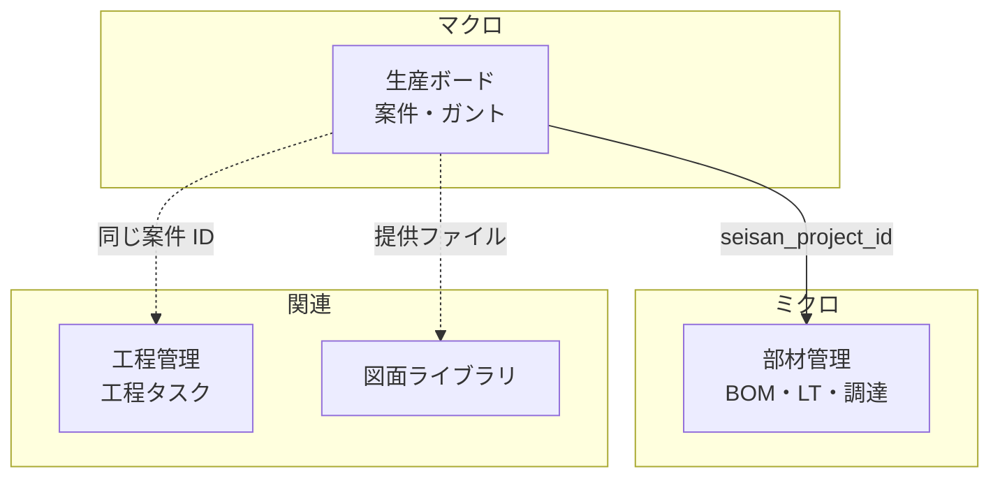
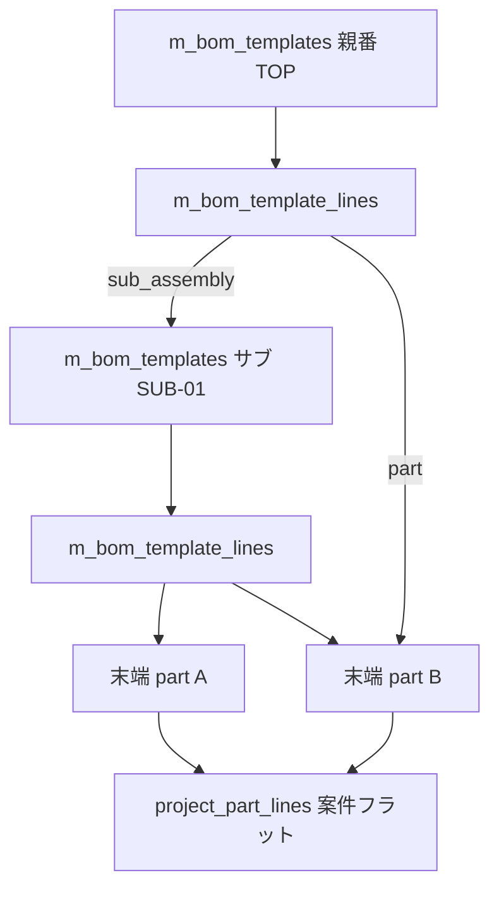
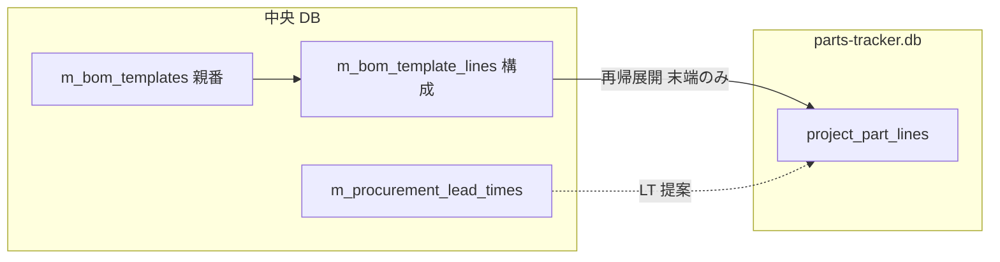
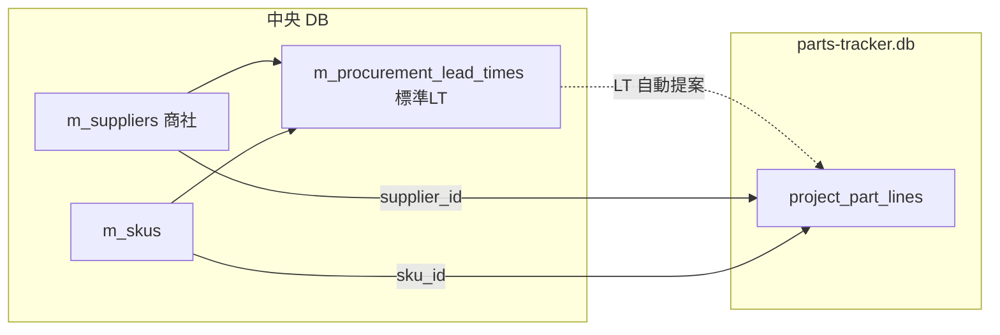

# ポータルアプリ 要件定義書

最終更新: 2026-05-23

---

## 0. 本書の位置づけ

社内で個別に開発してきた 6 つの Electron デスクトップアプリを「1 つのポータル」に統合するための要件をまとめる。
本書は **方針合意のための文書** であり、確定したらこの内容に沿って開発に着手する。

> 凡例:
> - **【決定】** 既に合意済みの事項
> - **【推奨】** 本書での提案。修正があれば指示してください
> - **【未確定】** 次フェーズで詰める事項

---

## 1. 背景・目的

### 1.1 背景
- 既存アプリは個別 exe として開発・運用されており、以下の課題がある。
  - ログインや認証が **アプリごとにバラバラ**（master-database は `app_operators`、Process management desktop は独自 `users` テーブル、seisan-board は「最初に開いた人を承認者にする」など）。
  - 客先・機種・品番などの **マスタの持ち方も統一されていない**（drawing-libraly は文字列をそのまま保存、seisan-board はマスタ DB を読み取り専用で参照、Process management は無関係）。
  - 各アプリを個別に起動・更新する必要があり、**「全社のデジタル基盤」としての一貫性がない**。

### 1.2 目的
- 全アプリの **入り口を 1 つに統合** したポータルを提供する。
- ユーザー認証・マスタを **ポータル内に集約** し、各アプリは中央 DB を参照する。
- **ランディングページ風のホーム画面** で、会社の方針・各アプリの紹介・起動導線を提供する。
- **将来のアプリ追加に耐えられる拡張性**（モジュラ構成、契約の明文化）を確保する。

### 1.3 非ゴール（やらないこと）
- 各アプリの **業務ロジックの作り直し**（既存の動作はできる限り維持）。
- 各アプリ固有 DB（図面 DB、OCR DB など）を **1 つに統合** すること。

---

## 2. 用語定義

| 用語 | 説明 |
|------|------|
| ポータル | 本書で開発する Electron アプリ。ログインと「顔」（ホーム）を持つ |
| 中央 DB | `master-database` が生成する SQLite ファイル。全アプリ共通のユーザー・マスタを保持 |
| サテライト DB | 各アプリが固有データのために持つ SQLite ファイル（図面、OCR、案件詳細など） |
| 子アプリ | ポータルから起動される子プロセスとしての既存 exe |
| 内蔵アプリ | ポータル内に画面として吸収された既存アプリ |

---

## 3. 既存 6 アプリの整理

### 3.1 アプリ一覧

| # | アプリ | 主な機能 | 技術スタック | DB | ポータル統合方針 |
|---|--------|----------|--------------|-----|----------------|
| 1 | **master-database** | 客先 / 機種 / 品番 / 部品名称 / グループ名 / ユーザー名のマスタ管理、操作者（ログインアカウント）管理 | Electron + React 18 + electron-vite + better-sqlite3 + CSS Modules | 中央 DB を生成 | **内蔵** |
| 2 | **seisan-board** | 生産工程の計画・実行、ガントチャート、ダッシュボード | Electron + React 18 + Tailwind + better-sqlite3 + Recharts | サテライト DB ＋ 中央 DB 参照 | **内蔵** |
| 3 | **Process management desktop** | 案件 / 工程ボード（Web 版から移植中） | Electron + React 18 + electron-vite + better-sqlite3 | 独自 DB（独自 `users` あり） | **内蔵** |
| 4 | **drawing-libraly** | 図面（PDF / eDrawings）管理、図面比較。※ DXF 取り扱いは 2026-05-17 に廃止 | （現状）Electron + React 19 + **Express サーバ** + better-sqlite3 + Tailwind + Python(compare exe) → **ポータル取り込み時に Express を撤去** し、Electron + React + Node（IPC 直結）構成へ再設計 | 独自 DB | **内蔵（再設計）** |
| 5 | **PixoConverter** | PDF ↔ 画像変換、PDF 連結、ページ編集 | Electron + React 19 + pdf-lib + sharp | DB なし | **子プロセス起動** |
| 6 | **部材管理（parts-tracker）** | 生産案件に紐づく部品（BOM）の調達区分・リードタイム・必要着日・ステータス管理 | （計画）Electron + React + better-sqlite3 | サテライト DB（`parts-tracker.db`）＋ 生産案件参照 | **内蔵（新規）【計画】** |

> **部材管理**は既存 6 アプリの移植ではなく、ポータル内の **新規内蔵アプリ**。詳細要件は **§8.5** を参照。ホーム LP では **生産ボードの直下**（事務サポートセクション内）に配置する。

### 3.2 統合方針（ハイブリッド）【決定】

- **内蔵（4 アプリ）**: master-database、seisan-board、Process management desktop、drawing-libraly。
  - いずれも DB に依存し、マスタ・ユーザー情報をポータルと共有したい業務系。
  - ポータル内のページとして React コンポーネントを移植する（段階的に行う）。
  - **drawing-libraly は Express サーバを撤去**し、Electron の IPC 経由でメインプロセスの repository／ハンドラを呼び出す構成に **作り直す**。
    - 既存 Express エンドポイント（`/api/drawings/...` 等）は IPC チャネル（`drawing:list`, `drawing:create` 等）に置き換える。
    - 図面比較の `compare_drawings.exe`（Python ビルド成果物）は **extraResources として同梱** を維持し、メインプロセスから `child_process.spawn` で呼び出す。
    - PDF 表示（PDF.js / react-pdf）は **レンダラで Blob URL / File URL として扱う**（Express 経由のファイル配信は廃止）。
- **子プロセス起動（1 アプリ）**: **PixoConverter** のみ。
  - **PDF_scope_vault**（OCR・全文検索）は **ポータル統合対象外**（単体デスクトップアプリとして別管理。2026-05-09 リポジトリから削除）。
  - ポータルから「起動ボタン」で既存 exe を `child_process.spawn` で立ち上げる。
  - 将来吸収しやすいよう、IPC 規約（`module:action` 形式、`{success, data|error}`）を共通化しておく。

### 3.3 アプリ起動時の画面挙動【決定】

内蔵アプリ・子プロセス起動アプリとも、**ポータル本体のウィンドウとは別のウィンドウ（別タブ相当）** で開く。

| 種別 | 起動方法 | 挙動 |
|------|---------|------|
| 内蔵アプリ | 新規 `BrowserWindow` を生成し、そのアプリ専用の URL（例: `#/apps/seisan-board`）を `loadURL` | ポータルのホームは常にバックで残る。各アプリは **独立ウィンドウ** で並行利用可能 |
| 子プロセス起動 | `child_process.spawn(exePath)` | そもそも別プロセスなので自然に別ウィンドウ |

実装方針（内蔵アプリ）:
- メインプロセスに `launcher` モジュール（`launcher:openApp` など）を設ける。
- 起動済みウィンドウを `Map<appId, BrowserWindow>` で管理し、**同じアプリを複数起動しない**（既に開いていれば `focus()` する）。
- 各ウィンドウは同一の preload を共有し、**ポータルのセッション（ログイン状態）を引き継ぐ**（メインプロセス側で保持しているため自然に引き継がれる）。
- ウィンドウを閉じた時点でそのアプリだけを終了する。ポータル本体を閉じると全ウィンドウを閉じる。
- ウィンドウ間のデータ共有は **メインプロセス（DB / セッション）経由のみ**。レンダラ同士の直接通信は禁止。

### 3.4 ワークスペース上の旧アプリフォルダの扱い【記録】

統合（ポータルへの移植・子プロセス起動への一本化）が **完了した時点** で、リポジトリ直下に並んでいる旧スタンドアロンアプリのディレクトリは **削除予定** とする。

対象（削除予定）:

| ディレクトリ名 |
|----------------|
| `drawing-libraly` |
| `master-database` |
| `PixoConverter` |
| `Process management desktop` |
| `seisan-board` |

**Python スクリプト・ランタイム依存の扱い**:

- 他 PC に Python 環境を用意できないため、**ソースの `.py` は最終的に残さなくてよい**前提でよい。
- 代わりに、ビルド済み **exe（および同梱に必要なリソース）だけ** をリポジトリ直下（例: `resources/` または `electron-builder` の `extraResources`）へ置き、**インストーラー配布物に含める**。
- 具体的な exe 名・配置パスは、アプリ取り込み時に `launcher-design.md` / `ipc-channels.md` を更新して固定する（図面比較、OCR、その他スクリプト由来のツールなど）。

> 注: 上記削除は **統合完了後** の整理作業。現時点では参照・比較のためフォルダを残す。

---

## 4. 技術構成

### 4.1 採用技術【決定】

| 領域 | 採用 | 理由 |
|------|------|------|
| 基盤 | **Electron 33** | 既存 4 アプリと同等。Chromium + Node 同梱で配布が容易 |
| ビルド | **electron-vite** | master-database / seisan-board / Process management desktop と同じ |
| 言語 | **TypeScript（ESM）** | ユーザー規約遵守。`require` 不可 |
| UI | **React 18** | 既存内蔵対象アプリ（1〜3）と揃える。19 系の PixoConverter / drawing-libraly は子で隔離 |
| ルーティング | **react-router-dom 6（HashRouter）** | Electron でファイルパス問題を避ける |
| スタイル | **Tailwind CSS + CSS Modules（共存）**【推奨】 | LP 演出・shadcn 系コンポーネントは Tailwind 中心。既存 master-database 由来の画面は CSS Modules を維持しつつ段階移行 |
| アニメーション | **framer-motion**【推奨】 | ヒーローのメリーゴーラウンド演出・スクロール連動・各セクションのフェードイン |
| アイコン | **lucide-react** | 既存複数アプリで使用中 |
| DB | **better-sqlite3** | 既存全アプリで使用 |
| パッケージング | **electron-builder（Windows NSIS）** | 既存と同じ |

### 4.2 セキュリティ規約【決定】（ユーザー規約より）

- `contextIsolation: true`
- `nodeIntegration: false`
- `sandbox: true`
- preload は **`contextBridge.exposeInMainWorld("api", { invoke })`** のみ。業務ロジック禁止
- IPC は **`ipcMain.handle` のみ**、レスポンスは `{ success, data | error }` で統一
- ネイティブモジュール（better-sqlite3 ほか）は **メイン側でのみ使用**

### 4.3 ディレクトリ構成（提案）

```
.                                 ← リポジトリルート
├── docs/
│   └── requirements.md           ← 本書
├── src/
│   ├── main/
│   │   ├── index.ts              ← エントリ。loader.ts のみ import
│   │   ├── window.ts             ← BrowserWindow 生成
│   │   ├── db/
│   │   │   ├── connection.ts     ← 中央 DB 接続管理
│   │   │   ├── schema.ts         ← テーブル DDL（バージョニング対応）
│   │   │   └── migrate.ts        ← マイグレーション（schema_meta による版管理）
│   │   ├── session.ts            ← ログインセッション
│   │   ├── auth-guard.ts         ← 権限チェック
│   │   ├── password.ts           ← scrypt ハッシュ
│   │   └── modules/
│   │       ├── loader.ts         ← 各 *.handler.ts を register
│   │       ├── auth/             ← ログイン・セッション・bootstrap
│   │       ├── operator/         ← 操作者管理
│   │       ├── master/           ← マスタ全般（customer/model/...）
│   │       ├── settings/         ← ポータル設定（DB パス・会社情報）
│   │       ├── launcher/         ← アプリ起動（内蔵= 新規 BrowserWindow／外部= child_process.spawn）
│   │       └── （アプリ別）/      ← 内蔵アプリのハンドラ
│   ├── preload/
│   │   └── index.ts              ← contextBridge のみ
│   ├── renderer/
│   │   ├── main.tsx
│   │   ├── App.tsx               ← ルーティング
│   │   ├── routes/
│   │   │   ├── Login.tsx
│   │   │   ├── Bootstrap.tsx     ← 初期セットアップウィザード
│   │   │   ├── Home.tsx          ← LP 風ホーム
│   │   │   └── apps/             ← 内蔵アプリ画面（段階追加）
│   │   ├── components/
│   │   │   ├── Navbar.tsx
│   │   │   ├── HeroCarousel.tsx  ← メリーゴーラウンド
│   │   │   ├── AppSection.tsx    ← #anchor で遷移する各アプリ説明
│   │   │   └── ui/               ← Button, Card 等の共通 UI
│   │   ├── hooks/
│   │   │   └── useAuth.ts
│   │   └── styles/
│   └── shared/
│       ├── types.ts
│       ├── auth.ts               ← AppRole 等
│       ├── ipcResponse.ts
│       └── constants.ts
├── public/
│   └── portal-icon.ico
├── electron.vite.config.ts
├── tailwind.config.ts
├── postcss.config.js
├── tsconfig.json
└── package.json
```

> `Modular Architecture Rules` に準拠。`*.repo.ts` / `*.handler.ts` を分離し、`loader.ts` で `register(ipcMain)` を呼ぶ。

---

## 5. データベース設計方針

### 5.1 全体像【決定（B：中央 + サテライト）】

- **中央 DB（portal-master.db）**: ポータルおよび内蔵アプリで **共有** するデータ。
  - 操作者（ログインアカウント）、マスタ（客先・機種・品番・部品名称・グループ名・ユーザー名 ほか）、ポータル設定。
- **サテライト DB（各アプリ）**: アプリ固有のトランザクションデータ。
  - 例: 案件、工程、図面、OCR 結果、ガントスケジュール。
  - サテライト側は **中央 DB の整数 ID を参照（FK ではなく ID コピー）** + **必要に応じて表示用テキストをスナップショット保存**（マスタ名変更時の追跡可能性のため）。

> サテライトでは FK は **同一 DB ファイル内のテーブルにのみ** 張る（SQLite はファイル間 FK 不可のため）。中央 DB の ID は単なる整数として保持。

### 5.2 中央 DB のテーブル構成方針【決定：master-database を作り直す／flat + 共有 SKU】

#### 5.2.1 方針転換

**【ユーザー判断 2026-05-05】**: 既存 master-database はまだ完成しきっていないため、**後方互換は気にせず作り直す**。
したがって、本章はもはや「互換を保ちつつ段階移行」ではなく、**「ポータル用の中央 DB を新規設計する」** ものとして扱う。既存 `seisan-board` の repository 層（`customers/models/part_numbers/component_names` を階層 FK で読む）は、ポータル取り込み時に合わせて書き換える前提。

#### 5.2.2 既存 master-database の階層を見直す理由

現行 master-database は `customers → models → part_numbers → component_names` を **FK で階層化** しており、以下のメリット・デメリットがある。

| 観点 | 現行（階層 FK） | 採用案（flat + 共有 SKU） |
|------|----------------|--------------------------|
| 同名利用 | 同名は親が違えば OK（例: 客先 A の機種「X」と客先 B の機種「X」は別） | 全社で同名は 1 つ（重複は意図的なら別途対応） |
| カスケード UI | 「客先 → 機種」で絞り込みが自然 | 別途 `m_skus` テーブルで関係管理 |
| アプリ間の差 | seisan-board は 4 階層、drawing-libraly は 3 階層、Process management は 0 階層 → **強制的な階層は誰かにとっては過剰** | 各アプリが必要な分だけ参照できる |
| 同じ部品が複数の機種にぶら下がる | 機種ごとに重複登録 | 共有 SKU で 1 行で表現可能 |
| 名称変更の影響 | 子も含めて 1 箇所更新で済む | flat なので 1 箇所更新で済む（SKU 側は ID 参照） |
| 取り込み側アプリの書き換え | 不要 | 必要（ただし内蔵時にまとめて実施） |

→ **階層 FK は外し、関係は `m_skus` で別テーブル化** することで「アプリごとに必要な切り口」を後から作れる柔軟性を確保する。

#### 5.2.3 提案テーブル

##### A. 操作者・認証（鶏卵対策の中核）

| テーブル | 役割 |
|----------|------|
| `app_operators` | ログインアカウント（loginName, passwordHash, displayName, role, isActive） |
| `app_operator_app_grants` | （任意・将来）アプリ別の利用権限。なければ全アプリ可 |

`role`: `viewer` / `editor` / `admin`（既存と同じ）

##### B. マスタ（flat）

各テーブルとも以下の共通列を持つ:

| 列 | 型 | 説明 |
|----|-----|------|
| `id` | INTEGER PRIMARY KEY AUTOINCREMENT | 主キー |
| `name` | TEXT NOT NULL | 名称 |
| `isActive` | INTEGER NOT NULL DEFAULT 1 | 有効フラグ |
| `createdAt` / `updatedAt` | TEXT | 監査列 |

部分 UNIQUE インデックス: `WHERE isActive = 1` で `name COLLATE NOCASE` 一意。

| テーブル | 説明 | 既存との違い |
|----------|------|-------------|
| `m_customers` | 客先 | （変更なし） |
| `m_models` | 機種 | **`customer_id` カラム廃止**（共有 SKU 側で関係を持つ） |
| `m_part_numbers` | 品番 | **`model_id` カラム廃止** |
| `m_component_names` | 部品名称 | **`part_number_id` カラム廃止** |
| `m_group_names` | グループ名 | （変更なし） |
| `m_user_names` | ユーザー名 | （変更なし） |
| `m_suppliers` | **商社**（購入・外注先） | **部材管理向け【計画】**。§8.5.6 参照 |
| `m_categories` | カテゴリ（scope 付き） | 図面ライブラリ等。§8.4.2 参照 |

**部材管理向けの追加マスタ（標準リードタイム）** は flat 名称マスタではなく **関連テーブル `m_procurement_lead_times`** として中央 DB に持つ（§8.5.6）。

##### C. 共有 SKU（任意のリンク）

複数アプリが「客先 × 機種 × 品番 × 部品名称 × 図面番号」を扱うため、**ポータルレベルで 1 つの「SKU テーブル」を持たせる**。

```sql
CREATE TABLE m_skus (
  id INTEGER PRIMARY KEY AUTOINCREMENT,
  customer_id   INTEGER REFERENCES m_customers(id),
  model_id      INTEGER REFERENCES m_models(id),
  part_number_id INTEGER REFERENCES m_part_numbers(id),
  component_name_id INTEGER REFERENCES m_component_names(id),
  drawing_number TEXT,
  revision      TEXT,
  isActive INTEGER NOT NULL DEFAULT 1,
  createdAt TEXT DEFAULT (datetime('now')),
  updatedAt TEXT DEFAULT (datetime('now'))
);
```

- どの ID も **NULL 可**（アプリごとに必要な深さでだけ埋める）。
- seisan-board は (客先・機種・品番・部品名称) を埋めて使う。
- drawing-libraly は (客先・機種・品番) + 図面番号 + リビジョンを埋めて使う。
- Process management desktop は (客先) + 図面番号 + リビジョンで使う、など。

##### D. 互換レイヤは不要

既存 master-database はスタンドアロンアプリとして廃止方針のため、**旧テーブル名（`customers` 等）を残す必要はない**。
既存 `seisan-board` の repository 層（`masterData.repo.ts` の `listCustomers` / `listModels(customerId)` など）は、内蔵移植時に **新スキーマ（`m_customers` + `m_skus` JOIN）前提に書き換える**。

##### E. 設定

| テーブル | 役割 |
|----------|------|
| `app_settings` | key/value で設定保持（会社名、モットー、配色、ロゴパス、アプリ起動コマンド等） |
| `schema_meta` | DB スキーマバージョン管理（マイグレーション制御） |

### 5.3 マスタの「使い方」のルール

| 局面 | ルール |
|------|--------|
| アプリが新規レコードを登録するとき | マスタに **存在する ID を必ず使う**（フォームはマスタ選択 UI 必須） |
| マスタ名が変更されたとき | サテライト側の表示は **マスタ JOIN を都度実行**。スナップショット保存している場合は監査列のみ更新せず、別途「履歴」を持つ |
| マスタが無効化されたとき | 既存レコードは残るが、**新規入力選択肢からは外す**（`isActive = 1` のみ表示） |

---

## 6. 認証・初期化（鶏と卵対策）

### 6.1 起動時フロー【決定（B 案：admin/admin 自動シード + 強制パスワード変更）】

```
[ポータル起動]
   │
   ▼
DB パス読み込み（app config に保存）
   │
   ├─ 未設定 ──────────────┐
   │                       ▼
   │              [初期セットアップ画面]
   │              ・新規 DB 作成 / 既存 DB 選択
   │              ・既定: %APPDATA%/portal/portal-master.db
   │                       │
   ▼                       │
DB 接続 + テーブル自動作成 ◄─┘
   │
   ▼
app_operators 件数チェック
   │
   ├─ 0 件 → admin/admin を seed → ログイン画面（admin/admin 案内）
   │                                      │
   └─ 1 件以上 → ログイン画面             │
                                          ▼
                              ログイン成功（admin/admin の場合）
                                          │
                                          ▼
                                [強制パスワード変更モーダル]
                                          │
                                          ▼
                                   ポータルホームへ
```

### 6.2 鶏卵にしないためのキーポイント

1. **DB ファイルが無くてもログイン画面まで到達できる** → 「DB を作成 / 選択する画面」を必ず先に出す。
2. **DB はあるが `app_operators` が空** という壊れ状態でも、**admin/admin が必ず立ち上がる**（自動 seed）。
3. **admin/admin のままでは業務画面に進めない**。最初のログイン直後に強制パスワード変更（DB に `mustChangePassword = 1` 列を持つか、初期パスワード判定で分岐）。
4. **管理者を最低 1 人保証**。管理者の最後の 1 人を無効化／降格はできない（既存 master-database のロジックを踏襲）。
5. **DB 切り替え時** はセッションを破棄し、初期化フローを最初からやり直す（既存 Process management desktop の `resetAppStateAfterDatabaseChange` 相当）。
6. **bootstrap 完了フラグ** を `app_settings` に保持（`portal.bootstrapped = '1'`）。`admin/admin` シードは `bootstrapped` が無い & 操作者 0 件のときだけ動かす（誤って 2 回目以降に admin が再生成されないように）。

### 6.3 セッション

- メイン側のメモリにセッション保持（既存 master-database の `session.ts` 方式）。
- アプリ終了で消える前提（業務 PC 想定なら問題なし）。
- 必要なら将来「N 分で自動ログアウト」を `app_settings` の値で実装。
- **子プロセスで起動するアプリ（PixoConverter）にセッションを引き継ぐ仕組み** は当面不要（各アプリは独立起動）。将来は「ワンタイムトークンを引数で渡す」拡張で対応可能。【未確定】

### 6.4 権限モデル

| ロール | できること |
|--------|-----------|
| `viewer` | 閲覧のみ。マスタ・案件 etc. の更新不可 |
| `editor` | 業務データの登録・更新可 |
| `admin` | 操作者管理、DB 設定、マスタ削除、`app_settings` 変更 |

---

## 7. UI 設計（LP 風ホーム）

### 7.1 ホーム画面の構成【決定】

```
┌────────────────────────────────────────────────────────┐
│ Navbar  [会社名]                  [#master][#seisan]…  │  ← アンカー遷移
├────────────────────────────────────────────────────────┤
│                                                        │
│   Hero (メリーゴーラウンド型カルーセル)                  │
│   ・「安全第一」「品質第二」「生産第三」を                │
│     回転式（フェード or サークル状）で順送り表示          │
│   ・会社名・ポータル名を中央に                           │
│                                                        │
├────────────────────────────────────────────────────────┤
│  #master-database                                      │
│   ┌──────────────┐  マスター DB 説明                     │
│   │  preview     │  ・客先・機種・品番…                   │
│   └──────────────┘  ・[開く]                            │
├────────────────────────────────────────────────────────┤
│  #seisan-board       … (同様、各アプリのセクション)      │
│  #process-management …                                 │
│  #drawing-library    …                                 │
│  #pixo-converter     …  [起動]（子プロセス・未対応時はエラー）  │
│  #pixo-converter     …  [起動]（子プロセス）             │
├────────────────────────────────────────────────────────┤
│  Footer  バージョン / 更新日 / 自分の表示名 / ログアウト │
└────────────────────────────────────────────────────────┘
```

### 7.2 デザイン要件

- **navbar**:
  - 左に会社名、右にアプリ名のアンカーリンク（`#master-database` など）。
  - クリックで **そのセクションまでスムーズスクロール**。
  - 右端に表示名と「ログアウト」。
- **ヒーロー**:
  - 会社モットーを **3 件** カルーセル表示（メリーゴーラウンド風）。
  - framer-motion で 3D 回転 or サークルパス上を移動。
  - モットー文言は `app_settings.company_motto_1/2/3` に保存し、設定画面から差し替え可能（**当面はプレースホルダ「安全第一 / 品質第二 / 生産第三」**）。
  - 会社名・ポータル名も `app_settings` から取得。
- **アプリセクション**:
  - 1 アプリ 1 セクション。スクロールで順に出現（`whileInView` フェード）。
  - **内蔵**: 「開く」ボタン → メインに `launcher:openApp` を送信 → **新規 `BrowserWindow`（別タブ相当）** でそのアプリの画面を `loadURL`。既に開いていれば前面化（focus）。
  - **子プロセス**: 「起動」ボタン → メインから `child_process.spawn(exePath)`。失敗時はトーストで通知。
- **配色テーマ**:
  - 既存 master-database のダーク系をベースに、Tailwind の `slate / sky / emerald` を組み合わせる方向【推奨】（具体案は実装フェーズで詰める）。

### 7.3 ログイン画面

- `app_operators` テーブルからログイン名 + パスワードで認証。
- フォーム下に **「初回は admin / admin でログインできます」** の案内（`bootstrapped` フラグが立つまで）。
- 「DB を選択 / 作成」リンクを下部に小さく置き、**DB 未設定状態から脱出可能** にする（鶏卵対策の補助動線）。

---

## 8. 開発スコープ（フェーズ計画）

### 8.1 今回のスコープ（フェーズ 1）【決定】

1. プロジェクト雛形（electron-vite + React + TS + Tailwind + framer-motion）
2. preload / contextBridge / IPC 雛形
3. 中央 DB 接続・テーブル自動作成・スキーマ版管理
4. **初期セットアップ画面**（DB 新規作成 / 既存選択）
5. **ログイン画面**（admin/admin 自動 seed + 強制パスワード変更）
6. **ポータルホーム**（LP 風、ヒーローのメリーゴーラウンド、navbar アンカー、各アプリセクションは仮プレースホルダ）
7. ログアウト / セッション管理

### 8.2 フェーズ 2（次回以降）【未確定】

- 中央 DB のスキーマ確定（flat + 共有 SKU の最終仕様、マイグレーション方式）
- マスタ管理画面の内蔵（旧 master-database の画面を移植・刷新）
- 操作者管理画面の内蔵
- 設定画面（会社名・モットー・DB パス変更）
- `launcher` モジュールの実装（別ウィンドウ起動・二重起動防止）

### 8.3 フェーズ 3 以降

- seisan-board / Process management desktop の段階吸収
- **drawing-libraly の再設計取り込み**（Express 撤去 → IPC 化、図面比較 exe の child_process 呼び出し、PDF/eDrawings の IPC 経由配信。**DXF は 2026-05-17 に取り扱いを廃止**）
- **PixoConverter** の起動ボタン連携と、起動後のステータス監視
- アプリ別利用権限（`app_operator_app_grants`）の実装 → **フェーズ 4-A** で `m_user_app_grants`（user 基準）として実装済み
- ログ・監査機能 → **フェーズ 4-D** で計画化（`app_audit_log`）

### 8.4 フェーズ 4 系（権限・カテゴリ・Pixo・運用強化）【計画のみ】

詳細・チェックリストは `task-progress.md` を参照。本書ではスコープと位置づけのみ記録する。

#### 8.4.1 フェーズ 4-A: マスタ起点のユーザー権限・アプリ別権限【実装済み】

- ログインアカウント（`app_operators`）と業務ユーザー（`m_user_names`）を **1:1**（ログイン名 = マスタ名）。
- **ポータル `admin`**: ポータル設定・操作者管理・**マスタ編集**のみ。業務アプリの権限は持たない。
- **アプリ別権限**: `m_user_app_grants`（中央 DB）で各内蔵アプリに admin / editor / viewer。工程管理のみ `processView`（SolidWorks / CADMAC / 両方）を併設。
- **グループ役割**: `m_user_group_memberships` で 1 ユーザー = 最大 1 グループ。`member` / `group_admin`。
- **完了通知**: 工程タスク完了時、当該案件のグループの `group_admin` のみへ通知（portal admin 全員には送らない）。
- 関連ドキュメント: [user-permissions.md](./user-permissions.md)。

#### 8.4.2 フェーズ 4-B: 共通カテゴリマスタ【計画】

- 中央 DB に **`m_categories`** を新設（`scope` 列でアプリ別に分離。`'common'` / `'drawing-library'` / 将来）。
- 図面ライブラリの **自社発行** タブで先行採用（既存 `LibDrawingRow.category` 文字列列を活用、クロス DB FK は張らない）。
- **マスタ編集はポータル admin のみ**。新規登録時はマスタからの選択を推奨し、自由入力フォールバックを許容。
- 工程管理・生産ボードへの導入は将来検討（先送り可）。

#### 8.4.3 フェーズ 4-C: PixoConverter 高負荷耐性【計画】

- 200 枚規模のカメラ写真 → PDF 変換 + 連結でクラッシュする現状を解消する。
- 方針: **画像は JPEG のまま `embedJpg`**、長辺リサイズ可、**チャンク連結**、**`utilityProcess.fork`** で別プロセス化、**進捗イベント + キャンセル**、renderer は path 文字列のみ保持。
- 既存 IPC (`pixo-converter:mergePdfs` 等) は当面維持し、**新 API**（`pixo-converter:imagesToPdf:start` / `:cancel` + `progress` event）を追加。

#### 8.4.4 フェーズ 4-D: 権限ガード強化と運用機能【計画】

- 4-A の権限モデルを **全 IPC・UI** に行き渡らせる。
  - `launcher:openApp` で `assertCanViewApp` を実施。grant 未付与ユーザーはホームで権限なし表示。
  - 生産ボードの主要 write IPC に `assertCanWriteApp("seisan-board")` を付与（現状は `assertLoggedIn` のみ）。
  - PixoConverter は `assertCanViewApp("pixo-converter")` に切替（grant 廃止して全ログインユーザー利用可とする運用も検討余地）。
- **監査ログ** `app_audit_log` を追加し、重要操作（マスタ更新・操作者更新・完了取消・grant 変更）を記録。管理メニューに閲覧画面（ポータル admin のみ）。
- 工程タスク `tasks.assignee` の **userNameId 化**（4-A 残課題）を完了させ、用語「担当 / 入力者」→「ユーザー」横断統一。

### 8.5 フェーズ 5: 部材管理（parts-tracker）

**位置づけ**: 生産ボード（**マクロ**＝製番・案件・工程ガント）の **直下** に置く **ミクロ** 管理。1 案件で使う **全部品** の調達・リードタイムを追い、「納期に間に合うか」を可視化する。**5-A-0 / 5-A MVP は実装済み**。**5-A-1 以降** は要件定義のみまたは未着手。

#### 8.5.1 背景・課題

- 生産ボードは **案件単位**（客先・機種・品番・案件納期・工程タスク）の管理に特化しており、**案件内の個別部品**（数十〜数百行）の調達状況は扱わない。
- 現場の要望: **社内製作 / 商社購入 / 支給品** など調達区分ごとに、**リードタイム**を踏まえ **必要着日までに間に合うか** を一覧で把握したい。
- 工程管理は **工程タスク（作業）** の進捗であり、部品表（BOM）の在庫・発注・入荷管理ではない。

#### 8.5.2 目的

| 目的 | 説明 |
|------|------|
| **部品の網羅** | 1 生産案件に必要な部品を **行リスト（BOM）** として登録・参照する |
| **調達区分** | 社内製作・購入（商社等）・支給品など **調達経路** を明示する |
| **リードタイム管理** | 部品ごとの LT（日）と **必要着日** から、発注・着手の遅れを検知する |
| **納期整合** | 案件納期（生産ボード `projects.deadline`）との関係で **リスク部品** を強調表示する |
| **商社マスタ** | 購入・外注先の名称を **中央マスタ** で一元登録し、部品行から参照する |
| **標準 LT マスタ** | 「何日前までに発注／着手しないと間に合わないか」を **DB 上の標準値** として保持し、部品登録時に自動反映する |
| **リピート品の入力効率** | **親番（製品品番）に紐づく BOM テンプレート** から、案件へ **一括展開** し、毎回の手入力を避ける |
| **多階層 BOM** | サブ組立（子の親番）配下の部品も **再帰的に展開** し、案件に **末端部品まで** 載せる |
| **BOM CSV 取込（優先）** | **SolidWorks 等の BOM エクスポート** から一括取込し、手入力より **最短** で部品表を立ち上げる |
| **部品リビジョン** | 部品行ごとに **Rev** を保持・表示し、図面・3D モデルとの版整合を取れる |
| **非表示（除外）部品** | 商社提供 3D 等で **サブ組立に含まれるが手配対象外** の部品を一覧から **非表示** にできる |
| **手配済の可視化** | 案件ごとの部品行で **手配済チェック** を付け、**いつ・誰が** 手配したかを一覧表示する |

#### 8.5.3 非ゴール（やらないこと・初期スコープ外）

- **3D CAD プレビュー**（IGES / STEP / eDrawings のブラウザ内表示）。図面ライブラリの eDrawings ダウンロード運用は維持。
- **在庫数量の厳密管理**（倉庫 WMS・ロット・棚番）。初期は **案件あたりの必要数と調達ステータス** のみ。
- **発注書・見積書の PDF 生成**、会計・購買システムとの **双方向連携**。
- **生産ボードの工程タスクを部品行に置き換える** こと（データモデルは分離）。
- **中央 DB への BOM 全量統合**（部品行はサテライト DB に保持。マスタ ID の参照のみ）。

#### 8.5.4 アプリ概要

| 項目 | 内容 |
|------|------|
| **表示名** | 部材管理 |
| **アプリ ID** | `parts-tracker`（`m_user_app_grants.appId` / ランチャー / ルートで共通） |
| **統合形態** | 内蔵アプリ（別 `BrowserWindow`、`#/apps/parts-tracker`） |
| **LP 配置** | セクション **`office-support`（事務サポート）**、`seisan-board` の **直後** |
| **DB** | 中央 DB と **隣接** の `parts-tracker.db`（工程管理・図面ライブラリと同パターン） |
| **生産ボード連携** | 部品行は **`seisan_project_id`**（`seisan-board.db` の `projects.id`）で紐付け。生産 DB への FK 制約は張らない（参照整合はアプリ層） |



#### 8.5.5 ユーザーと権限【推奨】

フェーズ 4-A の **アプリ別 grant**（`m_user_app_grants`）に **`parts-tracker`** を追加する。

| grant | できること | できないこと |
|-------|------------|--------------|
| **未設定** | — | アプリ起動・IPC（`assertCanViewApp` で拒否） |
| **viewer** | 案件選択、部品一覧・サマリ閲覧 | 行の追加・編集・削除 |
| **editor** | viewer + 部品行 CRUD、ステータス・LT・必要着日の更新 | 商社・標準 LT **マスタの編集**（マスタはポータル admin） |
| **admin** | editor + 一括インポート設定（将来） | ポータル設定・中央マスタ CRUD（別権限） |

- **商社マスタ**（`m_suppliers`）と **標準リードタイム**（`m_procurement_lead_times`）の CRUD は、既存マスタと同様 **ポータル admin のみ**（`master:*` IPC）。部材管理アプリからは **参照・選択** が主用途。

- IPC は **`assertCanViewApp("parts-tracker")` / `assertCanWriteApp("parts-tracker")`** を原則とする（4-D 方針に準拠）。
- 生産ボード **viewer** でも部材管理 **editor** が付いていれば、案件を選んで部品を更新できる（アプリ権限は独立）。

#### 8.5.6 データモデル（案）

##### 8.5.6.1 中央 DB: 商社マスタ【決定案】

部材管理の **購入・外注** で選ぶ商社名を、客先・グループと同様 **中央マスタ** で管理する。

**テーブル: `m_suppliers`**

| 列 | 型 | 説明 |
|----|-----|------|
| `id` | INTEGER PK | |
| `code` | TEXT NOT NULL UNIQUE COLLATE NOCASE | 略称・コード（任意運用可） |
| `name` | TEXT NOT NULL | **商社名**（表示・選択の主キー） |
| `note` | TEXT | 連絡先メモ・取扱品目など |
| `isActive` | INTEGER DEFAULT 1 | 無効化で選択肢から除外 |
| `createdAt` / `updatedAt` | TEXT | |

- マスターデータベース UI に **「商社」タブ** を追加（`MasterCrud` + `master:list` / `master:upsert` 等の既存 IPC を拡張）。
- 社内製作・支給品は **商社マスタを使わない**（`source_type` が `inhouse` / `supplied` のとき `supplier_id` は NULL 可）。

##### 8.5.6.2 中央 DB: 標準リードタイム【決定案】

「**大体どのくらい前に注文（または着手）しないと間に合わないか**」を、マスタとして DB 管理する。

**テーブル: `m_procurement_lead_times`**

| 列 | 型 | 説明 |
|----|-----|------|
| `id` | INTEGER PK | |
| `source_type` | TEXT NOT NULL | 調達区分（`inhouse` / `purchase` / `supplied`） |
| `supplier_id` | INTEGER | `m_suppliers.id`。`purchase` 時は **推奨必須** |
| `sku_id` | INTEGER | 中央 `m_skus.id`（任意。部品特定用） |
| `part_number` | TEXT | 品番・図番（`sku_id` 未設定時の代替キー。任意） |
| `lead_time_days` | INTEGER NOT NULL | **標準リードタイム（日）** — 必要着日の何日前までに発注／着手すべきか |
| `note` | TEXT | 例: 「通常 2 週間、年末は +7 日」 |
| `isActive` | INTEGER DEFAULT 1 | |
| `createdAt` / `updatedAt` | TEXT | |

**一意性【推奨】**: 有効行について `(source_type, supplier_id, sku_id, part_number)` の組み合わせで重複不可（NULL は DISTINCT として扱う実装は SQLite 制約に合わせて設計）。

**解決優先順位（部品行作成・更新時に LT を自動提案）【推奨】**:

1. **品番/SKU × 商社 × 区分** が一致する行（最も具体）
2. **商社 × 区分** のみ（商社デフォルト LT）
3. **区分のみ**（社内製作デフォルト LT 等、`supplier_id` NULL）
4. 上記なし → 部品行で **手入力**

**日数の意味【決定案】**:

- `lead_time_days` は **カレンダー日**（土日含む）とする。営業日換算が必要になったら `note` または将来列で拡張。【未確定: 営業日カレンダー】

**マスタ UI【推奨】**:

- マスターデータベースに **「標準リードタイム」** タブ（または商社タブ内サブ画面）を追加。
- 列例: 区分 / 商社 / 品番(SKU) / 標準 LT（日）/ 備考。
- 購入区分では商社を **ドロップダウン**（`m_suppliers`）で選択。

##### 8.5.6.3 サテライト DB: 案件部品行

**DB ファイル: `parts-tracker.db`**

**テーブル: `project_part_lines`（案件部品行）**

| 列 | 型 | 説明 |
|----|-----|------|
| `id` | INTEGER PK | 行 ID |
| `seisan_project_id` | TEXT NOT NULL | 生産案件 ID |
| `part_number` | TEXT NOT NULL | 部品品番・図番 |
| `part_name` | TEXT NOT NULL | 部品名称 |
| `quantity` | REAL NOT NULL DEFAULT 1 | 必要数量 |
| `source_type` | TEXT NOT NULL | 調達区分（下表） |
| `supplier_id` | INTEGER | 中央 `m_suppliers.id`（`purchase` 時など） |
| `lead_time_days` | INTEGER NOT NULL DEFAULT 0 | **この案件での LT（日）**。作成時に標準 LT マスタからコピーし、案件ごとに上書き可 |
| `required_date` | TEXT NOT NULL | 必要着日（`yyyy-mm-dd`） |
| `order_by_date` | TEXT | **発注期限日**（任意・自動計算可）= `required_date` − `lead_time_days` |
| `ordered_at` | TEXT | 実際の発注日（購入・外注時） |
| `status` | TEXT NOT NULL | 行ステータス（下表） |
| `sku_id` | INTEGER | 中央 `m_skus.id` への任意リンク |
| `procurement_lead_time_id` | INTEGER | 参照した標準 LT マスタ行（任意・監査用） |
| `note` | TEXT | 備考 |
| `sort_order` | INTEGER DEFAULT 0 | 表示順 |
| `created_at` / `updated_at` | TEXT | 監査用 |

**5-B 追加列（案件部品行・【計画・未実装】）**

| 列 | 型 | 説明 |
|----|-----|------|
| `revision` | TEXT | **部品リビジョン**（例: `A`, `01`）。SolidWorks BOM CSV から取込可。空欄可 |
| `is_hidden` | INTEGER NOT NULL DEFAULT 0 | **一覧非表示**（1=非表示）。DB からは削除せず、既定 UI から除外 |
| `hidden_at` / `hidden_by_username` | TEXT | 非表示にした日時・操作者（任意・監査用） |
| `hidden_reason` | TEXT | 非表示理由（例: 「商社3D付属・購入品に含む」） |
| `import_batch_id` | INTEGER | `project_part_import_batches.id`（CSV 取込由来の行） |

> **入力経路の優先度【決定案】**: 新規案件の部品表立ち上げは **(1) BOM CSV 取込（SolidWorks）** → (2) 親番テンプレート展開（リピート品）→ (3) 手入力。商社提供 3D を参照する場合、CSV／取込後一覧で **不要行を非表示** する運用を想定する。

> 旧案の `supplier_name`（自由文字列）は **廃止**し、`supplier_id` + マスタ参照に統一する。マスタ未登録の商社は **先にマスタ登録** してから部品行に紐付ける運用【推奨】。

**調達区分 `source_type`【決定案】**

| 値 | 表示名 | 説明 |
|----|--------|------|
| `inhouse` | 社内製作 | 自社加工・内製 |
| `purchase` | 購入 | 商社・メーカー購入 |
| `supplied` | 支給品 | 客先支給・既存支給在庫 |

**行ステータス `status`【決定案】**

| 値 | 表示名 |
|----|--------|
| `planned` | 未着手 |
| `ordered` | 発注済 |
| `in_progress` | 製作中 |
| `received` | 入荷済 |
| `delayed` | 遅延 |

**その他テーブル（サテライト・MVP 外）**

- `project_part_import_batches` … BOM CSV インポート履歴
- `project_part_line_arrangement_log` … 手配済チェックの ON/OFF 履歴（**5-A-1【計画】**）。解除時も「誰がいつ外したか」を残す場合に使用

**5-A-1 追加列（案件部品行・【計画・未実装】）**

手配済チェックと操作者表示のため、`project_part_lines` に以下を追加する。

| 列 | 型 | 説明 |
|----|-----|------|
| `is_arranged` | INTEGER NOT NULL DEFAULT 0 | **手配済**（1=チェック ON）。一覧のチェックボックスと同期 |
| `arranged_at` | TEXT | 手配済にした日時（`datetime('now')` 相当） |
| `arranged_by_user_name_id` | INTEGER | 中央 `m_user_names.id`（ログインセッションの `userNameId`） |
| `arranged_by_username` | TEXT | 表示用スナップショット（ユーザー名。マスタ改名後も当時の表示を維持） |

**手配済の意味【決定案】**

- **購入（`purchase`）**: 商社への発注・手配が完了した
- **社内製作（`inhouse`）**: 製作依頼・着手手配が完了した
- **支給品（`supplied`）**: 支給の確認・手配が完了した

チェック ON 時は `is_arranged = 1` とし、`arranged_at` / `arranged_by_*` を **その操作のセッション** でセットする。あわせて `status` を **`ordered`（購入）** または **`in_progress`（社内製作）** へ進める【推奨】— 区分ごとの対応は実装時に定数化。

チェック OFF（解除）時【推奨】:

- `is_arranged = 0`、`arranged_at` / `arranged_by_*` を NULL に戻す（一覧は「未手配」表示）
- 解除操作は **`project_part_line_arrangement_log`** に 1 行追記し、監査・問い合わせ用に **過去の手配記録** を残す

> 既存列 `ordered_at` は **実際の発注日**（任意入力）として維持。`arranged_at` は **現場が「手配済」チェックを付けた日時** とし、意味を分離する。

##### 8.5.6.4 中央 DB: 親番 BOM テンプレート【計画・未実装】

**リピート品対策**。同じ **親番（製品・組立品の品番）** で繰り返し発生する案件について、構成部品リストを **マスタとして保持** し、案件選択後に **一括展開** する。

**多階層（サブ組立）【決定案・5-A-1 に含む】**

製造 BOM は **1 段のフラットリストだけでは不足** する。親番の直下に **サブ組立品番（子の親番）** があり、その配下にさらに部品がぶら下がる構成を扱う。

| 用語 | 意味 |
|------|------|
| **親番（ルート）** | 生産案件の製品品番に相当するテンプレートヘッダ（`m_bom_templates`） |
| **サブ組立** | 親番の構成行のうち、**さらに独自の BOM テンプレートを持つ** 中間品番 |
| **末端部品（リーフ）** | 調達・手配の対象となる **これ以上展開しない** 品番行 |
| **展開** | ルートから再帰的にサブ組立を辿り、**すべての末端部品** を `project_part_lines` に生成すること |

**展開の基本方針【決定案】**

- 案件への展開結果は **調達・手配単位のフラットな行リスト** とする（現場がチェックを付ける単位）。
- ただし **どのサブ組立経由か** は失わないよう、案件部品行に **階層メタデータ**（後述）を保持する。
- 数量は **親数量 × 子数量 × …** を各階層で乗算し、末端行の `quantity` に反映する【推奨】。
- サブ組立テンプレートが **未定義** の行は、展開プレビューで **警告** し、当該行はスキップまたは **サブ組立品番1行のみ** 追加するかをユーザー選択【未確定】。
- **循環参照**（A→B→A）は展開前に検出し、エラーとする。

**親番キーの決め方【決定案】**

| 優先 | キー | 説明 |
|------|------|------|
| 1 | `parent_sku_id` | 中央 `m_skus.id`（推奨・マスタ整合） |
| 2 | `parent_part_number` | 図面番号(品番) 文字列（SKU 未整備時の代替） |

案件への展開時は、生産案件の **`part_number`（図面番号）** または紐づく SKU とテンプレートを **照合** する。一致テンプレートが複数ある場合は **最新更新** または **名称でユーザー選択**【未確定】。

**テーブル: `m_bom_templates`（ヘッダ）**

| 列 | 型 | 説明 |
|----|-----|------|
| `id` | INTEGER PK | |
| `parent_sku_id` | INTEGER | 親 SKU（任意） |
| `parent_part_number` | TEXT NOT NULL | **親番**（表示・検索の主キー） |
| `name` | TEXT NOT NULL | テンプレート名称（例: 「〇〇標準構成 Rev A」） |
| `note` | TEXT | 備考 |
| `isActive` | INTEGER DEFAULT 1 | |
| `createdAt` / `updatedAt` | TEXT | |

**テーブル: `m_bom_template_lines`（構成行）**

| 列 | 型 | 説明 |
|----|-----|------|
| `id` | INTEGER PK | |
| `template_id` | INTEGER NOT NULL | `m_bom_templates.id`（この行が属する親番テンプレート） |
| `line_kind` | TEXT NOT NULL | **`part`**（末端部品）または **`sub_assembly`**（サブ組立参照） |
| `part_number` | TEXT NOT NULL | 品番（`part` 時は末端品番、`sub_assembly` 時は **サブ組立品番**） |
| `part_name` | TEXT NOT NULL | 名称 |
| `quantity` | REAL NOT NULL DEFAULT 1 | 親1個あたりの員数 |
| `source_type` | TEXT NOT NULL | 調達区分（`part` 行のみ必須。`sub_assembly` は展開後の子に適用） |
| `supplier_id` | INTEGER | `m_suppliers.id`（`part`・購入時） |
| `sku_id` | INTEGER | 任意 |
| `ref_template_id` | INTEGER | **`sub_assembly` 時**: 展開先 `m_bom_templates.id`（推奨） |
| `ref_part_number` | TEXT | **`sub_assembly` 時**: `ref_template_id` 未設定なら **親番=`part_number`** のテンプレートを検索 |
| `sort_order` | INTEGER DEFAULT 0 | 同一テンプレート内の表示順 |
| `note` | TEXT | 行備考 |

- **`line_kind = part`**: 展開時に **そのまま1行**（末端）として案件に追加。
- **`line_kind = sub_assembly`**: 展開時に **`ref_template_id` または `ref_part_number` で子テンプレートを解決** し、**再帰的に** 子の構成行を展開。サブ組立品番自体は案件行に **載せない**（末端のみ載せる）【決定案】。サブ組立単位でも手配したい場合は **5-A-2 以降** で `sub_assembly` 行も案件に残すモードを検討【未確定】。

**テンプレート行には必要着日を持たない**（案件納期・部品ごとに展開後に設定）。

**展開アルゴリズム（案）**

1. ルート `template_id` の行を `sort_order` 順に走査。
2. `part` → 数量係数 `qtyMul` を掛けたうえで展開候補リストへ。
3. `sub_assembly` → 子テンプレートを解決。見つからなければ警告。見つかれば `qtyMul × line.quantity` で **再帰**。
4. 訪問済み `template_id` セットで **循環検出**。
5. 末端行ごとに **`m_procurement_lead_times` から LT 自動提案** → `project_part_lines` へ INSERT。`required_date` は **案件納期を初期値** とし、ユーザーが行ごとに調整【推奨】。

**案件部品行への階層メタ（展開由来・5-A-1 追加列案）**

サブ展開後も「どの組立の下か」を一覧で分かるように、`project_part_lines` に以下を追加する【計画】。

| 列 | 型 | 説明 |
|----|-----|------|
| `bom_level` | INTEGER NOT NULL DEFAULT 0 | ルートからの深さ（0=ルート直下の末端、1=1段サブ経由…） |
| `assembly_path` | TEXT | 経路表示用（例: `TOP-ASSY/SUB-01/BOLT-M6`） |
| `parent_assembly_part_number` | TEXT | **直上** のサブ組立品番（ルート直下なら NULL 可） |
| `root_template_id` | INTEGER | 展開元ルート `m_bom_templates.id` |
| `source_template_line_id` | INTEGER | 展開元 `m_bom_template_lines.id`（末端行がどのマスタ行由来か） |

> 手入力で追加した行は上記を NULL / 0 とし、展開由来のみ埋める。

**マスタ UI【推奨】**

- マスターデータベースに **「BOM テンプレート」** タブ（ポータル admin）。
- 親番でヘッダを選び、構成行を CRUD。
- **ツリー表示【推奨】**: `sub_assembly` 行に **「子 BOM を開く」** リンク。子テンプレート未登録のサブ組立品番は **警告バッジ**。
- 行追加時: **末端部品** / **サブ組立（別テンプレート参照）** を選択。
- 既存案件の部品表から **「テンプレートとして保存」** する逆方向も **5-A-1 以降** で検討【未確定】。

**部材管理 UI: 一括展開【推奨】**

- 案件選択後、生産案件の親番に一致するテンプレートがあれば **「テンプレートから展開（全階層）」** ボタンを表示。
- 展開前 **プレビュー**: 追加される **末端行数**、通過する **サブ組立数**、**最大階層**、未登録サブ組立の **警告一覧**、既存行との **重複**。
- 一覧表示: デフォルト **フラット** + `assembly_path` 列（またはインデント）。**ツリー折りたたみ** は 5-A-2 以降【未確定】。
- 重複方針【未確定】: 同一 `part_number` + 同一 `assembly_path` / 同一 `source_template_line_id` で判定し、**スキップ** / **数量加算** / **上書き** をユーザー選択。





**中央 DB との関係**

- `m_skus` は **部品の辞書** として任意参照（`sku_id`）。未登録品番も **自由入力で BOM 行を作成可**（生産ボード CSV インポートと同様の運用耐性）。
- **`m_suppliers` / `m_procurement_lead_times`** は部品行の商社選択・LT 初期値の **正** とする。
- 生産案件のメタ（製番・客先・案件納期）は **読み取り専用で `seisan-project:*` から取得**。部材 DB に案件ヘッダのコピーは持たない（MVP）。



#### 8.5.7 リードタイム・リスク判定（案）

**必要着日**の決め方（MVP）:

- **手入力** を基本とする。
- 画面に生産案件 **納期** を表示し、ユーザーが部品ごとに必要着日を設定する。
- 部品行追加時: **区分・商社・品番/SKU** から `m_procurement_lead_times` を引き、**`lead_time_days` を自動セット**（ユーザーが上書き可）。

**発注期限日 `order_by_date`【推奨】**:

- 自動計算: **`order_by_date = required_date − lead_time_days`**（日付演算）。
- 一覧に **発注期限** 列を表示し、「今日が発注期限を過ぎているのに未発注」を **要発注** として強調する。

**リスク判定（自動）【推奨】**:

| 条件 | 表示 |
|------|------|
| `status` が `received` | 問題なし（完了扱い） |
| `required_date` < 今日 かつ 未入荷 | **遅延**（赤） |
| 今日 > `order_by_date` かつ `status` が `planned` | **要発注**（黄）— 発注期限超過 |
| 今日 + `lead_time_days` > `required_date` かつ `status` が `planned` | **要発注**（黄）— LT 不足（`order_by_date` 未設定時のフォールバック） |
| 上記以外 | 正常 |

**逆算（将来）【未確定】**:

- 組立基準日または案件納期から **自動で必要着日を提案**（工程ガントの組立タスク終了日との連動はフェーズ 5-B 以降）。

#### 8.5.8 画面・UX（案）

**ルート**: `#/apps/parts-tracker`

| 画面 | MVP | 説明 |
|------|-----|------|
| **案件選択** | ○ | 生産案件をドロップダウンまたは検索で選択（製番・客先・納期表示） |
| **部品一覧** | ○ | テーブル: 品番・名称・数量・区分・商社・LT・必要着日・**発注期限**・ステータス・備考 |
| **サマリバー** | ○ | 遅延件数・要発注件数・未着手件数 |
| **行追加・編集** | ○ | モーダルまたはインライン。商社は **マスタから選択**。LT は標準マスタから **自動入力** |
| **手配済チェック** | — | **5-A-1【計画】**: 一覧にチェック列。ON で `arranged_at` / 操作者表示。解除時はログに残す【推奨】 |
| **親番 BOM 一括展開** | — | **5-A-1【計画】**: テンプレート一致時に **サブ組立含む全階層** を再帰展開し末端部品を一括 INSERT |
| **部品一覧（階層表示）** | — | **5-A-1【計画】**: フラット一覧 + `assembly_path` 列（ツリー UI は将来） |
| **マスタ: 商社** | ○ | マスターデータベースに `m_suppliers` タブ（ポータル admin） |
| **マスタ: 標準 LT** | ○ | マスターデータベースに `m_procurement_lead_times` タブ（ポータル admin） |
| **マスタ: BOM テンプレート** | — | **5-A-1【計画】**: `m_bom_templates` / `m_bom_template_lines` タブ（ポータル admin） |
| **生産ボードへの導線** | △ | MVP 後: 生産案件詳細から「部材管理を開く」 |
| **BOM CSV インポート** | — | **5-B【計画・最優先入力】**: SolidWorks BOM エクスポートから一括取込（Rev 列対応） |
| **部品 Rev 列** | — | **5-B【計画】**: 一覧・編集でリビジョン表示 |
| **非表示部品** | — | **5-B【計画】**: 手配対象外行の非表示トグル・「非表示を含む」表示切替 |
| **ダッシュボード（全案件横断）** | — | フェーズ 5-C |

- UI テーマ: 図面ライブラリ・工程管理と同様 **`.portal-app-calm-shell`（事務向けライト）**。
- 一覧ページネーション: **20 / 50 / 100**（他アプリに合わせる）【推奨】。

#### 8.5.9 IPC 設計（案・未実装）

モジュール名 **`parts-tracker`**。レスポンスは共通 `{ success, data | error }`。

| チャネル | 権限 | 概要 |
|---------|------|------|
| `parts-tracker:line:listByProject` | viewer | `{ seisanProjectId }` → 部品行一覧 |
| `parts-tracker:line:create` | editor | 行追加 |
| `parts-tracker:line:update` | editor | 行更新 |
| `parts-tracker:line:delete` | editor | 行削除 |
| `parts-tracker:line:setArranged` | editor | **5-A-1【計画】** `{ id, arranged: boolean }` → 手配済 ON/OFF、`arranged_at` / `arranged_by_*` 更新、必要なら arrangement_log 追記 |
| `parts-tracker:project:summary` | viewer | 遅延・要発注件数など |
| `parts-tracker:template:match` | viewer | **5-A-1【計画】** `{ seisanProjectId }` → 親番一致テンプレート一覧 |
| `parts-tracker:template:expand` | editor | **5-A-1【計画】** `{ seisanProjectId, templateId, duplicatePolicy?, expandSubAssemblies?: true }` → **再帰展開**で末端部品行を一括作成 |
| `parts-tracker:template:previewExpand` | viewer | **5-A-1【計画】** 展開前プレビュー（末端行数・サブ組立数・最大階層・未登録サブ警告） |
| `parts-tracker:db:status` | viewer | DB パス・接続状態（工程管理 `process-mgmt` の status に準拠） |
| `parts-tracker:import:preview` | editor | **5-B【計画】** CSV 内容のプレビュー・列マッピング確認 |
| `parts-tracker:import:commit` | editor | **5-B【計画】** 取込実行 → `project_part_lines` 一括 INSERT/更新 |
| `parts-tracker:import:downloadTemplate` | viewer | **5-B【計画】** 取込用 CSV テンプレ DL（UTF-8 BOM） |
| `parts-tracker:line:setHidden` | editor | **5-B【計画】** `{ id, hidden: boolean, reason? }` 非表示 ON/OFF |

**マスタ IPC（既存 `master:*` の拡張・未実装）**

| 対象 | 概要 |
|------|------|
| `m_suppliers` | `MASTER_TABLES` 追加 → `master:list` / `master:upsert` 等で CRUD |
| `m_procurement_lead_times` | 専用 IPC **`master:procurementLeadTime:*`** または `master:*` の table パラメータ拡張【未確定】 |
| `m_bom_templates` / `m_bom_template_lines` | **5-A-1【計画】** 専用 IPC **`master:bomTemplate:*`**（ヘッダ + 行 CRUD、展開は `parts-tracker` 側） |

- 生産案件一覧は **新規 IPC を増やさず** 既存 `seisan-project:list` を renderer から invoke（モジュール間 import 禁止のため、部材 handler から seisan repo を直接呼ぶのは **案件メタ取得の read のみ** 可とするかは実装時に判断。【未確定】

**実装配置（予定）**

```
src/main/modules/parts-tracker/
  parts-tracker.handler.ts
  parts-tracker.repo.ts
src/main/db/
  partsTrackerSchema.ts
  partsTrackerConnection.ts
src/shared/
  partsTracker.ts
src/renderer/src/routes/
  PartsTrackerApp.tsx
```

#### 8.5.10 フェーズ分割（実装順）

| 段階 | 内容 | 受け入れの目安 |
|------|------|----------------|
| **5-A-0 マスタ** | 中央 DB に `m_suppliers` + `m_procurement_lead_times`、マスタ UI タブ | 商社名と標準 LT を登録・編集できる |
| **5-A MVP** | `parts-tracker.db` + 部材管理 UI（案件選択・部品表・CRUD・リスク色・LT 自動提案） | 1 案件の部品を登録し、マスタ LT から発注期限が分かる |
| **5-A-1 効率・現場** | **親番 BOM テンプレート** + **サブ組立の再帰展開** + 案件へ一括展開、**手配済チェック** + `arranged_by` / `arranged_at` 表示 | リピート品で **末端まで** 一括展開でき、手配した人・日時が一覧で分かる |
| **5-B 入力効率** | **SolidWorks BOM CSV 一括取込**（Rev 対応）、**非表示部品**、SKU 紐付け、生産ボードからの導線 | 設計 BOM を **最短** で案件部品表に載せ、不要なサブ構成は非表示にできる |
| **5-C 横断** | 全案件の「要対応部品」ダッシュボード | 調達担当が日次で一覧確認できる |
| **5-D 連携** | 工程管理・通知（部品遅延をグループ管理者へ等） | 【未確定】 |

#### 8.5.11 受け入れ基準

**5-A-0（マスタ）**

- [x] マスターデータベースで **商社**（`m_suppliers`）を CRUD できる（ポータル admin）。
- [x] マスターデータベースで **標準リードタイム**（`m_procurement_lead_times`）を CRUD できる。区分・商社・品番/SKU・LT（日）を登録できる。
- [ ] 同一キーの重複登録が防止される（または警告される）。【未実装: DB UNIQUE 制約なし】

**5-A MVP（部材管理アプリ）**

- [x] ホームの **事務サポート** セクションで、生産ボードの **直下** に「部材管理」が表示され、grant 付与ユーザーが別ウィンドウで開ける。
- [x] 生産案件を選択すると、その案件の部品行一覧が表示される。
- [x] 調達区分（社内 / 購入 / 支給）・**商社（マスタ選択）**・LT・必要着日・**発注期限**・ステータスを **editor 以上** が登録・更新できる。
- [x] 部品行作成時、標準 LT マスタから **`lead_time_days` が自動提案** される（上書き可）。
- [x] **遅延**および**要発注**の行が一覧上で判別できる。
- [x] `parts-tracker.db` が中央 DB と同じディレクトリに自動作成される。
- [x] `npm run typecheck` が通る。IPC・モジュール構成が Architecture Rules に準拠する。

**5-A-1（親番テンプレート・手配済）【計画・未実装】**

- [ ] 中央 DB に **`m_bom_templates` / `m_bom_template_lines`** があり、マスタ DB から親番ごとの構成部品を CRUD できる（ポータル admin）。
- [ ] 部材管理で案件を選択し、親番に一致するテンプレートがある場合 **「テンプレートから展開（全階層）」** で `project_part_lines` に **末端部品まで** 一括追加できる（editor 以上）。
- [ ] **サブ組立**（`line_kind = sub_assembly`）を参照する多階層テンプレートで、数量が **親×子の積** として末端行に反映される。
- [ ] 展開結果の部品行に **`assembly_path` / `bom_level` 等** が入り、どのサブ組立下かが一覧で分かる。
- [ ] **循環参照** するテンプレート構成は展開前にエラーとなる。
- [ ] 子 BOM 未登録のサブ組立品番はプレビューで **警告** される。
- [ ] 展開時に標準 LT マスタから **`lead_time_days` が自動提案** され、必要着日は案件納期等を初期値とできる。
- [ ] 部品一覧に **手配済チェック** があり、ON/OFF を editor 以上が操作できる。
- [ ] 手配済 ON の行に **`arranged_at` と操作者（ユーザー名）** が表示される。
- [ ] 手配済 OFF（解除）時、**解除前の記録** が `project_part_line_arrangement_log`（または同等）に残る【推奨】。
- [ ] `npm run typecheck` が通る。

**5-B（BOM CSV 取込・Rev・非表示）【計画・未実装】**

- [ ] 部材管理 UI から **SolidWorks BOM CSV**（列定義は下記 §8.5.13）を **プレビュー付き** で取込できる（editor 以上）。
- [ ] 取込行に **`revision`** が保存され、一覧に表示される（空欄可）。
- [ ] 取込後も手入力・編集で Rev を変更できる。
- [ ] 部品行を **非表示** にでき、既定一覧から除外される（行は DB に残る）。
- [ ] **「非表示を含む」** トグルで非表示行を再表示できる。非表示理由を任意入力できる。
- [ ] 非表示行は **遅延・要発注サマリから除外** する【推奨】。
- [ ] 取込履歴が `project_part_import_batches` に残る。
- [ ] 生産ボード `CsvImportDialog` と同様、**フォーマット説明・テンプレ DL** がある。
- [ ] `npm run typecheck` が通る。

#### 8.5.13 BOM CSV 取込・部品 Rev・非表示部品【計画・5-B・未実装】

##### 8.5.13.1 位置づけ（入力経路の優先）

現場・設計の **最初の部品表投入** として、**SolidWorks からエクスポートした BOM CSV の一括取込** を **最優先** とする。

| 順位 | 入力経路 | 向いている場面 |
|------|----------|----------------|
| **1** | **BOM CSV 取込（SolidWorks）** | 新規案件・設計 BOM が確定しているとき（**最速**） |
| 2 | 親番 BOM テンプレート展開（5-A-1） | リピート品・標準構成がマスタ化されているとき |
| 3 | 手入力（1 行ずつ） | 追加分・例外のみ |

手入力のみでは数百行の BOM 立ち上げに時間がかかるため、**5-B は 5-A-1 と同等かそれ以上に実務優先度が高い**【決定案】。

##### 8.5.13.2 SolidWorks BOM CSV【決定案・列は実装前に実機エクスポートで確定】

**参照実装**: 生産ボードの案件 CSV 取込（`CsvImportDialog` / `seisan-import:*` / `shared/seisan/csvImportFormat.ts`）と同様の UX を部材管理にも持つ。

| 項目 | 内容 |
|------|------|
| **文字コード** | UTF-8（**BOM 付き**推奨）。Shift_JIS は将来対応【未確定】 |
| **UI** | 案件選択後「BOM CSV 取込」→ ファイル選択 → **列マッピング／プレビュー** → 確定 |
| **重複** | 同一案件で再取込時: **追加のみ** / **品番+Rev で更新** / **全置換** をユーザー選択【未確定】 |
| **階層** | SolidWorks エクスポートに **レベル／インデント／親子** 列があれば `bom_level` / `assembly_path` を生成【5-A-1 列と共用】 |
| **LT・商社** | 取込後に標準 LT マスタから **自動提案**（既存ロジック）。CSV に商社名列があれば `m_suppliers` と照合【未確定】 |

**想定 CSV 列（最小セット・【未確定】要実機確認）**

| CSV 列（例） | 部品行フィールド |
|--------------|------------------|
| 品番 / Part Number | `part_number` |
| 名称 / Description | `part_name` |
| 数量 / QTY | `quantity` |
| **リビジョン / Rev** | **`revision`** |
| 調達区分（任意） | `source_type`（未記載時は `purchase` 等の既定） |
| レベル / 親品番（任意） | `bom_level` / `assembly_path` 生成用 |

**部品リビジョン【決定案】**

- 各行に **`revision`（TEXT、空欄可）** を保持。図面ライブラリ・SKU マスタの Rev と **同じ表記**（`A`, `01` 等）を想定。
- 一覧・編集モーダル・CSV エクスポート（将来）に Rev 列を表示。
- 同一案件内の一意性は **`part_number` + `revision` + `assembly_path`** の組み合わせで判定する案【未確定】（Rev なしは `revision IS NULL` として扱う）。

##### 8.5.13.3 商社提供 3D と「非表示」部品【決定案】

**背景**: 商社から提供・ダウンロードした **3D モデル（サブアセンブリ付き）** を参照すると、BOM 上は存在するが **当社で個別手配しない部品**（既に購入品に含まれる締結部品、標準部品、表示用ジオメトリ等）が **サブ構成として大量に展開** されることがある。これらを部材管理の **手配・リスク一覧から除外** したい。

| 項目 | 内容 |
|------|------|
| **非表示の意味** | 行は **削除しない**。`is_hidden = 1` とし、**既定の部品一覧・サマリから除外** |
| **操作** | editor 以上が行単位で「非表示にする／表示に戻す」。理由 `hidden_reason` を任意入力 |
| **UI** | 一覧に **目アイコン／非表示** 操作。ツールバーに **「非表示を含む」** チェックで再表示 |
| **サマリ** | 非表示行は **遅延・要発注件数に含めない**【推奨】（手配対象外のため） |
| **CSV 取込** | 取込直後の一覧でまとめて非表示にする、または CSV に **除外フラグ列** を将来追加【未確定】 |
| **テンプレート** | 5-A-1 の BOM テンプレート行にも `default_hidden` を持てる余地【未確定】 |

**非表示 vs 削除**

- **削除**: 誤取込の行を完全に除去
- **非表示**: 参照用・3D 整合用に残すが、調達業務の一覧から外す

##### 8.5.13.4 取込履歴テーブル（サテライト）

**テーブル: `project_part_import_batches`**

| 列 | 型 | 説明 |
|----|-----|------|
| `id` | INTEGER PK | |
| `seisan_project_id` | TEXT NOT NULL | 対象案件 |
| `source` | TEXT NOT NULL | 例: `solidworks_bom_csv` |
| `file_name` | TEXT | 元ファイル名 |
| `row_count` | INTEGER | 取込行数 |
| `imported_by_username` | TEXT | 操作者 |
| `created_at` | TEXT | 取込日時 |

#### 8.5.12 未確定事項

1. BOM **CSV 列定義**（**SolidWorks 実機エクスポート**での確定列・日本語/英語ヘッダー）。§8.5.13.2 参照。
2. **支給品**の LT 扱い（0 日固定 vs 客先支給予定日を別列で持つか）。
3. 部品行と **工程管理タスク** の紐付け要否。
4. 監査ログ（`app_audit_log`）に部材 CRUD・マスタ LT 変更を記録するか（4-D 拡張）。
5. `m_procurement_lead_times` の CRUD を **`master:*` 汎用 CRUD** に載せるか **専用 IPC** にするか。
6. **営業日**換算（土日祝除外）が必要か。現状は **カレンダー日** で統一。
7. 社内製作（`inhouse`）の「着手期限」も `order_by_date` と同じ式でよいか（用語を **着手期限** / **発注期限** で出し分けるか）。
8. **親番 BOM テンプレート** の親番キーは `parent_sku_id` 優先か `parent_part_number` のみか（両方併用時の一意性）。
9. テンプレート展開時の **重複部品行** の扱い（スキップ / 数量加算 / 上書き）。
10. 手配済チェック OFF 時に **`status` を `planned` に戻す** か、発注済のまま残すか。
11. 手配済履歴を **行内のみ** で足りるか、**監査ログ（`app_audit_log`）** にも載せるか。
12. 既存案件の部品表から **テンプレートを逆生成** する機能の要否。
13. **サブ組立品番** を案件行に **残すモード**（中間品も手配対象）が必要か、**末端のみ** でよいか。
14. 同一末端品番が **複数サブ経路** から出る場合の行の **統合**（1行に数量合算）vs **経路別に分割** のデフォルト。
15. `assembly_path` の区切り文字と、一覧の **ツリー折りたたみ UI** を 5-A-1 に含めるか 5-A-2 か。
16. BOM CSV **再取込** 時の重複ポリシー（追加 / 更新 / 全置換）。
17. 非表示行を **CSV 再エクスポート** に含めるか。
18. SolidWorks 以外（Excel 手作り BOM 等）の **汎用 CSV** 対応の要否。
19. `revision` の一意性ルール（同一品番・別 Rev を別行として常に許容するか）。

---

## 9. 拡張性ガイドライン

新しいアプリを将来追加するときに崩壊しないよう、以下を守る。

### 9.1 必ず守ること

- **中央 DB のテーブル名・PK・`isActive` の意味は、ポータル稼働後は変えない**（運用後は後方互換を厳守）。
- 新マスタを足すときは **既存と同じ列セット**（`id / name / isActive / createdAt / updatedAt` + 部分 UNIQUE）で作る。
- IPC は `module:action`、レスポンスは `{success, data | error}` で統一。
- 内蔵アプリは `src/main/modules/<app>/` 配下で完結させ、**他アプリのモジュールを直接 import しない**。共通処理は `src/shared/`。
- 内蔵アプリの画面は **別 `BrowserWindow` で開く**（`launcher` モジュール経由）。ポータル本体の window と同居させない。

### 9.2 推奨すること

- サテライト DB の業務テーブルは **マスタ ID（`m_customers.id` など）を整数で保持** し、JOIN は実行時にする（snapshot は監査要件があるときのみ）。
- 子プロセスで起動するアプリには **将来引数でセッショントークンを渡せる導線** を残す（プロトコル URL or 環境変数）。
- `app_settings` を文字列 key/value にして、機能フラグ・テーマ・モットー差し替えに使う。

### 9.3 絶対に避けること

- 中央 DB に **「type / key / value」式の超汎用テーブル** を増やすこと（型・参照整合性が崩れる）。
- preload に業務関数を増やすこと（必ず汎用 `invoke` のみ）。
- レンダラから直接 SQLite を触ること。

---

## 10. 未確定事項（次のフェーズで決める）

1. 子プロセスアプリへの **セッション引き継ぎ** の有無。
2. `app_operator_app_grants`（アプリ別利用権限）の必要性とテーブル定義。
3. ログ・監査要件（誰がいつ何を変更したか）。
4. 配色・ロゴ・モットーの **実テキスト / 画像**。
5. 既存 `seisan-board` / `drawing-libraly` を新スキーマに合わせて書き換える **着手順・移行計画**。
6. `drawing-libraly` のサテライト DB（図面・eDrawings）の **新設計**（Express 撤去に伴い、ファイル保存ルールと IPC チャネルを再定義。**DXF は 2026-05-17 に取り扱いを廃止**）。
7. 内蔵アプリを別ウィンドウで開く際の **タブ風 UI（BrowserView ベース）** と **マルチウィンドウ** のどちらを採用するか（現時点では「マルチウィンドウ（別 BrowserWindow）」で進める）。

---

## 11. 受け入れ基準（フェーズ 1）

以下を満たしたらフェーズ 1 完了とする。

- [ ] `npm run dev` でポータルが起動し、初回はセットアップ画面が出る。
- [ ] 「新規 DB 作成」で `%APPDATA%/portal/portal-master.db` が作られ、`app_operators` に `admin/admin` が seed される。
- [ ] ログイン画面で `admin/admin` でログインでき、強制パスワード変更モーダルが出る。
- [ ] 変更後、ホーム（LP 風）に遷移できる。
- [ ] ヒーローのメリーゴーラウンドで 3 件のモットーが順送り表示される。
- [ ] navbar のアプリ名リンクで該当セクションにスムーズスクロールする。
- [ ] 「ログアウト」でログイン画面に戻る。
- [ ] DB ファイルを削除して再起動 → セットアップ画面に戻り、再 seed できる（鶏卵にならない）。
- [ ] レンダラで `window.api` 以外の Node API が露出していない（`contextIsolation` 等の規約準拠）。

---

## 12. 確認事項（このまま開発に進めますか？）

特に以下に **NG / 修正希望** があればコメントください。問題なければこの内容で実装に着手します。

- 統合方針が **ハイブリッド（4 内蔵 + 2 子プロセス起動）** でよい
- 各アプリは **別ウィンドウ（別タブ相当）で開く**。同じアプリは二重起動させず、既に開いていれば前面化する
- master-database は **後方互換を気にせず作り直し**、**flat + 共有 SKU** 構成で新規設計してよい
- drawing-libraly は **Express を撤去**し、Electron + React + Node（IPC 直結）で再構成してよい
- ログインは **admin/admin 自動 seed + 強制パスワード変更**
- UI スタックは **Tailwind CSS + framer-motion**
- フェーズ 1 のスコープは **「初期セットアップ画面 + ログイン + LP 風ホーム」までで打ち止め**
- 会社名・モットーは **プレースホルダ**（「安全第一 / 品質第二 / 生産第三」、会社名 = `__COMPANY__`）で進め、`app_settings` で後から差し替え可能にする
