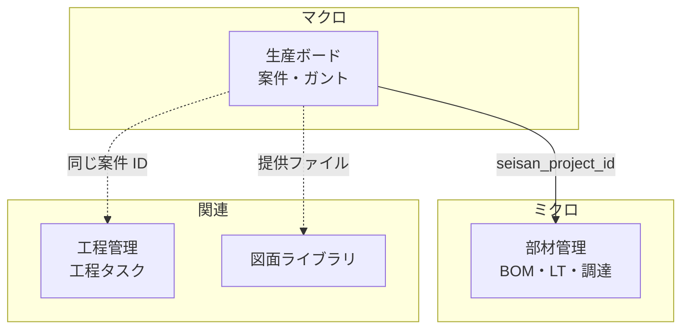
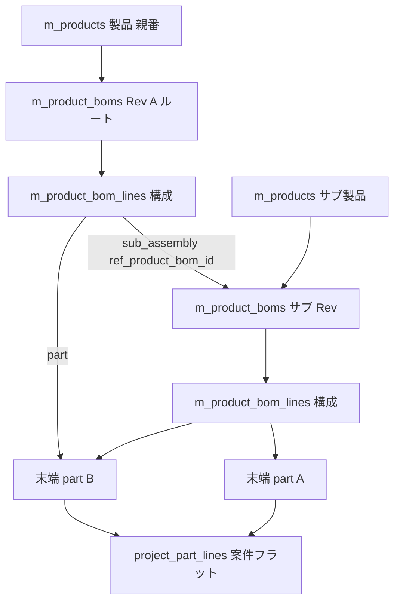
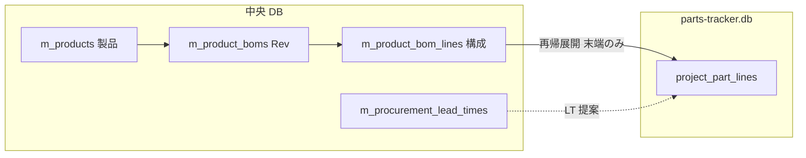
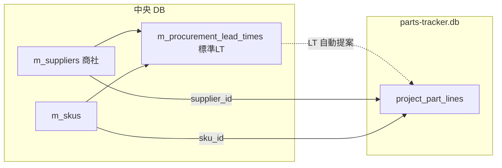
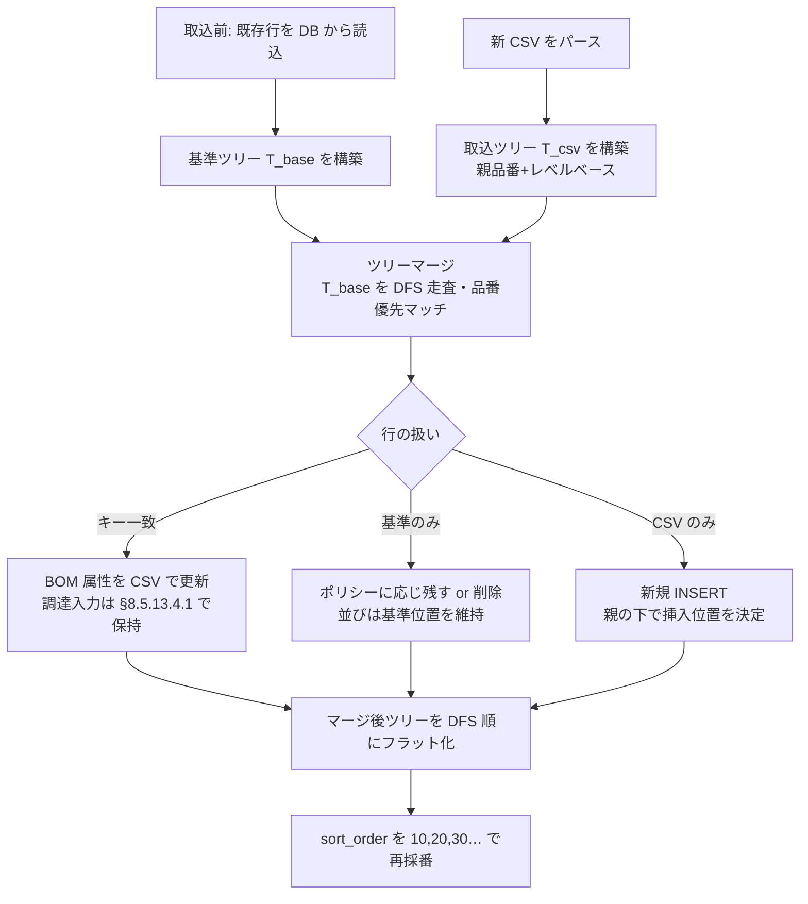
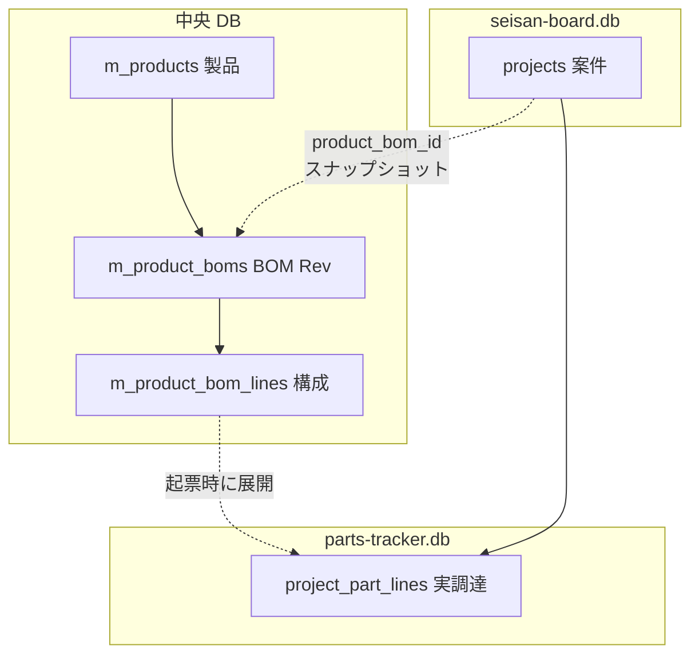

# ポータルアプリ 要件定義書

最終更新: 2026-05-23

---

## 0. 本書の位置づけ

社内で個別に開発してきた 6 つの Electron デスクトップアプリを「1 つのポータル」に統合するための要件をまとめる。
本書は **方針合意のための文書** であり、確定したらこの内容に沿って開発に着手する。

> 凡例:
> - **【決定】** 既に合意済みの事項
> - **【推奨】** 本書での提案。修正があれば指示してください
> - **【未確定】** 次フェーズで詰める事項

---

## 1. 背景・目的

### 1.1 背景
- 既存アプリは個別 exe として開発・運用されており、以下の課題がある。
  - ログインや認証が **アプリごとにバラバラ**（master-database は `app_operators`、Process management desktop は独自 `users` テーブル、seisan-board は「最初に開いた人を承認者にする」など）。
  - 客先・機種・品番などの **マスタの持ち方も統一されていない**（drawing-libraly は文字列をそのまま保存、seisan-board はマスタ DB を読み取り専用で参照、Process management は無関係）。
  - 各アプリを個別に起動・更新する必要があり、**「全社のデジタル基盤」としての一貫性がない**。

### 1.2 目的
- 全アプリの **入り口を 1 つに統合** したポータルを提供する。
- ユーザー認証・マスタを **ポータル内に集約** し、各アプリは中央 DB を参照する。
- **ランディングページ風のホーム画面** で、会社の方針・各アプリの紹介・起動導線を提供する。
- **将来のアプリ追加に耐えられる拡張性**（モジュラ構成、契約の明文化）を確保する。

### 1.3 非ゴール（やらないこと）
- 各アプリの **業務ロジックの作り直し**（既存の動作はできる限り維持）。
- 各アプリ固有 DB（図面 DB、OCR DB など）を **1 つに統合** すること。

---

## 2. 用語定義

| 用語 | 説明 |
|------|------|
| ポータル | 本書で開発する Electron アプリ。ログインと「顔」（ホーム）を持つ |
| 中央 DB | `master-database` が生成する SQLite ファイル。全アプリ共通のユーザー・マスタを保持 |
| サテライト DB | 各アプリが固有データのために持つ SQLite ファイル（図面、OCR、案件詳細など） |
| 子アプリ | ポータルから起動される子プロセスとしての既存 exe |
| 内蔵アプリ | ポータル内に画面として吸収された既存アプリ |

---

## 3. 既存 6 アプリの整理

### 3.1 アプリ一覧

| # | アプリ | 主な機能 | 技術スタック | DB | ポータル統合方針 |
|---|--------|----------|--------------|-----|----------------|
| 1 | **master-database** | 客先 / 機種 / 品番 / 部品名称 / グループ名 / ユーザー名のマスタ管理、操作者（ログインアカウント）管理 | Electron + React 18 + electron-vite + better-sqlite3 + CSS Modules | 中央 DB を生成 | **内蔵** |
| 2 | **seisan-board** | 生産工程の計画・実行、ガントチャート、ダッシュボード | Electron + React 18 + Tailwind + better-sqlite3 + Recharts | サテライト DB ＋ 中央 DB 参照 | **内蔵** |
| 3 | **Process management desktop** | 案件 / 工程ボード（Web 版から移植中） | Electron + React 18 + electron-vite + better-sqlite3 | 独自 DB（独自 `users` あり） | **内蔵** |
| 4 | **drawing-libraly** | 図面（PDF / eDrawings）管理、図面比較。※ DXF 取り扱いは 2026-05-17 に廃止 | （現状）Electron + React 19 + **Express サーバ** + better-sqlite3 + Tailwind + Python(compare exe) → **ポータル取り込み時に Express を撤去** し、Electron + React + Node（IPC 直結）構成へ再設計 | 独自 DB | **内蔵（再設計）** |
| 5 | **PixoConverter** | PDF ↔ 画像変換、PDF 連結、ページ編集 | Electron + React 19 + pdf-lib + sharp | DB なし | **子プロセス起動** |
| 6 | **部材管理（parts-tracker）** | 生産案件に紐づく部品（BOM）の調達区分・リードタイム・必要着日・ステータス管理 | （計画）Electron + React + better-sqlite3 | サテライト DB（`parts-tracker.db`）＋ 生産案件参照 | **内蔵（新規）【計画】** |

> **部材管理**は既存 6 アプリの移植ではなく、ポータル内の **新規内蔵アプリ**。詳細要件は **§8.5** を参照。ホーム LP では **生産ボードの直下**（事務サポートセクション内）に配置する。

### 3.2 統合方針（ハイブリッド）【決定】

- **内蔵（4 アプリ）**: master-database、seisan-board、Process management desktop、drawing-libraly。
  - いずれも DB に依存し、マスタ・ユーザー情報をポータルと共有したい業務系。
  - ポータル内のページとして React コンポーネントを移植する（段階的に行う）。
  - **drawing-libraly は Express サーバを撤去**し、Electron の IPC 経由でメインプロセスの repository／ハンドラを呼び出す構成に **作り直す**。
    - 既存 Express エンドポイント（`/api/drawings/...` 等）は IPC チャネル（`drawing:list`, `drawing:create` 等）に置き換える。
    - 図面比較の `compare_drawings.exe`（Python ビルド成果物）は **extraResources として同梱** を維持し、メインプロセスから `child_process.spawn` で呼び出す。
    - PDF 表示（PDF.js / react-pdf）は **レンダラで Blob URL / File URL として扱う**（Express 経由のファイル配信は廃止）。
- **子プロセス起動（1 アプリ）**: **PixoConverter** のみ。
  - **PDF_scope_vault**（OCR・全文検索）は **ポータル統合対象外**（単体デスクトップアプリとして別管理。2026-05-09 リポジトリから削除）。
  - ポータルから「起動ボタン」で既存 exe を `child_process.spawn` で立ち上げる。
  - 将来吸収しやすいよう、IPC 規約（`module:action` 形式、`{success, data|error}`）を共通化しておく。

### 3.3 アプリ起動時の画面挙動【決定】

内蔵アプリ・子プロセス起動アプリとも、**ポータル本体のウィンドウとは別のウィンドウ（別タブ相当）** で開く。

| 種別 | 起動方法 | 挙動 |
|------|---------|------|
| 内蔵アプリ | 新規 `BrowserWindow` を生成し、そのアプリ専用の URL（例: `#/apps/seisan-board`）を `loadURL` | ポータルのホームは常にバックで残る。各アプリは **独立ウィンドウ** で並行利用可能 |
| 子プロセス起動 | `child_process.spawn(exePath)` | そもそも別プロセスなので自然に別ウィンドウ |

実装方針（内蔵アプリ）:
- メインプロセスに `launcher` モジュール（`launcher:openApp` など）を設ける。
- 起動済みウィンドウを `Map<appId, BrowserWindow>` で管理し、**同じアプリを複数起動しない**（既に開いていれば `focus()` する）。
- 各ウィンドウは同一の preload を共有し、**ポータルのセッション（ログイン状態）を引き継ぐ**（メインプロセス側で保持しているため自然に引き継がれる）。
- ウィンドウを閉じた時点でそのアプリだけを終了する。ポータル本体を閉じると全ウィンドウを閉じる。
- ウィンドウ間のデータ共有は **メインプロセス（DB / セッション）経由のみ**。レンダラ同士の直接通信は禁止。

### 3.4 ワークスペース上の旧アプリフォルダの扱い【記録】

統合（ポータルへの移植・子プロセス起動への一本化）が **完了した時点** で、リポジトリ直下に並んでいる旧スタンドアロンアプリのディレクトリは **削除予定** とする。

対象（削除予定）:

| ディレクトリ名 |
|----------------|
| `drawing-libraly` |
| `master-database` |
| `PixoConverter` |
| `Process management desktop` |
| `seisan-board` |

**Python スクリプト・ランタイム依存の扱い**:

- 他 PC に Python 環境を用意できないため、**ソースの `.py` は最終的に残さなくてよい**前提でよい。
- 代わりに、ビルド済み **exe（および同梱に必要なリソース）だけ** をリポジトリ直下（例: `resources/` または `electron-builder` の `extraResources`）へ置き、**インストーラー配布物に含める**。
- 具体的な exe 名・配置パスは、アプリ取り込み時に `launcher-design.md` / `ipc-channels.md` を更新して固定する（図面比較、OCR、その他スクリプト由来のツールなど）。

> 注: 上記削除は **統合完了後** の整理作業。現時点では参照・比較のためフォルダを残す。

---

## 4. 技術構成

### 4.1 採用技術【決定】

| 領域 | 採用 | 理由 |
|------|------|------|
| 基盤 | **Electron 33** | 既存 4 アプリと同等。Chromium + Node 同梱で配布が容易 |
| ビルド | **electron-vite** | master-database / seisan-board / Process management desktop と同じ |
| 言語 | **TypeScript（ESM）** | ユーザー規約遵守。`require` 不可 |
| UI | **React 18** | 既存内蔵対象アプリ（1〜3）と揃える。19 系の PixoConverter / drawing-libraly は子で隔離 |
| ルーティング | **react-router-dom 6（HashRouter）** | Electron でファイルパス問題を避ける |
| スタイル | **Tailwind CSS + CSS Modules（共存）**【推奨】 | LP 演出・shadcn 系コンポーネントは Tailwind 中心。既存 master-database 由来の画面は CSS Modules を維持しつつ段階移行 |
| アニメーション | **framer-motion**【推奨】 | ヒーローのメリーゴーラウンド演出・スクロール連動・各セクションのフェードイン |
| アイコン | **lucide-react** | 既存複数アプリで使用中 |
| DB | **better-sqlite3** | 既存全アプリで使用 |
| パッケージング | **electron-builder（Windows NSIS）** | 既存と同じ |

### 4.2 セキュリティ規約【決定】（ユーザー規約より）

- `contextIsolation: true`
- `nodeIntegration: false`
- `sandbox: true`
- preload は **`contextBridge.exposeInMainWorld("api", { invoke })`** のみ。業務ロジック禁止
- IPC は **`ipcMain.handle` のみ**、レスポンスは `{ success, data | error }` で統一
- ネイティブモジュール（better-sqlite3 ほか）は **メイン側でのみ使用**

### 4.3 ディレクトリ構成（提案）

```
.                                 ← リポジトリルート
├── docs/
│   └── requirements.md           ← 本書
├── src/
│   ├── main/
│   │   ├── index.ts              ← エントリ。loader.ts のみ import
│   │   ├── window.ts             ← BrowserWindow 生成
│   │   ├── db/
│   │   │   ├── connection.ts     ← 中央 DB 接続管理
│   │   │   ├── schema.ts         ← テーブル DDL（バージョニング対応）
│   │   │   └── migrate.ts        ← マイグレーション（schema_meta による版管理）
│   │   ├── session.ts            ← ログインセッション
│   │   ├── auth-guard.ts         ← 権限チェック
│   │   ├── password.ts           ← scrypt ハッシュ
│   │   └── modules/
│   │       ├── loader.ts         ← 各 *.handler.ts を register
│   │       ├── auth/             ← ログイン・セッション・bootstrap
│   │       ├── operator/         ← 操作者管理
│   │       ├── master/           ← マスタ全般（customer/model/...）
│   │       ├── settings/         ← ポータル設定（DB パス・会社情報）
│   │       ├── launcher/         ← アプリ起動（内蔵= 新規 BrowserWindow／外部= child_process.spawn）
│   │       └── （アプリ別）/      ← 内蔵アプリのハンドラ
│   ├── preload/
│   │   └── index.ts              ← contextBridge のみ
│   ├── renderer/
│   │   ├── main.tsx
│   │   ├── App.tsx               ← ルーティング
│   │   ├── routes/
│   │   │   ├── Login.tsx
│   │   │   ├── Bootstrap.tsx     ← 初期セットアップウィザード
│   │   │   ├── Home.tsx          ← LP 風ホーム
│   │   │   └── apps/             ← 内蔵アプリ画面（段階追加）
│   │   ├── components/
│   │   │   ├── Navbar.tsx
│   │   │   ├── HeroCarousel.tsx  ← メリーゴーラウンド
│   │   │   ├── AppSection.tsx    ← #anchor で遷移する各アプリ説明
│   │   │   └── ui/               ← Button, Card 等の共通 UI
│   │   ├── hooks/
│   │   │   └── useAuth.ts
│   │   └── styles/
│   └── shared/
│       ├── types.ts
│       ├── auth.ts               ← AppRole 等
│       ├── ipcResponse.ts
│       └── constants.ts
├── public/
│   └── portal-icon.ico
├── electron.vite.config.ts
├── tailwind.config.ts
├── postcss.config.js
├── tsconfig.json
└── package.json
```

> `Modular Architecture Rules` に準拠。`*.repo.ts` / `*.handler.ts` を分離し、`loader.ts` で `register(ipcMain)` を呼ぶ。

---

## 5. データベース設計方針

### 5.1 全体像【決定（B：中央 + サテライト）】

- **中央 DB（portal-master.db）**: ポータルおよび内蔵アプリで **共有** するデータ。
  - 操作者（ログインアカウント）、マスタ（客先・機種・品番・部品名称・グループ名・ユーザー名 ほか）、ポータル設定。
- **サテライト DB（各アプリ）**: アプリ固有のトランザクションデータ。
  - 例: 案件、工程、図面、OCR 結果、ガントスケジュール。
  - サテライト側は **中央 DB の整数 ID を参照（FK ではなく ID コピー）** + **必要に応じて表示用テキストをスナップショット保存**（マスタ名変更時の追跡可能性のため）。

> サテライトでは FK は **同一 DB ファイル内のテーブルにのみ** 張る（SQLite はファイル間 FK 不可のため）。中央 DB の ID は単なる整数として保持。

### 5.2 中央 DB のテーブル構成方針【決定：master-database を作り直す／flat + 共有 SKU】

#### 5.2.1 方針転換

**【ユーザー判断 2026-05-05】**: 既存 master-database はまだ完成しきっていないため、**後方互換は気にせず作り直す**。
したがって、本章はもはや「互換を保ちつつ段階移行」ではなく、**「ポータル用の中央 DB を新規設計する」** ものとして扱う。既存 `seisan-board` の repository 層（`customers/models/part_numbers/component_names` を階層 FK で読む）は、ポータル取り込み時に合わせて書き換える前提。

#### 5.2.2 既存 master-database の階層を見直す理由

現行 master-database は `customers → models → part_numbers → component_names` を **FK で階層化** しており、以下のメリット・デメリットがある。

| 観点 | 現行（階層 FK） | 採用案（flat + 共有 SKU） |
|------|----------------|--------------------------|
| 同名利用 | 同名は親が違えば OK（例: 客先 A の機種「X」と客先 B の機種「X」は別） | 全社で同名は 1 つ（重複は意図的なら別途対応） |
| カスケード UI | 「客先 → 機種」で絞り込みが自然 | 別途 `m_skus` テーブルで関係管理 |
| アプリ間の差 | seisan-board は 4 階層、drawing-libraly は 3 階層、Process management は 0 階層 → **強制的な階層は誰かにとっては過剰** | 各アプリが必要な分だけ参照できる |
| 同じ部品が複数の機種にぶら下がる | 機種ごとに重複登録 | 共有 SKU で 1 行で表現可能 |
| 名称変更の影響 | 子も含めて 1 箇所更新で済む | flat なので 1 箇所更新で済む（SKU 側は ID 参照） |
| 取り込み側アプリの書き換え | 不要 | 必要（ただし内蔵時にまとめて実施） |

→ **階層 FK は外し、関係は `m_skus` で別テーブル化** することで「アプリごとに必要な切り口」を後から作れる柔軟性を確保する。

#### 5.2.3 提案テーブル

##### A. 操作者・認証（鶏卵対策の中核）

| テーブル | 役割 |
|----------|------|
| `app_operators` | ログインアカウント（loginName, passwordHash, displayName, role, isActive） |
| `app_operator_app_grants` | （任意・将来）アプリ別の利用権限。なければ全アプリ可 |

`role`: `viewer` / `editor` / `admin`（既存と同じ）

##### B. マスタ（flat）

各テーブルとも以下の共通列を持つ:

| 列 | 型 | 説明 |
|----|-----|------|
| `id` | INTEGER PRIMARY KEY AUTOINCREMENT | 主キー |
| `name` | TEXT NOT NULL | 名称 |
| `isActive` | INTEGER NOT NULL DEFAULT 1 | 有効フラグ |
| `createdAt` / `updatedAt` | TEXT | 監査列 |

部分 UNIQUE インデックス: `WHERE isActive = 1` で `name COLLATE NOCASE` 一意。

| テーブル | 説明 | 既存との違い |
|----------|------|-------------|
| `m_customers` | 客先 | （変更なし） |
| `m_models` | 機種 | **`customer_id` カラム廃止**（共有 SKU 側で関係を持つ） |
| `m_part_numbers` | 品番 | **`model_id` カラム廃止** |
| `m_component_names` | 部品名称 | **`part_number_id` カラム廃止** |
| `m_group_names` | グループ名 | （変更なし） |
| `m_user_names` | ユーザー名 | （変更なし） |
| `m_suppliers` | **商社**（購入・外注先） | **部材管理向け【計画】**。§8.5.6 参照 |
| `m_categories` | カテゴリ（scope 付き） | 図面ライブラリ等。§8.4.2 参照 |

**部材管理向けの追加マスタ（標準リードタイム）** は flat 名称マスタではなく **関連テーブル `m_procurement_lead_times`** として中央 DB に持つ（§8.5.6）。

##### C. 共有 SKU（任意のリンク）

複数アプリが「客先 × 機種 × 品番 × 部品名称 × 図面番号」を扱うため、**ポータルレベルで 1 つの「SKU テーブル」を持たせる**。

```sql
CREATE TABLE m_skus (
  id INTEGER PRIMARY KEY AUTOINCREMENT,
  customer_id   INTEGER REFERENCES m_customers(id),
  model_id      INTEGER REFERENCES m_models(id),
  part_number_id INTEGER REFERENCES m_part_numbers(id),
  component_name_id INTEGER REFERENCES m_component_names(id),
  drawing_number TEXT,
  revision      TEXT,
  isActive INTEGER NOT NULL DEFAULT 1,
  createdAt TEXT DEFAULT (datetime('now')),
  updatedAt TEXT DEFAULT (datetime('now'))
);
```

- どの ID も **NULL 可**（アプリごとに必要な深さでだけ埋める）。
- seisan-board は (客先・機種・品番・部品名称) を埋めて使う。
- drawing-libraly は (客先・機種・品番) + 図面番号 + リビジョンを埋めて使う。
- Process management desktop は (客先) + 図面番号 + リビジョンで使う、など。

##### D. 互換レイヤは不要

既存 master-database はスタンドアロンアプリとして廃止方針のため、**旧テーブル名（`customers` 等）を残す必要はない**。
既存 `seisan-board` の repository 層（`masterData.repo.ts` の `listCustomers` / `listModels(customerId)` など）は、内蔵移植時に **新スキーマ（`m_customers` + `m_skus` JOIN）前提に書き換える**。

##### E. 設定

| テーブル | 役割 |
|----------|------|
| `app_settings` | key/value で設定保持（会社名、モットー、配色、ロゴパス、アプリ起動コマンド等） |
| `schema_meta` | DB スキーマバージョン管理（マイグレーション制御） |

### 5.3 マスタの「使い方」のルール

| 局面 | ルール |
|------|--------|
| アプリが新規レコードを登録するとき | マスタに **存在する ID を必ず使う**（フォームはマスタ選択 UI 必須） |
| マスタ名が変更されたとき | サテライト側の表示は **マスタ JOIN を都度実行**。スナップショット保存している場合は監査列のみ更新せず、別途「履歴」を持つ |
| マスタが無効化されたとき | 既存レコードは残るが、**新規入力選択肢からは外す**（`isActive = 1` のみ表示） |

---

## 6. 認証・初期化（鶏と卵対策）

### 6.1 起動時フロー【決定（B 案：admin/admin 自動シード + 強制パスワード変更）】

```
[ポータル起動]
   │
   ▼
DB パス読み込み（app config に保存）
   │
   ├─ 未設定 ──────────────┐
   │                       ▼
   │              [初期セットアップ画面]
   │              ・新規 DB 作成 / 既存 DB 選択
   │              ・既定: %APPDATA%/portal/portal-master.db
   │                       │
   ▼                       │
DB 接続 + テーブル自動作成 ◄─┘
   │
   ▼
app_operators 件数チェック
   │
   ├─ 0 件 → admin/admin を seed → ログイン画面（admin/admin 案内）
   │                                      │
   └─ 1 件以上 → ログイン画面             │
                                          ▼
                              ログイン成功（admin/admin の場合）
                                          │
                                          ▼
                                [強制パスワード変更モーダル]
                                          │
                                          ▼
                                   ポータルホームへ
```

### 6.2 鶏卵にしないためのキーポイント

1. **DB ファイルが無くてもログイン画面まで到達できる** → 「DB を作成 / 選択する画面」を必ず先に出す。
2. **DB はあるが `app_operators` が空** という壊れ状態でも、**admin/admin が必ず立ち上がる**（自動 seed）。
3. **admin/admin のままでは業務画面に進めない**。最初のログイン直後に強制パスワード変更（DB に `mustChangePassword = 1` 列を持つか、初期パスワード判定で分岐）。
4. **管理者を最低 1 人保証**。管理者の最後の 1 人を無効化／降格はできない（既存 master-database のロジックを踏襲）。
5. **DB 切り替え時** はセッションを破棄し、初期化フローを最初からやり直す（既存 Process management desktop の `resetAppStateAfterDatabaseChange` 相当）。
6. **bootstrap 完了フラグ** を `app_settings` に保持（`portal.bootstrapped = '1'`）。`admin/admin` シードは `bootstrapped` が無い & 操作者 0 件のときだけ動かす（誤って 2 回目以降に admin が再生成されないように）。

### 6.3 セッション

- メイン側のメモリにセッション保持（既存 master-database の `session.ts` 方式）。
- アプリ終了で消える前提（業務 PC 想定なら問題なし）。
- 必要なら将来「N 分で自動ログアウト」を `app_settings` の値で実装。
- **子プロセスで起動するアプリ（PixoConverter）にセッションを引き継ぐ仕組み** は当面不要（各アプリは独立起動）。将来は「ワンタイムトークンを引数で渡す」拡張で対応可能。【未確定】

### 6.4 権限モデル

| ロール | できること |
|--------|-----------|
| `viewer` | 閲覧のみ。マスタ・案件 etc. の更新不可 |
| `editor` | 業務データの登録・更新可 |
| `admin` | 操作者管理、DB 設定、マスタ削除、`app_settings` 変更 |

---

## 7. UI 設計（LP 風ホーム）

### 7.1 ホーム画面の構成【決定】

```
┌────────────────────────────────────────────────────────┐
│ Navbar  [会社名]                  [#master][#seisan]…  │  ← アンカー遷移
├────────────────────────────────────────────────────────┤
│                                                        │
│   Hero (メリーゴーラウンド型カルーセル)                  │
│   ・「安全第一」「品質第二」「生産第三」を                │
│     回転式（フェード or サークル状）で順送り表示          │
│   ・会社名・ポータル名を中央に                           │
│                                                        │
├────────────────────────────────────────────────────────┤
│  #master-database                                      │
│   ┌──────────────┐  マスター DB 説明                     │
│   │  preview     │  ・客先・機種・品番…                   │
│   └──────────────┘  ・[開く]                            │
├────────────────────────────────────────────────────────┤
│  #seisan-board       … (同様、各アプリのセクション)      │
│  #process-management …                                 │
│  #drawing-library    …                                 │
│  #pixo-converter     …  [起動]（子プロセス・未対応時はエラー）  │
│  #pixo-converter     …  [起動]（子プロセス）             │
├────────────────────────────────────────────────────────┤
│  Footer  バージョン / 更新日 / 自分の表示名 / ログアウト │
└────────────────────────────────────────────────────────┘
```

### 7.2 デザイン要件

- **navbar**:
  - 左に会社名、右にアプリ名のアンカーリンク（`#master-database` など）。
  - クリックで **そのセクションまでスムーズスクロール**。
  - 右端に表示名と「ログアウト」。
- **ヒーロー**:
  - 会社モットーを **3 件** カルーセル表示（メリーゴーラウンド風）。
  - framer-motion で 3D 回転 or サークルパス上を移動。
  - モットー文言は `app_settings.company_motto_1/2/3` に保存し、設定画面から差し替え可能（**当面はプレースホルダ「安全第一 / 品質第二 / 生産第三」**）。
  - 会社名・ポータル名も `app_settings` から取得。
- **アプリセクション**:
  - 1 アプリ 1 セクション。スクロールで順に出現（`whileInView` フェード）。
  - **内蔵**: 「開く」ボタン → メインに `launcher:openApp` を送信 → **新規 `BrowserWindow`（別タブ相当）** でそのアプリの画面を `loadURL`。既に開いていれば前面化（focus）。
  - **子プロセス**: 「起動」ボタン → メインから `child_process.spawn(exePath)`。失敗時はトーストで通知。
- **配色テーマ**:
  - 既存 master-database のダーク系をベースに、Tailwind の `slate / sky / emerald` を組み合わせる方向【推奨】（具体案は実装フェーズで詰める）。

### 7.3 ログイン画面

- `app_operators` テーブルからログイン名 + パスワードで認証。
- フォーム下に **「初回は admin / admin でログインできます」** の案内（`bootstrapped` フラグが立つまで）。
- 「DB を選択 / 作成」リンクを下部に小さく置き、**DB 未設定状態から脱出可能** にする（鶏卵対策の補助動線）。

### 7.4 ホーム アプリ説明文リライト【確定・実装済み】

**目的**: ポータルホーム（`Home.tsx` → `AppSection`）に表示する各アプリの `description` およびセクション `lead` を、**利用者向けの平易な説明**に差し替える。技術実装（DB 名・IPC・権限モデル・ファイル配置など）は書かない。

**現状の問題**（`shared/constants.ts` `APP_CATALOG` / `PORTAL_APP_SECTION_META`）

| 問題 | 例 |
|------|-----|
| バックエンド用語 | `drawing-library.db`、`中央データベース`、`process-management.db` |
| 権限・設計の説明 | ロール名、セッション、クラウド流出経路 |
| アプリ連携の内部構造 | 「同一 DB を参照」「案件 ID 連携」 |
| 長さ | 段落 1 つ・300 字超 — **長さ自体は維持可**（聞き取り結果） |

**文案の方針【2026-05 聞き取り 1 回目 確定】**

| 項目 | 内容 |
|------|------|
| トーン | **現場・事務向けにくだけた口調**（「〜できます」「〜が楽になります」） |
| 長さ | **現状並み**（段落 1 つ・300 字程度。必要なら 2 段落まで） |
| 読者 | **その画面を操作中の人** |
| 構成 | 各ページ **「できること（概要）」＋「操作手順（ボタン名・手順番号）」** の2部構成。ページ説明だけでは不十分 |
| トーン | **マニュアル寄り**（箇条書き・手順多め） |

**実装先**

- `src/shared/constants.ts` … `APP_CATALOG[].description`（**2026-05 反映済み**）
- `PORTAL_APP_SECTION_META` … **現状維持**（変更なし）

#### 7.4.1 セクション見出し（lead）の聞き取り【現状維持】

| sectionId | 方針 |
|-----------|------|
| 4 ブロックすべて | **title / lead は現状のまま**（聞き取り回答: 「このままでいい」） |

#### 7.4.2 アプリ別 聞き取りシート【回答記録】

##### A. マスターデータベース（`master-database`）

| # | 質問 | 回答 |
|---|------|------|
| A1 | **誰が**使いますか？ | 取締役、部長、工場長 |
| A2 | **いつ**触りますか？ | 毎日 |
| A3 | 現場の人への説明 | ポータルアプリ全体のデータをマスターデータ（元となる基本情報）として管理し、それぞれのアプリで一律した内容で入力できるようなデータを管理している |
| A7 | 他アプリとの関係 | 誰がやっても同じ入力条件になるように |

##### B. 生産ボード（`seisan-board`）

| # | 質問 | 回答 |
|---|------|------|
| B1 | **誰が**毎日使いますか？ | それぞれの部署の長 |
| B2 | **どんな場面**で開きますか？ | 顧客からの受注があった場合、進捗確認 |
| B3 | 製番の社内呼称 | **品番** |
| B4 | なくなると困ること | いつまでに納品しないといけないかなど、時間管理ができない |
| B7 | 新人に最初に見せる場所 | 受注入力は長が行う。ガントチャートの期間を見て、それまでに次工程に回せるように動く |

##### C. 部材管理（`parts-tracker`）

| # | 質問 | 回答 |
|---|------|------|
| C1 | 主ユーザー | 事務、生産管理 |
| C5 | ゴール | 欠品防止、発注漏れ防止 |
| C6 | 生産ボードとの違い | 製品の構成と個々の部品の Rev 管理。購入品・支給品があればいつまでに必要か、手配はいつまでかを管理する |

##### D. 図面ライブラリ（`drawing-library`）

| # | 質問 | 回答 |
|---|------|------|
| D1/D2 | 用語 | **顧客図面** と **自社発行** の両方を使う |
| D4 | 入れたい運用 | 客先・機種・図面番号のカスケード絞り込みで、最短で欲しい図面が見つかる |
| D5 | PDF 比較 | **おまけ程度**。新旧比較したい図面をまずダウンロードして PC 上に用意し、それぞれのファイルを選んで比較。完璧に動作しないので目安確認程度 |

##### E. 工程管理（`process-management`）

| # | 質問 | 回答 |
|---|------|------|
| E1 | **誰が**使いますか？ | 生産技術 |
| E3 | ビュー切替 | **出す**。SolidWorks / CADMAC などに合わせて、生産技術の進捗状況が把握できる |
| E4 | 生産ボードとの使い分け | 生産ボードの「設計」と「レーザーデータ作成」の進捗だけを、部内で把握できるようにした |

##### F. PixoConverter（`pixo-converter`）

| # | 質問 | 回答 |
|---|------|------|
| F1 | **誰が**使いますか？ | 事務所みんな |
| F2 | 具体例 | 社内図面の PDF 管理、購入品図面の作成、図面ライブラリ自社発行の登録用ファイル作成 |
| F4 | 通称 | PixoConverter のまま |

##### G. ヒーロー・全体

| # | 質問 | 回答 |
|---|------|------|
| G1〜G3 | — | **未回答**（初稿ではヒーロー文言は現状維持） |

#### 7.4.3 確定文案【2026-05 承認】

##### セクション見出し（`PORTAL_APP_SECTION_META`）

**変更なし**（現行の `title` / `lead` を維持）。

##### 各アプリ `description`（`APP_CATALOG` に反映済み）

**`master-database`**

```
取締役・部長・工場長が毎日確認し、客先や機種、品番など、ポータル全体で使う基本情報をまとめて管理するアプリです。どのアプリから入力しても同じ名称・同じ選び方になるように整えておくのが役目で、誰が操作しても入力のブレが起きにくくなります。現場の方が直接触ることは少ないかもしれませんが、生産ボードや部材管理、図面ライブラリで選ぶ名前の元になっている、いわば「共通の名簿」です。ここを日々整えておくと、後工程の入力が迷子になりません。
```

**`seisan-board`**

```
各部署の長が毎日開き、顧客から受注が入ったら品番単位で進捗を追うアプリです。いつまでに納品しなければならないか、今どの段階にいるかを一覧で把握でき、納期の時間管理ができます。受注の登録は長が行い、新人の方にはまずガントチャートの期間を見て、次の工程に間に合うように動くところから始めてもらうのがおすすめです。顧客から預かった図面や資料も品番ごとに整理され、図面ライブラリの「顧客図面」から同じ内容を探せます。
```

**`parts-tracker`**

```
事務や生産管理が使い、生産ボードの品番とは別に、製品を構成する部品の Rev や、購入品・支給品の手配状況を細かく追います。いつまでに部品が揃わないと困るか、手配の期限はいつまでかを一覧で見られ、欠品や発注漏れを防ぐのがゴールです。生産ボードが品番全体の流れを見るのに対し、部材管理は「中身の部品表」と「いつ手配するか」に寄ったアプリだと思ってください。危ないものが早めに目に入るよう、期限まわりは見やすく表示されます。
```

**`drawing-library`**

```
「顧客図面」は生産ボードに登録された提供ファイルを、品番と一緒に探せます。「自社発行」は社内で作った図面を Rev ごとに登録・履歴管理でき、客先・機種・図面番号の順で絞り込むと欲しい図面にたどり着きやすくなっています。治具や社内設備の図面もカテゴリで分けて登録できます。PDF 比較は、比較したいファイルを PC 上に用意してから、それぞれ選んで並べるおまけ機能です。完璧に差分が出るわけではないので、目安確認程度に使ってください。
```

**`process-management`**

```
生産技術が使い、生産ボードでは見にくい「設計」と「レーザーデータ作成」の進捗だけを、部内で細かく追えるようにしたアプリです。SolidWorks や CADMAC など、担当する作業に合わせた見え方に切り替えられ、今どこまで進んでいるかがひと目で分かります。品番全体の日程や納期は生産ボード、技術部門の中の進み具合は工程管理、という使い分けをイメージしてください。部内の進捗共有や、次に手を付ける作業の整理に向いています。
```

**`pixo-converter`**

```
事務所のみんなが、日々の資料づくりに使う変換・編集ツールです。社内図面を PDF で揃えたいとき、購入品の図面を作るとき、図面ライブラリの自社発行に載せるファイルを用意するときなど、ポータルからすぐ開けます。PDF や画像の変換、複数ファイルの結合、ページの入れ替えなど、印刷や登録の直前に体裁を整える場面で助かります。面倒なファイル作業を、このアプリに任せてしまうイメージです。
```

#### 7.4.4 受け入れ基準

- [x] 全 `APP_CATALOG` 説明に `.db` / IPC / grant / ロール英名が含まれない
- [x] 各説明が **300 字前後**（±100 字）で、冒頭にアプリの目的が分かる
- [x] トーンが §7.4 方針（くだけた・現場向け）と一致
- [x] セクション `lead` がアプリ説明と矛盾しない
- [x] ユーザーが §7.4.3 文案を **承認**（2026-05）
- [x] `shared/constants.ts` に反映
- [ ] ホーム画面で表示確認（手動）

### 7.5 アプリ内ヘルプ（ページ別操作説明）【文案確定・実装未着手】

**目的**: 各内蔵アプリの **画面（ページ／タブ）ごと** に、その場で「何ができて、どう操作するか」が分かるヘルプを用意する。ダッシュボード系画面では **KPI・グラフ・分析ブロックが何を表すか** を必ず説明する。

**§7.4（ホーム LP 説明文）との違い**

| 項目 | ホーム LP（§7.4） | アプリ内ヘルプ（本節） |
|------|-------------------|------------------------|
| 読者 | 初めてポータルを開いた人 | **その画面を操作中の人** |
| 内容 | アプリ全体の役割・位置づけ | **当該ページの操作手順・画面の見方** |
| トーン | くだけた口調 | **マニュアル寄り（箇条書き・手順多め）** |
| 技術メモ | 禁止 | **`.db` / 保存場所 / IPC も書かない**（聞き取り確定） |

**表示 UI【2026-05 聞き取り】**

| 項目 | 方針 |
|------|------|
| 初回実装 | **ヘルプボタン → モーダル**（既存パターンを踏襲） |
| 将来 | **サイドドロワー**への移行を検討可（レイアウトが広い画面向け） |
| 併用 | 各ページ **tagline（1 行サマリ）** をヘッダーまたはツールバー上に任意表示（既存定数を活用） |

**実装方針（コード変更時）**

- 各ヘルプは **「できること（概要）」＋「操作手順（UI のボタン名・番号付き手順）」** の2部構成とする（ページ説明のみ不可）
- 文言は `*HelpCopy.ts` に **ページ ID キー**で集約（例: `seisanBoardHelpCopy.ts` の `HELP_DASHBOARD_KPI`）。
- 長文は `*HelpContent.tsx` コンポーネントで **variant = ページ ID** を受け取り表示（部材管理 `PartsTrackerHelpContent` を参考）。
- ヘルプ本文は **Markdown 風の見出し＋箇条書き**（実装時は JSX の `<section>` / `<ul>`）。
- 権限差分（viewer / editor / admin）は **段落を出し分け**（部材管理と同様）。

#### 7.5.1 現状インベントリ

| アプリ | 画面 / タブ | ヘルプ | 備考 |
|--------|-------------|--------|------|
| **生産ボード** | ダッシュボード | **あり**（Dialog） | グラフ説明あり。文言が `DashboardPage.tsx` 直書き → `seisanBoardHelpCopy` へ移管予定 |
| | 案件一覧 | **なし** | |
| | 案件詳細 | **なし** | |
| | ガント | **なし** | |
| | 設定（一般・工程テンプレ・権限） | **なし** | 利用頻度低め。後回し可 |
| **部材管理** | メイン（部品一覧） | **あり**（Modal） | 1 モーダルに全機能が詰まっている。セクション見出し整理を推奨 |
| | 案件間比較 | **あり** | variant=`compare` |
| | 変更履歴 | **あり** | variant=`history` |
| **図面ライブラリ** | 顧客図面 | **あり** | `.db` 記述なし（OK） |
| | 自社発行 | **あり** | `HELP_DB_STORAGE_NOTE` あり → **削除** |
| | PDF 比較 | **あり** | exe パス等の技術メモ → **利用者向けに簡略化** |
| **工程管理** | ダッシュボード | **あり（薄い）** | 1 行＋DB メモのみ。**分析ブロックの説明を新規作成** |
| | ボード | **あり** | 内容は充実。DB メモ削除 |
| | マイタスク | **あり** | dashboard タブ時は mytasks 用が出ないバグ的挙動 → **タブごと出し分け要確認** |
| **マスターデータベース** | 全タブ | **なし** | ヘッダー 1 行のみ。**タブごと新規** |
| | ユーザー権限・監査ログ・標準 LT・SKU | **なし** | |
| **PixoConverter** | PDF変換 / TIFF / 画像 / 結合 / 差替 | **なし** | **ページごと新規** |

#### 7.5.2 ページ ID 一覧（ヘルプ variant キー）

```
seisan-board/dashboard | projects | project-detail | gantt
parts-tracker/main | compare | history
drawing-library/customer | work | pdf-compare
process-management/dashboard | board | mytasks
master-database/{tableId} | user-access | audit-log | procurement-lead-times | m_skus
pixo-converter/pdf-convert | tiff-convert | image-convert | merge | replace
```

#### 7.5.3 確定文案 — ダッシュボード（生産ボード・工程管理）

##### 生産ボード — `dashboard`【コード既存をベースに移管】

> 現行 `DashboardPage.tsx` 内 Dialog の内容を §7.4 と同様の平易語に整え、`seisanBoardHelpCopy.ts` へ移す。

**このページでできること**

- 品番（案件）全体の状況を KPI・グラフ・直近納期表で俯瞰する
- 右上の **グループ** で特定グループだけに絞り込む（全ウィジェット連動）

**KPI カード（上段 4 つ）**

| 表示 | 意味 |
|------|------|
| 進行中案件 | いま「進行中」の品番数。動いている仕事の量 |
| 今月納期 | 今月中に納期がある進行中品番数。月末に向けて要確認 |
| 納期遅延 | 納期を過ぎても未完了の品番数。**0 が理想** |
| 今月完了 | 今月完了した品番数。チームの成果 |

**グループ別 案件負荷（横棒グラフ）**

- 各グループが抱える品番数を、ステータス別に色分け表示
- **紫** = 承認済（これから着手） / **青** = 進行中 / **緑** = 完了
- 棒が長いグループほど負荷が多い。偏りの確認用

**ステータス別 案件分布（ドーナツ）**

- 全品番がどのステータスにいるかの割合
- 「進行中」が極端に多いときはボトルネックの可能性

**月別 案件推移（折れ線）**

- 過去 6 ヶ月の **新規登録数** と **完了数**
- 完了が新規に追いついていない → 仕事が溜まっているサイン

**直近の納期（表）**

- 今日から 30 日以内に納期の未完了品番
- **赤** = 7 日以内または超過 / **黄** = 14 日以内 / **緑** = 15 日以上

**操作**

1. グループを選ぶ（任意）
2. **再読込** で最新化
3. 品番の詳細は **案件一覧** から

---

##### 工程管理 — `dashboard`【新規ドラフト】

> グラフ（recharts）ではなく **KPI カード・表・通知ブロック** が中心。いずれも説明対象。

**このページでできること**

- 自グループの工程タスクの **いま** と **当月の傾向** を確認
- 滞留・通知を見て **ボード** / **マイタスク** に移動

**現在の状況（4 カード）**

| 表示 | 意味 |
|------|------|
| 作業中 | ステータスが「作業中」のタスク数（全体） |
| 一時中断 | 「一時中断」（CAD 引渡し待ち等）のタスク数 |
| 未着手（全体） | まだ着手していないタスク数 |
| 自分の未着手 | ログイン中の自分が主担当で、未着手のタスク数 |

**分析サマリー（当月・4 カード）**

| 表示 | 意味 |
|------|------|
| 放置タスク | **7 日以上更新がない** 未完了タスク。クリックで一覧 |
| 今月完了 | 今月完了したタスク件数 |
| 今月平均 | 今月完了タスクの **平均作業日数** |
| 並行率 | SolidWorks と CADMAC を並行した案件の割合（％） |

**詳細ブロック（3 列）**

1. **メンバーの作業状況** — 自グループメンバーごとに、作業中 / 一時中断 / 未着手 / 補助 の件数。名前クリックで **ボードをその担当で絞り込み**
2. **工程別分析** — 設計・レーザーデータ作成など工程タイプごとに、今月完了数・平均作業日数・一時中断・作業中
3. **通知（未確認）** — CAD へ受渡し / ガント変更 / 完了報告

**自分の担当・クイックリンク**

- 今日着手・今日完了・未着手（主担当）の件数
- **マイタスクへ** / **ボード一覧へ** ボタン

**操作**

1. 通知ブロックの **更新** で最新化
2. 放置タスクカード → 一覧確認 → ボードで対応
3. 進捗入力は **マイタスク**、全体確認は **ボード**

---

#### 7.5.4 確定文案【2026-05 聞き取り反映】

##### 生産ボード — `projects`（案件一覧）

**このページでできること**

- 品番（案件）の一覧表示・検索・絞り込み
- **受注登録**（新規案件の作成）

**操作手順 — 受注登録（新規案件）**

1. 画面上部右の **「新規案件」** をクリック
2. ダイアログで **客先 → 機種 → 図面番号(品番) → 名称** の順に選択（マスタ連動）
3. **号機**・**リビジョン**（任意）・**納期（案）**・**内容**・**グループ**・**入力者** を入力
4. **「保存」** をクリック → 下書き状態の案件が作成される
5. 一覧の該当行をクリックし **案件詳細** へ（工程作成・提出へ進む）

**操作手順 — 一覧の絞り込み・検索**

1. 検索欄に案件番号・客先・機種・品番・号機・内容のキーワードを入力（入力後しばらくで自動反映）
2. **客先** / **グループ** / **登録月** のプルダウンで絞り込む
3. **「リセット」** で条件をクリア
4. **「完了案件を含む」** にチェックを入れると、完了品番も表示される（初期は非表示）
5. 一覧を下までスクロールすると、続きの案件が自動で読み込まれる

**操作手順 — その他**

| 操作 | 手順 |
|------|------|
| **案件詳細を開く** | 一覧の行をクリック |
| **CSV エクスポート** | 右上 **「CSVエクスポート」**（表示中の一覧を出力） |
| **CSV インポート** | 右上 **「CSVインポート」** → ファイル選択 → 取込（編集権限が必要） |
| **データ更新** | ヘッダーの **更新** アイコン（他画面で変更した直後など） |

**ステータスの流れ（参考）**

- 下書き → **提出**（詳細画面）→ 承認済 → **案件を着手** → 進行中 → **案件を完了**
- 承認後に工程作成。進行中が日常の管理対象

**新人向けの基本フロー**

1. 長が **新規案件** で受注登録
2. 案件詳細で **提出 → 承認**（権限者）→ **工程** タブで工程作成
3. 毎日 **ダッシュボード** または **ガント** で進捗確認

---

##### 生産ボード — `project-detail`（案件詳細）

**このページでできること**

- 1 品番の基本情報の確認・更新
- **工程**（ガント）の作成・編集
- **提供ファイル**（顧客図面等）の登録

**操作手順 — ステータス変更（ヘッダー付近のボタン）**

| ボタン | いつ使う | 手順 |
|--------|----------|------|
| **提出** | 下書きのとき（長） | 概要の必須項目を埋める → **「提出」** |
| **承認** | 提出済のとき（承認者） | **「承認」** をクリック |
| **案件を着手** | 承認済のとき | **「案件を着手」** → 確認ダイアログで OK → **進行中** に |
| **案件を完了** | 進行中のとき | **「案件を完了」** → 確認 → **完了** に |
| **完了解除（差し戻し）** | 完了後に戻すとき | **「完了解除」** → 確認 → **進行中** に |
| **複製** | 似た案件を下書きで作る | **「複製」** → 確認 → 新規下書きが開く |

**操作手順 — 概要タブ（基本情報・提供ファイル）**

1. **概要** タブを選択
2. **基本情報** … 客先名・グループ・納期を入力・修正
3. **製品情報** … 名称・機種・図面番号(品番)・号機・リビジョン
4. **依頼内容・備考** … 内容・備考を入力
5. 画面下 **「保存」** をクリック（編集権限が必要）
6. **提供ファイル** セクション:
   - **「ファイル追加」** → PC から顧客図面等を選択
   - 各行 **「開く」** で参照、**「削除」** で登録解除
   - **「一括ダウンロード」** でまとめて保存
   - ※ 図面ライブラリ **顧客図面** タブにも同じファイルが表示される

**操作手順 — 工程タブ（長の作業）**

> **承認後** でないと工程タブは「承認後に工程作成が可能です」と表示され、操作できません。

1. **工程** タブを選択
2. 工程がまだない場合:
   - **「納期からスケジュール作成」** … 納期を基準に工程テンプレートから一括作成（初回のみ表示）
   - または **「工程追加」** / **「工程を追加」** で 1 件ずつ追加
3. 工程追加ダイアログで工程名・期間などを入力して保存
4. ガント上で **バーをドラッグ** して開始日・終了日を調整（編集権限が必要）
5. 工程行の **削除** で不要な工程を除去（案件全体の親行は削除不可）
6. 工程の **並び順** をドラッグで変更可能
7. **「完了工程を含む」** で完了済み工程の表示／非表示を切替

**関連アプリ（参照先）**

- **図面ライブラリ（顧客図面）** … 提供ファイルの閲覧・DL
- **部材管理** … 同じ品番の部品表・手配
- **工程管理** … 生産技術の設計・レーザーデータ進捗

**戻る**

- 左上 **←** または **案件一覧** へ戻る

---

##### 生産ボード — `gantt`（全案件ガント）

**誰が・いつ使うか**

- **取締役・部長・工場長** が **毎日** 開き、全体の進捗を確認する

**このページで判断すること**

- 各品番の工程が **納期までに間に合うか**
- どのグループ・どの案件に負荷が偏っているか
- 次の工程に回すタイミング

**操作手順 — 表示の絞り込み**

1. 画面上部の **検索欄** に案件番号・客先・図面番号(品番) を入力 → 該当案件だけ表示
2. **グループ** プルダウンで **「すべてのグループ」** または特定グループを選択
3. **「完了工程を含む」** にチェック → 完了済み工程も表示（初期は非表示）

**操作手順 — ガントの見方・操作**

1. 左の行リスト … 案件名（親行）と各工程（子行）。客先・機種・品番などの列を展開可能
2. 右のタイムライン … 横棒の位置＝日程。親行＝案件全体、子行＝各工程
3. **案件名（親行）をクリック** → その **案件詳細** へ移動
4. 編集権限がある場合、子工程の **バーをドラッグ** して日程を変更（全案件ガントから直接調整）
5. 工程が 1 件もない案件は表示されない → **案件詳細の工程タブ** で先に工程を作成

**操作手順 — 印刷（会議・掲示用）**

1. **「印刷（A3横）」** をクリック
2. ダイアログで **開始日**・**終了日** を指定（初期値は表示中の全期間）
3. **「印刷」** → ブラウザの印刷画面（A3 横向き・日単位）で出力
4. 期間を絞ると紙に収まりやすくなる

**操作手順 — データ更新**

- ヘッダーの **更新** アイコン、または案件詳細で工程を変えたあと **ガント画面を開き直す**

**見方のコツ**

- バーが納期に対して右に寄りすぎ → 遅れの可能性。**案件詳細 → 工程** で期間を見直す
- グループ色（例: キャビンG・デッキG）で担当グループを識別
- 表示期間の時間窓プリセット（今月・今四半期等）は **§8.10【検討・未実装】** を参照。日常確認は将来 **「今月」** 起点が推奨

---

##### 部材管理 — `main`（部品一覧）【見出し整理＋TOP3 反映】

> 既存ヘルプ定数を **見出し付きセクション** に再構成。`.db` 段落は削除。

**このページでできること**

- 選択した生産案件の部品表を見て、**購入・支給品の手配** と **状態** を管理する

**よく使う操作 TOP3**

1. **購入会社（商社）入力** — 行編集または一括編集モードで商社を設定（§8.5.23 予測変換 Combobox【実装済み】）
2. **手配したか** — 購入区分の行で **手配済** チェック（発注完了の記録）
3. **状態確認** — リスク列（遅延・要発注）と区分タブで、未着手・発注済・入荷済を確認

**見出し構成（実装時）**

1. 案件の選び方（客先 → 親番 → 案件）
2. よく使う操作 TOP3（上記）
3. 一括編集モード（区分・商社・状態）
4. リスク・行の色の意味
5. BOM CSV 取込 / 前回案件コピー（管理者）
6. 案件間比較・変更履歴へのリンク
7. 権限別にできること

---

##### 工程管理 — `board` / `mytasks`

> **SW/CADMAC 並行の説明量は現状維持**（聞き取り確定）。実装時は `HELP_DB_STORAGE_NOTE` のみ削除。

- ボード: 既存 `BOARD_HELP_*` 定数をそのまま使用（見出し整理のみ）
- マイタスク: 既存 `MY_TASKS_HELP_*` 定数をそのまま使用
- ダッシュボード: §7.5.3 工程管理ドラフトを確定文案として使用

---

##### マスターデータベース — タブ別【タブ切替で本文変更・確定】

**共通**

- **主な利用者**: 取締役・部長・工場長（§7.4 聞き取り）
- **目的**: ポータル全体で同じ名称・同じ選び方になるよう、基本情報を整える
- **注意**: 名称を変えると各アプリの選択肢・表示に影響。無効化は新規選択肢から外す（既存データは残る）
- **編集**: ポータル **admin** のみ（一般ユーザーは参照のみの画面構成）

| タブ | ここに登録するもの | 主な使われ方 |
|------|-------------------|--------------|
| **客先** | 顧客・取引先の名称 | 生産ボード・図面・部材の「客先」選択肢 |
| **機種** | 製品の機種名 | 同上「機種」 |
| **図面番号(品番)** | 品番マスタ | 案件・図面・SKU の品番 |
| **部品名称** | 部品の名称マスタ | SKU・部材の名称 |
| **グループ名** | 製造グループ（例: キャビンG） | 生産ボードの担当グループ、ガント色 |
| **ユーザー** | ログイン・担当者名 | 工程管理の担当、コメント投稿者名 |
| **商社** | 購入先 | **部材管理** の商社プルダウン |
| **カテゴリ** | 図面の分類（scope 別） | 図面ライブラリ（治具・社内設備など） |
| **標準 LT** | 商社・品目ごとの標準リードタイム（日数） | **部材管理** で購入・支給品の **発注期限を自動提案** |
| **SKU（関係）** | 客先×機種×品番×部品名称などの **組み合わせ台帳** | 図面ライブラリ新規登録時の SKU 自動入力、各アプリの名寄せ |
| **ユーザー権限** | アプリ別の admin / editor / viewer | ポータル admin のみ編集 |
| **監査ログ** | マスタ・権限の変更履歴 | ポータル admin の確認用 |

**標準 LT タブ — 操作**

1. 商社・品目（または品番）に対応する **日数** を登録
2. 部材管理で購入・支給品行の LT が空のとき、この値が提案される

**SKU タブ — 操作**

1. 客先・機種・品番など、必要な組み合わせを 1 行で登録
2. 図面番号表記・Rev を台帳用に持てる
3. 図面ライブラリ **新規登録** で SKU を選ぶと客先・機種・品番が自動入力される

---

##### 図面ライブラリ — 各タブ

**`customer`（顧客図面）**

1. 検索欄・客先 / 機種 / 品番で絞り込む
2. カードを開く → 提供ファイル一覧 → **ダウンロード**
3. ファイルの登録・更新は **生産ボード** の案件詳細（提供ファイル）。ここは閲覧・取得用

**`work`（自社発行）**

1. **客先 → 機種 → 図面番号** で絞り込み（カスケード）
2. **新規** で Rev 登録（Rev アップは既存を編集せず新規）
3. 詳細 → **Rev 履歴** / **eDrawings** / コメント
4. **現行版のみ表示** で最新 Rev だけ一覧
5. 治具・社内設備は **カテゴリ** で区別（任意）

**`pdf-compare`（PDF 比較・おまけ）**

1. 比較したい PDF を **PC 上に用意**（顧客図面は先にダウンロード）
2. 比較元・比較先を選択 → 比較実行
3. 目安確認程度（完璧な差分表示ではない）

---

##### PixoConverter — 各ページ

| ページ | 操作手順 |
|--------|----------|
| **PDF 変換** | ファイルをドロップ → 出力形式選択 → 変換 → 保存 |
| **TIFF 変換** | 同上（TIFF 向け） |
| **画像変換** | 画像ファイル → PDF 等に変換 |
| **PDF 結合** | 複数 PDF を並べ替え → 1 ファイルに結合 |
| **PDF 差替** | 既存 PDF の指定ページを差し替え・削除 |

**社内での主な用途**（§7.4）: 社内図面の PDF 化、購入品図面の作成、図面ライブラリ自社発行の登録用ファイル作成

---

#### 7.5.5 聞き取り回答【2026-05 記録】

##### 生産ボード

| # | 質問 | 回答 |
|---|------|------|
| Q1 | 案件一覧 | **受注登録** が中心。**操作手順** を §7.5.4 に追記済み |
| Q2 | 案件詳細 | **長が工程作成**。**提出〜着手〜工程タブ** の手順を追記済み |
| Q3 | ガント | **取締役・部長・工場長** が毎日。**絞込・印刷・クリック** の手順を追記済み |

##### マスターデータベース

| # | 質問 | 回答 |
|---|------|------|
| Q4 | タブ別ヘルプ | **はい、タブごとに本文を変える** |

##### 部材管理・工程管理

| # | 質問 | 回答 |
|---|------|------|
| Q5 | メインヘルプ | **見出し整理**で十分。TOP3: **購入会社入力、手配したか、状態確認** |
| Q6 | 工程管理ボード/マイタスク | **現状の説明量（SW/CADMAC 含む）でよい** |

---

#### 7.5.6 受け入れ基準（実装タスク用）

- [ ] 上表インベントリの **必須ページ** にヘルプボタンがある（生産ボード 3 ページ、マスタ全タブ、Pixo 5 ページ含む）
- [ ] ヘルプ本文に **`.db` / ファイルパス / IPC** が含まれない
- [ ] **ページ（variant）ごと** に本文が異なる（同一アプリ内で全ページ共通 1 本は不可）
- [ ] 各ヘルプに **操作手順**（ボタン名・番号付き）が含まれる（概要説明のみは不可）
- [ ] ダッシュボード 2 種（生産ボード・工程管理）に **KPI / グラフ / 分析ブロック** の説明がある
- [ ] 文案は `*HelpCopy.ts` に集約（ページ直書きを避ける）
- [x] §7.5.5 の聞き取り回答を反映し、§7.5.4 を **確定文案** とした（2026-05）
- [ ] 権限別段落（部材管理等）が role に応じて切り替わる
- [ ] マスターデータベースは **アクティブタブ** に応じてヘルプ本文が切り替わる

**必須ページの優先度**

| 優先 | 対象 |
|------|------|
| **A** | 生産ボード ダッシュボード（移管）、案件一覧、案件詳細、ガント |
| **A** | 工程管理 ダッシュボード（新規） |
| **B** | マスターデータベース全タブ、PixoConverter 全ページ |
| **B** | 図面ライブラリ（.db 削除・手順追記）、部材管理（見出し整理） |
| **C** | 生産ボード設定、工程管理ボード/マイタスク（既存文案の整理のみ） |

---

## 8. 開発スコープ（フェーズ計画）

### 8.1 今回のスコープ（フェーズ 1）【決定】

1. プロジェクト雛形（electron-vite + React + TS + Tailwind + framer-motion）
2. preload / contextBridge / IPC 雛形
3. 中央 DB 接続・テーブル自動作成・スキーマ版管理
4. **初期セットアップ画面**（DB 新規作成 / 既存選択）
5. **ログイン画面**（admin/admin 自動 seed + 強制パスワード変更）
6. **ポータルホーム**（LP 風、ヒーローのメリーゴーラウンド、navbar アンカー、各アプリセクションは仮プレースホルダ）
7. ログアウト / セッション管理

### 8.2 フェーズ 2（次回以降）【未確定】

- 中央 DB のスキーマ確定（flat + 共有 SKU の最終仕様、マイグレーション方式）
- マスタ管理画面の内蔵（旧 master-database の画面を移植・刷新）
- 操作者管理画面の内蔵
- 設定画面（会社名・モットー・DB パス変更）
- `launcher` モジュールの実装（別ウィンドウ起動・二重起動防止）

### 8.3 フェーズ 3 以降

- seisan-board / Process management desktop の段階吸収
- **drawing-libraly の再設計取り込み**（Express 撤去 → IPC 化、図面比較 exe の child_process 呼び出し、PDF/eDrawings の IPC 経由配信。**DXF は 2026-05-17 に取り扱いを廃止**）
- **PixoConverter** の起動ボタン連携と、起動後のステータス監視
- アプリ別利用権限（`app_operator_app_grants`）の実装 → **フェーズ 4-A** で `m_user_app_grants`（user 基準）として実装済み
- ログ・監査機能 → **フェーズ 4-D** で計画化（`app_audit_log`）

### 8.4 フェーズ 4 系（権限・カテゴリ・Pixo・運用強化）【計画のみ】

詳細・チェックリストは `task-progress.md` を参照。本書ではスコープと位置づけのみ記録する。

#### 8.4.1 フェーズ 4-A: マスタ起点のユーザー権限・アプリ別権限【実装済み】

- ログインアカウント（`app_operators`）と業務ユーザー（`m_user_names`）を **1:1**（ログイン名 = マスタ名）。
- **ポータル `admin`**: ポータル設定・操作者管理・**マスタ編集**のみ。業務アプリの権限は持たない。
- **アプリ別権限**: `m_user_app_grants`（中央 DB）で各内蔵アプリに admin / editor / viewer。工程管理のみ `processView`（SolidWorks / CADMAC / 両方）を併設。
- **グループ役割**: `m_user_group_memberships` で 1 ユーザー = 最大 1 グループ。`member` / `group_admin`。
- **完了通知**: 工程タスク完了時、当該案件のグループの `group_admin` のみへ通知（portal admin 全員には送らない）。
- 関連ドキュメント: [user-permissions.md](./user-permissions.md)。

#### 8.4.2 フェーズ 4-B: 共通カテゴリマスタ【計画】

- 中央 DB に **`m_categories`** を新設（`scope` 列でアプリ別に分離。`'common'` / `'drawing-library'` / 将来）。
- 図面ライブラリの **自社発行** タブで先行採用（既存 `LibDrawingRow.category` 文字列列を活用、クロス DB FK は張らない）。
- **マスタ編集はポータル admin のみ**。新規登録時はマスタからの選択を推奨し、自由入力フォールバックを許容。
- 工程管理・生産ボードへの導入は将来検討（先送り可）。

#### 8.4.3 フェーズ 4-C: PixoConverter 高負荷耐性【計画】

- 200 枚規模のカメラ写真 → PDF 変換 + 連結でクラッシュする現状を解消する。
- 方針: **画像は JPEG のまま `embedJpg`**、長辺リサイズ可、**チャンク連結**、**`utilityProcess.fork`** で別プロセス化、**進捗イベント + キャンセル**、renderer は path 文字列のみ保持。
- 既存 IPC (`pixo-converter:mergePdfs` 等) は当面維持し、**新 API**（`pixo-converter:imagesToPdf:start` / `:cancel` + `progress` event）を追加。

#### 8.4.4 フェーズ 4-D: 権限ガード強化と運用機能【計画】

- 4-A の権限モデルを **全 IPC・UI** に行き渡らせる。
  - `launcher:openApp` で `assertCanViewApp` を実施。grant 未付与ユーザーはホームで権限なし表示。
  - 生産ボードの主要 write IPC に `assertCanWriteApp("seisan-board")` を付与（現状は `assertLoggedIn` のみ）。
  - PixoConverter は `assertCanViewApp("pixo-converter")` に切替（grant 廃止して全ログインユーザー利用可とする運用も検討余地）。
- **監査ログ** `app_audit_log` を追加し、重要操作（マスタ更新・操作者更新・完了取消・grant 変更）を記録。管理メニューに閲覧画面（ポータル admin のみ）。
- 工程タスク `tasks.assignee` の **userNameId 化**（4-A 残課題）を完了させ、用語「担当 / 入力者」→「ユーザー」横断統一。

#### 8.4.5 フェーズ 4-E: 図面ライブラリ UI/UX 改善【実装済み】

**位置づけ**: 図面ライブラリ（`drawing-library`）の **顧客図面・自社発行・PDF 比較** タブについて、部材管理（`parts-tracker`）と同等の **画面占有・操作バー** を揃え、自社発行図面の **登録内容修正** を可能にする。**2026-05-25 要件確定・実装済み**。

##### 8.4.5.1 背景・課題

| 課題 | 現状 | 要望 |
|------|------|------|
| **登録後の修正不可** | 自社発行タブ（UI 表記「自社発行」／ユーザー呼称「自社開発」）は **新規登録・削除・詳細閲覧** のみ。誤った客先・品番・Rev・PDF をアップロードした場合、**削除して再登録**するしかない | 新規登録と同等の項目を **編集** で直せること |
| **画面幅の制約** | `DrawingLibraryApp.tsx` の `main` 内ラッパーが **`max-w-6xl` で中央寄せ**（`mx-auto px-4 py-6`）。ワイドモニタで左右に余白が大きい | 部材管理と同様、**ビューポート幅いっぱい**にコンテンツを表示する |
| **操作ボタン順** | 顧客図面・自社発行タブのツールバーが **ヘルプ → 更新** の順（右寄せ） | **更新 → ヘルプ** に入れ替え、他アプリ（部材管理の操作バー等）と揃える |

##### 8.4.5.2 画面いっぱい表示（全タブ共通）

**対象タブ**

| タブ ID | UI ラベル | コンポーネント |
|---------|-----------|----------------|
| `seisan` | 顧客図面 | `SeisanProvidedFilesTab.tsx` |
| `workDb` | 自社発行 | `DrawingDbTab.tsx` |
| `pdfCompare` | PDF 比較 | `PdfCompareBonusTab.tsx` |

**レイアウト方針**

- `DrawingLibraryApp.tsx` の `main` 直下ラッパーから **`max-w-6xl` と `mx-auto` を撤去**する。
- 部材管理 `PartsTrackerApp.tsx` に合わせ、**`w-full`** と横パディング **`px-3 py-4 sm:px-4`**（または同等）で全幅利用する。
- ヘッダ（タブ切替・ユーザー表示）は現状の **sticky 全幅** を維持する。
- 一覧カード／テーブル／PDF 比較の 2 カラムグリッドは、余白が増えた分 **横方向に伸びる** ことを許容する（無理な `max-w-*` の再付与はしない）。
- 詳細モーダル（`Modal width="full"`）の挙動は **変更しない**。

**参考**: 部材管理は `main` 内が `w-full space-y-4 px-3 py-4 sm:px-4` で、ユーザー注記の「いっぱいいっぱい」表示に相当する。

##### 8.4.5.3 更新・ヘルプボタンの配置

| タブ | 現状 | 変更後 |
|------|------|--------|
| 顧客図面 | 右寄せ行で **ヘルプ → 更新** | **更新 → ヘルプ**（左からこの順。行全体は右寄せのままでよい） |
| 自社発行 | 同上（その右に **新規** 等） | **更新 → ヘルプ → 新規** … の順 |
| PDF 比較 | **ヘルプ** のみ（更新ボタンなし） | 変更なし（ヘルプ位置は現状維持でよい） |

アイコン・ラベル・`variant="secondary"` `size="sm"` は現状踏襲。部材管理ではヘルプが上部・更新がカード内左端だが、図面ライブラリは **同一ツールバー内での順序入れ替え** で足りる。

##### 8.4.5.4 自社発行図面の編集機能

**スコープ**: **自社発行タブのみ**（`drawing_type = 'work'`）。顧客図面は生産ボード **提供ファイル同期** が正であり、本節の編集対象外とする。

**権限**

- `canAppWrite(session, "drawing-library")` が `true` のユーザー（**editor / admin**）のみ編集 UI を表示する。
- **viewer** は従来どおり閲覧・ダウンロードのみ。

**編集可能項目**（新規登録モーダル `DrawingDbTab.tsx` と同等）

| 項目 | 備考 |
|------|------|
| 客先（`customer_name`） | 保存フォルダ名 |
| 機種（`model`） | |
| 図面番号・品番（`product_name`） | 表示上「図面番号(品番)」 |
| リビジョン（`revision`） | |
| 名称（`title`） | |
| カテゴリ（`category`） | §8.4.2 の `m_categories` Select（未実装時は現行の自由入力／Select 方針に追随） |
| PDF ファイル（`file_path`） | **差し替え**可。`drawing:pickPdf` で再選択し、ストレージへコピー後パスを更新 |

**編集不可・別経路**

- **eDrawings 添付**・**コメント**・**旧図面フラグ**（`is_obsolete`）は既存の詳細モーダル操作のまま（本節の「メタデータ編集」とは分離してよい）。
- `drawing_type` の手動切替は不要（`file_path` 更新時の既存 repo ロジックに従う）。

**UI 案**

1. 一覧カードまたは詳細モーダルに **編集** 入口（鉛筆アイコン等。部材管理の「操作」列と同様の視認性）。
2. **編集モーダル**を開き、新規登録と同フォームを **既存値でプリフィル**。
3. SKU 連動（中央マスタ SKU 台帳）は新規と同様 **任意**。編集時に SKU を選び直して客先・機種・品番等を上書きしてよい。
4. 保存時は `window.api.invoke("drawing:update", { id, patch })` を呼ぶ。成功後は一覧・詳細を再読込しトースト表示。

**バリデーション・整合**（既存 `drawings.repo.ts` `updateDrawing` を利用）

- 品番＋リビジョンの組み合わせ **重複チェック**（自レコードを除く）。重複時はエラーメッセージを表示し保存しない。
- PDF は **`.pdf` のみ**。差し替え時は旧ファイルの削除方針は既存 `drawingStorage`／repo の慣行に合わせる（孤立ファイルが残らないこと）。
- 必須項目は新規登録と同一（最低限 **名称・品番・Rev** 等、現行 `handleCreateSubmit` と揃える）。

**IPC**

| チャネル | 用途 | 状態 |
|----------|------|------|
| `drawing:update` | `{ id, patch: Partial<DrawingUpsertInput> }` | **実装済み**（UI 未接続） |
| `drawing:pickPdf` | PDF ファイル選択 | **実装済み** |
| `drawing:get` | 編集モーダル用の最新行取得 | 既存 `drawing:list`／詳細 state で代替可 |

新規 IPC は **原則不要**。Renderer は汎用 `invoke` のみ（モジュール直呼び出し禁止）。

##### 8.4.5.5 受け入れ基準

- [x] 顧客図面・自社発行・PDF 比較の 3 タブで、ワイド画面時に **左右の大きな余白がなく** コンテンツが横に広がる。
- [x] 顧客図面・自社発行でツールバーのボタン順が **更新 → ヘルプ** である。
- [x] 自社発行で、editor 以上が登録済み図面の **メタデータと PDF** を編集でき、一覧・詳細に反映される。
- [x] 品番＋Rev 重複時は保存できず、分かりやすいエラーが出る。
- [x] viewer には編集 UI が出ない。

##### 8.4.5.6 実装時の主な変更ファイル（参考）

| 層 | ファイル |
|----|----------|
| シェル | `src/renderer/src/routes/DrawingLibraryApp.tsx` |
| タブ UI | `SeisanProvidedFilesTab.tsx`, `DrawingDbTab.tsx`, `PdfCompareBonusTab.tsx`（全幅のみ） |
| ヘルプ文言 | `drawingLibraryHelpCopy.ts`（編集手順の追記） |
| Main | 変更なし想定（`drawing-library.handler.ts`・`drawings.repo.ts` は既存 `drawing:update` で足りる） |

#### 8.4.6 フェーズ 4-F: 図面ライブラリ 自社発行 Rev 運用 UX 改善【実装済み】

**位置づけ**: ChatGPT 案（2026-06）をベースに、**現行の Rev 管理方式・DB 構造を維持**したまま自社発行タブの UI/UX を強化する。**2026-05-25 要件確定・実装済み**。

**維持する前提（変更しない）**

| 項目 | 内容 |
|------|------|
| Rev モデル | **1 レコード = 1 品番 + 1 Rev**。Rev アップ時は既存行を更新せず **新規レコード** で登録 |
| 旧版の扱い | 削除せず **`is_obsolete`** で残す（一覧オーバーレイ・手動チェックは継続） |
| 重複ルール | 同一 `drawing_type` 内で **品番 + Rev** の組み合わせは一意（既存 `checkDuplicate`） |
| スコープ | **自社発行タブのみ**（`drawing_type = 'work'`）。顧客図面・部材管理・生産ボードとの連携は行わない |

**破壊しないための設計方針**

- `is_obsolete` は**廃止しない**。自動「現行版」判定と**併用**する（後述）。
- 既存データの移行は不要（新規列・新規 UI の追加のみ）。
- Rev の大小比較は **TEXT 列**のまま。実装時は `shared/` に純粋関数を置き、一覧・履歴・フィルタで**同一ロジック**を使う。

##### 8.4.6.1 共通定義（Rev グループ・現行版）

**Rev グループ（履歴・現行版判定の単位）**

同一グループ = 次の 4 つがすべて一致する `drawings` 行の集合:

| キー | 列 |
|------|-----|
| 図面種別 | `drawing_type = 'work'` |
| 客先 | `customer_name`（trim 後。空は別グループ） |
| 機種 | `model`（trim 後。空は別グループ） |
| 品番 | `product_name`（trim 後。UI「図面番号(品番)」） |

> `drawing_number` は表示フォールバック用。グルーピングには **使わない**（既存登録との整合）。

**Rev の大小比較（実装規則）**

1. **推奨運用**: Rev は `0`, `1`, `2` … の **非負整数文字列** とする（現場ルールとしてヘルプに明記）。
2. **実装**: `shared/drawingRevisionSort.ts`（新規）で比較する。
   - 両方が整数にパース可能 → **数値比較**
   - それ以外 → **既存と同様** `COLLATE NOCASE` 相当の文字列比較（フォールバック）
3. 「最大 Rev」= グループ内で上記比較により**最大**の `revision` を持つ行。

**現行版の定義（バッジ・フィルタ共通）**

```
現行版 =
  同一 Rev グループ内で revision が最大
  かつ is_obsolete = 0
```

| 表示 | 条件 |
|------|------|
| **現行**バッジ（緑系） | 上記「現行版」に該当 |
| **旧図面**バッジ（グレー系） | `is_obsolete = 1`、または同一グループ内で revision が最大でない |

> 既存の **旧図面オーバーレイ**（`ObsoleteOverlay`）は維持。バッジは追加の視覚補助とする。

##### 8.4.6.2 Rev 履歴表示（優先度 A）

**目的**: 同一品番の別 Rev へ、検索し直さず遷移できるようにする。

**対象**: 自社発行・**図面詳細モーダル**（`DrawingDbTab.tsx`）。

**UI**

- 詳細モーダル右カラムは現状 **eDrawings** があるため、**タブ切替**とする: `Rev履歴` | `eDrawings`（デフォルトは状況に応じて `Rev履歴` または現行タブ維持でも可）。
- **Rev履歴**パネルに、同一 Rev グループの行を **Rev 降順** でリスト表示。

表示例:

```
Rev履歴
● Rev2（現行）     ← 現行版バッジ付き
  Rev1             ← 現在表示中なら強調
  Rev0
```

- **現在表示中**の行はリスト内で強調（太字・背景色等）。
- 行クリックで **詳細モーダルを閉じず**、同一モーダル内で `detail` を切り替え（PDF・eDrawings・コメントを再読込）。

**データ取得**

- 新規 IPC: `drawing:revHistory`
  - Request: `{ customerName, model, productName, drawingType: 'work' }`
  - Response: `LibDrawingRow[]`（Rev 降順。`shared` の比較関数でソート）
- Handler → `drawings.repo.ts` に SELECT のみ追加（モジュール規約遵守）。

##### 8.4.6.3 現行版バッジ（優先度 A）

**一覧（カード）**

- 各カードに小バッジ: **`現行`**（緑系）または **`旧図面`**（グレー系）。§8.4.6.1 の判定を使用。
- 既存 `ObsoleteOverlay` は `is_obsolete = 1` のとき従来どおり表示（バッジと併用可）。

**詳細モーダル**

- ヘッダー（メタデータ付近）に同じバッジを表示。
- 表示中 Rev が現行版でない場合、**「この Rev は現行版ではありません」** の短い注記を任意表示（実装時判断可）。

**算出タイミング**

- 一覧: `drawing:list` の拡張、または一覧取得後にクライアントでグループ単位算出（件数が多い場合は **repo 側で `is_current` フラグを付与**する Response 拡張を推奨）。
- 破壊回避のため、DB 列追加は**不要**（算出プロパティで足りる）。

##### 8.4.6.4 現行版のみ表示フィルタ（優先度 A）

**目的**: 日常利用で旧 Rev を隠し、一覧をすっきり見せる。

**UI**: 自社発行一覧の検索エリアにチェックボックス

```
☑ 現行版のみ表示
```

| 項目 | 値 |
|------|-----|
| 初期値 | **ON** |
| ON 時 | 各 Rev グループから **現行版 1 件のみ** 表示 |
| OFF 時 | 旧図面を含む **全レコード** 表示（現状同等） |

**API**

- `drawing:list` の `DrawingListParams` に `currentOnly?: boolean` を追加。
- `currentOnly === true` 時、repo でグループごとに現行版 id を決定し、WHERE に含める。

##### 8.4.6.5 コメント機能強化（優先度 B）

**目的**: 誰がいつ何を書いたかを残し、運用メモ・変更理由の追跡をしやすくする。

**現状との差分**

| 項目 | 現状 | 変更後 |
|------|------|--------|
| 投稿者 | なし | セッションから保存 |
| 表示 | 本文 + `created_at` のみ | 日時・ユーザー名・本文 |
| 並び | 実装依存 | **新しい順**（`created_at DESC`） |
| 編集 | API あり・UI なし | **UI では編集不可**（現行方針維持） |
| 削除 | editor 以上なら誰でも | **投稿者本人** または **drawing-library admin** のみ |

**DB 変更**（`drawing-library.db`・マイグレーション）

`drawing_comments` に列追加（既存行は NULL 許容）:

| 列 | 型 | 備考 |
|----|-----|------|
| `user_name_id` | INTEGER NULL | 中央 `m_user_names.id` 参照（FK は張らない） |
| `user_name` | TEXT NULL | 投稿時の `username` スナップショット（表示用） |

**作成時**: `drawing-comment:create` でログインセッションから `user_name_id` / `user_name` を付与。

**削除時**: `drawing-comment:delete` で投稿者一致または `getAppRole(session, 'drawing-library') === 'admin'` を検証。

**表示例**

```
2026/06/12 10:15  後藤
フレーム右側にブラケット追加
```

##### 8.4.6.6 PDF 比較ショートカット（見送り）

**方針（2026-05 確定）**: **実装しない**。

PDF 比較タブは、顧客図面をローカルにダウンロードしたうえで新・旧を比べる **おまけツール** の位置づけとする。自社発行の詳細画面からのショートカットは付けない。

**見送り理由**

- スキャン PDF や企業ごとに図面配置が異なるデータでは比較精度が低く、汎用導線としての効果が限定的。
- 一部の企業図面にのみ有効で、自社発行 Rev 履歴との連携は運用メリットが小さい。

**維持するもの**

- **PDF比較タブ**（`pdfCompare`）自体は従来どおり維持。ユーザーが **ローカルファイルを2件選んで** 比較する用途のみ。

##### 8.4.6.7 Rev 変更理由（優先度 C）

**目的**: 図面 PDF だけでは分からない改訂意図を Rev ごとに残す（コメントの運用メモとは別）。

**DB 変更**

`drawings` テーブルに列追加:

| 列 | 型 | 備考 |
|----|-----|------|
| `change_summary` | TEXT NULL | Rev 登録・編集時に任意入力 |

**UI**

- **新規登録**・**編集**モーダルにテキストエリア（任意）を追加。
- **詳細**ヘッダーに表示（空なら「—」）。

**入力例**（ヘルプ・プレースホルダ）: 穴位置変更 / ブラケット追加 / 材質変更 SS400→SUS304 / 寸法修正

**API**: 既存 `drawing:create` / `drawing:update` の `DrawingUpsertInput` に `change_summary?` を追加。

##### 8.4.6.8 実装優先順位

| 優先度 | 機能 | 主な変更 |
|--------|------|----------|
| **A** | Rev 履歴表示 | `drawing:revHistory`、詳細モーダル右タブ |
| **A** | 現行版バッジ | 一覧・詳細、`shared/drawingRevisionSort.ts` |
| **A** | 現行版のみフィルタ | `drawing:list` + `currentOnly`、UI チェックボックス |
| **B** | コメント強化 | `drawing_comments` 列追加、作成・削除権限 |
| ~~**B**~~ | ~~PDF 比較ショートカット~~ | **見送り**（§8.4.6.6） |
| **C** | Rev 変更理由 | `drawings.change_summary`、新規/編集/詳細 UI |

##### 8.4.6.9 受け入れ基準

- [x] 自社発行詳細で同一品番の Rev 一覧が見え、クリックで詳細が切り替わる（モーダルは開いたまま）。
- [x] 一覧・詳細で **現行** / **旧図面** バッジが §8.4.6.1 のルールどおり表示される。
- [x] 「現行版のみ表示」初期 ON で、グループあたり最大 1 件。OFF で全 Rev 表示。
- [x] コメントに投稿者名・日時が付き、本人または admin のみ削除できる。
- [x] ~~詳細から PDF 比較タブへ遷移し、比較元 A に表示中 PDF が入る。~~ → **見送り**（§8.4.6.6）
- [x] 新規・編集で `change_summary` を保存し、詳細に表示できる。
- [x] 顧客図面タブ・部材管理・生産ボードの挙動に回帰がない。

##### 8.4.6.10 主な変更ファイル（参考）

| 層 | ファイル |
|----|----------|
| 共有 | `shared/drawingLibrary.ts`、`shared/drawingRevisionSort.ts`（新規） |
| DB | `drawingLibrarySchema.ts`、migrate（`change_summary`、`drawing_comments` 列） |
| Main | `drawings.repo.ts`、`drawingAttachments.repo.ts`、`drawing-library.handler.ts` |
| Renderer | `DrawingLibraryApp.tsx`、`DrawingDbTab.tsx`、`PdfCompareBonusTab.tsx`、`drawingLibraryHelpCopy.ts` |
| ドキュメント | `docs/db-schema.md`、`docs/ipc-channels.md` |

### 8.5 フェーズ 5: 部材管理（parts-tracker）

**位置づけ**: 生産ボード（**マクロ**＝製番・案件・工程ガント）の **直下** に置く **ミクロ** 管理。1 案件で使う **全部品** の調達・リードタイムを追い、「納期に間に合うか」を可視化する。**5-A-0 / 5-A MVP は実装済み**。**5-A-1 以降** は要件定義のみまたは未着手。

#### 8.5.1 背景・課題

- 生産ボードは **案件単位**（客先・機種・品番・案件納期・工程タスク）の管理に特化しており、**案件内の個別部品**（数十〜数百行）の調達状況は扱わない。
- 現場の要望: **社内製作 / 商社購入 / 支給品** など調達区分ごとに、**リードタイム**を踏まえ **必要着日までに間に合うか** を一覧で把握したい。
- 工程管理は **工程タスク（作業）** の進捗であり、部品表（BOM）の在庫・発注・入荷管理ではない。

#### 8.5.2 目的

| 目的 | 説明 |
|------|------|
| **部品の網羅** | 1 生産案件に必要な部品を **行リスト（BOM）** として登録・参照する |
| **調達区分** | 社内製作・購入（商社等）・支給品など **調達経路** を明示する |
| **リードタイム管理** | 部品ごとの LT（日）と **必要着日** から、発注・着手の遅れを検知する |
| **納期整合** | 案件納期（生産ボード `projects.deadline`）との関係で **リスク部品** を強調表示する |
| **商社マスタ** | 購入・外注先の名称を **中央マスタ** で一元登録し、部品行から参照する |
| **標準 LT マスタ** | 「何日前までに発注／着手しないと間に合わないか」を **DB 上の標準値** として保持し、部品登録時に自動反映する |
| **リピート品の入力効率** | 製品 BOM 展開に加え、**前回案件から BOM コピー**（§8.5.17.1）で手配・状態のみ初期化して流用 |
| **多階層 BOM** | サブ組立（子の親番）配下の部品も **再帰的に展開** し、案件に **末端部品まで** 載せる |
| **BOM CSV 取込（優先）** | **SolidWorks 等の BOM エクスポート** から一括取込し、手入力より **最短** で部品表を立ち上げる |
| **部品リビジョン** | 部品行ごとに **Rev** を保持・表示し、図面・3D モデルとの版整合を取れる |
| **非表示（除外）部品** | 商社提供 3D 等で **サブ組立に含まれるが手配対象外** の部品を一覧から **非表示** にできる |
| **手配済の可視化** | 案件ごとの部品行で **手配済チェック** を付け、**いつ・誰が** 手配したかを一覧表示する |
| **製品中心の BOM 管理（5-E）** | 「製品（親番）」を主役にして、**案件は製品 Rev の発注インスタンス** として扱う。案件は無限に増えても、製品 BOM は **有限の単位** で長期管理できる |
| **設計変更の見える化（5-F）** | 同じ親番の **Rev A → Rev B の差分**（追加・削除・数量変更・Rev 上がり）を一覧／視覚表示し、調達担当が「何が変わったか」をすぐ把握できる |

#### 8.5.3 非ゴール（やらないこと・初期スコープ外）

- **3D CAD プレビュー**（IGES / STEP / eDrawings のブラウザ内表示）。図面ライブラリの eDrawings ダウンロード運用は維持。
- **在庫数量の厳密管理**（倉庫 WMS・ロット・棚番）。初期は **案件あたりの必要数と調達ステータス** のみ。
- **発注書・見積書の PDF 生成**、会計・購買システムとの **双方向連携**。
- **生産ボードの工程タスクを部品行に置き換える** こと（データモデルは分離）。
- **中央 DB への BOM 全量統合**（部品行はサテライト DB に保持。マスタ ID の参照のみ）。

#### 8.5.4 アプリ概要

| 項目 | 内容 |
|------|------|
| **表示名** | 部材管理 |
| **アプリ ID** | `parts-tracker`（`m_user_app_grants.appId` / ランチャー / ルートで共通） |
| **統合形態** | 内蔵アプリ（別 `BrowserWindow`、`#/apps/parts-tracker`） |
| **LP 配置** | セクション **`office-support`（事務サポート）**、`seisan-board` の **直後** |
| **DB** | 中央 DB と **隣接** の `parts-tracker.db`（工程管理・図面ライブラリと同パターン） |
| **生産ボード連携** | 部品行は **`seisan_project_id`**（`seisan-board.db` の `projects.id`）で紐付け。生産 DB への FK 制約は張らない（参照整合はアプリ層） |



#### 8.5.5 ユーザーと権限【推奨】

フェーズ 4-A の **アプリ別 grant**（`m_user_app_grants`）に **`parts-tracker`** を追加する。

| grant | できること | できないこと |
|-------|------------|--------------|
| **未設定** | — | アプリ起動・IPC（`assertCanViewApp` で拒否） |
| **viewer** | 閲覧・検索・ソート・区分タブ・**非表示行も表示**・CSV 出力 / コピー（印刷用） / 印刷 | データ変更全般（詳細は §8.5.20） |
| **editor** | viewer + **一括編集モード**・手配済・モーダル編集（BOM 同一性以外） | BOM 取込・コピー・行削除・非表示・品番等の手修正（§8.5.20） |
| **admin** | editor + **BOM CSV 取込**・**前回案件コピー**・行追加・非表示・品番 / 名称 / Rev / 数量の手修正 | ポータル設定・中央マスタ CRUD（別権限） |

- **商社マスタ**（`m_suppliers`）と **標準リードタイム**（`m_procurement_lead_times`）の CRUD は、既存マスタと同様 **ポータル admin のみ**（`master:*` IPC）。部材管理アプリからは **参照・選択** が主用途。

- IPC は **`assertCanViewApp("parts-tracker")` / `assertCanWriteApp("parts-tracker")`** を原則とする（4-D 方針に準拠）。
- 生産ボード **viewer** でも部材管理 **editor** が付いていれば、案件を選んで部品を更新できる（アプリ権限は独立）。

#### 8.5.6 データモデル（案）

##### 8.5.6.1 中央 DB: 商社マスタ【決定案】

部材管理の **購入・外注** で選ぶ商社名を、客先・グループと同様 **中央マスタ** で管理する。

**テーブル: `m_suppliers`**

| 列 | 型 | 説明 |
|----|-----|------|
| `id` | INTEGER PK | |
| `code` | TEXT NOT NULL UNIQUE COLLATE NOCASE | 略称・コード（任意運用可） |
| `name` | TEXT NOT NULL | **商社名**（表示・選択の主キー） |
| `note` | TEXT | 連絡先メモ・取扱品目など |
| `isActive` | INTEGER DEFAULT 1 | 無効化で選択肢から除外 |
| `createdAt` / `updatedAt` | TEXT | |

- マスターデータベース UI に **「商社」タブ** を追加（`MasterCrud` + `master:list` / `master:upsert` 等の既存 IPC を拡張）。
- 社内製作・支給品は **商社マスタを使わない**（`source_type` が `inhouse` / `supplied` のとき `supplier_id` は NULL 可）。

##### 8.5.6.2 中央 DB: 標準リードタイム【決定案】

「**大体どのくらい前に注文（または着手）しないと間に合わないか**」を、マスタとして DB 管理する。

**テーブル: `m_procurement_lead_times`**

| 列 | 型 | 説明 |
|----|-----|------|
| `id` | INTEGER PK | |
| `source_type` | TEXT NOT NULL | 調達区分（`inhouse` / `purchase` / `supplied`） |
| `supplier_id` | INTEGER | `m_suppliers.id`。`purchase` 時は **推奨必須** |
| `sku_id` | INTEGER | 中央 `m_skus.id`（任意。部品特定用） |
| `part_number` | TEXT | 品番・図番（`sku_id` 未設定時の代替キー。任意） |
| `lead_time_days` | INTEGER NOT NULL | **標準リードタイム（日）** — 必要着日の何日前までに発注／着手すべきか |
| `note` | TEXT | 例: 「通常 2 週間、年末は +7 日」 |
| `isActive` | INTEGER DEFAULT 1 | |
| `createdAt` / `updatedAt` | TEXT | |

**一意性【推奨】**: 有効行について `(source_type, supplier_id, sku_id, part_number)` の組み合わせで重複不可（NULL は DISTINCT として扱う実装は SQLite 制約に合わせて設計）。

**解決優先順位（部品行作成・更新時に LT を自動提案）【推奨】**:

1. **品番/SKU × 商社 × 区分** が一致する行（最も具体）
2. **商社 × 区分** のみ（商社デフォルト LT）
3. **区分のみ**（社内製作デフォルト LT 等、`supplier_id` NULL）
4. 上記なし → 部品行で **手入力**

**日数の意味【決定案】**:

- `lead_time_days` は **カレンダー日**（土日含む）とする。営業日換算が必要になったら `note` または将来列で拡張。【未確定: 営業日カレンダー】

**マスタ UI【推奨】**:

- マスターデータベースに **「標準リードタイム」** タブ（または商社タブ内サブ画面）を追加。
- 列例: 区分 / 商社 / 品番(SKU) / 標準 LT（日）/ 備考。
- 購入区分では商社を **Combobox（予測変換）** で選択（§8.5.23）。現状は `<select>` プルダウン【実装済み・UX 改善予定】。

##### 8.5.6.3 サテライト DB: 案件部品行

**DB ファイル: `parts-tracker.db`**

**テーブル: `project_part_lines`（案件部品行）**

| 列 | 型 | 説明 |
|----|-----|------|
| `id` | INTEGER PK | 行 ID |
| `seisan_project_id` | TEXT NOT NULL | 生産案件 ID |
| `part_number` | TEXT NOT NULL | 部品品番・図番 |
| `part_name` | TEXT NOT NULL | 部品名称 |
| `quantity` | REAL NOT NULL DEFAULT 1 | 必要数量 |
| `source_type` | TEXT NOT NULL | 調達区分（下表） |
| `supplier_id` | INTEGER | 中央 `m_suppliers.id`（`purchase` 時など） |
| `lead_time_days` | INTEGER NOT NULL DEFAULT 0 | **この案件での LT（日）**。作成時に標準 LT マスタからコピーし、案件ごとに上書き可 |
| `required_date` | TEXT NOT NULL | 必要着日（`yyyy-mm-dd`） |
| `order_by_date` | TEXT | **発注期限日**（任意・自動計算可）= `required_date` − `lead_time_days` |
| `ordered_at` | TEXT | 実際の発注日（購入・外注時） |
| `status` | TEXT NOT NULL | 行ステータス（下表） |
| `sku_id` | INTEGER | 中央 `m_skus.id` への任意リンク |
| `procurement_lead_time_id` | INTEGER | 参照した標準 LT マスタ行（任意・監査用） |
| `note` | TEXT | 備考 |
| `sort_order` | INTEGER DEFAULT 0 | 表示順 |
| `created_at` / `updated_at` | TEXT | 監査用 |

**5-B 追加列（案件部品行・【計画・未実装】）**

| 列 | 型 | 説明 |
|----|-----|------|
| `revision` | TEXT | **部品リビジョン**（例: `A`, `01`）。SolidWorks BOM CSV から取込可。空欄可 |
| `is_hidden` | INTEGER NOT NULL DEFAULT 0 | **一覧非表示**（1=非表示）。DB からは削除せず、既定 UI から除外 |
| `hidden_at` / `hidden_by_username` | TEXT | 非表示にした日時・操作者（任意・監査用） |
| `hidden_reason` | TEXT | 非表示理由（例: 「商社3D付属・購入品に含む」） |
| `import_batch_id` | INTEGER | `project_part_import_batches.id`（CSV 取込由来の行） |

> **入力経路の優先度【決定案】**: 新規案件の部品表立ち上げは **(1) BOM CSV 取込（SolidWorks）** → (2) 親番テンプレート展開（リピート品）→ (3) 手入力。商社提供 3D を参照する場合、CSV／取込後一覧で **不要行を非表示** する運用を想定する。

> 旧案の `supplier_name`（自由文字列）は **廃止**し、`supplier_id` + マスタ参照に統一する。マスタ未登録の商社は **先にマスタ登録** してから部品行に紐付ける運用【推奨】。

**調達区分 `source_type`【決定案】**

| 値 | 表示名 | 説明 |
|----|--------|------|
| `inhouse` | 社内製作 | 自社加工・内製 |
| `purchase` | 購入 | 商社・メーカー購入 |
| `supplied` | 支給品 | 客先支給・既存支給在庫 |

> **SolidWorks BOM CSV 取込時（2026-05-25 確定）**: CSV から調達区分は **取り込まない**。取込直後は **未設定**（`purchase` 等への自動既定はしない）。購入品は全体の約 3 割のため、**取込後に一覧で手入力** する。未設定行はリスク集計から除外するか「区分未設定」として表示する【実装時に UI 確定】。

**行ステータス `status`【決定案】**

| 値 | 表示名 |
|----|--------|
| `planned` | 未着手 |
| `ordered` | 発注済 |
| `in_progress` | 製作中 |
| `received` | 入荷済 |
| `delayed` | 遅延 |

**その他テーブル（サテライト・MVP 外）**

- `project_part_import_batches` … BOM CSV インポート履歴
- `project_part_line_arrangement_log` … 手配済チェックの ON/OFF 履歴（**5-A-1【計画】**）。解除時も「誰がいつ外したか」を残す場合に使用

**5-A-1 追加列（案件部品行・【計画・未実装】）**

手配済チェックと操作者表示のため、`project_part_lines` に以下を追加する。

| 列 | 型 | 説明 |
|----|-----|------|
| `is_arranged` | INTEGER NOT NULL DEFAULT 0 | **手配済**（1=チェック ON）。一覧のチェックボックスと同期 |
| `arranged_at` | TEXT | 手配済にした日時（`datetime('now')` 相当） |
| `arranged_by_user_name_id` | INTEGER | 中央 `m_user_names.id`（ログインセッションの `userNameId`） |
| `arranged_by_username` | TEXT | 表示用スナップショット（ユーザー名。マスタ改名後も当時の表示を維持） |

**手配済の意味【決定案】**

- **購入（`purchase`）**: 商社への発注・手配が完了した — **一覧の手配済チェックはこの区分のみに表示**（§8.5.6.3.2）
- ~~**社内製作（`inhouse`）**~~: 手配済チェックは **使わない**。進捗は **状態**（一括編集で `製作中` / `入荷済` 等）で管理する
- ~~**支給品（`supplied`）**~~: 手配済チェックは **使わない**（購入と同様の運用が必要になったら将来拡張可）
- ~~**未設定（`unset`）**~~: 手配済チェックは **表示しない**（区分設定後に購入へ変更した行だけチェック可能）

チェック ON 時は `is_arranged = 1` とし、`arranged_at` / `arranged_by_*` を **その操作のセッション** でセットする。あわせて **行ステータス `status` とサマリ「未着手」件数と連動** する（詳細は下記 §8.5.6.3.1）。

チェック OFF（解除）時:

- `is_arranged = 0`、`arranged_at` / `arranged_by_*` を NULL に戻す（一覧は「未手配」表示）
- 解除操作は **`project_part_line_arrangement_log`** に 1 行追記し、監査・問い合わせ用に **過去の手配記録** を残す
- **手配済 ON によって自動進めた `status` のみ** `planned`（未着手）へ戻す（後述 §8.5.6.3.1）

> 既存列 `ordered_at` は **実際の発注日**（任意入力）として維持。`arranged_at` は **現場が「手配済」チェックを付けた日時** とし、意味を分離する。

##### 8.5.6.3.1 手配済チェックと行ステータス・サマリの連動【2026-05-25 決定・実装】

**背景**: 現状の実装では `is_arranged`（手配済チェック）と `status`（状態列・サマリの「未着手: N 件」）は **独立**。手配済にしても `status` が `planned` のままだと **未着手件数が減らない**。**一覧の手配済チェックとサマリ・状態列を一致** させる。

**連動の原則**

| 操作 | `is_arranged` | `status`（自動） | サマリへの影響 |
|------|---------------|------------------|----------------|
| 手配済 **ON** | `1` + `arranged_*` セット | `planned` から区分に応じて進める（下表） | **未着手**（`plannedCount`）**減**、**手配済**（`arrangedCount`）**増** |
| 手配済 **OFF** | `0` + `arranged_*` クリア | 当該行が **手配済 ON による自動進行のみ** のとき `planned` に戻す | **未着手** **増**、**手配済** **減** |

**手配済 ON 時の `status` 進行（調達区分 `source_type`）**

| `source_type` | 進める先 `status` | 状態列の表示 |
|---------------|-------------------|--------------|
| `purchase`（購入） | `ordered` | 発注済 |
| `inhouse`（社内製作） | — | 手配済チェック非表示のため **本連動の対象外**。状態は一括編集で直接変更 |
| `supplied`（支給品） | — | 手配済チェック非表示のため **本連動の対象外** |
| `unset`（未設定） | — | 手配済チェック非表示 |

**手配済 OFF 時の戻し**

- 直前の状態が上表の **自動進行で付いた `ordered` / `in_progress` のみ** → `planned` に戻す。
- ユーザーが編集ダイアログで手動設定した `received` / `delayed` 等は **手配済 OFF だけでは変更しない**（誤操作防止）。
- 自動進行か手動かを判別するため、行に **`status_advanced_by_arrangement`**（INTEGER 0/1）を追加するか、**arrangement_log の直近イベント** と組み合わせて判定する【実装時にいずれかを採用】。

**サマリバーとの対応（表示行＝非表示除く）**

| チップ | 集計条件（連動後） |
|--------|-------------------|
| **手配済** | `is_arranged = 1` |
| **未着手** | `status = 'planned'`（手配済 ON で進んだ行は含めない） |
| **遅延** / **要発注** | 既存どおり `risk`（日付と `status` から算出）。`status` が `planned` 以外になれば **要発注** の対象外になる |

**一覧・フィルタとの関係**

- **手配** フィルタ（未手配 / 手配済）は引き続き **`is_arranged`** を参照。
- **状態** 列は **`status`** のラベル表示（連動後は手配済と整合）。
- 手配済 ON/OFF 後も **行が消えない**（楽観的更新。§8.5.13.2.8）。

**IPC / リポジトリ**

- `parts-tracker:line:setArranged` 内で **トランザクション** として `is_arranged` と `status`（および戻し時の `planned`）を同一更新する。現状の **チェックのみ更新** は本仕様で置き換える。

**受け入れ（未実装）**

- [x] 購入行で手配済 ON → 状態が「発注済」、サマリ未着手が 1 減る
- [x] 同じ行で手配済 OFF → 状態が「未着手」、サマリ未着手が 1 増える
- [x] **社内製作・未設定・支給品** の行に手配済チェックは **表示されない**（§8.5.6.3.2）
- [x] 手動で「入荷済」にした行を手配済 OFF しても **入荷済のまま**

##### 8.5.6.3.2 手配済チェックの表示対象【2026-05-25 確定・実装】

**背景**: 手配済は **商社への発注完了** を記録する用途が主。社内製作・未設定行にチェックがあると意味が薄く、誤操作の温床になる。

**方針【確定】**

| `source_type` | 手配済列のチェック | 進捗の記録方法 |
|---------------|-------------------|----------------|
| **`purchase`（購入）** | **表示**（editor 以上が ON/OFF） | 手配済チェック ＋ 状態（入荷済等） |
| **`inhouse`（社内製作）** | **非表示**（`—` または空欄） | **状態** 列・一括編集（`製作中` / `入荷済` 等） |
| **`unset`（未設定）** | **非表示** | 先に区分を設定 |
| **`supplied`（支給品）** | **非表示** | 状態・備考で管理 |

- viewer は従来どおりチェック不可（購入行のみアイコン表示可）。
- 既存 DB の `is_arranged` は区分変更後も残り得るが、**非購入行では UI から変更不可** とする【推奨】。区分を購入に変えた行はチェックが現れる。
- **手配** フィルタ（未手配 / 手配済）は **購入行のみ** を集計するか、非購入行は常にフィルタ対象外とする【実装時にどちらかを採用・既定は購入のみ集計】。

**受け入れ**

- [x] 購入行のみ手配済チェックが操作できる
- [x] 社内製作・未設定行にチェックが出ない
- [x] 社内製作の進捗は状態列で「製作中」「入荷済」等にできる（一括編集）

##### 8.5.6.4 中央 DB: 製品 BOM（親番テンプレートを兼ねる）【計画・5-A-1 / 5-E 統合・未実装】

**方針確定（2026-05-25）**:
**5-A-1 で別立て予定だった `m_bom_templates` / `m_bom_template_lines` は実装しない**。代わりに **5-E の `m_products` / `m_product_boms` / `m_product_bom_lines`** をそのまま **「親番 BOM テンプレート」と兼用** する。**製品 Rev = テンプレート Rev** と見なし、テーブル重複を避ける。
（テーブル DDL の詳細は §8.5.14.3 を参照。本節は **多階層展開ロジック** と **案件部品行への階層メタ** を扱う）

**位置づけ**: 同じ **親番（製品・組立品の品番）** で繰り返し発生する案件について、構成部品リストを **製品マスタ（`m_products` + `m_product_boms`）** に保持し、案件起票（5-E）または既存案件への一括展開で **末端部品まで再帰展開** する。

**多階層（サブ組立）【決定案】**

製造 BOM は **1 段のフラットリストだけでは不足** する。親番の直下に **サブ組立品番（子の親番）** があり、その配下にさらに部品がぶら下がる構成を扱う。

| 用語 | 意味 |
|------|------|
| **親番（ルート）** | 生産案件の製品品番に相当する **製品 Rev**（`m_product_boms` の特定 Rev） |
| **サブ組立** | 親番の構成行のうち、**別の `m_product_boms` を参照する** 中間品番 |
| **末端部品（リーフ）** | 調達・手配の対象となる **これ以上展開しない** 品番行 |
| **展開** | ルートから再帰的にサブ組立を辿り、**すべての末端部品** を `project_part_lines` に生成すること |

**展開の基本方針【決定案】**

- 案件への展開結果は **調達・手配単位のフラットな行リスト** とする（現場がチェックを付ける単位）。
- ただし **どのサブ組立経由か** は失わないよう、案件部品行に **階層メタデータ**（後述）を保持する。
- 数量は **親数量 × 子数量 × …** を各階層で乗算し、末端行の `quantity` に反映する【推奨】。
- サブ組立 BOM が **未定義** の行は、展開プレビューで **警告** し、当該行はスキップまたは **サブ組立品番1行のみ** 追加するかをユーザー選択【未確定】。
- **循環参照**（A→B→A）は展開前に検出し、エラーとする。

**親番キーの決め方【決定案】**

製品マスタ `m_products` で **親番 = `part_number`**（UNIQUE）を一意に持つため、テンプレート側で `parent_sku_id` / `parent_part_number` を別に持つ必要は **なし**。任意で `m_products.sku_id` に SKU を紐付ける。

案件への展開時は、生産案件 `projects.product_id` から **製品 Rev**（`projects.product_bom_id`）を直接参照する。案件起票時に Rev をスナップショットしているため、テンプレート照合は不要（5-E 後の運用）。**既存 5-A MVP 案件への後付け展開** をしたい場合のみ、`part_number` から `m_products` を検索する補助 UI を提供【推奨・5-A-1 互換】。

**構成行の構造（`m_product_bom_lines`・§8.5.14.3 と同一）**

| 主要列 | 説明 |
|--------|------|
| `product_bom_id` | この行が属する **製品 Rev**（`m_product_boms.id`） |
| `line_kind` | **`part`**（末端部品）または **`sub_assembly`**（サブ組立参照） |
| `part_number` / `part_name` / `quantity` / `source_type` / `supplier_id` / `sku_id` / `sort_order` / `note` | 部品メタ（5-A-1 案と同等） |
| `ref_product_bom_id` | **`sub_assembly` 時**: 参照先 `m_product_boms.id`（推奨） |
| `ref_part_number` | **`sub_assembly` 時**: `ref_product_bom_id` 未設定なら **親番=`part_number`** の最新 `released` Rev を検索 |

- **`line_kind = part`**: 展開時に **そのまま1行**（末端）として案件に追加。
- **`line_kind = sub_assembly`**: 展開時に **`ref_product_bom_id` または `ref_part_number` で子製品 Rev を解決** し、**再帰的に** 子の構成行を展開。サブ組立品番自体は案件行に **載せない**（末端のみ載せる）【決定案】。サブ組立単位でも手配したい場合は **5-A-2 以降** で `sub_assembly` 行も案件に残すモードを検討【未確定】。

**製品 BOM 行には必要着日を持たない**（案件納期・部品ごとに展開後に設定）。

**展開アルゴリズム（案）**

1. ルート `product_bom_id` の行を `sort_order` 順に走査。
2. `part` → 数量係数 `qtyMul` を掛けたうえで展開候補リストへ。
3. `sub_assembly` → 子製品 Rev を解決。見つからなければ警告。見つかれば `qtyMul × line.quantity` で **再帰**。
4. 訪問済み `product_bom_id` セットで **循環検出**。
5. 末端行ごとに **`m_procurement_lead_times` から LT 自動提案** → `project_part_lines` へ INSERT。`required_date` の初期値は **§8.5.22（溶接開始日、未取得時は案件納期）** とし、ユーザーが行ごとに調整【推奨】。

**案件部品行への階層メタ（展開由来・5-A-1 / 5-E 追加列）**

サブ展開後も「どの組立の下か」を一覧で分かるように、`project_part_lines` に以下を追加する【計画】。

| 列 | 型 | 説明 |
|----|-----|------|
| `bom_level` | INTEGER NOT NULL DEFAULT 0 | ルートからの深さ（0=ルート直下の末端、1=1段サブ経由…） |
| `assembly_path` | TEXT | 経路表示用（例: `TOP-ASSY/SUB-01/BOLT-M6`） |
| `parent_assembly_part_number` | TEXT | **直上** のサブ組立品番（ルート直下なら NULL 可） |
| `root_product_bom_id` | INTEGER | 展開元ルート `m_product_boms.id`（= 案件の `projects.product_bom_id` と一致） |
| `source_product_bom_line_id` | INTEGER | 展開元 `m_product_bom_lines.id`（末端行がどのマスタ行由来か） |

> 手入力で追加した行は上記を NULL / 0 とし、展開由来のみ埋める。
> 旧案 `root_template_id` / `source_template_line_id` は **採用しない**（テンプレート別立てを廃止したため）。

**マスタ UI【推奨】**

- マスターデータベースに **「製品 BOM」** タブ（ポータル admin、§8.5.14.5 と同一 UI）。
- 親番（`m_products`）を選び、Rev（`m_product_boms`）を選んで構成行を CRUD。
- **ツリー表示【推奨】**: `sub_assembly` 行に **「子 BOM を開く」** リンク。子 Rev 未登録のサブ組立品番は **警告バッジ**。
- 行追加時: **末端部品** / **サブ組立（別 Rev 参照）** を選択。
- 既存案件の部品表から **「製品 BOM として保存」** する逆方向は **5-E 以降の補助機能** で検討【未確定】。

**部材管理 UI: 一括展開【推奨】**

- 案件選択後、案件の親番に一致する `m_products` があれば **「製品 BOM から展開（全階層）」** ボタンを表示。
- 展開前 **プレビュー**: 追加される **末端行数**、通過する **サブ組立数**、**最大階層**、未登録サブ組立の **警告一覧**、既存行との **重複**。
- 一覧表示: **インデント表示**（`bom_level` 連動）。`assembly_path` は補助列。**ツリー折りたたみ** は 5-B 以降で検討可（§8.5.13.2.5）。
- 重複方針【未確定】: 同一 `part_number` + 同一 `assembly_path` / 同一 `source_product_bom_line_id` で判定し、**スキップ** / **数量加算** / **上書き** をユーザー選択。





**中央 DB との関係**

- `m_skus` は **部品の辞書** として任意参照（`sku_id`）。未登録品番も **自由入力で BOM 行を作成可**（生産ボード CSV インポートと同様の運用耐性）。
- **`m_suppliers` / `m_procurement_lead_times`** は部品行の商社選択・LT 初期値の **正** とする。
- 生産案件のメタ（製番・客先・案件納期）は **読み取り専用で `seisan-project:*` から取得**。部材 DB に案件ヘッダのコピーは持たない（MVP）。



#### 8.5.7 リードタイム・リスク判定（案）

**必要着日**の決め方（MVP → §8.5.22 で拡張）:

- **手入力** を基本とする。
- **新規行の初期値**は §8.5.22 の **溶接開始日**（取得できないときは **案件納期** にフォールバック）。画面には案件 **納期** も引き続き表示する。
- 部品行追加時: **区分・商社・品番/SKU** から `m_procurement_lead_times` を引き、**`lead_time_days` を自動セット**（ユーザーが上書き可）。

**発注期限日 `order_by_date`【推奨】**:

- 自動計算: **`order_by_date = required_date − lead_time_days`**（日付演算）。
- 一覧に **発注期限** 列を表示し、「今日が発注期限を過ぎているのに未発注」を **要発注** として強調する。

**リスク判定（自動）【推奨】**:

| 条件 | 表示 |
|------|------|
| `status` が `received` | 問題なし（完了扱い） |
| `required_date` < 今日 かつ 未入荷 | **遅延**（赤） |
| 今日 > `order_by_date` かつ `status` が `planned` | **要発注**（黄）— 発注期限超過 |
| 今日 + `lead_time_days` > `required_date` かつ `status` が `planned` | **要発注**（黄）— LT 不足（`order_by_date` 未設定時のフォールバック） |
| 上記以外 | 正常 |

**逆算（将来）【§8.5.22 に統合・未実装】**:

- ~~組立基準日または案件納期から **自動で必要着日を提案**~~ → **溶接工程の開始日** を初期値とする（§8.5.22）。組立タスク終了日との段階ずらしは **不要**（§8.5.13.2）。

#### 8.5.8 画面・UX（案）

**ルート**: `#/apps/parts-tracker`

| 画面 | MVP | 説明 |
|------|-----|------|
| **案件選択** | ○ | 生産案件をドロップダウンまたは検索で選択（製番・客先・納期表示） |
| **部品一覧** | ○ | テーブル: 品番・名称・数量・区分・商社・LT・必要着日・**発注期限**・ステータス・備考 |
| **サマリバー** | ○ | 遅延件数・要発注件数・未着手件数 |
| **行追加・編集** | ○ | 詳細は **モーダル**（品番・数量・着日・備考等）。**調達区分・状態・商社** は §8.5.16 の **一覧インライン編集**【実装済み】。商社は §8.5.23 **Combobox【実装済み】** |
| **一覧インライン編集** | ○ | §8.5.16: 編集モード＋一括保存（`parts-tracker:line:batchUpdate`） |
| **区分タブ（一覧）** | ○ | §8.5.16: 調達区分タブ＋表示行件数バッジ |
| **手配済チェック** | △ | 一覧にチェック列・`arranged_at` / 操作者表示・解除ログは **実装済み**。**`status`・サマリ未着手との連動** は §8.5.6.3.1【未実装】 |
| **親番 BOM 一括展開** | — | **5-A-1【計画】**: テンプレート一致時に **サブ組立含む全階層** を再帰展開し末端部品を一括 INSERT |
| **部品一覧（BOM ツリー）** | x | **5-B.2【確定】**: **親品番・レベル** を軸にしたツリー表（§8.5.13.2.8）。**ページネーションなし**・1 画面スクロール【実装済み】 |
| **マスタ: 商社** | ○ | マスターデータベースに `m_suppliers` タブ（ポータル admin） |
| **マスタ: 標準 LT** | ○ | マスターデータベースに `m_procurement_lead_times` タブ（ポータル admin） |
| **マスタ: 製品 BOM（親番テンプレート兼用）** | — | **5-A-1 / 5-E【計画・統合】**: `m_products` / `m_product_boms` / `m_product_bom_lines` タブ（ポータル admin）。5-A-1 で別立て予定だった `m_bom_templates` は廃止 |
| **生産ボードへの導線** | △ | MVP 後: 生産案件詳細から「部材管理を開く」 |
| **BOM CSV インポート** | x | **5-B**: SolidWorks 標準8列から一括取込・再取込 3 ポリシー【実装済み】 |
| **部品 Rev 列** | x | 一覧・編集・CSV 取込【実装済み】 |
| **非表示部品** | x | 非表示トグル・「非表示行も表示」・サマリから除外【実装済み】 |
| **ダッシュボード（全案件横断）** | — | フェーズ 5-C |
| **製品（親番）起点トップ** | — | **5-E【計画】**: 入口を製品一覧に変更。Rev 数・関連案件数・最新 Rev を表示 |
| **製品 Rev 一覧・BOM 編集** | — | **5-E【計画】**: 製品 Rev ごとの BOM をマスタとして編集（CSV 取込／サブ展開共用） |
| **製品マスタ（マスタ DB）** | — | **5-E【計画】**: `m_products` / `m_product_boms` タブ（ポータル admin） |
| **案件起票（製品中心）** | — | **5-E【計画】**: 製品 + Rev + 数量 + 客先 + 納期 で案件を作成。`product_bom_id` をスナップショット |
| **BOM Rev 差分ビュー** | △ | **5-F**: 製品 Rev / 案件間 / 最新 Rev 比較 IPC。**案件間専用ページ** は §8.5.17.2【実装済み】 |
| **リピート案件 BOM 引き継ぎ** | x | §8.5.17.1: 前回案件の BOM を流用（手配・状態は初期化）【実装済み】 |
| **カスケード式案件選択** | x | §8.5.17.3: 客先 → 親番／製番 → 案件【実装済み】 |
| **製品 BOM マスタ** | — | §8.5.18: **運用廃止**（UI 非表示）【実装済み】 |
| **BOM エクスポート** | x | §8.5.18.3: CSV / コピー（印刷用）/ 印刷【実装済み】 |
| **変更履歴** | x | §8.5.18.4: `/history`【実装済み】 |

- UI テーマ: 図面ライブラリ・工程管理と同様 **`.portal-app-calm-shell`（事務向けライト）**。
- ~~一覧ページネーション: 20 / 50 / 100~~ → **【決定（2026-05-25）】部材管理の部品一覧はページネーションなし**。CSV 由来の BOM（数百行）を **1 画面でスクロール** して俯瞰する（§8.5.13.2.8）。他アプリのページネーション方針とは切り離す。

#### 8.5.9 IPC 設計（案・未実装）

モジュール名 **`parts-tracker`**。レスポンスは共通 `{ success, data | error }`。

| チャネル | 権限 | 概要 |
|---------|------|------|
| `parts-tracker:line:listByProject` | viewer | `{ seisanProjectId }` → 部品行一覧 |
| `parts-tracker:line:create` | editor | 行追加 |
| `parts-tracker:line:update` | editor | 行更新 |
| `parts-tracker:line:delete` | admin | 行削除 |
| `parts-tracker:line:setArranged` | editor | **5-A-1【計画】** `{ id, arranged: boolean }` → 手配済 ON/OFF、`arranged_at` / `arranged_by_*` 更新、必要なら arrangement_log 追記 |
| `parts-tracker:project:summary` | viewer | 遅延・要発注件数など |
| `parts-tracker:productBom:match` | viewer | **5-A-1 / 5-E【計画・統合】** `{ seisanProjectId }` → 親番一致 `m_products` + 利用可能 Rev 一覧（既存 5-A MVP 案件の後付け展開用） |
| `parts-tracker:productBom:expand` | editor | **5-A-1 / 5-E【計画・統合】** `{ seisanProjectId, productBomId, duplicatePolicy?, expandSubAssemblies?: true }` → **再帰展開**で末端部品行を一括作成 |
| `parts-tracker:productBom:previewExpand` | viewer | **5-A-1 / 5-E【計画・統合】** 展開前プレビュー（末端行数・サブ組立数・最大階層・未登録サブ警告） |
| `parts-tracker:productBom:reapplyNewRev` | editor | **5-E / 5-F【計画】** `{ seisanProjectId, newProductBomId }` → 既存案件を **新 Rev に当て直し**。差分プレビューを介して行ごとに承認反映 |
| `parts-tracker:db:status` | viewer | DB パス・接続状態（工程管理 `process-mgmt` の status に準拠） |
| `parts-tracker:import:preview` | editor | **5-B【計画】** CSV 内容のプレビュー・列マッピング確認 |
| `parts-tracker:import:commit` | editor | **5-B【計画】** 取込実行 → `project_part_lines` 一括 INSERT/更新 |
| `parts-tracker:import:downloadTemplate` | viewer | **5-B【計画】** 取込用 CSV テンプレ DL（UTF-8 BOM） |
| `parts-tracker:line:setHidden` | editor | **5-B【計画】** `{ id, hidden: boolean, reason? }` 非表示 ON/OFF |

**マスタ IPC（既存 `master:*` の拡張・未実装）**

| 対象 | 概要 |
|------|------|
| `m_suppliers` | `MASTER_TABLES` 追加 → `master:list` / `master:upsert` 等で CRUD |
| `m_procurement_lead_times` | 専用 IPC **`master:procurementLeadTime:*`** または `master:*` の table パラメータ拡張【未確定】 |
| `m_products` / `m_product_boms` / `m_product_bom_lines` | **5-A-1 / 5-E【計画・統合】** 専用 IPC **`master:productBom:*`**（製品ヘッダ + Rev ヘッダ + 構成行の CRUD、Released 化、Rev コピー）。展開は `parts-tracker` 側。5-A-1 で予定していた `master:bomTemplate:*` は廃止し本 IPC に集約 |

- 生産案件一覧は **新規 IPC を増やさず** 既存 `seisan-project:list` を renderer から invoke（モジュール間 import 禁止のため、部材 handler から seisan repo を直接呼ぶのは **案件メタ取得の read のみ** 可とするかは実装時に判断。【未確定】

**実装配置（予定）**

```
src/main/modules/parts-tracker/
  parts-tracker.handler.ts
  parts-tracker.repo.ts
src/main/db/
  partsTrackerSchema.ts
  partsTrackerConnection.ts
src/shared/
  partsTracker.ts
src/renderer/src/routes/
  PartsTrackerApp.tsx
```

#### 8.5.10 フェーズ分割（実装順）

| 段階 | 内容 | 受け入れの目安 |
|------|------|----------------|
| **5-A-0 マスタ** | 中央 DB に `m_suppliers` + `m_procurement_lead_times`、マスタ UI タブ | 商社名と標準 LT を登録・編集できる |
| **5-A MVP** | `parts-tracker.db` + 部材管理 UI（案件選択・部品表・CRUD・リスク色・LT 自動提案） | 1 案件の部品を登録し、マスタ LT から発注期限が分かる |
| **5-A-1 効率・現場** | **5-E と統合**: 製品 BOM（`m_product_boms`）を親番テンプレート兼用とし、**サブ組立の再帰展開** で末端まで案件に一括展開。**手配済チェック** + `arranged_by` / `arranged_at` 表示は独立に先行可 | リピート品で **末端まで** 一括展開でき、手配した人・日時が一覧で分かる |
| **5-B 入力効率** | **SolidWorks BOM CSV 一括取込**（Rev 対応）、**非表示部品**、SKU 紐付け、生産ボードからの導線 | 設計 BOM を **最短** で案件部品表に載せ、不要なサブ構成は非表示にできる |
| **5-C 横断** | 全案件の「要対応部品」ダッシュボード | 調達担当が日次で一覧確認できる |
| **5-D 連携** | 工程管理・通知（部品遅延をグループ管理者へ等） | 【未確定】 |
| **5-E 製品中心 BOM** | 入口を **案件選択 → 製品（親番）選択** に切替。製品 Rev ごとに BOM を保持し、案件は **製品 Rev のインスタンス** として作る | 製品単位で長期的に BOM を持ち、案件は **製品 + Rev + 数量 + 客先** だけで起票できる |
| **5-F BOM 差分** | 同一親番の **Rev A → Rev B の差分表示**（追加・削除・数量変更・Rev 上がり）。案件間の比較も可 | 設計変更時に「何の部品が変わったか」が一目で分かる |

#### 8.5.11 受け入れ基準

**5-A-0（マスタ）**

- [x] マスターデータベースで **商社**（`m_suppliers`）を CRUD できる（ポータル admin）。
- [x] マスターデータベースで **標準リードタイム**（`m_procurement_lead_times`）を CRUD できる。区分・商社・品番/SKU・LT（日）を登録できる。
- [ ] 同一キーの重複登録が防止される（または警告される）。【未実装: DB UNIQUE 制約なし】

**5-A MVP（部材管理アプリ）**

- [x] ホームの **事務サポート** セクションで、生産ボードの **直下** に「部材管理」が表示され、grant 付与ユーザーが別ウィンドウで開ける。
- [x] 生産案件を選択すると、その案件の部品行一覧が表示される。
- [x] 調達区分（社内 / 購入 / 支給）・**商社（マスタ選択）**・LT・必要着日・**発注期限**・ステータスを **editor 以上** が登録・更新できる。
- [x] 部品行作成時、標準 LT マスタから **`lead_time_days` が自動提案** される（上書き可）。
- [x] **遅延**および**要発注**の行が一覧上で判別できる。
- [x] `parts-tracker.db` が中央 DB と同じディレクトリに自動作成される。
- [x] `npm run typecheck` が通る。IPC・モジュール構成が Architecture Rules に準拠する。

**5-A-1（親番テンプレート・手配済）【計画・未実装】**

- [x] 中央 DB に **`m_products` / `m_product_boms` / `m_product_bom_lines`**（5-E と統合確定）があり、マスタ DB から親番ごとの構成部品を **製品 Rev 単位で** CRUD できる（ポータル admin）。
- [x] 部材管理で案件を選択し、親番に一致する **製品 BOM**（`m_product_boms` の Rev）がある場合 **「製品 BOM から展開（全階層）」** で `project_part_lines` に **末端部品まで** 一括追加できる（editor 以上）。
- [x] **サブ組立**（`line_kind = sub_assembly`）を参照する多階層テンプレートで、数量が **親×子の積** として末端行に反映される。
- [x] 展開結果の部品行に **`assembly_path` / `bom_level` 等** が入り、どのサブ組立下かが一覧で分かる。
- [x] **循環参照** するテンプレート構成は展開前にエラーとなる。
- [x] 子 BOM 未登録のサブ組立品番はプレビューで **警告** される。
- [x] 展開時に標準 LT マスタから **`lead_time_days` が自動提案** され、必要着日は案件納期等を初期値とできる。
- [x] 部品一覧に **手配済チェック** があり、ON/OFF を editor 以上が操作できる。
- [x] 手配済 ON の行に **`arranged_at` と操作者（ユーザー名）** が表示される。
- [x] 手配済 OFF（解除）時、**解除前の記録** が `project_part_line_arrangement_log`（または同等）に残る【推奨】。
- [x] `npm run typecheck` が通る。

**5-E（製品中心 BOM 管理 / 5-A-1 統合）【計画・未実装】**

- [ ] 中央 DB に **`m_products`** / **`m_product_boms`** / **`m_product_bom_lines`** があり、製品（親番）単位で BOM を Rev ごとに保持できる（ポータル admin）。**5-A-1 の `m_bom_templates` は実装しない**（兼用確定）。
- [ ] `seisan-board.db / projects` に **`product_id`** / **`product_bom_id`** / **`quantity_units`** が追加され、案件が **どの製品 Rev の発注インスタンスか** を保持する。
- [ ] 部材管理アプリのトップが **製品一覧** から始まり、Rev 数・関連案件数・最新 Rev・最終更新を確認できる。
- [ ] 製品 Rev を選ぶと **BOM 編集画面**（CSV 取込・サブ展開共用）が開き、構成行を CRUD できる。
- [ ] 案件起票時に **製品 + Rev + 数量 + 客先 + 納期** だけで案件が作成でき、`product_bom_id` を **スナップショット** として `projects` に持つ。
- [ ] 案件部品行は **製品 BOM × `quantity_units`** から自動生成され、以後の手配・遅延管理は既存 5-A MVP と同じ画面で行える。
- [ ] **製品 BOM が後から更新されても、既存案件には自動追従しない**（§8.5.14.4.1）。新 Rev への当て直しは手動操作で、5-F の差分プレビューを必ず介する。
- [ ] 既存の **案件起点 UI も残り**、過去案件（`product_id` NULL）をそのまま開ける。
- [ ] サブ組立の **再帰展開**（旧 5-A-1 のロジック）が `m_product_boms` 上で動く。
- [ ] `npm run typecheck` が通る。

**5-F（BOM Rev 差分表示）【計画・未実装】**

- [x] 製品マスタ画面から **同じ親番の Rev A と Rev B を比較** でき、追加・削除・数量変更・Rev 上がりが色分けで一覧表示される。
- [x] 差分テーブルとは別に、**要約テキスト**（「追加 3 / 削除 1 / 数量変更 2 / Rev 上がり 5」等）が表示される。
- [x] 同じ製品の **過去案件 vs 新案件** の差分も同じ画面ロジックで表示できる（§8.5.17.2 案件間比較ページ）。
- [ ] 案件部品一覧で **「前 Rev からの変更」バッジ** が行ごとに表示できる（変更ありのみ抽出トグルあり）。
- [ ] 差分は **読み取り専用** で、書き込みは BOM 編集経由とする。
- [x] `npm run typecheck` が通る。

**5-B（BOM CSV 取込・Rev・非表示）【実装済み】**

- [x] 部材管理 UI から BOM CSV を **プレビュー付き** で取込できる（editor 以上）【簡易列のみ】。
- [x] **標準8列形式**（§8.5.13.2.1）の取込。調達区分・商社は **CSV 外・手入力**。
- [x] 取込時 **空欄 → `-`**（§8.5.13.5.2）。一覧 **ツリー維持ソート**（§8.5.13.5.3）。
- [x] 取込行に **`revision`** が保存され、一覧に表示される（空欄可）【CSV に Rev 列が無い場合は空】。
- [x] 登録用 **BOM テンプレート DL**（§8.5.13.5 理想列・8列）【実装済み】。
- [x] 取込バッチの一覧表示（§8.5.18.4 変更履歴ページ）。【行単位の変更元バッジは未実装】
- [x] 取込後も手入力・編集で Rev を変更できる。
- [x] 部品行を **非表示** にでき、既定一覧から除外される（行は DB に残る）。
- [x] **「非表示を含む」** トグルで非表示行を再表示できる。非表示理由を任意入力できる。
- [ ] **サブ組立ヘッダ行**（例: `175t補助バー`）も取込し **既定で表示**（どの組立に属するか分かるように）。非表示はユーザー操作のみ。
- [x] 部品一覧が **BOM ツリー表**（親品番・レベル・折りたたみ・ページネーションなし）§8.5.13.2.8。
- [x] **手配済** トグルが一覧から行を消さない（楽観的更新）。
- [x] CSV 取込時、調達区分は **未設定**（自動で `purchase` にしない）。
- [x] 再取込: **品番+Rev で更新** / **新規のみ** / **全置換** を選択可能（§8.5.13.4）。
- [x] 再取込 3 ポリシーすべてで **区分・商社・状態・手配済** が意図せずリセットされない（§8.5.13.4.1）。
- [x] 再取込時、CSV 行順が変わっても **既存データ基準のマージ** で一覧並びが安定する（§8.5.13.4.2）。
- [ ] 案件 **`quantity_units`** による表示倍率（BOM は常に 1 台分）【サブ機能】。
- [x] 非表示行は **遅延・要発注サマリから除外** する【推奨】。
- [x] 取込履歴が `project_part_import_batches` に残る。
- [x] 生産ボード `CsvImportDialog` と同様、**フォーマット説明・テンプレ DL** がある【理想列テンプレは未】。
- [x] `npm run typecheck` が通る。

#### 8.5.13 BOM CSV 取込・部品 Rev・非表示部品【計画・5-B】

##### 8.5.13.1 位置づけ（入力経路の優先）

現場・設計の **最初の部品表投入** として、**SolidWorks からエクスポートした BOM CSV の一括取込** を **最優先** とする。

| 順位 | 入力経路 | 向いている場面 |
|------|----------|----------------|
| **1** | **BOM CSV 取込（SolidWorks）** | 新規案件・設計 BOM が確定しているとき（**最速**） |
| ~~2~~ | ~~製品 BOM 展開~~ | **§8.5.18 で廃止**。リピートは **前回案件コピー** を使用 |
| 3 | 手入力（1 行ずつ） | 追加分・例外のみ |

手入力のみでは数百行の BOM 立ち上げに時間がかかるため、**5-B は 5-A-1 と同等かそれ以上に実務優先度が高い**【決定案】。

##### 8.5.13.2 SolidWorks BOM CSV【2026-05-25 ヒアリング確定・実装は 5-B 拡張で対応】

**参照データ**: リポジトリ直下 `ダミー生データ.csv`（SolidWorks → Excel → **UTF-8** CSV、インデント付き）。

**参照実装（プロトタイプ）**: `parts-tracker:import:*` / `shared/partsTrackerCsvFormat.ts` — 簡易ヘッダ（`品番`/`名称`/`数量`）のみ。**本節の SW 形式は未対応**。

| 項目 | 内容【確定】 |
|------|-------------|
| **文字コード** | **UTF-8**（Excel 保存時も UTF-8）。`ｽﾄｯｸ` 等の半角カナは **変換せずそのまま** 名称・備考に残してよい |
| **UI** | 案件選択後「BOM CSV 取込」→ ファイル選択 → **列マッピング／プレビュー** → 確定 |
| **重複（再取込）** | ユーザー選択: **品番+Rev で更新** / **全置換**（§8.5.13.4）。リピート品は同一 **品番+Rev** を **流用** |
| **階層** | **優先**: CSV の **`レベル`** → `bom_level`、**`親品番`** → `parent_assembly_part_number`。**補助**: 品番先頭スペース・符号・行順（§8.5.13.2.4）。不一致時はプレビュー警告 |
| **符号列** | ルート付近のみ連番（`0`,`1`,…）。子行は空欄可（取込後 **`-`** 表示可・§8.5.13.5.2） |
| **調達区分・商社** | CSV に **含めない**。**取込後に UI で手入力**（確定・2026-05-25） |
| **空白セル** | 取込時に表示用テキスト列の空欄を **`-`** に正規化（§8.5.13.5.2） |
| **一覧ソート** | **ツリー構造を崩さない** 昇順／降順（§8.5.13.5.3）。取込時の行全体の品番ソートは **しない** |
| **不要列** | `ｽﾄｯｸ ｻｲｽﾞ`・`単重` は **取込しない**（設計 BOM にはあるが部材管理では不要） |
| **LT・商社・区分** | CSV からは **取込しない**。取込後: 標準 LT は **品番単位** の `m_procurement_lead_times` から自動提案（材質×加工ルールは **不要**）。商社・調達区分は **手入力**（品番プレフィックスルールも **不要**） |
| **必要着日** | 取込時の **新規 INSERT 行** の `required_date` 初期値は §8.5.22（**溶接開始日**、未取得時は **案件納期**）。工程ごとの段階ずらしは **不要**（全行同一の基準日でよい） |

###### 8.5.13.2.1 実 CSV 列マッピング

**形式名**: **標準8列 BOM CSV**（SolidWorks からエクスポート。約 300 行規模・UTF-8。**特定のリポジトリ内ファイル名には依存しない**）。

**旧形式（互換）**: インデント＋`材料` のみ（`ダミー生データ.csv` 相当）。親品番・レベル・Rev なし。

| CSV 列（標準8列） | 部品行・メタ | 備考 |
|---------------------------|--------------|------|
| `符号` | `sort_order` 補助 | ルート行は `0`,`1`,…。子行は空→取込後 `-` 可 |
| `品　　番` | `part_number` | **trim して保存**（先頭スペースは本サンプルでは未使用） |
| `名　称` | `part_name` | 改行を含む quoted フィールドあり（パーサで対応） |
| `Rev` | `revision` | 空欄・`未検出`（SW 未取得）・図面 Rev（`1` 等）。空は `-` 化可 |
| `個数` | `quantity` | 数値。**空欄は `-` にしない**（未指定時 1 またはエラー【実装時】） |
| `材質` | `note` または将来 `material` | 空欄多い。既に CSV 内で `-` の行あり |
| `親品番` | `parent_assembly_part_number` | **階層の主キー**。仮想親（例: `側で準備する部品`）あり |
| `レベル` | `bom_level` | 整数 `0`〜`4`（本サンプル）。`assembly_path` 生成の主入力 |

| CSV 列（`ダミー生データ.csv` のみ） | 備考 |
|-------------------------------------|------|
| `ｽﾄｯｸ ｻｲｽﾞ` / `単重` | **取込しない** |

**ヘッダー正規化**: `品番` / `品　　番`、`名称` / `名　称`、`Rev` / `リビジョン`、`個数` / `数量` 等を同一視。

**階層算出の優先順位【2026-05-25 確定・標準8列形式 ベース】**

1. **`レベル` 列** → `bom_level`
2. **`親品番` 列** → `parent_assembly_part_number`（親の `part_number` と一致すること）
3. 親品番から **`assembly_path`** を構築（ルートは `レベル=0` の品番）
4. 上記が欠ける行のみ、**行順＋品番先頭スペース** で推定（旧 `ダミー生データ` 互換）
5. `レベル` と `親品番` の整合性チェック（例: 子の level = 親の level + 1）— 不一致は **警告**、取込は続行可

###### 8.5.13.2.2 行の取込方針（サブ組立ヘッダ）

| 方針 | 内容【確定】 |
|------|-------------|
| **親行（サブ組立ヘッダ）** | **取込し、そのまま表示**（例: `175t補助バー`）。どの組立に使うか分かるようにする |
| **既定の非表示** | **しない**（取込時に親行を自動非表示にしない） |
| **手配対象** | 親行も子行も、調達区分・手配済は **ユーザーが後から設定**。原価・員数積算は **不要** |

###### 8.5.13.2.3 数量と製造台数

| 概念 | 内容【確定】 |
|------|-------------|
| **BOM の単位** | 設計 BOM は **常に 1 台分** で作成・エクスポートする |
| **CSV の `個数`** | 1 台分 BOM 上の数量を **そのまま** `quantity` に保存（親子積算しない） |
| **案件の製造台数** | `seisan-board.db / projects.quantity_units`（将来フィールド）。**サブ機能**として UI 上で「表示数量 = `quantity` × `quantity_units`」または展開時倍率を選べるようにする【実装詳細は 5-E 連携時】 |
| **製品 BOM 再帰展開** | マスタ展開時の親×子積は **製品 BOM 用**。SW CSV 取込パスとは **別ルール** とする |

###### 8.5.13.2.4 階層の算出

**標準8列形式（主）**

- `bom_level` ← CSV **`レベル`**（例: ルート `G262-C100-1000` は `0`、その子 Assy は `1`、末端は `4` まで）
- `parent_assembly_part_number` ← CSV **`親品番`**（空のルート行は親なし／自身がルート）
- `assembly_path` ← ルート品番から親品番を辿ったパス（例: `G262-C100-1000/G262-C101-1000/G262-C102-1000/...`）
- CSV **行順** は `sort_order` に保存（符号順など **出力設定に依存**）。階層メタは **親品番＋レベル** から決め、行順に依存しない

**`ダミー生データ.csv` 形式（フォールバック）**

```
品番先頭スペース数 → bom_level（2スペース単位）
直上親: 自分より浅い直近の行の品番
```

- **深さ**: 標準8列形式 では **level 4 まで** 確認。上限は設けず UI でインデント調整可。
- **Excel 経由の注意**: 先頭スペース形式を使う場合のみ記載。本番は **親品番＋レベル** 推奨。

###### 8.5.13.2.5 一覧表示（インデント）【§8.5.13.2.8 に統合】

旧「インデントのみ」案は **BOM ツリー表**（親品番・レベル列を前面に出す）に置き換える。詳細は §8.5.13.2.8。

###### 8.5.13.2.8 部品一覧 BOM ツリー UX【2026-05-25 確定】

標準8列 CSV の **`親品番`・`レベル`** を活かし、部品一覧を **BOM ツリーとして読める UI** に作り直す。

| 項目 | 内容【確定】 |
|------|-------------|
| **主役の列** | **`レベル`（Lv）** と **`親品番`** を品番の左（または直前）に常時表示。どのサブ組立にぶら下がっているかが **一目** で分かること |
| **ツリー表現** | 左ガターに **階層線／インデント**、`bom_level` に応じた **段差**。子行は親の下に **取込順またはツリーソート順** で並ぶ |
| **折りたたみ** | 子を持つ行（親品番として参照されている品番）で **サブツリーを折りたたみ** 可能【実装済み】 |
| **一括折りたたみ** | BOM 表直上に **「すべて展開」「すべて折りたたむ」** を配置。対象は **現在フィルタ後に表示中の行** のうち **ルート（`bom_level` ≤ 0 の行の `assembly_path`）を除く** 親ノードのみ（ルート直下は常に表示）【2026-05-25 確定・実装】 |
| **ページネーション** | **なし**。フィルタ後の全行を **1 つのスクロール領域** に表示（sticky ヘッダ）。数百行の BOM をページ跨ぎしない |
| **ソート** | §8.5.13.5.3 の **ツリー維持ソート**（兄弟のみ並べ替え）をツールバーに配置 |
| **一覧ツールバー配置** | **左寄せ**: 品番検索・**リスク**フィルタ・**手配**フィルタ。**右寄せ**: 「非表示行も表示」チェック・ソート（並び／方向）【2026-05-25 確定・実装】 |
| **手配済** | チェック ON/OFF 後も **行が消えない**（一覧を loading で差し替えない）。**楽観的更新** または **サイレント再取得** で即時反映 |
| **調達列** | 区分・商社・LT・着日等はツリーの **右側** に配置。末端部品とサブ組立ヘッダを **同じ表** で扱う（親行も手配対象になり得る） |

**列レイアウト（推奨・左→右）**

`[折りたたみ] Lv | 親品番 | 手配済 | リスク | 品番 | Rev | 名称 | 個数 | 材質 | 区分 | 商社 | LT | 必要着日 | 発注期限 | 状態 | 操作`

**受け入れ**

- [x] レベル 4 付近まで階層が読める（スクロールで追える）
- [x] 親品番が空の行は **ルート** と分かる表示（「—」または自身がルート）
- [x] 手配済チェック後、**リロードなし** でチェック状態・行が一覧に残る
- [x] 「すべて展開」「すべて折りたたむ」でサブツリーを一括操作できる
- [x] 検索・リスク・手配フィルタは **左端**、「非表示行も表示」は **右端**
- [ ] 手配済 ON/OFF と **状態列・サマリ未着手** が連動する（§8.5.6.3.1）
- [x] ページ送り UI がなく、件数表示は「全 N 件（フィルタ後）」のみ
- [x] §8.5.16 の一覧インライン編集・区分タブ

###### 8.5.13.2.6 部品リビジョンと変更追跡

- 各行に **`revision`（TEXT、空欄可）** を保持。
- **Rev は必須運用に近い**（品番のみの差分運用は避けたい）。SW エクスポートに Rev 列を載せる（§8.5.13.5）。
- 同一案件内の更新・再取込のキー: **`part_number` + `revision` + `assembly_path`**（Rev 空は NULL 同士でマッチ）。
- **どこから変わったか**: 行に `import_batch_id` / `source_product_bom_line_id` / `root_product_bom_id` を保持し、UI で **「CSV 取込 yyyy-mm-dd」** / **「製品 BOM Rev B から展開」** 等を表示。5-F の Rev 差分と併用。

##### 8.5.13.3 商社提供 3D と「非表示」部品【決定案】

**背景**: 商社から提供・ダウンロードした **3D モデル（サブアセンブリ付き）** を参照すると、BOM 上は存在するが **当社で個別手配しない部品**（既に購入品に含まれる締結部品、標準部品、表示用ジオメトリ等）が **サブ構成として大量に展開** されることがある。これらを部材管理の **手配・リスク一覧から除外** したい。

| 項目 | 内容 |
|------|------|
| **非表示の意味** | 行は **削除しない**。`is_hidden = 1` とし、**既定の部品一覧・サマリから除外** |
| **操作** | editor 以上が行単位で「非表示にする／表示に戻す」。理由 `hidden_reason` を任意入力 |
| **UI** | 一覧に **目アイコン／非表示** 操作。ツールバーに **「非表示を含む」** チェックで再表示 |
| **サマリ** | 非表示行は **遅延・要発注件数に含めない**【推奨】（手配対象外のため） |
| **CSV 取込** | 取込直後の一覧でまとめて非表示にする、または CSV に **除外フラグ列** を将来追加【未確定】 |
| **テンプレート** | `m_product_bom_lines`（5-A-1 / 5-E 統合）にも `default_hidden` を持てる余地【未確定】 |

**非表示 vs 削除**

- **削除**: 誤取込の行を完全に除去
- **非表示**: 参照用・3D 整合用に残すが、調達業務の一覧から外す

##### 8.5.13.4 再取込ポリシー【2026-05-25 確定】

| ポリシー | 内部値 | 用途 |
|----------|--------|------|
| **品番+Rev で更新（推奨）** | `updateOnRevision` | リピート品・設計微修正。同一キーの行は BOM 構造・名称・数量等を上書き。**キーに無い行は残す**（追加のみ） |
| **新規行のみ追加（既存はスキップ）** | `appendOnly` | 追加分だけ CSV から足す。既存行は **一切上書きしない** |
| **既存をすべて削除して入替** | `replaceAll` | 設計変更後の SW 再出力を **案件部品表ごと差し替え** |

**リピート品の流用**: 同一案件で **品番+Rev+assembly_path が変わらない** 行は、再取込後も **区分・商社・状態・手配済** 等の調達入力を維持する（§8.5.13.4.1）。一覧の **並び順** は既存データを基準にマージする（§8.5.13.4.2）。

**設計変更**: 同一品番で Rev が上がった部品は、(1) 一覧で **Rev を手動変更**、(2) **全置換 CSV**、(3) 製品 BOM 更新 + **5-F 差分** のいずれか。

##### 8.5.13.4.1 再取込時の調達入力の保持【2026-05-25 確定・**実装済み**】

**背景・課題**

BOM CSV は **構造情報（品番・名称・Rev・数量・親子）** のみを運ぶ。区分・商社・状態は **CSV 外の手入力**（§8.5.13.5）。現状の再取込実装では、特に **「品番+Rev で更新」** 時に既存行の `source_type` / `supplier_id` 等が CSV 側の未設定値で **上書きされてしまう**。区分・商社・状態が **未入力に戻る**。

入力作業完了後に CSV の作り方ミス等で **再読み込み** が必要になった場合、調達入力をやり直すことになり、作業時間の浪費・モチベーション低下・入力ミスの連鎖・アプリ離脱の原因になる。

**方針【確定】**

再取込は **BOM 構造の修正** が目的であり、**調達業務の入力結果は可能な限り保持** する。3 ポリシーすべてに適用する。

**行の同一性キー（マージ・復元用）**

```
part_number + revision + assembly_path
```

（§8.5.13.2.6・取込 `lineKey` と同一。Rev 空は NULL 同士でマッチ。）

**保持対象フィールド（調達入力・業務状態）**

CSV 再取込で **上書きしてはいけない** 列:

| 列 | 内容 |
|----|------|
| `source_type` | 調達区分 |
| `supplier_id` | 商社 |
| `status` | 状態 |
| `is_arranged` / `arranged_at` / `arranged_by_user_name_id` / `arranged_by_username` | 手配済と操作者記録 |
| `lead_time_days` / `required_date` / `order_by_date` / `procurement_lead_time_id` | LT・必要着日・発注期限（手入力・自動提案後の確定値） |
| `is_hidden` / `hidden_at` / `hidden_by_username` / `hidden_reason` | 非表示と理由 |
| `ordered_at` | 実発注日（任意入力済みの場合） |

**再取込で更新してよいフィールド（BOM 構造・CSV 由来）**

| 列 | 内容 |
|----|------|
| `part_name` / `quantity` / `revision` ※ | 名称・員数・Rev（キー変更時は別行扱い） |
| `bom_level` / `assembly_path` / `parent_assembly_part_number` | 階層メタ（親子が正しければ CSV 値で更新可。パス変更時はキー変更に注意） |
| `import_batch_id` | 直近取込バッチへの更新 |
| `note` | **CSV の材質列等から入る値のみ**。ユーザーが手入力した備考は **CSV 側が空のとき保持**【推奨】 |

> **`sort_order`（表示並び）** は §8.5.13.4.2 の **基準マージ** に従い、CSV 行順の盲信はしない。

> ※ **Rev が変わってキーが変わる行** は新規行として扱い、調達入力は **初期値**（旧行は残るかポリシーに従う）。同一品番の Rev 更新は手動または全置換＋復元で対応。

**ポリシー別の挙動**

| ポリシー | 調達入力の扱い |
|----------|----------------|
| **品番+Rev で更新** | キー一致の **既存行**: 上記「更新してよい列」のみ UPDATE。**保持対象は既存値をそのまま残す** |
| **新規行のみ追加** | キー一致行は **スキップ**（調達入力含め一切変更なし）。新規キーのみ INSERT（初期値） |
| **既存をすべて削除して入替** | ① DELETE 前に当該案件の全行から **キー → 保持対象フィールド** のスナップショットをメモリ上に保持 ② 新 CSV で INSERT ③ 同一キーの新行にスナップショットを **マージ復元**。キーが無い行（CSV から消えた部品）は復元対象外（削除済み） |

**全置換時の UI・注意**

- 取込プレビュー／確定前に **「調達入力を復元できる行: N 件」** を表示する【推奨】
- **キーが変わった行**（`assembly_path` 変更・Rev 変更等）は復元できず初期値になる旨を **注意書き** で表示
- 既存の「手配済・区分が消える可能性」警告を、**復元ロジック前提** の文言に更新する

**IPC・実装メモ（案）**

- `parts-tracker:import:commit` の `duplicatePolicy` 3 種すべてで上記マージを `bom-csv-import.repo.ts` に実装
- `import:preview` の結果に `preservedProcurementLineCount`（復元／維持見込み件数）を載せられると UX が良い【任意】

**受け入れ**

- [x] **品番+Rev で更新** で再取込しても、キー一致行の **区分・商社・状態** が未入力に戻らない
- [x] **品番+Rev で更新** で、キー一致行の **手配済** も維持される
- [x] **新規行のみ追加** で、既存行の調達入力が変わらない（現状どおりスキップを維持）
- [x] **既存をすべて削除して入替** 後も、同一キー行の **区分・商社・状態・手配済** が復元される
- [x] 全置換でキー不一致（新規部品・パス変更）の行のみ初期値になる
- [x] 取込プレビューまたは確定ダイアログに、調達入力維持／復元に関する説明がある

##### 8.5.13.4.2 再取込時の並び順（基準マージ方式）【2026-05-25 確定・**実装済み**】

**背景・課題**

SolidWorks / Excel の出力設定や手編集により、**同一 BOM でも CSV の行順が取込のたびに変わる** ことがある（符号順・品番順の切替、行の削除・挿入など）。現状は再取込時に **新 CSV の行番号** を `sort_order` にそのまま書き込むため、一覧の並びが前回と大きく変わり、ユーザーが把握した行位置とずれる。**調達入力を保持しても並びがバラバラでは実務上つらい**。

案件間 BOM 差分（§8.5.15.3）では **既存データを基準ツリー** にして比較している。再取込も同様に **DB 上の既存部品表を基準（ベースライン）** とし、新 CSV と **突き合わせながらマージ** する方針とする。

**方針【確定】**

| 原則 | 内容 |
|------|------|
| **基準は既存** | 再取込時、並びの主役は **取込前の `project_part_lines`**（同一案件の現行データ）。新 CSV の行順は **参考情報** にとどめる |
| **構造は親子で決める** | 階層は **親品番＋レベル／`assembly_path`** から復元（§8.5.13.5.1）。CSV 行順に依存しない |
| **比較しながらマージ** | §8.5.15.3 と同型の **基準ツリー DFS ＋ 品番優先マッチ** で既存行と CSV 行を対応付け、マージ結果の **フラット化順** で `sort_order` を再採番する |
| **3 ポリシー共通** | 調達入力保持（§8.5.13.4.1）とセットで、**品番+Rev 更新／新規のみ／全置換** のいずれでも適用 |

**処理フロー（計画）**



**マージの詳細ルール**

1. **基準ツリー `T_base`**
   - 取込前の既存行から `buildBomDiffTree` 相当のロジックで構築（`sort_order` / `assembly_path` / 親品番）。
   - 走査順 ＝ ユーザーが前回まで見慣れた一覧順の **正** とする。

2. **取込ツリー `T_csv`**
   - 新 CSV 行から同様にツリー化。**CSV ファイル内の行番号は兄弟間の補助キーのみ**（品番マッチのタイブレーク等）。

3. **ノード対応付け**（§8.5.15.3 と同一思想）
   - 各親の子リストで: **品番一致を優先** → 複数候補は **兄弟インデックスが近い** 組。
   - マッチしたノード: BOM 列（名称・数量・階層メタ等）を CSV 側で更新。§8.5.13.4.1 の保持列は触らない。
   - **キー一致行の `sort_order`**: 基準ツリー上の **相対位置を維持**（新 CSV の行番号で上書きしない）。

4. **新規ノード（CSV にだけある）**
   - 親がマッチしている場合: その親の子リスト内で、CSV ツリーの兄弟順を参考に **挿入位置** を決め、基準走査の適切な隙間に並べる。
   - 親ごと新規のみの場合: 親の子リスト **末尾** に追加【既定】。
   - 挿入後、兄弟全体の `sort_order` を該当サブツリーで再採番。

5. **基準のみのノード（CSV にない）**
   - **品番+Rev で更新**: 行は **残す**。並びは基準位置のまま（削除扱いにしない）。
   - **新規のみ**: 触らない（スキップ）。
   - **全置換**: 行は **削除**（CSV が案件の正）。ただし §8.5.13.4.1 の調達スナップショット復元はキー一致分のみ。

6. **`sort_order` 再採番**
   - マージ完了後、表示用フラットリストを **最終ツリーの DFS 順** で一度だけ走査し、`10, 20, 30, …` を付与（既存の取込実装と同じ刻み）。
   - **初回取込**（既存行 0 件）のみ、CSV 行順をそのまま `sort_order` の初期値としてよい。

**§8.5.15.3（BOM 差分）との関係**

| 観点 | BOM 差分 | 再取込マージ |
|------|----------|--------------|
| 基準側 | 前回**生産案件** または Rev A | 同一案件の **取込前データ** |
| 先側 | 今回案件 / Rev B | **新 CSV** |
| 出力 | 差分一覧（読み取り専用） | **DB 更新**（マージ結果を保存） |
| 共通ロジック | `shared/bomDiff.ts` のツリー構築・品番優先マッチ | **同一関数の再利用を推奨**（`buildBomDiffTree` / マッチ補助）。取込専用はマージ＋`sort_order` 再採番 |

**UI・プレビュー【推奨】**

- 取込プレビューに **「並び: 既存データ基準でマージ」** の説明を表示。
- 任意: 「並びを維持する行 N / 新規挿入 M / 基準のみ残存 K」を件数表示。
- CSV 行順と一覧順が異なる場合でも、**確定後の一覧は前回に近い並び** になることをヘルプで明記。

**受け入れ**

- [x] 再取込（**品番+Rev で更新**）で CSV 行順だけが変わった場合、**キー一致行の一覧順が前回と実質同じ**（大幅な並べ替えが起きない）
- [x] 新規部品行は、**親サブアセンブリの下** の妥当な位置に挿入される（末尾寄せでも可・仕様どおり）
- [x] **全置換** 後も、同一キー行は §8.5.13.4.1 の調達復元に加え、**マージ後 DFS 順** で `sort_order` が一貫している
- [x] **初回取込** は CSV 行順で `sort_order` が付く（回帰なし）
- [x] マージロジックが §8.5.15.3 と同型であること（`shared/bomImportMerge.ts` が `buildBomDiffTree` / `findBestChildMatch` を再利用）

##### 8.5.13.5 登録用 BOM CSV テンプレート【2026-05-25 確定・標準8列】

SolidWorks から **社内テンプレ列** でエクスポート可能になった（**標準8列**・行数は製品により可変）。

**標準列（この順・左から右）**

| 順 | 列（ヘッダ・SW 出力例） | 必須 | 用途 |
|----|-------------------------|------|------|
| 1 | `符号` | 任意 | ルートの並び。子行は空欄可 |
| 2 | `品番`（出力は `品　　番` 可） | ○ | `part_number` |
| 3 | `名称`（出力は `名　称` 可） | ○ | `part_name` |
| 4 | `Rev` | 推奨 | `revision`（`未検出` はそのまま保存可） |
| 5 | `個数` | ○ | `quantity`（1 台分） |
| 6 | `材質` | 任意 | 材質・`note` |
| 7 | `親品番` | **○（本形式）** | `parent_assembly_part_number`。ツリー復元・ソートの主キー |
| 8 | `レベル` | **○（本形式）** | `bom_level` |

**ヘッダー行の例（実機）**

```text
符号,品　　番,名　称,Rev,個数,材質,親品番,レベル
```

**CSV に含めない列（手入力）【確定】**

| 列 | 扱い |
|----|------|
| `調達区分` | **テンプレに載せない**。部材管理 UI で行ごとに設定 |
| `商社コード` | **同上**。`m_suppliers` から選択 |

**SolidWorks 側の確認事項**

1. [x] **Rev** 列を BOM に追加してエクスポートできる（未取得時は `未検出` 等）
2. [x] **親品番・レベル** を BOM 列として出せる
3. [x] UTF-8 で **標準8列** の CSV が得られる
4. 符号順／品番順など **並びが変わっても**、親品番＋レベルが正しければ取込可能（§8.5.13.5.3）

**テンプレ DL IPC**: `parts-tracker:import:downloadTemplate` — 上記 **8 列** + サンプル 1 行（UTF-8 BOM）。実装時は社内テンプレと同一ヘッダ順。

**任意拡張（現テンプレ外）**

| 列 | 用途 |
|----|------|
| `行種別` | `part` / `sub_assembly` |
| `除外` | 取込直後 `is_hidden`（既定では使わない） |

###### 8.5.13.5.1 取込時の行順と CSV 出力順の違い【注意】

**背景**: SW の BOM 出力は **符号順**・**品番順** などで **CSV 内の行順だけ** が変わることがある（標準8列では符号＋階層順のことが多い）。

**標準8列形式 形式での扱い【確定】**

| 処理 | 方針 |
|------|------|
| **階層の決定** | **`親品番` + `レベル`** から決める。CSV 行順に **依存しない** |
| **取込時のソート** | ファイル全体を品番昇順などに **並べ替えてから取込しない**（親子が壊れる） |
| **`sort_order`** | 初回取込は **CSV 行番号順** を保存。再取込は §8.5.13.4.2 の **基準マージ後 DFS 順** で再採番（CSV 行順の盲信はしない） |

**旧形式（親品番なし）のみの注意**: インデント＋行順頼みの CSV を品番ソートして取り込むと、§8.5.13.5.1 旧版と同様に **親子が壊れる**。その場合は親品番・レベル列の追加を推奨。

###### 8.5.13.5.2 空欄の正規化（`-` 埋め）【2026-05-25 確定・未実装】

**要望**: 取込時、空白セルは一覧上で **`-`** と表示できるようにする（空欄と未設定の区別をしやすくする）。

| 対象列 | 取込時の扱い |
|--------|--------------|
| `符号` | 空・空白のみ → **`-`**（子行の空符号） |
| `Rev` | 空・空白のみ → **`-`**。値 `未検出` は **そのまま**（SW 由来の明示状態） |
| `材質` | 空 → **`-`**。既に CSV が `-` の場合はそのまま |
| `名称` | 空 → **品番をコピー** または **`-`**【実装時にどちらか固定。プレビューで明示】 |
| `親品番` | **ルート（`レベル=0`）** のみ空→親なし（DB は NULL）。空だが level>0 は **警告** |
| `個数` | 空は **`-` にしない**。未指定は `1` またはバリデーションエラー |
| `レベル` | 数値必須。空はエラー |
| `品番` | 空行は **スキップまたはエラー**（`-` 不可） |

- DB 保存値も `-` とするか、NULL のまま UI のみ `-` 表示とするかは **実装時選択**（推奨: TEXT 列は `NULL`→表示 `-`、検索時は空と同一扱い）。
- **調達区分・商社** は CSV に無いため対象外（未設定表示は別 UI）。

###### 8.5.13.5.3 ツリーを崩さない一覧ソート【2026-05-25 確定・未実装】

**要望**: 取込後・部品一覧 UI で、**品番・符号・Rev・個数・材質** などで **昇順／降順** に並べ替えたいが、**サブアセンブリの親子構造は維持** したい。

**前提**: 各行に `parent_assembly_part_number` と `bom_level`（CSV **`親品番`・`レベル`** 由来）があること。

**ソート方式（要件）**

1. CSV／DB から **親子グラフ** を構築（親品番 → 子品番のリスト。ルートは `レベル=0` または親品番なし）。
2. ユーザーが選んだ列（例: **品番**）と方向（**昇順 / 降順**）で、**同一親の直下の子どうしだけ** をソートする（兄弟ノードソート）。
3. 表示順は **深さ優先（pre-order）**: 親 → ソート済みの子 → 孫… の順でフラット化し、**インデント表示** は `bom_level` のまま。
4. **親子の所属は変えない**（子が別の親の下に移動しない）。

| ソートキー候補 | 備考 |
|----------------|------|
| 品番 | 最も利用想定が多い |
| 符号 | ルート付近のみ値あり。子は `-` 同士で元 `sort_order` 副次キー |
| Rev | `未検出` / `-` の並び順は実装時定義（末尾推奨） |
| 個数 | 数値ソート |
| 材質 | 文字列ソート |
| （既定） | **CSV 取込順**（`sort_order`）＝兄弟間はファイル順 |

**やってはいけないこと**

- 全行を **品番だけでフラットソート** してからツリー表示する（親が子より下に来る）。
- 取込パイプライン内で **グローバル品番ソート** してから `親品番` を解釈する。

**UI**

- 部品一覧に **「ツリー順（既定）」** と **「品番↑／品番↓」** 等のソート切替。
- ツリーソート中は **インデント＋親子線（任意）** を維持。
- ソート変更は **表示のみ**（DB の `parent_assembly_part_number` は不変）。永続化する場合は `display_sort_mode` を案件またはユーザー設定に保存【任意】。

> **結論**: 標準8列形式 のように **親品番＋レベル** があるため、**兄弟単位ソート＋深さ優先表示** で「昇順／降順」と「ツリー維持」を両立できる。取込時のグローバルソートは引き続き **禁止**。

##### 8.5.13.6 取込履歴テーブル（サテライト）

**テーブル: `project_part_import_batches`**

| 列 | 型 | 説明 |
|----|-----|------|
| `id` | INTEGER PK | |
| `seisan_project_id` | TEXT NOT NULL | 対象案件 |
| `source` | TEXT NOT NULL | 例: `solidworks_bom_csv` |
| `file_name` | TEXT | 元ファイル名 |
| `row_count` | INTEGER | 取込行数 |
| `imported_by_username` | TEXT | 操作者 |
| `created_at` | TEXT | 取込日時 |

行の `import_batch_id` から **いつ・どのファイルで入ったか** を一覧に表示する。

##### 8.5.13.7 プロトタイプ実装との差分（実装タスク用）

| 項目 | 現状（プロトタイプ） | 本要件（標準8列） |
|------|---------------------|---------------------------|
| ヘッダ | `品番`/`名称`/`数量` のみ | **8列**: 符号・品番・名称・Rev・個数・材質・親品番・レベル |
| 調達区分・商社 | 未指定時 `purchase` 既定 | CSV **非搭載**・**手入力** |
| 階層 | 未解析 | **親品番＋レベル** 優先 |
| 空欄 | そのまま NULL | **符号/Rev/材質** 等は **`-`** 正規化（§8.5.13.5.2） |
| 一覧ソート | なし | **ツリー維持**の昇順／降順（§8.5.13.5.3） |
| 一覧表示 | フラット | **インデント表示** |
| Rev | あれば取込 | `未検出` 含む |

#### 8.5.14 製品中心の BOM 管理【計画・5-E・未実装】

##### 8.5.14.1 課題と方向性

現状（5-A MVP）の部材管理は、**生産案件（製番）を入口** にして部品表を読み込む。
これでも動くが、長期運用で次の不都合が出る。

- **案件は無限に増えていく**: 会社が続く限り製番は積み上がり、過去案件の一覧は長くなる。
- **同じ製品なのに毎回 BOM 取込・調整が必要**: 設計が同じでも、案件単位で別データになる。
- **設計変更の追跡が案件ごと**: ある製品の Rev 履歴を **製品横断** で見にくい。
- **「製品ごとの定番部品」が散らばる**: リピート品テンプレート（5-A-1）はマスタとして用意できても、**製品の "正" の BOM** がどこにあるかが曖昧。

そこで **「製品（親番）を主役」** とするデータの持ち方を追加する。

| 概念 | 役割 | 数 |
|------|------|-----|
| **製品（Product / 親番）** | 「何を作るか」を表す **長期マスタ**。会社が続く限り増える品種は **有限** | 数十〜数百 |
| **製品 Rev（BOM Version）** | その製品の **設計バージョン**。Rev A / B / C … と推移 | 製品ごとに数〜数十 |
| **生産案件（インスタンス）** | 「製品 Rev X を 5 台、A 社に納める」**1 回ぶんの発注** | 無限に増える |
| **案件部品行** | 案件にぶら下がる **実調達ログ**。手配済・発注日などを記録 | 案件ごとに数十〜数百 |

**マクロ → ミクロ の対応**:

```
製品マスタ（有限）
   └─ Rev A の BOM
       └─ 案件 #001（A 社・3 台・2026-06-30 納期） ← 部品行（実調達）
       └─ 案件 #015（B 社・1 台・2026-08-10 納期） ← 部品行（実調達）
   └─ Rev B の BOM
       └─ 案件 #032（C 社・2 台・2026-09-15 納期） ← 部品行（実調達）
```

> 製品 BOM が **設計の "正"**、案件部品行は **その製品 Rev を作るときの実調達記録**、という分離。

##### 8.5.14.2 入口の切替（UI/UX）

部材管理アプリのトップ画面を、**案件起点** ではなく **製品起点** に組み替える。

| 起点 | 画面 | 主な操作 |
|------|------|---------|
| **製品一覧** | 親番（製品）の一覧。Rev 数・関連案件数・最新 Rev・最終更新を表示 | 製品を選ぶ → Rev 一覧へ |
| **Rev 一覧** | その製品の Rev（A / B / C …）。BOM 行数・差分件数・関連案件 | Rev を選ぶ → BOM 編集／案件適用 |
| **BOM 編集（製品 Rev）** | 製品 Rev の部品表を編集（マスタとしての正本） | CSV 取込・手入力・サブ展開 |
| **案件一覧（製品配下）** | この製品 Rev で立てた案件 | 案件を開く → 案件部品行（実調達） |
| **案件部品行** | 既存の 5-A MVP 画面。製品 BOM のスナップショット＋実調達 | 手配済チェック・LT・必要着日 |

> 既存の **案件選択 UI も残す**（過去案件を直接開く導線として）。**主入口を製品起点に切替** するだけで、案件起点は補助。

##### 8.5.14.3 データモデル（案）

**中央 DB の追加マスタ**

**テーブル: `m_products`（製品マスタ）**

| 列 | 型 | 説明 |
|----|-----|------|
| `id` | INTEGER PK | |
| `part_number` | TEXT NOT NULL UNIQUE | 親番（製品品番） |
| `name` | TEXT NOT NULL | 製品名称 |
| `sku_id` | INTEGER | 中央 `m_skus.id`（任意） |
| `default_supplier_id` | INTEGER | 既定商社（任意） |
| `note` | TEXT | 備考（製品ファミリ等） |
| `isActive` | INTEGER DEFAULT 1 | |
| `createdAt` / `updatedAt` | TEXT | |

**テーブル: `m_product_boms`（製品 BOM ヘッダ・Rev 単位）**

| 列 | 型 | 説明 |
|----|-----|------|
| `id` | INTEGER PK | |
| `product_id` | INTEGER NOT NULL | `m_products.id` |
| `revision` | TEXT NOT NULL | Rev（`A`, `B`, `01` 等） |
| `released_at` | TEXT | リリース日時 |
| `released_by_username` | TEXT | リリース者 |
| `status` | TEXT | `draft` / `released` / `obsolete` |
| `note` | TEXT | 変更内容メモ（設計変更履歴の自由記述） |
| `createdAt` / `updatedAt` | TEXT | |
| **UNIQUE** | `(product_id, revision)` | 同製品で同 Rev は 1 つ |

**テーブル: `m_product_bom_lines`（製品 BOM 構成行）**

| 列 | 型 | 説明 |
|----|-----|------|
| `id` | INTEGER PK | |
| `product_bom_id` | INTEGER NOT NULL | `m_product_boms.id`（この行が属する製品 Rev） |
| `line_kind` | TEXT NOT NULL | **`part`**（末端部品）または **`sub_assembly`**（サブ組立参照） |
| `part_number` | TEXT NOT NULL | 品番（`part` 時は末端品番、`sub_assembly` 時は **サブ組立品番**） |
| `part_name` | TEXT NOT NULL | 名称 |
| `quantity` | REAL NOT NULL DEFAULT 1 | 親 1 個あたりの員数 |
| `source_type` | TEXT NOT NULL | 調達区分（`part` 行のみ必須。`sub_assembly` は展開後の子に適用） |
| `supplier_id` | INTEGER | `m_suppliers.id`（`part`・購入時） |
| `sku_id` | INTEGER | `m_skus.id`（任意） |
| `ref_product_bom_id` | INTEGER | **`sub_assembly` 時**: 参照先 `m_product_boms.id`（推奨） |
| `ref_part_number` | TEXT | **`sub_assembly` 時**: `ref_product_bom_id` 未設定時に **親番=`part_number`** の最新 `released` Rev を検索 |
| `sort_order` | INTEGER DEFAULT 0 | 同一 Rev 内の表示順 |
| `note` | TEXT | 行備考 |

> **5-A-1 統合確定（2026-05-25）**: 5-A-1 で別立て予定だった `m_bom_templates` / `m_bom_template_lines` は **実装しない**。**製品 Rev = 親番テンプレート** と見なし、`m_product_boms` / `m_product_bom_lines` で兼用する。展開アルゴリズム・階層メタの詳細は §8.5.6.4 を参照。

**案件側の追加列（配置先確定: `seisan-board.db` の `projects`）**

**確定事項（2026-05-25）**: **`seisan-board` の `projects` テーブル** に持たせる。理由は「**案件 ＝ 製品 Rev の発注インスタンス**」という意味づけが最も自然で、`parts-tracker` 以外（生産ボード・工程管理・図面ライブラリ）からも製品紐付けが見えると運用上便利なため。

| 追加列（`seisan-board.db / projects`） | 型 | 説明 |
|---------------------------------------|-----|------|
| `product_id` | INTEGER | 中央 `m_products.id`（任意・既存案件は NULL 可） |
| `product_bom_id` | INTEGER | 起票時にスナップショットした `m_product_boms.id` |
| `quantity_units` | REAL DEFAULT 1 | 製造台数（製品 1 台あたりの BOM × `quantity_units` で部品数量を算出） |

- 中央 DB の `m_products` / `m_product_boms` を **`seisan-board.db` から参照**（中央 DB 統合済みなので同一 DB 内 JOIN 可）。
- `parts-tracker.db / project_part_lines` 側にはスナップショット出自を **`root_product_bom_id`**（§8.5.6.4）として持つ。`projects.product_bom_id` と冗長だが、案件詳細を引かずに行レベルで参照できるようにする【推奨】。
- 既存 5-A MVP 案件（`product_id` / `product_bom_id` が NULL）も従来どおり **手入力・CSV 取込・後付け展開** で動作する（5-E 移行は段階的）。



##### 8.5.14.4 案件起票フロー（製品中心）

1. **製品を選ぶ**: `m_products` から親番を選択
2. **Rev を選ぶ**: 既定は **最新 released**。古い案件のリピートなら旧 Rev も選べる
3. **数量・客先・納期を入力**: 既存の生産ボード `projects` の作成フロー（`product_id` / `product_bom_id` / `quantity_units` も併せて INSERT）
4. **BOM をスナップショット**: `m_product_boms` の構成行を **`project_part_lines` に展開**（既存の再帰展開ロジック流用）
5. **以降は既存 5-A MVP と同じ**: 手配済・遅延・要発注

##### 8.5.14.4.1 製品 BOM 更新時の追従ポリシー【決定（2026-05-25）】

**既存案件には自動追従しない**（既定）。

理由:

- 案件は **発注済み・部品到着済み・手配中** が混在し、上流の BOM 変更を自動反映すると **現場の手配記録が壊れる**。
- 製品 Rev は **`released` 後に内容を編集しない** ことを運用前提とする（編集が必要なら **新 Rev を切る**）。

具体動作:

| 操作 | 既存案件 | 新規案件 |
|------|---------|---------|
| **`m_product_boms.note`** などメタ列の更新 | 影響なし（参照のみ） | 影響なし |
| **`m_product_bom_lines`** の追加・削除・編集（同じ Rev に対して） | **自動追従しない**。案件部品行は起票時点のスナップショットのまま | 起票時点の最新内容で展開 |
| **新 Rev（`m_product_boms` 追加）** | 既存案件は **旧 Rev のまま**。`projects.product_bom_id` は更新されない | 既定で新 Rev が選ばれる |
| **既存案件を新 Rev に "あえて" 当て直す** | 手動操作で許可。**差分（§8.5.15）をプレビュー** → 追加・削除・数量変更を **行ごとに承認** して反映【推奨・5-F と統合】 | — |

UI:

- 案件部品一覧に **「製品 BOM がより新しい Rev に更新されています」** バッジ（軽い通知）を表示【推奨】。
- バッジから **「新 Rev と比較」（§8.5.15）** を 1 クリックで開ける。

##### 8.5.14.5 製品マスタ画面（マスタ DB 側）

- マスターデータベースに **「製品（親番）」タブ** を追加（ポータル admin）。
- 列例: 親番 / 名称 / 既定商社 / Rev 数 / 最新 Rev / 関連案件数 / 最終更新。
- 行クリック → **BOM Rev 一覧**（Rev 追加・コピー・Released 化）。
- Rev 詳細で **構成行 CRUD**（部材管理の BOM 編集画面を共用）。

##### 8.5.14.6 移行シナリオ（5-A MVP からの段階移行）

- **5-A MVP** のデータ（案件単位の部品行）は維持。
- 5-E 導入後、過去案件の部品行から **製品 BOM を逆生成** する補助機能を提供【未確定】。
- 当面は **製品起点 / 案件起点 を併用** し、新規案件から徐々に製品起点に寄せる。
- マイグレーション順:
  1. 中央 DB に `m_products` / `m_product_boms` / `m_product_bom_lines` を **追加**（schema 次バージョン）。
  2. `seisan-board.db / projects` に `product_id` / `product_bom_id` / `quantity_units` を **NULL 許容で追加**。既存案件は NULL のまま。
  3. `parts-tracker.db / project_part_lines` に `root_product_bom_id` / `source_product_bom_line_id` / `bom_level` / `assembly_path` / `parent_assembly_part_number` を **追加**。
  4. マスタ UI「製品 BOM」タブを公開。
  5. 案件起票 UI を **製品中心モード** にも対応（既存の案件起点モードはトグルで残す）。
  6. 既存案件への **製品 BOM 後付け展開**（手動）を 5-A-1 互換 UI として提供。
- **5-A-1 の `m_bom_templates`** は実装スキップのため、マイグレーションは **不要**（テーブル自体が存在しない）。

#### 8.5.16 一覧インライン編集・区分タブ【2026-05-25 決定・実装済み】

**背景**: CSV 取込後、数百行について **調達区分・状態・商社** を行ごとにモーダルで開いて修正するのは工数が大きい。現場ではこの 3 項目をまとめて直すことが多く、**品番・数量・着日・材質・備考** は取込値のまま触らない運用が想定される。

**設計方針（レビュー・確定）**

| 案 | 概要 | 採用 |
|----|------|------|
| **A. セル変更の即時保存** | プルダウン変更のたびに IPC → DB | 不採用 |
| **B. 行ごとチェックアウト／チェックイン** | 行単位で編集開始・保存 | 不採用 |
| **C. 編集モード（案件単位）** | ツールバー **1 ボタン** で **表示中の全行** をプルダウン化し、**一括保存のみ** で DB 反映 | **採用【確定】** |

**編集モードの流れ**

1. **閲覧モード（既定）**: 区分・状態・商社は **テキスト表示**。手配済チェック・折りたたみ・検索・区分タブは利用可。
2. **編集モード ON**: ツールバー（部品一覧直上）の **「編集モード」** トグルで切替。
   - **現在の表示行**（検索・リスク・手配・区分タブ・非表示除外後の `filteredLines`）のうち、次の列が **プルダウン** になる:
     - **区分** … 全表示行で常に編集可（`inhouse` / `purchase` / `supplied` / `unset`）
     - **商社** … **`purchase` の行のみ** Combobox（§8.5.23・現状は `<select>`）。それ以外は **—** 表示（無効）
     - **状態** … **`is_arranged = 1`（手配済 ON）の行のみ** プルダウン有効。未手配行は **テキスト表示のまま**（変更不可）【2026-05-25 確定】
   - 編集モード中は一覧上部を **編集中バー** 表示（例: 背景色・「未保存の変更があります」）。
   - 手配済チェックは **編集モード中も操作可**（即時反映の既存仕様）。手配済を ON にした行は、**同一セッション内で状態プルダウンが有効化** される【確定】。
3. **ドラフト**: プルダウン変更は **クライアント側ドラフト** のみ。DB には書かない。
   - 区分を `purchase` 以外に変えたドラフトでは **商社を NULL 扱い** で保存予定。
   - **`purchase` に変更しても商社未選択を許容**（保存時バリデーション **なし**）【2026-05-25 確定】。既存モーダル編集の「購入は商社必須」とは **一覧インラインのみ緩和**。
   - 区分・商社のドラフト確定時（一括保存時）に LT をマスタから再提案し、`lead_time_days` / `order_by_date` / `risk` を再計算【確定】。
4. **一括保存（チェックイン）【唯一の保存手段】**:
   - ツールバーの **「一括保存」** のみ。行ごとの保存ボタンは **置かない**【確定】。
   - 変更のあった行だけ `parts-tracker:line:update` を送る（行数 N 回）。件数が多い場合は **`parts-tracker:line:batchUpdate`**（トランザクション）を **推奨実装**。
   - 成功後: 編集モード OFF（または閲覧に戻る）、ドラフト破棄、**楽観的更新**（一覧を loading 全面差し替えしない §8.5.13.2.8）、サマリ・リスクを再集計。
5. **キャンセル**: **「キャンセル」** で編集モード OFF + 全ドラフト破棄（DB 不変）。未保存確認ダイアログ【推奨】（変更があるときのみ）。
6. **編集モード中のタブ切替**: 区分タブを変えたとき、**新タブの表示行もプルダウン表示**（編集モードは案件単位で維持）。**他タブで編集したドラフトはメモリに保持**し、タブを戻せば復元【確定】。
7. **モーダル編集**: 品番・名称・Rev・数量・必要着日・備考・`ordered_at` 等は **従来モーダル** のまま。インライン対象外。

**権限**

- `parts-tracker` の **editor 以上** のみ編集モード ON 可。viewer はトグル非表示。

**手配済・状態連動との関係（§8.5.6.3.1）**

- インラインで **状態** を変えられるのは **手配済 ON 行のみ**（上記）。§8.5.6.3.1 実装後は手配済 ON で `status` 自動進行と整合させる。
- インラインの状態変更は **手動変更** 扱い。
- 一括保存後、サマリ（未着手・要発注等）と **リスク列** をサイレント再集計。

**区分タブ（一覧の切替表示）【確定】**

| タブ | 表示対象 |
|------|----------|
| **すべて** | 現行フィルタ後の全表示行（既定） |
| **未設定** | `source_type = unset` |
| **購入** | `purchase` |
| **社内製作** | `inhouse` |
| **支給品** | `supplied` |

- 配置: 部品一覧 **直上**（検索バーより上）。各タブに **件数バッジ** — **表示行のみ** をカウント（非表示行・フィルタ除外行は含めない）【2026-05-25 確定】。
- **ツリー表示**: タブは **該当区分の行だけを表示** する通常フィルタ。**親が別区分の子だけが残る** ケースは **運用上想定しない**（BOM 上、親子は同一調達フローでまとめて直す）ため、**祖先の薄色表示などの特別扱いは不要** — 通常のツリー行表示でよい【確定】。
- タブと **リスク／手配** フィルタは **AND** 結合。

**IPC（案）**

- MVP: 既存 `parts-tracker:line:update` を変更行ぶん呼ぶ。
- **推奨**: `parts-tracker:line:batchUpdate` — `{ updates: ProjectPartLineUpsertInput[] }` を 1 トランザクションで処理（一括保存の失敗を中途半端にしない）。

**受け入れ**

- [x] 「編集モード」ON で表示中の全行の区分（＋条件付き商社・状態）がプルダウンになる
- [x] 保存は **一括保存のみ**。一括保存まで DB は更新されない
- [x] 手配済 OFF の行は状態プルダウンが無効。ON 後は同一編集セッションで有効
- [x] 購入以外で商社プルダウンが無効。`purchase` で商社空でも保存可
- [x] 区分タブの件数バッジが **表示行のみ** と一致
- [x] editor 未満は編集モード不可

**確認事項（2026-05-25 クローズ）**

| # | 質問 | 決定 |
|---|------|------|
| 1 | チェックアウト単位 | **編集モード 1 ボタンで全行プルダウン化** |
| 2 | チェックイン単位 | **一括保存のみ**（行ごと保存なし） |
| 3 | 区分タブで親が別区分 | **想定しない。通常表示** |
| 4 | `unset`→`purchase` で商社必須 | **バリデーションなし** |
| 5 | 状態のインライン | **手配済 ON 行のみ** |
| 6 | タブ件数 | **表示行のみ** |

#### 8.5.17 リピート運用・案件間差分ページ・カスケード案件選択【2026-05-25 決定・実装済み】

現場ヒアリング（2026-05-25）に基づく追加要件。§8.5.16（一覧インライン編集）とは独立した **入力効率・案件切替・設計変更の見える化** を扱う。

##### 8.5.17.1 リピート案件：前回 BOM の引き継ぎ【決定】

**背景**: 同じ親番・同じ製品で **リピート生産** する場合、BOM 構成（品番・数量・階層・Rev・区分・商社・LT 等）は **前回案件とほぼ同一** でよい。一方、**手配済・状態** は **新案件としてゼロから** 進めたい。**必要着日** は前回値ではなく **新案件の溶接開始日**（§8.5.22）に揃える。

**位置づけ**

| 経路 | 用途 |
|------|------|
| **製品 BOM 展開（5-E）** | マスタの **最新設計 Rev** から案件を立ち上げる（設計変更あり） |
| **前回案件からコピー（本機能）** | **実績に近い前回案件** の部品表をそのまま複製（リピート・微修正なし） |
| **BOM CSV 取込（5-B）** | 新規設計・大きな構成変更 |

**操作フロー（案）**

1. 部材管理で **対象案件（新案件）** をカスケード選択（§8.5.17.3）で選ぶ。
2. **「前回案件から BOM をコピー」** を実行（editor 以上）。
3. **コピー元** を選択:
   - **推奨**: 同一 `part_number`（親番）かつ **納期が直近の過去案件** を候補リストで提示（`seisan-board.db / projects`）。
   - 手動で別案件を検索して指定可。
4. **プレビュー**: コピー行数・上書き対象（既に部品行がある場合）を表示。
5. **確定** で `project_part_lines` を INSERT（トランザクション）。

**コピー時の列の扱い【確定】**

| 項目 | コピー元 → 先 |
|------|----------------|
| 品番・名称・Rev・数量・階層メタ（`bom_level` / `assembly_path` / `parent_assembly_part_number` 等） | **そのまま複製** |
| 調達区分・商社・LT・発注期限・備考・`sort_order` | **そのまま複製**（前回の調達設定を引き継ぐ） |
| **`required_date`（必要着日）** | **コピーしない** — **先（新）案件** の §8.5.22 **溶接開始日**（未取得時は案件納期）を **全コピー行に一括設定**。前回案件の溶接日・必要着日は引き継がない【2026-05-25 確定】 |
| **`is_arranged` / `arranged_at` / `arranged_by_*`** | **初期化**（0 / NULL） |
| **`status`** | **`planned`（未着手）** に初期化 |
| **`is_hidden`** | 既定は **非表示も含めて複製**（`is_hidden` の値を維持）。オプションで「非表示行はコピーしない」【実装時にトグル】 |
| `import_batch_id` / `source_product_bom_line_id` | NULL または **コピー元行 ID を参照メタ** に記録（監査用 `copied_from_line_id` 列の追加を検討【任意】） |
| `ordered_at` | NULL に初期化【推奨】— 前回の実発注日は引き継がない |

**重複・上書きポリシー【確定案】**

| 先案件の状態 | 動作 |
|--------------|------|
| **部品行が 0 件** | 全行 INSERT |
| **既に部品行あり** | 確認ダイアログ。**「全置換（既存行を削除してからコピー）」** と **「中止」** のみ【推奨】。部分マージは将来 |

**IPC（案）**

| チャネル | 権限 | 概要 |
|---------|------|------|
| `parts-tracker:project:suggestRepeatSources` | viewer | `{ seisanProjectId }` → 同一親番の過去案件候補（納期降順・部品行件数付き） |
| `parts-tracker:project:cloneBomFrom` | editor | `{ targetProjectId, sourceProjectId, includeHidden? }` → コピー件数。トランザクション |

**受け入れ**

- [x] リピート案件で前回 BOM を **1 操作** で複製できる
- [x] コピー後、手配済はすべて OFF、状態は未着手
- [x] 区分・商社・LT は前回値が残る（現場が §8.5.16 で一括修正可能）

##### 8.5.17.2 案件間 BOM 差分：専用ページ【決定】

**背景**: 設計変更があり **今回案件** の BOM が前回と違うとき、「何が変わったか」を **部品一覧とは別画面** で俯瞰したい。モーダルだけでは行数が多く説明・共有に不向き。

**既存との関係**

- **5-F / `parts-tracker:bomDiff:project`**: 案件 A vs 案件 B の差分ロジックは **実装済み**（`shared/bomDiff.ts` + `bom-diff.repo.ts`）。
- **本要件**: UI を **専用ルート／専用ページ** に分離（部品一覧のサブ画面ではなく **独立ナビ**）。

**ルート（案）**

- `#/apps/parts-tracker/diff` または `#/apps/parts-tracker/compare`
- 部材管理ヘッダーに **「案件間比較」** リンク（一覧に戻る導線あり）

**画面構成【確定】**

1. **比較元・比較先の選択**（カスケード案件選択 §8.5.17.3 を流用）
   - **比較元（前回）**: リピートの **前回案件** を既定候補
   - **比較先（今回）**: 現在作業中の案件、または別途選択
   - **「前回候補を自動セット」**: 比較先と同一親番の **直近過去案件** を比較元に提案
2. **要約バー**: §8.5.15 と同様（追加 N / 削除 N / 数量変更 N / Rev 上がり N）+ `summaryText`
3. **差分テーブル**（読み取り専用）: 色分け（緑／赤／黄／青）、**変更ありのみ表示** トグル
4. **マッチング**: §8.5.15.3 の **基準ツリー走査＋品番優先マッチ**（比較元＝前回生産案件が既定）
5. **エクスポート**【将来】: 差分のみ CSV

**権限**: viewer 以上（読み取り専用）。

**受け入れ**

- [x] 部品一覧と別ページで、前回案件 vs 今回案件の差分が見られる
- [x] 設計変更の説明に要約テキストが使える
- [x] 比較元・先はカスケード UI で選べる

##### 8.5.17.3 カスケード式案件選択【決定】

**背景**: 案件が増えると、単一の検索ボックス + 長いドロップダウンでは **目的の案件にたどり着きにくい**。

**UI【確定】— 3 段カスケード**

| 段 | ラベル | 内容 |
|----|--------|------|
| **1** | **客先** | `projects` の `company_name`（`company_id` 表示名）を **重複排除リスト**。未選択時は 2 段目以降無効 |
| **2** | **親番（製品品番）** | 1 段目で絞った案件の **`part_number`（親番）** をリスト（空は「（親番なし）」）。同一親番のリピート群を選びやすくする |
| **3** | **案件** | 1・2 段で絞った **`projects` 一覧**（製番・案件名・納期・部品行件数）。選択で `seisanProjectId` 確定 |

- 既存の **フリーワード検索**（製番・案件名・客先）は **任意の補助** として残してよい（3 段の上または横）。
- 選択変更時: 部品一覧を読み込み。**編集モード ON かつ未保存** のときは確認ダイアログ【推奨】。
- **比較ページ・コピー元選択** でも **同一コンポーネント** を再利用【推奨】。

**データ**

| チャネル | 概要 |
|---------|------|
| `parts-tracker:projectList`（既存） | 一覧取得のままクライアント側でカスケード集計でも可 |
| `parts-tracker:projectListCascade`（任意） | `{ companyName?, partNumber? }` で段階絞り込み（件数多い場合） |

MVP は **既存 `projectList`（最大 500 件）をクライアント集計** で足りる想定【確定】。

**受け入れ**

- [x] 客先 → 親番 → 案件の順で絞り込める
- [x] リピート品（同一親番）の前後案件が選びやすい
- [x] 部品一覧・差分ページ・BOM コピーで同じ選択 UI

**確認事項（2026-05-25 クローズ）**

| # | 内容 | 決定 |
|---|------|------|
| 1 | リピート時に区分・商社も引き継ぐか | **引き継ぐ**（手配・状態のみ初期化） |
| 2 | 差分 UI | **専用ページ**（IPC は既存 `bomDiff:project` 流用可） |
| 3 | 案件検索 | **客先 → 親番 → 案件** のカスケード |

#### 8.5.18 運用方針の確定：案件 BOM 中心・製品 BOM 廃止・トレーサビリティ【2026-05-25 決定・実装】

現場方針に基づき、部材管理の **データの正** を **案件ごとの BOM（CSV 取込 or 前回案件コピー）** に一本化する。中央マスタの **製品 BOM（`m_product_boms`）は運用・UI から廃止** する（DB テーブルは後方互換のため残置可。新規登録・展開導線は出さない）。

##### 8.5.18.1 入力経路の再整理【確定】

| 経路 | 採用 |
|------|------|
| **案件へ BOM CSV 取込** | **主経路**（設計 Rev 変更時は当該案件で再取込 or 新案件で新 CSV） |
| **前回案件から BOM コピー** | リピート・調達設定も引き継ぐとき |
| **製品 BOM マスタ展開** | **廃止**（UI・ドキュメント上の推奨経路から除外） |
| **マスタ DB「製品 BOM」タブ** | **非表示**（admin 向け CRUD 導線を閉じる） |

**設計変更の見える化**: 製品 Rev マスタ比較に頼らず、**案件間比較**（§8.5.17.2）で「前回案件 vs 今回案件」を見る。

##### 8.5.18.2 リードタイム表示の区分【確定】

**背景**: アプリは事務所内のみ。社内製作・区分未設定の **着手／製作進捗は本アプリでは更新しない** ため、購入品向けの **発注期限・要発注** ロジックを社内行に載せない。

| `source_type` | LT・発注期限の一覧表示 | 標準 LT マスタの自動提案 |
|---------------|------------------------|-------------------------|
| `purchase`（購入） | **表示する** | **する** |
| `supplied`（支給） | **表示する** | **する** |
| `inhouse`（社内製作） | **表示しない**（`—`） | **しない**（LT=0 扱い） |
| `unset`（未設定） | **表示しない** | **しない** |

- **遅延**（必要着日超過）は全区分で従来どおり判定可。
- **要発注**は **`purchase` / `supplied` かつ `planned`** のときのみ（LT ベース）。

##### 8.5.18.3 BOM エクスポート・クリップボード【確定】

部品一覧（表示中のフィルタ結果）から:

| 操作 | 内容 |
|------|------|
| **CSV ダウンロード** | 標準8列（符号・品番・名称・Rev・個数・材質・親品番・レベル）＋ **調達用拡張列**（区分・商社・LT・必要着日・発注期限・状態・手配済）を UTF-8 BOM で出力 |
| **コピー（印刷用）** | 上記と同内容を TSV（タブ区切り）でクリップボードにコピー（Excel 貼り付け・印刷用） |
| **印刷** | 表示行を A4 横の HTML 表で別ウィンドウ表示し、ブラウザ印刷 |

- エクスポートは **表示行**（非表示・折りたたみ・タブフィルタ後）を対象とする【確定】。
- 変更履歴ページの案件詳細でも **CSV 出力 / コピー（印刷用） / 印刷** を提供【実装】。
- ファイル名例: `{製番}_{案件名}_bom_{日付}.csv`

##### 8.5.18.4 変更履歴ページ【確定】

**ルート**: `#/apps/parts-tracker/history`  
**ヘッダー**: 「部品一覧」「案件間比較」と並ぶ **「変更履歴」** リンク。

**目的**: 過去に登録・取込した **案件別 BOM の変更** を一覧し、いつ・誰が・どのファイルで載せたかを追える。

**一覧（インデックス）**

| 列 | 内容 |
|----|------|
| 客先 / 親番 / 製番・案件名 / 納期 | 生産案件メタ（カスケード絞り込み可） |
| 部品行数 | 表示行 / 全行 / 非表示 |
| 最終更新 | `project_part_lines` の `updated_at` 最大 |
| 最終 CSV 取込 | `project_part_import_batches` の直近（日時・ファイル名・件数） |
| 操作 | **詳細**・**部品一覧で開く** |

**詳細（ドロワー or 下位パネル）**

- 当該案件の **取込バッチ履歴**（日時・ファイル名・行数・実行者）
- **読み取り専用** の部品表（ツリー表示は簡略版でも可）
- **CSV エクスポート**（§8.5.18.3 と同形式）

**IPC（案）**

| チャネル | 概要 |
|---------|------|
| `parts-tracker:history:index` | 部品行が 1 件以上ある案件のメタ＋集計一覧 |
| `parts-tracker:line:export` | `{ seisanProjectId, includeHidden?, format? }` → CSV 文字列（一覧ページからも利用可） |

**受け入れ**

- [x] マスタ DB に「製品 BOM」タブが **表示されない**
- [x] 部材管理に製品 BOM 展開 UI が **ない**
- [x] 社内製作・未設定行で LT／発注期限が **表示されない**
- [x] 部品一覧から CSV ダウンロード・コピー（印刷用）・印刷ができる
- [x] 変更履歴ページで過去案件の BOM と取込履歴を追える

#### 8.5.19 親品番行の視覚ハイライト【2026-05-25 決定・実装】

**背景**: BOM ツリー表では折りたたみアイコンで親子が分かるが、数百行の一覧では **サブ組立（親品番として他行から参照される行）** が葉部品と同じ見た目のままだと、構造の把握に時間がかかる。

**目的**: **子を 1 件以上持つ行**（＝当該行の `part_number` が、他の表示行の `parent_assembly_part_number` として参照されている行）を、一覧上で **ひと目で識別** できるようにする。

##### 8.5.19.1 対象行の定義【確定】

| 条件 | ハイライト |
|------|------------|
| 他行の `parent_assembly_part_number` と **一致する** `part_number` を持つ | **する**（親品番行） |
| 子を持たない末端部品（葉） | しない |
| ルート行（`bom_level = 0` 等）で子を持つ | **する** |

- 判定は **クライアント側** で行い、表示中の行集合（非表示除外・フィルタ後）を元に **親品番セット** を構築する（既存 `PartsBomTreeTable` の `branchParents` ロジックと同等）。
- IPC・DB 変更は **不要**。

##### 8.5.19.2 表示仕様【確定・B案】

| 項目 | 内容 |
|------|------|
| **適用画面** | **部品一覧**（`PartsBomTreeTable`）、**案件間比較**（`BomDiffResultPanel`）、**変更履歴**スナップショット（`PartsBomTreeTable` 読み取り専用） |
| **表現** | **「構造」列**を追加し、親品番行（子を 1 件以上持つ行）のみ **`組立` バッジ** を表示。葉部品行は空欄。**品番列は通常表示のまま**（太字・背景色による強調はしない） |
| **理由** | 遅延・手配済・非表示は **行背景色** で既に判定しているため、親行も背景色にすると視認が競合する |
| **折りたたみ** | 親行のバッジは **折りたたみ状態に依存しない**（子が非表示でも親は `組立` 表示） |
| **印刷・コピー** | `組立` バッジは **画面表示のみ**。CSV／クリップボード／印刷 HTML には **載せない** |

##### 8.5.19.3 受け入れ

- [x] 子を持つ親品番行の「構造」列に `組立` バッジが付く
- [x] 遅延・手配済・非表示の既存行スタイルと競合しない
- [x] 区分タブ・リスクフィルタ・折りたたみ後も判定が破綻しない
- [x] 部品一覧・案件間比較・変更履歴の各一覧に同じルールで適用する

##### 8.5.19.4 調達進捗の行背景色（手配済・入荷済）【2026-05-25 確定・実装】

**背景**: 手配済チェックを付けても行の色が変わらない、という現場報告がある。実装調査の結果、**遅延（`risk = delayed`）の赤背景が手配済の薄緑より優先** されており、期限超過行では手配済にしても緑が見えない。また手配済チェックは **購入行のみ** に限定する方針（§8.5.6.3.2）のため、行色の判定もそれに合わせる。

**方針【確定】**

| 優先度（高→低） | 条件 | 行背景 |
|----------------|------|--------|
| 1 | `is_hidden = 1` | 既存どおり（薄いグレー・ミュート文字） |
| 2 | **案件未完了** かつ `risk = delayed` | 既存どおり（左ボーダー赤 + 薄い赤背景） |
| 3 | `status = received`（入荷済） | **蛍光緑系**（手配済より強い「完了の証」。例: `bg-lime-400/20` または `bg-green-400/25` — 実装時にテーマと調整） |
| 4 | **購入行** かつ `is_arranged = 1` | **薄い緑**（現状の `bg-state-success/[0.06]` を維持） |
| 5 | 上記以外 | 背景なし |

**補足**

- **社内製作・未設定・支給品** 行は手配済チェック非表示のため、**手配済による薄緑は付けない**（入荷済 `status = received` の蛍光緑は区分に関わらず適用可）。
- **入荷済** は **手配済より視覚優先**（薄緑の上に蛍光緑へ昇格するイメージ）。
- **案件完了済み**（§8.5.21）のときは **遅延・要発注の赤ハイライトを抑制** する（行データ・`risk` 計算結果は保持。アーカイブ表示として色だけ落とす）。

**既知の不具合（解消済み・案件完了時は抑制）**

- [x] 手配済 ON でも **遅延行は赤のまま**（案件未完了時は仕様どおり遅延優先。完了後は抑制）
- [x] 非遅延の購入行で手配済 ON → **薄い緑** 背景

**受け入れ**

- [x] 購入行・遅延でない行で手配済 ON → **薄い緑** 背景
- [x] 入荷済（`status = received`）→ **蛍光緑** 背景（手配済より目立つ）
- [x] 社内製作・未設定行に手配済チェックがなく、手配済による薄緑も付かない
- [x] 案件完了後は遅延行の赤ハイライトが **抑制** される（§8.5.21 と併せて確認）

#### 8.5.20 アプリ内ロール別操作権限【2026-05-25 決定・実装】

`m_user_app_grants` の **parts-tracker** ロール（admin / editor / viewer）で UI と IPC を分岐する。実装は `shared/partsTrackerAuth.ts` と handler 側の検証で二重化する。

##### 8.5.20.1 編集モーダルから除外する項目【確定】

**調達区分**・**状態** は §8.5.16 の **一括編集モード** でのみ変更する。行編集モーダルからは **削除** する。

##### 8.5.20.2 ロール別一覧

| 操作 | admin | editor | viewer |
|------|:-----:|:------:|:------:|
| 案件選択・検索・ソート・区分タブ | ○ | ○ | ○ |
| 非表示行も表示（トグル） | ○ | ○ | ○ |
| CSV 出力 / コピー（印刷用） / 印刷 | ○ | ○ | ○ |
| **BOM CSV 取込** | ○ | — | — |
| **前回案件から BOM コピー** | ○ | — | — |
| **部品行を追加**（手動） | ○ | — | — |
| **一括編集モード**（区分・商社・状態） | ○ | ○ | — |
| **手配済** ON/OFF（**購入行のみ** — §8.5.6.3.2） | ○ | ○ | — |
| **行削除** | ○ | — | — |
| **非表示** / 再表示 | ○ | — | — |
| モーダル: **品番・部品名称・Rev・数量** | ○※ | — | — |
| モーダル: 商社・LT・必要着日・備考 | ○ | ○ | — |

※ admin が品番・名称・Rev・数量を手修正する場合、UI に **「原則は生産技術へ最新 BOM CSV 取込を依頼」** の警告を表示する（やむを得ない手修正用）。

##### 8.5.20.3 IPC 権限（案）

| チャネル | 最低ロール |
|---------|------------|
| `parts-tracker:import:preview` / `import:commit` | **admin** |
| `parts-tracker:project:cloneBomFrom` | **admin** |
| `parts-tracker:line:create` | **admin** |
| `parts-tracker:line:setHidden` | **admin** |
| `parts-tracker:line:update`（品番・名称・Rev・数量を含む） | **admin** |
| `parts-tracker:line:update`（商社・LT・必要着日・備考のみ） | **editor** |
| `parts-tracker:line:batchUpdate` / `line:setArranged` | **editor** |
| `parts-tracker:line:delete` | **admin** |
| 閲覧系・`import:downloadTemplate`・エクスポート相当 | **viewer** |

##### 8.5.20.4 受け入れ

- [x] 編集モーダルに調達区分・状態がない
- [x] ロールごとに上表どおりボタン・操作列が表示される
- [x] editor が品番等を API で更新できない
- [x] 一括編集の区分・商社・状態プルダウン幅が十分に広い

#### 8.5.21 部材管理からの「案件完了」【2026-05-25 確定・実装】

**背景**: 部材管理の一覧は **必要着日と今日** から `risk`（要発注・遅延）を算出し、**遅延行を赤くハイライト** する（§8.5.19.4）。製造が終わり部品も揃ったあとも、案件を **完了** にしていない限り **赤い行やサマリの遅延件数が残り続ける**。生産ボード側では `projects.status = done`（完了）があるが、部材管理からはその操作ができず、調達担当が「終わったのにアラートが消えない」と感じやすい。

**目的**: 案件が **調達・製造の観点で完全に終了** したことを明示し、**リスク表示をアーカイブモード** に切り替える。データ（行・手配済・履歴）は **削除しない**。

**方針【確定】**

| 項目 | 内容 |
|------|------|
| **操作** | 部材管理ヘッダー（案件選択付近）に **「案件完了」** ボタン |
| **権限** | **editor 以上**（生産ボードの案件ステータス変更と同等の責任を想定。詳細は実装時に `partsTrackerAuth` と整合） |
| **確認** | 確認ダイアログ。未手配・遅延行が残っていても **完了は可能** とするが、件数を **警告表示**（「遅延 N 件・未手配 M 件が残っています。完了するとリスク表示が抑制されます」） |
| **永続化** | 生産ボードと共有の **`seisan-board.db / projects.status` を `done` に更新**（部材管理専用フラグは **設けない** — 単一の真実源） |
| **IPC** | 既存の生産ボード案件更新チャネルを **invoke** するか、`parts-tracker:project:complete` 等で main 内から `projects.repo` を呼ぶ（モジュール間直接 import 禁止のため **handler 経由で seisan 側 repo を呼ぶ設計** は実装時に決定） |
| **完了後の一覧** | §8.5.19.4 のとおり **遅延・要発注の行背景・左ボーダー赤を出さない**。手配済の薄緑・入荷済の蛍光緑は **そのまま表示可**（記録の参照用） |
| **完了後のサマリ** | **遅延・要発注チップ** は **0 表示** または **「案件完了のため非表示」** ラベルに切替（実装時にどちらかを採用） |
| **未着手・手配済件数** | 件数は **表示継続可**（実績の参照）。リスク系のみ抑制 |
| **完了の取り消し** | **部材管理からも操作可能** にする【2026-05-25 追記・**未実装**】— 詳細は下記 §8.5.21.1。生産ボードで `done` → `in_progress` に戻した場合も **`status` 参照でリスク表示を再開**（既存どおり） |
| **viewer** | ボタン非表示。完了済み案件は閲覧のみ |

**案件完了と生産ボードの関係**

- 部材管理の「案件完了」は **生産ボードの案件ステータス「完了」と同一** とする（二重管理しない）。
- 生産ボードだけで完了にした場合も、部材管理側は **`projects.status` を参照** して同じくリスク抑制する（ボタンは不要だが挙動は一致）。

**受け入れ**

- [x] editor 以上が部材管理から案件を完了にできる
- [x] 完了前に遅延行があっても確認のうえ完了できる
- [x] 完了後、遅延の赤行が **消える**（抑制される）
- [x] 完了後も BOM 行・手配済・変更履歴は参照できる
- [x] 生産ボードで完了にした案件を部材管理で開いてもリスク表示が抑制される
- [x] 生産ボードで `done` → `in_progress` に戻すと遅延ハイライトが再び有効になる（部材管理は `status` 参照で追随）
- [x] 部材管理から **完了の解除** ができる（§8.5.21.1）

##### 8.5.21.1 案件完了の解除【2026-05-25 追記・**実装済み**】

**背景**: §8.5.21 で「案件完了」ボタンは実装済みだが、誤って完了にした・追加調達が発生したなどの理由で **完了を戻したい** 場面がある。現状は生産ボード側でステータスを戻す必要があり、部材管理の利用者（調達担当）にとって操作が分断されている。

**方針【確定】**

| 項目 | 内容 |
|------|------|
| **操作** | 選択案件が **`projects.status = done`** のとき、ヘッダー操作列に **「完了を解除」** ボタンを表示（「案件完了」ボタンと **排他** — 完了済みなら完了ボタンは非表示） |
| **権限** | **editor 以上**（案件完了と同じ） |
| **確認** | 確認ダイアログ。「案件を **製作中** に戻します。遅延・要発注の表示が **再び有効** になります。」 |
| **永続化** | 生産ボードと共有の **`projects.status` を `in_progress` に更新**（部材管理専用フラグは設けない） |
| **遷移** | `PROJECT_STATUS_TRANSITIONS` の **`done` → `in_progress`** のみ（多段階の巻き戻しはしない） |
| **完了後の表示** | §8.5.19.4 の **遅延・要発注ハイライト・サマリ件数** が **即時に再開**（`status` 更新後の再読込で反映） |
| **データ** | BOM 行・手配済・履歴は **変更しない**（ステータスのみ戻す） |
| **IPC（案）** | `parts-tracker:project:uncomplete` — `{ seisanProjectId }` → `{ id, status }` |
| **viewer** | ボタン非表示 |

**受け入れ**

- [x] 完了済み案件を選択すると「完了を解除」が editor 以上に表示される
- [x] 解除後、`projects.status` が `in_progress` になる
- [x] 解除後、遅延行の赤ハイライト・サマリの遅延／要発注件数が再表示される
- [x] 未完了案件では「案件完了」ボタンのみ表示され、両方同時には出ない

#### 8.5.22 必要着日と生産ボード・溶接開始日の連動【2026-05-25 確定・**実装済み**（マッピング UI は §8.5.22.7 で未実装）】

**背景**: 現状の初期値は **案件納期**（`projects.deadline`）— BOM CSV 取込・手動行追加・製品 BOM 展開で利用。現場では部品が **溶接に入る前** に揃えればよく、納期（出荷・完了）より **溶接開始日** を必要着日の基準にしたい。生産ボードの案件ガントには工程テンプレート **「溶接」**（seed: `process_templates.id = 'pt05'`）があり、各案件の `tasks.start_date` が **計画開始日** として持たれる。

**目的**

1. 部材管理で **新規に `required_date` を決めるとき** のデフォルトを **当該案件の溶接タスク `start_date`** にする。
2. 生産ボードで **溶接開始日が変わったとき**、**自動連動対象の部品行** の必要着日を追随させる（**手動変更した行は保護**）。
3. 日程変更時に **「溶接の日程の変更がありました。」** をユーザーに通知する。

ユーザーは従来どおり行ごとに上書き可能。

##### 8.5.22.1 溶接タスクの特定と工程マッピング【確定】

§8.6.7（工程管理のガント工程名マッピング）と同型で、**テンプレート名変更・ID 差し替え** に耐える。

| 項目 | 内容 |
|------|------|
| **既定** | `process_templates.id = 'pt05'`（名称 **溶接**）。現時点では変更予定なし |
| **マッピング設定** | `parts_tracker_meta` に **工程テンプレート ID** を 1 件保持（キー例: `welding_process_template_id`）。未設定時は **`pt05`**【バックエンド実装済み】 |
| **マッピング UI** | §8.5.22.7 に従い **工程管理 §8.6.7 と同型の設定モーダル** を部材管理に設ける【2026-05-25 追記・**UI 未実装**】 |
| **参照元 DB** | `seisan-board.db` の `tasks` + `process_templates`（部材管理から **読み取り**。更新は生産ボード側） |
| **クエリ** | `tasks.project_id = :seisanProjectId` かつ マッピングで解決した `process_template_id`（または名称一致） |
| **採用する日付** | **`tasks.start_date`**（計画開始日）【2026-05-25 確定】。`actual_start_date` は **使わない** |
| **複数ヒット時** | **`start_date` が最も早い行** を採用 |
| **フォールバック** | ① 対象工程タスクなし / `start_date` 空 → **`projects.deadline`** ② 納期も空 → **当日** |

共有関数案: `resolveWeldingStartDate(seisanProjectId) → { date, source: 'welding_start' | 'project_deadline' | 'today', templateId? }`

##### 8.5.22.2 初期値の適用タイミング【確定】

| 経路 | `required_date` |
|------|-----------------|
| **BOM CSV 取込**（新規 INSERT） | 先案件の溶接開始日（§8.5.22.1） |
| **手動行追加** | 同上（モーダル初期値） |
| **製品 BOM 展開** | 同上 |
| **前回案件 BOM コピー**（§8.5.17.1） | **先（新）案件** の溶接開始日を **全コピー行に設定**（コピー元の必要着日・溶接日は **複製しない**） |
| **CSV 再取込**（既存行 UPDATE） | §8.5.13.4.1 のとおり **既存 `required_date` は保持** |

新規設定時は `required_date_user_override = 0`（下記 §8.5.22.4）とする。

##### 8.5.22.3 溶接開始日変更時の連動【2026-05-25 確定・実装済み】

生産ボードで溶接タスクの **`start_date` が変更** されたあと、部材管理の必要着日を **追随** する。

| 項目 | 内容 |
|------|------|
| **検知** | 案件ごとに **前回参照した溶接 `start_date`** をキャッシュ（例: `parts_tracker_welding_date_cache` または `project_part_lines` メタとは別テーブル）。部材管理 **案件選択時**・**更新ボタン**・生産ボード保存後の **部材管理再表示** で現行ガントと比較 |
| **自動更新対象** | 当該案件の `project_part_lines` のうち **`required_date_user_override = 0`** の行のみ |
| **保護（手動変更）** | ユーザーがモーダル・一覧で **必要着日を保存した** 行は `required_date_user_override = 1` とし、**溶接日変更の自動追随から除外**【確定】 |
| **更新内容** | `required_date` ← 新しい溶接 `start_date`（フォールバックは §8.5.22.1 と同じ）。`order_by_date` を **再計算** |
| **手配済・状態** | **変更しない**（§8.5.13.4.1 と同趣旨） |

**通知【確定】**

| 項目 | 内容 |
|------|------|
| **文言** | **「溶接の日程の変更がありました。」**（旧日付 → 新日付を併記可） |
| **タイミング** | 部材管理で **該当案件を開いたとき**、または **一覧更新時** にキャッシュと不一致を検出したとき |
| **表示** | 案件サマリ付近の **注意バナー**（§8.6.7 の「計画（所要日数）に変更がありました」に準じた UX） |
| **操作** | **「必要着日を更新する」**（保護行以外を一括追随）／**「確認した」**（キャッシュのみ更新し、行は触らない）／任意で **「今回は更新しない」** |
| **対象外** | 案件完了（§8.5.21）済みは通知のみまたは抑制【実装時にどちらか】 |

##### 8.5.22.4 手動変更の記録（DB 案）【確定】

| 列（案） | 型 | 意味 |
|----------|-----|------|
| `required_date_user_override` | INTEGER NOT NULL DEFAULT 0 | `1` = ユーザーが必要着日を明示保存した。**溶接日自動追随の対象外** |

- モーダル `line:update`・将来のインライン必要着日編集で `required_date` を変更したら `1`。
- 溶接開始日による **一括追随**・**初期 INSERT** では `0`。
- ユーザーが再度「溶接開始日に戻す」操作を将来追加する場合は `0` に戻す【任意】。

##### 8.5.22.5 UI【確定案】

| 画面 | 変更 |
|------|------|
| 行追加モーダル | **「溶接開始日（YYYY-MM-DD）を初期値。未取得時は案件納期」** |
| 案件サマリ | **溶接開始日**（読み取り）＋ 変更検知時は §8.5.22.3 のバナー |
| BOM CSV 取込 | 採用した基準日と source を 1 行表示 |
| 前回案件コピー | プレビューに **「必要着日は新案件の溶接開始日（○○）を全行に設定」** と明記 |

##### 8.5.22.7 溶接工程マッピング UI（工程管理との統一）【2026-05-25 追記・**実装済み**】

**背景**: §8.5.22 の初回実装では、溶接タスク特定のためのマッピングを **`parts_tracker_meta` + 既定 `pt05`** として main に組み込んだが、**画面上の設定入口はない**。一方、工程管理（§8.6.7）では管理者向けに **「ガント工程名」** ボタン → **「ガント工程名マッピング」** モーダルでテンプレート対応を変更できる。**ポータル内の設定 UX は揃えた方がよい**【2026-05-25 確定】。

**設計方針【確定】**

- 部材管理でも工程管理と **同じ操作パターン** を採用する（ボタン配置・モーダル構成・説明文・キャンセル／保存）。
- 実装済みのバックエンド（`resolveWeldingStartDate`・`parts_tracker_meta`）は **維持** し、UI から同じ設定を読み書きする。
- 工程管理の `GanttTemplateMappingModal`（`ProcessMgmtParallelPanel.tsx`）を **参考実装** とし、可能なら **共通のモーダルレイアウト**（タイトル・説明・ラベル付き入力・右下ボタン）を流用する。

**UI 案（工程管理ボードに準拠）**

| 項目 | 内容 |
|------|------|
| **入口ボタン** | 部材管理ヘッダー操作列（「更新」「案件完了」付近、またはヘルプの左）に **secondary / sm** の **「溶接工程」** または **「必要着日の基準工程」** ボタン |
| **表示条件** | **部材管理 admin のみ**（工程管理の「ガント工程名」と同様。editor・viewer は非表示） |
| **モーダルタイトル** | **「溶接工程マッピング」**（または「必要着日の基準工程マッピング」） |
| **説明文** | 「生産ボードの工程テンプレートと部材管理の必要着日（溶接開始日）を対応付けます。未設定時は既定値（溶接 / `pt05`）を使用します。」— §8.6.7 のガント工程名マッピングと **同趣旨の 1 段落** |
| **入力** | **1 フィールド**（MVP）。ラベル例: **「必要着日の基準工程（溶接）」**。値は **工程テンプレート名**（既定: `溶接`）を表示し、保存時に `process_templates` と突合して ID を解決する【推奨】。またはテンプレート ID を直接入力（実装簡易案） |
| **操作** | **キャンセル** / **保存**（工程管理モーダルと同配置） |
| **保存先** | 既存の `parts_tracker_meta.welding_process_template_id`（変更なし） |
| **即時反映** | 保存後、選択中案件の **溶接開始日表示・バナー検知** を再取得（設定変更だけでは過去行の `required_date` は一括変更しない） |

**IPC 案（追加分）**

| チャネル | 権限 | 概要 |
|---------|------|------|
| `parts-tracker:welding:getProcessTemplateMapping` | admin | 現在のマッピング（表示名 + 内部 ID） |
| `parts-tracker:welding:setProcessTemplateMapping` | admin | `{ processTemplateId }` または `{ processTemplateName }` を保存 |

**受け入れ**

- [x] admin が部材管理から溶接工程マッピングを開ける
- [x] モーダルの見た目・操作が工程管理の「ガント工程名マッピング」と **同等に分かりやすい**
- [x] 未設定時は `pt05`（溶接）が使われる
- [x] 設定変更後、新規 INSERT の初期 `required_date` に反映される

##### 8.5.22.6 IPC / main

| チャネル | 権限 | 概要 |
|---------|------|------|
| `parts-tracker:project:weldingStartDate` | viewer | `{ seisanProjectId }` → `{ date, source, previousCachedDate?, changed: boolean }` |
| `parts-tracker:project:syncRequiredDatesFromWelding` | editor | `{ seisanProjectId }` → 追随更新件数（`user_override = 0` のみ） |
| `parts-tracker:project:ackWeldingDateChange` | editor | キャッシュ更新のみ（行は更新しない） |
| `parts-tracker:welding:getProcessTemplateMapping` | admin | §8.5.22.7 マッピング取得 |
| `parts-tracker:welding:setProcessTemplateMapping` | admin | §8.5.22.7 マッピング保存 |

既存の CSV 取込・行作成・`cloneBomFrom`・BOM 展開は handler 内で `resolveWeldingStartDate` を共用。

**受け入れ（コア機能・実装済み）**

- [x] 計画 **`start_date`** を溶接開始日として採用する
- [x] マッピング未設定時は `pt05`、設定変更後も別テンプレを指定できる（**UI は §8.5.22.7 未実装**）
- [x] CSV 取込・手動追加・BOM 展開の新規行が溶接開始日（フォールバック含む）になる
- [x] 前回案件コピーで **必要着日は新案件の溶接開始日**（前回日付をコピーしない）
- [x] 再取込で既存行の必要着日が変わらない
- [x] 溶接 `start_date` 変更後、**手動変更していない行** の必要着日が追随できる
- [x] **手動変更した行** は溶接日変更の一括更新で **変わらない**
- [x] 溶接日程変更時に **「溶接の日程の変更がありました。」** バナーが出る
- [x] 溶接工程マッピング UI が工程管理と統一されている（§8.5.22.7）

**未確定事項**

| # | 論点 | 備考 |
|---|------|------|
| 1 | 区分別デフォルト（購入のみ等） | **不要**（全区分同一溶接開始日） |
| 2 | 案件完了後の溶接変更通知 | **抑制**（完了案件ではバナー非表示。§8.5.21 と整合） |
| 3 | マッピング UI の入力形式 | **テンプレート名**（§8.6.7 同型）を優先。実装時に ID 直入力かドロップダウンかを決定 |

#### 8.5.23 商社入力の予測変換（Combobox）【2026-05-25 要件確定・**実装済み**】

##### 8.5.23.1 背景・課題

部材管理では購入区分（`purchase`）の行ごとに **商社**（`m_suppliers`）を選ぶ。商社マスタは **おおよそ 100 社前後** と想定され、現状は **ネイティブ `<select>` プルダウン** で全件を列挙している。

| 入力箇所 | 現状 UI | 課題 |
|----------|---------|------|
| **一覧インライン編集**（§8.5.16） | 商社列 = `<select>`（**名称のみ** 表示） | 数百行を直すとき、行ごとにスクロール選択が **苦行** になりやすい |
| **行編集モーダル** | `Select`（`コード : 名称` 表示） | コードは見えるが、**検索・絞り込みができない** |

一括編集モード（§8.5.16）が主戦場のため、**商社入力の効率化** を優先する。

##### 8.5.23.2 前提条件（聞き取り・確定）

| 項目 | 内容 |
|------|------|
| **商社コード** | 商社ごとに **コード番号が決まっている**（`m_suppliers.code`、UNIQUE） |
| **商社名** | 表示・業務上の主名称（`m_suppliers.name`） |
| **マスタの正** | 商社は **中央マスタのみ** から選択。自由入力の商社名は **不可**（§8.5.6.1 の方針維持） |
| **件数規模** | 全件は **約 100 件** — クライアント側の絞り込みで足りる（専用検索 API は不要） |

##### 8.5.23.3 目的

購入区分行の商社選択を、**コードまたは名称の一部入力 → 候補から確定** できる **Combobox（予測変換付き入力）** に置き換え、一覧インライン編集の工数を下げる。

**非ゴール（本要件ではやらない）**

- マスタ未登録の商社を **その場で新規登録** する（従来どおりマスターデータベースで事前登録）
- `supplier_id` の保存形式・LT 自動提案・標準 LT 連携の **ロジック変更**
- 新規 IPC・DB スキーマ変更
- 外部ライブラリ必須のあいまい検索（100 件規模では **部分一致で十分**）

##### 8.5.23.4 UI 仕様（Combobox）

**コンポーネント名（実装時の目安）**: `SupplierCombobox`（部材管理専用。他マスタ選択への横展開は将来検討）

**適用箇所**

1. **部品一覧・編集モード** … `PartsBomTreeTable` の商社列（`purchase` 行のみ）
2. **行編集モーダル** … `PartsTrackerApp` の商社フィールド（`form.sourceType === "purchase"` 時）

**操作イメージ**

```
┌─────────────────────────────────────┐
│ 商社  [ A01 と入力中...          ▼] │
├─────────────────────────────────────┤
│  A01 : 〇〇商事株式会社              │  ← クリック or Enter で確定
│  A02 : △△産業                      │
│  A10 : ××部品                      │
└─────────────────────────────────────┘
```

**入力・検索**

| 操作 | 挙動 |
|------|------|
| フォーカス | 未選択時は空欄、選択済み時は **コード : 名称** を表示（編集開始で全選択またはカーソル末尾【実装時決定】） |
| 文字入力 | `code` と `name` の **両方** を対象に部分一致で候補を絞り込む |
| 正規化 | 前後空白トリム、比較時は **大文字小文字を区別しない**（BOM CSV 取込の商社名マッチと同趣旨） |
| 並び順 | **コード前方一致** → **名称前方一致** → **部分一致** の優先。同点なら **コード昇順** |
| 候補表示件数 | 最大 **10 件** 程度（スクロール可） |
| 候補の表示形式 | **`{code} : {name}`**（モーダルと表記統一） |
| 確定 | 候補クリック、または **Enter** で先頭候補を確定 |
| クリア | 空欄で確定 → `supplier_id = null`（一覧インラインは §8.5.16 の「商社未選択許容」に従う） |
| キーボード | ↑↓ で候補移動、Esc で候補パネルを閉じる【推奨】 |
| コード一意 | `code` がマスタ上 UNIQUE のため、**コード完全一致** かつ候補 1 件のとき **Enter 1 発確定** を可能にする【推奨】 |

**確定後の表示（閲覧モード・セル幅）**

| 画面 | 表示 |
|------|------|
| 一覧・閲覧モード | 現状維持で **商社名** の truncate 表示で可。余裕があれば **`コード` のみ** または **`コード : 名称`**【実装時に列幅で決定】 |
| 編集モード・Combobox | 入力中はテキスト、確定後は選択値を表示 |

**区分連動（§8.5.16 維持）**

- `purchase` 以外の行では商社 Combobox は **表示しない**（**—** のまま）
- 区分を `purchase` 以外に変えたドラフトでは **商社 NULL** で一括保存（現行仕様維持）

##### 8.5.23.5 データ・連携（変更なし）

| 項目 | 方針 |
|------|------|
| 保存値 | 従来どおり `supplier_id`（`m_suppliers.id`） |
| マスタ取得 | 起動時の `master:list`（`m_suppliers`、`isActive = 1` のみ）を **そのまま利用** |
| LT 自動提案 | 商社確定時に既存の `suggestLeadTime` 等を **そのまま呼ぶ**（モーダル） |
| 一括保存 | ドラフトの `supplierId` を `parts-tracker:line:batchUpdate` に送る流れは **不変** |
| CSV 取込 | 商社名の完全一致マッチ（`shared/partsTrackerCsvFormat.ts`）は **不変**。UI の検索正規化と **同じ trim / lowerCase 方針** に揃える【推奨】 |

##### 8.5.23.6 権限

§8.5.16・§8.5.20 と同じ。

- **editor 以上** … 一覧インライン・モーダルで商社 Combobox を操作可
- **viewer** … 閲覧のみ（Combobox 非表示）

##### 8.5.23.7 将来拡張（初期スコープ外・任意）

| 案 | 概要 |
|----|------|
| **よく使う商社を上位** | 当該案件またはログインユーザーで **過去に選んだ商社** を候補先頭に |
| **直前選択の記憶** | 一括編集で連続入力時、直前に確定した商社を次行の初期候補に |
| **マスタ横展開** | 他アプリのマスタ選択にも同 Combobox を流用 |

初期リリースでは **必須としない**。

##### 8.5.23.8 実装タッチポイント（参考・未着手）

| 種別 | パス（目安） |
|------|----------------|
| 共有 UI | `src/renderer/src/routes/parts-tracker/SupplierCombobox.tsx`（新規） |
| 検索ロジック | `src/renderer/src/routes/parts-tracker/supplierComboboxUtils.ts`（新規・任意） |
| 一覧 | `src/renderer/src/routes/parts-tracker/PartsBomTreeTable.tsx` |
| モーダル | `src/renderer/src/routes/PartsTrackerApp.tsx` |
| ヘルプ | `partsTrackerHelpCopy.ts` … 「プルダウン」→「予測変換（コード・名称）」に文言更新 |
| UI 基盤 | 既存 `@radix-ui/react-popover` 等で Combobox パターンを組む【新規 npm 依存は不要な想定】 |

**IPC・main 変更**: **なし**

##### 8.5.23.9 受け入れ基準

- [x] 購入区分行の商社列が **`<select>` ではなく Combobox** になっている（一覧インライン・モーダル両方）
- [x] **コード** と **名称** の両方で候補が絞り込める
- [x] 候補・確定表示が **`コード : 名称`** 形式で統一されている
- [x] 確定値は `supplier_id` のみ DB に保存され、LT 提案・一括保存・権限が **従来どおり動く**
- [x] マスタ未登録の文字列は **確定できない**（候補からのみ選択）
- [x] `npm run typecheck` が通る
- [x] 部材管理ヘルプの商社入力説明が Combobox 仕様に更新されている

**優先度**: **B**（§7.5.6 部材管理ヘルプの次の UX 改善。一括編集の現場負荷が高いため **部材管理内では A 寄り**）

#### 8.5.15 BOM Rev 差分表示（設計変更の見える化）【5-F・ツリー走査比較実装済み／案件間比較は §8.5.17.2】

##### 8.5.15.1 課題

設計変更で **Rev A → Rev B** に上がったとき、現場・調達は次のことを知りたい。

- **追加された部品**（新規発注・新規手配が必要）
- **削除された部品**（不要在庫リスク・キャンセル要否）
- **数量が変わった部品**（不足／過剰）
- **部品 Rev だけが上がった部品**（同じ品番だが図面が更新された）

現状の部材管理は **Rev を行に持つ予定**（5-B）だが、**Rev 同士の比較ビュー** はまだ要件にない。
これを **「変更ハイライト」** として加える。

##### 8.5.15.2 表示モード

**(1) 製品 Rev の比較（マスタ側）**

- 入口: 製品マスタ → BOM Rev 一覧 → **「Rev A と Rev B を比較」**。
- 表示: 並列テーブル または 統合テーブル（差分行に色付け）。

| 種別 | 色 | 内容 |
|------|-----|------|
| **追加** | 緑 | Rev B にだけ存在する品番 |
| **削除** | 赤（取消線） | Rev A にだけ存在する品番 |
| **数量変更** | 黄 | 同品番だが `quantity` が違う（前値 → 新値を併記） |
| **Rev 上がり** | 青 | 同品番だが部品 `revision` が違う（例: `BOLT-M6 A → B`） |
| **変更なし** | 灰／非表示 | 既定は **「変更ありのみ表示」** トグル可 |

**(2) 案件と案件の比較**

- 同じ製品の **過去案件 vs 新案件** を比較（リピート品の差分把握）。
- 過去案件の `project_part_lines` をスナップショットとして扱い、(1) と同じロジックで diff。
- **UI は §8.5.17.2 の専用ページ** に集約（部品一覧上のモーダルだけにしない）。

**(3) 単一案件内の "前 Rev からの変更" バッジ**

- 案件起票時、製品 BOM が **前 Rev からどう変わったか** を案件部品一覧の **行バッジ**として常時表示。
- 例: 「この案件で **新規** に発生する部品」「**前案件 Rev からの変更** がある部品」を色分け。

##### 8.5.15.3 比較アルゴリズム【2026-05-25 確定・**実装済み**】

**背景**: CSV 再取込や Excel 加工（タキゲン等のモデルから不要部品を削除する等）で **行の並び順** が前回とバラバラになっても、リピート品の **前回生産案件** を基準に **確実に差分** を見たい。

**比較の基準（前側 A）【運用デフォルト】**

| パターン | 基準（A） | 先（B） |
|----------|-----------|---------|
| **案件間比較（主）** | **前回生産案件**（同一親番の直近過去案件を「前回候補を自動セット」で提案） | 今回案件 |
| 製品 Rev 比較 | 古い Rev（Rev A） | 新しい Rev（Rev B） |
| 案件 vs 最新 Rev | 案件にスナップショット済みの製品 BOM Rev | マスタの最新 Rev |

**アルゴリズム: 基準ツリー走査 ＋ 品番優先マッチ**（`shared/bomDiff.ts` の `computeTreeBomDiff`）

1. **基準側（A）** の `project_part_lines`（または製品 BOM 展開結果）から、`assembly_path` / `parent_assembly_part_number` / `sort_order` で **BOM ツリー** を構築する。
2. **ルート（トップ品番）** から、基準ツリーを **深さ優先・上から順** に走査する。
3. 各親ノードの子リストについて:
   - **第1段**: 同じ親の下で **品番一致** の行を優先的にペアリング（同一品番が複数ある場合は **兄弟インデックスが近い** 組を優先）。
   - **第2段**: ペアが取れたサブアセンブリは **再帰** して子ツリーも比較する。
   - 基準にあり先にない → **削除**（子孫も基準順で列挙）。
   - 先にあり基準にない → **追加**（子孫も列挙）。
4. ペア確定後に **属性比較**: `quantity` / 部品 `revision`（Rev はマッチキーに含めない）。
5. **表示順**: 差分テーブルの行順は **基準ツリーの DFS 順**（変更種別での並べ替えはしない）。

**想定される運用例**

- CSV の **行順だけ** が変わった → 品番マッチで **変更なし** または正しい属性差分のみ。
- Excel で **pin / spring を削除** → 基準にあって先にないため **削除** として表示（意図した差分）。
- サブアセンブリ内の設計変更 → 親子文脈を保ったまま数量変更・Rev 上がりを表示。

**差分種別の判定**（ペア確定後）:

```
A 行 = 基準側 / B 行 = 先側
- A になく B にある → 追加
- A にあり B にない → 削除
- 両方にある:
    - quantity が違う → 数量変更
    - 部品 revision が違う → Rev 上がり
    - 上記どちらも違いなし → 変更なし
```

**受け入れ**

- [x] 案件間比較で **前回生産案件を基準** にツリー走査比較が動作する
- [x] 製品 Rev 比較・案件 vs 最新 Rev も **同一アルゴリズム** を使用する
- [x] 差分一覧の並びが **基準側 BOM 構成順** になる
- [x] フラットな `part_number` のみ照合（旧方式）は廃止し、UI の「組立パスでマッチング」トグルを撤去する

##### 8.5.15.4 説明・要約（"何が変わったか" を読みやすく）

差分テーブルだけでなく、**要約テキスト** も出す。

> 例:
> 「**Rev A → Rev B**: 追加 3 件 / 削除 1 件 / 数量変更 2 件 / 部品 Rev 上がり 5 件」
> 「数量変更の例: `BOLT-M6×20` が 8 → 12 個に増加」
> 「削除: `BRACKET-OLD` が構成から外れました」

調達担当が現場や上長に説明するときに、**箇条書きの要約** をそのまま使える形にする【推奨】。

##### 8.5.15.5 IPC・データ取り回し（案）

| チャネル | 権限 | 概要 |
|---------|------|------|
| `parts-tracker:bomDiff:productRev` | viewer | `{ productId, revA, revB }` → 差分行リスト + 要約 |
| `parts-tracker:bomDiff:project` | viewer | `{ projectIdA, projectIdB }` → 案件間差分 |
| `parts-tracker:bomDiff:currentVsPrev` | viewer | `{ seisanProjectId }` → 直前案件・直前 Rev との差分 |

- 差分は **読み取り専用ビュー**。書き込みはなし（編集は通常の BOM 編集経由）。

##### 8.5.15.6 受け入れの目安

- 設計変更で Rev を上げた直後、**1 クリックで** 何が変わったかが分かる。
- **追加部品** だけを抽出して **発注リスト** として出せる（CSV エクスポート【将来】）。
- 案件で **「前 Rev からの変更」** が一覧で色分けされ、ベテラン以外でも変更点を見落としにくい。

#### 8.5.12 未確定事項

1. ~~BOM **CSV 列定義**~~ → **【決定（2026-05-25）】** **標準8列**（符号・品番・名称・Rev・個数・材質・親品番・レベル）。§8.5.13.2.1 / §8.5.13.5。
2. **支給品**の LT 扱い（0 日固定 vs 客先支給予定日を別列で持つか）。
3. 部品行と **工程管理タスク** の紐付け要否（並行引渡しの粒度は **§8.6.6-1** と関連）。
4. 監査ログ（`app_audit_log`）に部材 CRUD・マスタ LT 変更を記録するか（4-D 拡張）。
5. `m_procurement_lead_times` の CRUD を **`master:*` 汎用 CRUD** に載せるか **専用 IPC** にするか。
6. **営業日**換算（土日祝除外）が必要か。現状は **カレンダー日** で統一。
7. 社内製作（`inhouse`）の「着手期限」も `order_by_date` と同じ式でよいか（用語を **着手期限** / **発注期限** で出し分けるか）。
8. **親番 BOM テンプレート** の親番キーは `parent_sku_id` 優先か `parent_part_number` のみか（両方併用時の一意性）。
9. テンプレート展開時の **重複部品行** の扱い（スキップ / 数量加算 / 上書き）。
10. 手配済チェック OFF 時に **`status` を `planned` に戻す** か、発注済のまま残すか。
11. 手配済履歴を **行内のみ** で足りるか、**監査ログ（`app_audit_log`）** にも載せるか。
12. 既存案件の部品表から **テンプレートを逆生成** する機能の要否。
13. ~~**サブ組立品番** を案件行に残すか~~ → **【決定（2026-05-25）】** SW CSV 取込では **親行も取込・表示**（§8.5.13.2.2）。製品 BOM **再帰展開** の末端のみモードは別途（5-A-1）。
14. 同一末端品番が **複数サブ経路** から出る場合の行の **統合**（1行に数量合算）vs **経路別に分割** のデフォルト。
15. ~~一覧の **ツリー UI**~~ → **【決定（2026-05-25）】** **インデント表示は 5-B で必須**（§8.5.13.2.5）。折りたたみは任意・将来。
16. ~~BOM CSV **再取込** ポリシー~~ → **【決定（2026-05-25）】** **品番+Rev 更新** / **新規のみ** / **全置換**（§8.5.13.4）。調達入力の保持は §8.5.13.4.1【未実装】。
17. 非表示行を **CSV 再エクスポート** に含めるか。
18. SolidWorks 以外（Excel 手作り BOM 等）の **汎用 CSV** 対応の要否（理想列テンプレがあれば **同一パーサ** で可）。
19. ~~`revision` の一意性~~ → **【決定（2026-05-25）】** 同一案件で **品番+Rev+assembly_path** をキー。別 Rev は **別行**。
20. ~~**製品中心モデル（5-E）** で、`product_id` / `product_bom_id` を **`seisan-board` 側に持たせる** か **`parts-tracker` 側のみ** か。~~ → **【決定（2026-05-25）】 `seisan-board.db / projects`** に `product_id` / `product_bom_id` / `quantity_units` を追加する（§8.5.14.3）。
21. ~~5-E 導入後、**5-A-1 の `m_bom_templates` を `m_product_boms` に統合** するか、両者を別概念として残すか。~~ → **【決定（2026-05-25）】統合**。`m_bom_templates` / `m_bom_template_lines` は実装せず、`m_product_boms` / `m_product_bom_lines` で兼用（§8.5.6.4 / §8.5.14.3）。
22. 製品 Rev の **`status` 遷移**（`draft` → `released` → `obsolete`）の運用ルール。`released` 以外で案件起票を許すか。
23. ~~製品 BOM を案件に **スナップショット** したあと、製品 BOM 側が更新された場合の **追従ポリシー**。~~ → **【決定（2026-05-25）】 既存案件には自動追従しない**（§8.5.14.4.1）。新 Rev は手動で当て直し、その際は 5-F の差分プレビューを介する。
24. ~~BOM 差分（5-F）の **マッチング キー**~~ → **【決定（2026-05-25）】** **基準ツリー走査＋品番優先マッチ**（§8.5.15.3）。`assembly_path` はツリー構築に使用。`revision` は属性比較のみ。`sku_id` は当面不要。
25. 5-F の差分結果を **CSV / クリップボード** に書き出す要件の有無（変更通知メール／発注リスト雛形）。
26. **過去案件の部品行から製品 BOM を逆生成** する自動化を 5-E に含めるか、5-A-1 のテンプレ逆生成と統合するか（5-A-1 / 5-E 統合済み）。
27. 製品マスタの **画像／代表図面** を持たせるか（図面ライブラリ連携）。
28. 5-E 移行で **既存 5-A MVP 案件**（`product_id` NULL）の表示を、製品起点トップで **「製品未割当」グループ** にまとめるか、製品起点トップから完全に外すか。

### 8.6 工程管理：並行作業・補助担当への対応【2026-05-25 ヒアリング確定・**実装済み 2026-05-25**】

#### 8.6.1 背景・現状（実装済み）

工程管理は **生産案件（`seisan-board`）1 件につき SolidWorks 工程・CADMAC 工程の 2 タスク** を自動作成し、ボード／マイタスクで進捗を追う。

| 項目 | 現状 |
|------|------|
| **工程の流れ** | 実質 **直列**: CADMAC は **SolidWorks が「完了」するまで** アクティブ一覧に出ない（`cadmacGateSql`） |
| **担当** | タスク **1 件 = 担当者 1 名**（`assignee` 文字列）。補助・分担の表現なし |
| **工程表示** | ユーザーごとに `processView`（SolidWorks / CADMAC / 両方）で **見える工程が分かれる** |
| **想定運用** | **1 人が SW 完了後に CADMAC** へ進むパイプライン |

現場では次のケースがある。

1. **部品点数や日数が少ない案件**では、SW が全完了する前に **途中データを CADMAC へ渡して並行** したい。
2. **主担当 1 人 + SW モデル作成の補助**（別ユーザーが SolidWorks を手伝う）があり、**誰が何をしているか** を一覧で追いたい。

#### 8.6.2 目的

| 目的 | 説明 |
|------|------|
| **柔軟な引渡し** | 「SW 全完了」以外でも、**明示的な引渡し** で CADMAC を開始できる |
| **役割の可視化** | **主担当 / 補助（SW）** を区別し、マイタスク・ボードで把握できる |
| **直列の維持** | 大規模案件では従来どおり **SW 完了後 CADMAC** を既定にできる |
| **既存 UI との整合** | ボード・マイタスク・履歴の **2 タブ構成は維持**し、案件行を中心に情報を足す |

#### 8.6.3 UX / UI 方針【推奨・B案】

**採用案: 「引渡し」＋「主担当／補助」＋案件の作業モード」**

直列ゲートを **廃止するのではなく緩和** し、運用で選べるようにする。

##### (1) 案件の作業モード（`work_mode`）

| モード | 意味 | CADMAC 開始条件 |
|--------|------|-----------------|
| **`sequential`（既定）** | 従来どおり直列 | SolidWorks 工程が **完了** |
| **`parallel`（並行）** | 小規模・短納期向け | **引渡し** 操作後（SW 未完了でも可） |

- 生産案件同期時は **`sequential` 既定**。
- **`parallel` への切替は SolidWorks 工程の主担当のみ** 可能（§8.6.6-2）。工程管理 **admin** は代理操作可。生産ボードの入力者（`input_by_user_id`）は **権限に含めない**。
- 切替時は理由メモを任意で残せる。
- 一覧に **バッジ**（`並行` / `直列`）を表示し、一目で運用が分かるようにする。

##### (2) SolidWorks 工程への「CADMAC へ引渡し」（**複数回可**）

SW 工程タスク（または案件行）に **引渡し** アクションを追加する。1 案件につき **何度でも** 実行できる（細かく分けて渡す運用に対応）。

| 項目 | 内容 |
|------|------|
| **操作** | 「CADMAC へ引渡し」ボタン（**SW 主担当**・工程管理 admin） |
| **バッチ** | 案件ごとに **1 から連番** の **`batch_no`** を自動採番。表示ラベルは **「バッチ1」「バッチ2」…**（引渡し作業の識別子） |
| **メモ** | **必須**（空欄では登録不可）。渡す範囲・内容を自由記述（例: 「板金3点」「サブアセンブリA」） |
| **単位** | **案件全体**（部材管理の部品行・サブ組立とは **紐づけない**）。細かい区切りは **バッチ番号＋メモ** で表す |
| **記録** | 1 回ごとに **`pm_handoff_events`** へ 1 行（`batch_no` / `handoff_at` / `handoff_by` / `note`）。要約は **最新バッチ番号** と **最新メモ** |
| **初回の効果** | `parallel` かつ **バッチ1 登録後**、CADMAC を **未開始／作業中** にできる（`cadmacGateSql` 緩和） |
| **2 回目以降** | SW が **作業中** のあいだ、**バッチ2以降** を追加登録。CAD が **一時中断** または **未開始** なら **CAD 主担当へインナー通知**（例: 「バッチ2 が引渡されました: …」）。**再開は自動にしない** |
| **UI** | 案件行に **「バッチN」** バッジ（＝最新まで引渡し済み。ホバーでメモ全文）。案件詳細に **バッチ一覧**（番号・日時・実行者・メモ） |

**全完了を待たない理由**を残すため、引渡しは **明示操作** とし、自動で CADMAC を **開始しない**（再開も CAD 主担当の操作）。

**細かく分けて引き渡す典型フロー**（§8.6.10）:

```
SW 並行モード → バッチ1（メモ必須）→ CAD 開始 → バッチ1作業 → 一時中断
     → SW 継続 → バッチ2（メモ必須）→ CAD に通知 → CAD が「再開」→ バッチ2作業 → 一時中断
     → … → SW 完了 → CAD が「再開」→ 最終「完了」
```

##### (3) 主担当・補助担当（SolidWorks）— **別枠の進捗**

| 役割 | 説明 | 進捗・メモ | マイタスク |
|------|------|------------|------------|
| **主担当** | SW 工程の責任者（従来の `assignee`） | 従来どおり **1 組** の進捗％・メモ | 主担当行 |
| **補助（SW）** | モデル作成などの補助作業者（**複数可**） | **補助者ごとに独立** した進捗％・メモ | 補助者ごとに **別カード** |

- **UI**: SW 工程タスクに「補助担当」を **複数選択**（マスタユーザー）。補助者は **自分専用のスライダー・メモ欄** を持つ（主担当の進捗と混在しない）。
- ボードの担当列は **`主: 佐藤 / 補: 田中・鈴木`** のように **1 行で要約**（ホバーで全文）。補助の進捗％は **集約表示しない**（詳細・マイタスクで確認）。
- 補助担当は **自分の進捗％・メモのみ** 更新可。**開始・完了・引渡し・並行モード切替** は SW 主担当・admin のみ。
- **主担当のマイタスク**では、同一 SW 工程カード内に **補助担当ごとの進捗％・メモを閲覧専用** で表示する（主担当は補助の進捗を編集しない）。

##### (4) 画面レイアウト案

**ボード（全体俯瞰）— 変更は列の追加が中心**

```
客先 | 案件 | [直列/並行] | SW状態 | CAD状態 | 主担当 | 補助 | 進捗… | 操作
```

- **SW状態**: 未開始 / 作業中 / **バッチNまで引渡し済** / 完了。
- **CAD状態**: 未開始 / 作業中 / **一時中断** / 完了（§8.6.8-4）。並行モードで SW 未完了のあいだ CAD 側の区切りは **完了ではなく一時中断**。
- いずれも **アイコン＋短ラベル**（背景色は現状の完了・遅延と競合しないトーン）。
- **案件詳細（将来タブ or ドロワー）**: 1 案件の **2 レーン簡易タイムライン**（SW 上段・CAD 下段）。直列モードでは CAD レーンがグレーアウト＋「SW 完了または引渡し待ち」。

**マイタスク**

- 主担当の行: 従来どおり（工程全体の進捗％・メモ）。**SolidWorks 主担当** のカードには、登録済み **補助担当の進捗％・メモ一覧**（閲覧のみ・補助者名付き）を **同一カード内** に表示する。
- **CAD 主担当**: 並行＋SW 未完了時は **完了** の代わりに **一時中断**（対象 **バッチ番号** を表示。例: 「バッチ2 作業中」）。**一時中断** 時は **再開** を表示。新規引渡し通知には **バッチ番号＋メモ** を含める。
- 補助の行: **同一 SW 工程でも別カード**。「補助」バッジ＋**補助専用**の進捗％・メモのみ編集可。
- フィルタ: 主担当のみ / 補助のみ / すべて【任意】。

**履歴**

- 引渡し日時・作業モード変更を **案件メタとして参照**（タスク履歴とは別ログでも可）。

##### (5) 採用しなかった案（参考）

| 案 | 概要 | 見送り理由 |
|----|------|------------|
| **A. ゲート完全撤廃** | SW 未完了でも常に CADMAC 操作可 | 大規模案件で誤開始が増えやすい |
| **C. 部品単位の細分化** | 部材管理 BOM 行ごとに工程タスク | 工程管理の粒度が重くなりすぎる（将来連携は §8.5.12-3 で検討） |
| **D. サブタスク無制限** | SW/CAD 配下に任意の子タスク | MVP では 2 工程＋役割で足りる想定 |

#### 8.6.4 データモデル案【実装済み】

| 対象 | 追加・変更案 |
|------|----------------|
| 案件リンク（`tasks.seisan_project_id` 単位のメタ） | `work_mode` (`sequential` \| `parallel`)、`work_mode_note`、`work_mode_changed_at`、`work_mode_changed_by_username` |
| CADMAC 工程タスク `status` | 既存に加え **`一時中断`** を追加（並行モード専用の区切り。履歴扱いは **しない**＝アクティブ一覧に残す） |
| 引渡し履歴 | **`pm_handoff_events`**（`id`, `seisan_project_id`, `sw_task_id`, **`batch_no`**（案件内連番・1始まり）, `handoff_at`, `handoff_by_username`, **`note`（NOT NULL）**）— **複数行**。`UNIQUE(seisan_project_id, batch_no)` |
| SW 工程タスク（要約） | `last_handoff_at`、`latest_batch_no`、`handoff_count` |
| CADMAC 工程タスク（任意） | `active_batch_no` — 再開・一時中断時に **いま扱っているバッチ** を記録（マイタスク表示用） |
| 主担当 | 従来の `assignee` / `assignee_user_name_id` |
| 補助担当 | **`task_support_assignees`**（`task_id`, `user_name_id`）— 登録のみ |
| 補助の進捗 | **`task_support_progress`**（`task_id`, `user_name_id`, `progress_percent`, `progress_note`, `updated_at`）— **補助者ごと 1 行** |
| ゲートロジック | `sequential` かつ引渡し 0 件 → SW 完了必須。`parallel` かつ **引渡し 1 件以上** → CADMAC 表示・開始可 |
| ガント連携キャッシュ | `pm_gantt_duration_cache`（`seisan_project_id`, `sw_days`, `cadmac_days`, `synced_at`）— 推奨判定用【任意】 |

**生産ボード連携（並行推奨・§8.6.7）**: 部品点数ではなく **ガントの工程日数** を参照。取得できない場合は推奨表示なし（SW 主担当が手動判断）。

#### 8.6.5 IPC 案【実装済み】

| チャネル | 概要 |
|---------|------|
| `process-mgmt:project:setWorkMode` | `{ seisanProjectId, workMode, note? }` — **SW 主担当** または admin のみ |
| `process-mgmt:task:handoffToCadmac` | `{ taskId, note }` — **`note` 必須**。`batch_no` はサーバ採番。何度でも実行可 |
| `process-mgmt:handoff:listByProject` | `{ seisanProjectId }` → バッチ一覧（`batch_no`・日時・実行者・メモ） |
| `process-mgmt:task:pause` | `{ id }` — CADMAC 工程を **一時中断**（並行モード・SW 未完了時。`complete` の代わり） |
| `process-mgmt:task:resume` | `{ id }` — **CAD 主担当**（＋admin）が **一時中断** から **作業中** へ再開 |
| `process-mgmt:task:setSupportAssignees` | `{ taskId, userNameIds[] }` |
| `process-mgmt:task:updateSupportProgress` | `{ taskId, progressPercent, progressNote }`（セッションの補助者本人のみ） |
| `process-mgmt:task:listBoard` | `workMode` / `latestBatchNo` / `latestBatchNote` / `handoffCount` / `supportAssignees` / `parallelRecommendReason?` を含める |
| `process-mgmt:gantt:syncDurations` | 生産ボードから日数を再取得し **キャッシュと比較**。レスポンスに `changes[]`（差分案件・旧日数・新日数）を含める。`acknowledge: true` でキャッシュを現行値に更新 |

#### 8.6.6 ヒアリング結果（2026-05-25 確定）

| # | 論点 | 決定 |
|---|------|------|
| 1 | 引渡しの粒度 | **案件全体**（部品行とは非連携）。**バッチ番号（連番）＋メモ必須** で複数回引渡しを識別 |
| 2 | 並行モードの決定者 | **SolidWorks 工程の主担当**（工程管理 `tasks.assignee`）。工程管理 admin は代理可。生産ボードの入力者は対象外 |
| 3 | 並行の自動推奨 | **生産ボードのガント工程日数** を使う（取得できる場合のみ）。しきい値 **各 7 カレンダー日以下**（余裕を見た1週間）。部品点数は使わない |
| 4 | 補助担当 | **別枠** で補助者ごとの **進捗％・メモ**。複数可。完了・引渡しは不可 |
| 5 | SW 未完了で CAD 側の区切り | 並行では CAD が先に一段落するのは **正常**。そのとき **完了ではなく一時中断**（§8.6.8-4）。警告バッジは不要 |
| 6 | 補助担当の人数 | **複数可** |
| 7 | 変更履歴 | **`pm_handoff_events`** と `work_mode` 変更日時・変更者で足りる。`app_audit_log` への必須記録は **不要**（§8.6.8-5 参照） |
| 8 | 一時中断からの再開 | **CAD 主担当**（＋admin）が **「再開」** を押す。SW 完了時の **自動再開はしない** |
| 9 | 引渡しメモ | **必須**（空白不可） |
| 10 | 引渡しバッチ | 案件内 **連番 `batch_no`**。UI 表示は **バッチ1・バッチ2…** |
| 11 | ガント日数の共有 | 工程管理ボードの **表示時・更新時** に差分があれば **「計画（所要日数）に変更がありました」** バナー（§8.6.7） |

#### 8.6.7 生産ボードガント連携（並行推奨・日程同期）【実装済み】

生産ボードの案件ガントは、工程テンプレートに沿った **開始日〜終了日** を持つ。現場の対応関係は次のとおり。

| 工程管理 | 生産ボード（ガント） | 日数の取り方 |
|----------|----------------------|--------------|
| **SolidWorks 所要** | テンプレート **「設計」** タスク（`process_templates` / ガント上の工程名） | `end_date − start_date + 1`（カレンダー日） |
| **CADMAC 所要** | テンプレート **「レーザー切断プログラム作成」** タスク | 同上 |

**並行推奨（表示のみ・自動切替しない）**

- 上記 2 工程の所要日数が **それぞれ 7 カレンダー日以下**（余裕を見た **1 週間** をしきい値）のとき、工程管理ボードに **「並行推奨」** ヒント（バッジまたはツールチップ）を表示する。
- しきい値 **7 日** は定数またはアプリ設定で保持（将来の微調整用）。
- ガント未作成・テンプレート名不一致・工程タスク未存在のときは **推奨表示なし**（エラーにしない）。

**生産ボードで日程変更したときの連動**

- ガントの **開始日・終了日** が変わると、工程管理側の **`pm_gantt_duration_cache`**（前回同期時の設計日数・レーザー切断プログラム作成日数）と **現在値** を比較する。
- **工程管理の `work_mode` は自動変更しない**（推奨表示・通知・バナーのみ）。

##### ボード表示時・更新時の「変更がありました」【2026-05-25 確定・実装済み】

知らないうちに所要日数だけ変わっていると困るため、**工程管理ボード** を開いたとき・**更新** したときに差分を画面で共有する（プッシュ通知に頼らない）。

| 項目 | 内容 |
|------|------|
| **タイミング** | ① **ページ／タブを開き直したとき**（ボードの初回マウント） ② **ボードの「更新」操作**（既存の一覧再取得） |
| **比較元** | `pm_gantt_duration_cache`（案件ごとの `sw_days` / `cadmac_days` / `synced_at`） |
| **比較先** | 生産ボード `seisan-board.db` から **その場で再取得** した現行日数 |
| **差分あり** | 画面上部（ボード一覧の上）に **注意バナー**: 「**計画（所要日数）に変更がありました**」 |
| **詳細** | バナー展開またはクリックで **変更案件一覧**（製番・案件名・設計 ○日→△日・レーザー ○日→△日）。並行推奨の付け外しもここで分かるようにする |
| **確認後** | ユーザーが **「確認した」**（またはバナーを閉じた）タイミングでキャッシュを **現行値に更新**。同じ差分は **再表示しない**（次に生産ボード側でまた変わるまで） |
| **差分なし** | バナーは出さない。キャッシュはそのまま（または静かに同期のみ） |

**マイタスク** タブでも同様のバナーを出すかは **任意**（MVP は **ボードタブのみ** でよい）。

##### 主担当向けインナー通知（上記と併用）

- 日数が変わった案件について、**当該 SW/CAD 主担当** へ **インナー通知** も送る（ベル一覧。メールなし）。ボードを開いていない担当者向け。
- 通知文例: 「案件 ○○ のガント日程が更新されました。設計 ○ 日→△ 日 / レーザー ○ 日→△ 日」
- ボードのバナーと **二重になってもよい**（見落とし防止）。確認（ack）でベルから消えるのは従来どおり。

**実装前提の確認事項（コード調査メモ）**

- 生産ボード `seisan-board.db` の `tasks` は `process_template_id` でテンプレートと紐づく。seed では `設計`（pt01）・`レーザー切断プログラム作成`（pt02）が存在する。
- テンプレート名を運用で変更した場合は **設定でマッピング**（工程名 → SW/CAD 種別）を持てるようにする【推奨・未確定】。

#### 8.6.8 用語補足（ヒアリングで不明だった点）

##### (4) 「SW 未完了で CAD 側が一段落」とは

並行モードでは、**SolidWorks がまだ作業中なのに CADMAC 側が先に一区切りつく** ことがある（意図した運用）。この状態を **完了** とすると「全部終わった」ように見えてしまう。

**決定（2026-05-25 追記）**:

| 条件 | CADMAC の操作・表示 |
|------|---------------------|
| `work_mode = parallel` かつ SW が **未完了** | CAD 側の区切りは **「一時中断」**（マイタスクのボタンも **完了** ではなく **一時中断**） |
| **一時中断** から再開 | **CAD 主担当**（＋admin）が **「再開」** を押して **作業中** に戻す（SW 完了とは **連動しない**） |
| SW が **完了** したあと | CAD が **再開** して残作業を進め、最終的に **完了** できる（自動再開はしない） |
| `work_mode = sequential` | 従来どおり（SW 完了後に CAD。区切りは **完了** のみ） |

- 警告バッジは **付けない**。ボード例: SW状態＝作業中、CAD状態＝**一時中断**。
- **一時中断** は履歴（完了済み一覧）に入れず、アクティブ一覧に残す（CAD 主担当の再開待ち）。

##### (5) 「監査ログ」とは

ポータル管理画面の **監査ログ**（`app_audit_log`）は、マスタ変更や操作者変更など **誰がいつ何をしたか** を後から調べる一覧。引渡し・作業モード変更までここに載せると管理者向けの履歴が厚くなるが、運用負荷も増える。

**決定**: MVP では **`pm_handoff_events` と `work_mode` 変更日時・変更者** で追跡できれば足りる。`app_audit_log` への必須記録は **しない**（将来必要なら 4-D 拡張）。

#### 8.6.9 未確定事項（残り）

1. ガント工程名と SW/CAD の **マッピング** をテンプレート名固定でよいか、設定画面で差し替え可能にするか。

#### 8.6.10 複数回引渡し（バッチ）の運用【2026-05-25 確定】

部材管理の部品行やサブ組立 ID には **結びつけない**。現場が「細かく分けて渡す」ときは **バッチ** で識別する。

| 観点 | 方針 |
|------|------|
| **バッチ番号** | 案件ごとに **1 から自動連番**。表示は **バッチ1・バッチ2…**（ユーザーが番号を入力しない） |
| **何を渡したか** | 引渡しのたびに **メモ必須**（自由記述・空白不可）。例: 「板金パーツ3点」「治具部のみ」 |
| **登録 UI** | モーダルに **次のバッチ番号を表示**（例: 「バッチ3 を引渡し」）＋メモ入力（必須）。未入力なら送信不可 |
| **何回でも** | SW 主担当が **引渡し** を繰り返せる。履歴は **バッチ番号順** の一覧 |
| **CAD の動き** | **バッチ単位** で作業 → **一時中断**（`active_batch_no` を記録）。次バッチが渡っても **CAD が再開** するまで待機 |
| **通知** | 2 回目以降: 「**バッチN** が引渡されました: {メモ}」を CAD 主担当へインナー通知 |
| **ボード** | **「バッチN」** バッジ（最新まで）＋ホバーで最新メモ。SW 状態は **バッチNまで引渡し済** でも **作業中** |

部品単位のシステム連携が将来必要になった場合は §8.5.12-3 を別途検討。**8.6 MVP はバッチ番号＋必須メモで対応**。

#### 8.6.11 受け入れ【実装済み 2026-05-25】

- [x] **SW 主担当**（＋**editor** 代理・admin）が `parallel` に切替できる（§8.8.2）
- [x] `parallel` 案件で **引渡し後**、SW 未完了でも CADMAC を開始できる
- [x] `sequential` 案件は従来どおり SW **完了後のみ** CADMAC がアクティブに出る
- [x] 引渡しは **バッチ連番**（バッチ1〜）で登録でき、**メモ未入力では登録できない**
- [x] 案件詳細・ボードで **バッチ番号とメモ** が一覧・バッジで見える
- [x] 2 回目以降の引渡しで、CAD 主担当に **バッチ番号付き** のインナー通知が届く
- [x] CAD マイタスクに **作業中のバッチ番号** が表示される
- [x] **一時中断** から **CAD 主担当の「再開」** のみで作業中に戻れる（SW 完了の自動再開なし）
- [x] SW 工程に **複数の補助担当** を登録でき、**補助者ごと** に進捗％・メモを入力できる
- [x] 補助者のマイタスクに **別カード** で表示される（主担当の進捗と独立）
- [x] **SW 主担当** のマイタスクで、補助担当ごとの **進捗％・メモを閲覧** できる（編集不可）
- [x] ボードで **直列／並行・引渡し済・主／補助** が識別できる
- [x] 設計・レーザー切断プログラム作成が **各 7 日以下** の案件で **並行推奨** が表示される（取れない場合は非表示）
- [x] 並行モードで SW 未完了のあいだ、CAD 側は **一時中断** で区切れ、ボードに **完了ではなく一時中断** と表示される
- [x] ボード **表示時・更新時** にガント日数の差分があれば **「計画（所要日数）に変更がありました」** バナーが出る（確認後は同じ差分を再表示しない）
- [x] ガント日程変更時に **SW/CAD 主担当へインナー通知** も届く（`work_mode` は自動変更しない）
- [x] 引渡し・モード変更の **実行者・日時** がタスク／案件メタから確認できる

### 8.7 工程管理：UI/UX 改善【2026-05-25 要件確定・**実装済み 2026-05-25**】

§8.6 で追加した並行作業・補助担当などの **機能要件は満たしている** が、画面の情報量・操作の分散により現場で使いづらいという課題がある。本節は **機能追加ではなく、既存機能を維持したまま UI/UX のみを改善** する。

#### 8.7.1 背景・課題

| 課題 | 内容 |
|------|------|
| 視認性 | ボード列が多く、一覧で「今何をすべきか」が掴みにくい |
| 横幅 | テーブルが横に長く、横スクロールが発生しやすい |
| 操作の分散 | 案件セル内の小ボタン（モード・補助・引渡し）と操作列（開始・完了等）が別々 |
| 案件と工程の関係 | 1 案件が SW 行・CAD 行の 2 行に分かれ、文脈が追いにくい |
| マイタスクの縦長 | 全カードが常に展開され、一覧の情報量が多い |
| タブの役割 | ボードとマイタスクの使い分けが直感的でない |

#### 8.7.2 目的・制約

**目的**

- 利用者が **今何をやるか・誰が担当か・どこまで進んでいるか** を短時間で把握できるようにする。
- 詳細情報は **必要なときだけ** 開けるようにし、一覧の認知負荷を下げる。

**制約（厳守）**

| 項目 | 方針 |
|------|------|
| DB | `process-management.db` の **スキーマ変更なし** |
| API / IPC | **極力変更なし**（既存 `process-mgmt:*` をそのまま利用） |
| 業務ロジック | リポジトリ・ハンドラの挙動は変えず、**UI コンポーネント中心** で改修 |
| 用語（内部） | `work_mode`・`sequential` / `parallel`・`handoff` 等の **DB 項目名・API 名は変更しない** |
| 用語（画面） | §8.7.10 の **表示ラベルのみ** 変更可 |

#### 8.7.3 改善方針（情報設計）

**現状**

```
ボード
├ 案件一覧
├ 工程一覧
├ 操作
└ 詳細情報（同一テーブルに全列表示）
```

**改善後**

```
ボード
├ 最低限の情報のみ一覧表示
└ 詳細は右サイドパネル（一覧を見たまま確認）

マイタスク
├ コンパクト表示（初期は折りたたみ）
└ 必要時のみ展開（進捗入力・補助閲覧等）

ダッシュボード（新規タブ・Phase 3）
└ 最初に見るサマリー・自分の担当・通知
```

既存の **ボード／マイタスクの 2 タブ構成は維持** し、Phase 3 で **ダッシュボード** タブを追加する。

#### 8.7.4 改修 1：ボード画面の列整理【Phase 1】

**現状の列（11 列前後）**

案件 / タスク / 工程 / 担当 / 状態 / 更新 / 着手 / 完了 / 進捗 / 進捗（共有）/ 操作

**改善後：初期表示列（6 列）**

| 列 | 内容 |
|----|------|
| 案件 | 案件名・製番等の要約。**クリックでサイドパネル**（§8.7.5） |
| 工程 | `solidworks` / `cadmac` 等（表示ラベルは §8.7.10） |
| 担当 | 主担当 ＋ 補助要約（`補: …`） |
| 状態 | §8.7.6 の色付きバッジ |
| 進捗 | 主担当の進捗％ |
| 操作 | §8.7.7 の統合操作メニュー |

**一覧から外す列（サイドパネルまたは詳細で表示）**

- 更新日時 / 着手日時 / 完了日時
- 進捗メモ全文（共有メモ）
- タスク名単独列（案件＋工程で足りる場合は統合表示を検討可）

**理由**: 日時・メモ全文は常時表示不要。一覧は **アクション判断** に必要な最小情報に絞る。

**補足**

- 並行バッジ（並行／バッチN／並行推奨）は **案件列** にコンパクトに残す。
- 列の表示／非表示をユーザーが切り替えられる **列カスタム** は Phase 1 では必須としない（将来拡張可）。

#### 8.7.5 改修 2：案件詳細サイドパネル【Phase 2】

**現状**

- 「案件内容」ボタン → **モーダル** で生産ボード案件詳細（閲覧）

**改善後**

- **案件列（または案件行）クリック** → 画面 **右サイドパネル** を開く（一覧は残る）
- モーダルは **補助的** に残してもよいが、主導線はサイドパネル

**サイドパネル表示内容**

| ブロック | 内容 |
|----------|------|
| 案件ヘッダ | 案件番号・案件名・製番・客先・図番・Rev |
| 工程一覧 | 当該案件の SW / CAD 各タスクの **状態・担当・進捗％** |
| 進捗履歴 | 主担当の進捗メモ・更新の参照（既存データから表示。専用履歴テーブル追加は **しない**） |
| 引渡し履歴 | `pm_handoff_events` のバッチ一覧（番号・日時・実行者・メモ）— 既存 IPC `process-mgmt:handoff:listByProject` |
| 補助担当一覧 | 補助者名・進捗％・メモ（`supportProgressList` 相当） |
| 更新履歴 | 着手・完了・更新日時、作業モード変更メタ（既存メタから表示） |
| 生産ボード | 「案件内容を開く」リンク（既存の閲覧導線を維持） |

**理由**: モーダルが多いと文脈を失う。サイドパネルなら **一覧を見ながら** 案件単位の詳細を確認できる。

#### 8.7.6 改修 3：操作ボタンの統合【Phase 2】

**現状**

| 場所 | 操作 |
|------|------|
| 案件セル内 | モード / 補助 / 引渡し / 一時中断 / 再開（小ボタン） |
| 操作列 | 開始 / 完了 / 一時中断 / 再開 |

**改善後**

- 操作列に **「操作 ▼」** ドロップダウン（または同等のメニュー）を **1 つ** 配置
- メニュー構成（権限・状態に応じて項目の出し分けは現行ロジックと同等）:

```
開始
完了
一時中断
再開
────────（区切り）
並行設定      … 旧「モード」（SW 主担当・admin）
補助担当      … 旧「補助」
CADへ受渡し   … 旧「引渡し」（§8.7.10 ラベル）
```

- 案件セル内の並行系ミニボタンは **撤去**（操作列に集約）

**理由**: 操作位置を一元化し、探す場所を固定する。

#### 8.7.7 改修 4：状態表示の色統一【Phase 1】

**現状**: 状態は文字ラベルのみで、一覧での瞬時判断がしづらい。

**改善後**: 状態ごとに **色＋バッジ** で統一（アイコン絵文字またはドット＋ラベル）。

| 状態 | 色 | 表示例 |
|------|-----|--------|
| 未開始 | グレー | 未開始 |
| 作業中 | 緑 | 作業中 |
| 一時中断 | オレンジ | 一時中断 |
| 完了 | 青 | 完了 |

- ボード・マイタスク・サイドパネル・ダッシュボードで **同じトークン** を使う（`ProcessManagementApp` 既存の `boardTaskStatusBadgeClass` を拡張・共通化）。
- 絵文字（🟢🟠🔵）を使うかドットのみかは実装時にアクセシビリティを考慮して決定可。

#### 8.7.8 改修 5：マイタスク画面のカード縮小【Phase 1】

**現状**: 全カードが常に展開（工程名・案件情報・スライダー・メモ・保存・補助一覧・案件内容ボタン等）。

**改善後**

**折りたたみ時（初期表示）**

```
CADMAC工程
YS26-0001
🟠 一時中断
進捗 100%
[開く]
```

- 1 行目: 工程種別（表示ラベル）
- 2 行目: 製番または案件識別子
- 3 行目: 状態バッジ（§8.7.7）
- 4 行目: 進捗％
- **「開く」** で展開

**展開時**

- 案件情報（客先・図番 Rev 等）
- 進捗スライダー・進捗メモ・保存ボタン
- 案件内容（閲覧）
- SW 主担当のみ: 補助担当の進捗一覧（閲覧のみ・§8.6 維持）
- 開始 / 完了 / 一時中断 / 再開（現行と同等の出し分け）

**理由**: 一度に見えるカード数を増やし、担当タスクが多いときのスクロール量を減らす。

#### 8.7.9 改修 6：マイタスクフィルタ【Phase 1 または Phase 2】

画面上部にタブまたはセグメント:

| フィルタ | 内容 |
|----------|------|
| **すべて** | 主担当カード ＋ 補助カード |
| **主担当** | `myTaskRole === 'primary'` のみ |
| **補助担当** | `myTaskRole === 'support'` のみ |

- **デフォルト: 主担当**（補助が増えても最初は自分の主担当作業が見える）

- フィルタは **クライアント側**（既存 `listMy` のレスポンスをそのまま利用）

#### 8.7.10 改修 7：ダッシュボードタブ【Phase 3】

**新規タブ**: ボード / マイタスク / **ダッシュボード**

ヘッダータブ順の推奨: `ダッシュボード` → `マイタスク` → `ボード`（利用者が最初に開く画面）は実装時に最終決定可。

**表示ブロック**

| ブロック | 内容 | データ源 |
|----------|------|----------|
| **サマリー** | 作業中 N 件 / 一時中断 N 件 / 完了 N 件（履歴は別）/ 遅延 N 件【定義要】 | 既存 `listBoard` active のクライアント集計。遅延判定ルールは Phase 3 で定義（ガント連携 or 納期未連携なら「未確定」表示） |
| **自分の担当** | 今日着手 / 今日完了 / 未着手 | `listMy` ＋ 日付比較 |
| **通知** | 引渡し / ガント変更 / 完了報告 | 既存 `process-mgmt:notify:listPending` |

**理由**: ログイン直後の **最初の画面** として、全体と自分の作業の入口を用意する。

#### 8.7.11 改修 8：用語改善（表示ラベルのみ）【Phase 3】

| 変更前（UI） | 変更後（UI） | 内部（変更しない） |
|--------------|--------------|-------------------|
| 直列 | **通常作業** | `sequential` / `work_mode` |
| 並行 | **並行作業** | `parallel` |
| 引渡し | **CADへ受渡し** | `handoff` / `handoffToCadmac` |

- ヘルプ文言・バッジ・モーダルタイトル・メニュー項目に反映
- `docs/ipc-channels.md` のチャネル名・型名は **変更しない**

#### 8.7.12 実装フェーズ（優先順位）

| Phase | 内容 | 優先度 |
|-------|------|--------|
| **Phase 1** | ボード列整理 / 状態色統一 / マイタスク折りたたみ / マイタスクフィルタ | 最優先 |
| **Phase 2** | 右サイドパネル / 操作メニュー統合 | 次 |
| **Phase 3** | ダッシュボードタブ / 用語整理 | その次 |

各 Phase は **独立してリリース可能** とする（Phase 1 のみでも価値がある）。

#### 8.7.13 受け入れ基準【実装済み 2026-05-25】

**Phase 1**

- [x] ボード初期表示が **6 列**（案件・工程・担当・状態・進捗・操作）に整理されている
- [x] 更新・着手・完了日時および進捗メモ全文は一覧から外れ、サイドパネルまたは詳細導線で参照できる（進捗メモはクリックでモーダル／サイドパネル）
- [x] 状態が **4 色バッジ** でボード・マイタスク双方に統一表示される
- [x] マイタスクカードが **折りたたみ初期** で、展開して従来どおり進捗保存できる
- [x] マイタスクに **すべて / 主担当 / 補助担当** フィルタがあり、デフォルトは **主担当**
- [x] 既存 IPC・DB を変更せず、§8.6 の並行・引渡し・補助の **業務動作が退化していない**

**Phase 2**

- [x] 案件クリックで **右サイドパネル** が開き、工程・引渡し履歴・補助一覧等が確認できる
- [x] ボードの操作が **操作 ▼ メニュー 1 か所** に集約されている
- [x] 生産ボード案件閲覧導線が維持されている

**Phase 3**

- [x] **ダッシュボード** タブでサマリー・自分の担当・通知が確認できる
- [x] UI ラベルが §8.7.11 に沿って表示される（API 名は不変）

#### 8.7.14 実装配置（予定）

- レンダラ: `src/renderer/src/routes/ProcessManagementApp.tsx` の分割・新規コンポーネント
  - `process-management/ProcessMgmtBoardTable.tsx`（列整理）
  - `process-management/ProcessMgmtSidePanel.tsx`（Phase 2）
  - `process-management/ProcessMgmtMyTaskCard.tsx`（折りたたみ）
  - `process-management/ProcessMgmtDashboard.tsx`（Phase 3）
  - `process-management/ProcessMgmtActionMenu.tsx`（Phase 2）
  - `process-management/processMgmtStatusBadge.tsx`（状態色共通化）
- 新規 IPC は **原則追加しない**。ダッシュボード集計も既存 `listBoard` / `listMy` / `notify:listPending` の組み合わせとする。

**§8.7 実装後の既知ギャップ → §8.8 / §8.9 で解消済み（2026-05-25）**

- [x] ボード操作列・権限 — §8.8.2（viewer 非表示、editor は並行系代理・ライフサイクルは主担当のみ）
- [x] グループ別ダッシュボード — §8.8.3
- [x] ダッシュボード分析拡張 — §8.9

---

### 8.8 工程管理：ボード操作権限の明確化とグループ別ダッシュボード【2026-05-25 実装済み】

§8.7 の UI 改修後に判明した **権限まわりの不整合** と、ダッシュボードの **チーム可視化** 要望をまとめる。本節は §8.6 の業務ルールを維持しつつ、**誰がボードから何を操作できるか** と **グループ単位の作業状況** を要件化する。

#### 8.8.1 背景・課題

| 課題 | 内容 |
|------|------|
| ボード操作ができない／分かりにくい | §8.7 で操作を **操作 ▼** に集約したが、**viewer でも列が出る**・**editor が並行操作できない** など、ロールと UI・サーバの期待がずれている |
| チーム状況が見えない | ダッシュボードは全体件数と自分の担当のみ。**同じ班・グループの誰が何件抱えているか** が一目で分からない |
| グループ情報の所在 | 利用者は「マスタのユーザーにグループ名を付けたい」と認識しがちだが、実装済みモデルは **別テーブル `m_user_group_memberships`**（§8.4.1）。画面・工程管理での **参照経路** が要件として未整理 |

#### 8.8.2 ボード操作権限の明確化【必須】

**目的**: 工程管理 **admin / editor** がボードから **意図どおりタスク操作** できるようにする。**viewer** は閲覧専用とする。

##### ロール別の基本方針（採用案）

| 工程管理ロール | ボード閲覧 | 操作列（操作 ▼） | 開始・完了・一時中断・再開 | 並行設定・補助担当・CADへ受渡し | 履歴の完了取り消し |
|----------------|------------|------------------|----------------------------|----------------------------------|--------------------|
| **viewer** | ○（`processView` に従う） | **非表示** | × | × | × |
| **editor** | ○ | **表示**（並行系のみの行あり） | **主担当のみ**（下記） | **○（admin と同等の代理操作）**【**確定 2026-05-25**】 | × |
| **admin** | ○ | **表示** | ○（全タスク・緊急代理可） | ○（全タスク） | ○（履歴モードのみ・現行維持） |

- UI の `canOperate` 判定は **`canAppWrite(session, "process-management")`（editor 以上）** に変更する。`canOperateProcessMgmtApp`（viewer 含む）は **マイタスク表示** など閲覧系に限定して使い分ける。
- **操作列そのもの** は `editor` 以上または（履歴モードの `admin`）のみ表示する（§8.7 の `showBoardOpsCol` ロジックを本節に合わせて修正）。
- **作業ライフサイクル**（開始・完了・一時中断・再開）と **工程の組み立て**（並行・補助・引渡し）は **分離** する【**確定 2026-05-25 見直し**】。

##### 作業ライフサイクルと代理操作の範囲【確定 2026-05-25 見直し】

| 操作 | editor | admin | 主担当本人 |
|------|--------|-------|------------|
| **開始** | 担当未設定タスクのみ可（着手で自分が主担当に）。**他人の担当行は不可** | 代理可 | 可（担当行または未設定） |
| **完了・一時中断・再開** | **不可**（主担当のみ） | 代理可 | 可 |
| **並行設定・補助・引渡し** | **SW 行で代理可**（担当外でも可） | 可 | SW 主担当行のみ |
| **進捗％・メモ** | 不可（他人分） | 可 | 本人・補助 |

**着手者＝主担当の原則**

- `start` 実行時、既存どおり `assignee` を **着手したログインユーザー** に更新する。
- 着手後の完了・中断・再開は **`assignee`（＝着手した主担当）のみ** が実行できる（**admin** のみ例外として代理可）。
- 手伝い・分担は **補助担当** または **並行作業＋CADへ受渡し** で表現し、editor が他人のタスクを **黙って完了させる** ことは想定しない。

**editor（上長・班長）の役割**

- ボード・ダッシュボードから **状況確認**、必要に応じて **並行モードへの切替・補助登録・引渡し** で工程を整える。
- 作業の完了まで **代行しない**（コミュニケーションのうえ現場が並行／補助で分ける運用を想定）。

**理由**: 着手者と完了者の不一致、進捗メモと担当のずれを防ぐ。viewer は事務・確認用として操作列を出さない。

##### サーバ側（IPC）との整合

- 開始・完了・一時中断・再開: **`assertCanWriteProcessMgmtTasks`（editor 以上）** に加え、**主担当チェック**（`shared/processMgmtPermissions.ts`）。**admin** のみ担当外でも可。
- 並行設定・補助・引渡し: **`assertSwPrimaryEditorOrAdmin` 相当** — **editor / admin** は担当外 SW 行でも可、それ以外は SW 主担当のみ。
- **viewer** は開始・完了系 IPC を **403**（UI 非表示と二重化）。
- **マイタスク** の操作ボタンは従来どおり **自分の担当（主担当・補助）** に限定してよい（ボードとの役割分担）。

##### 受け入れ基準（ボード操作）

- [x] 工程管理 **viewer** でボードを開いても **操作列が表示されない**
- [x] 工程管理 **editor** は **主担当の行のみ** 開始・完了・一時中断・再開できる（担当外は不可）
- [x] 工程管理 **admin** は任意タスクの開始・完了等を代理実行できる
- [x] **editor** が並行設定・補助・CADへ受渡しを **主担当でない SW 行** に対して実行できる
- [x] **viewer** が IPC で開始・完了を叩いても拒否される（UI 非表示に加えサーバでも二重化）

#### 8.8.3 グループ別ダッシュボード【実装済み】

**目的**: ダッシュボードで **同じグループのメンバーが、今どれだけ作業しているか** を把握できるようにする。

##### マスタデータ（グループとユーザー）

**新規カラムは原則追加しない**。フェーズ 4-A 済みの次を正とする。

| テーブル | 役割 |
|----------|------|
| `m_group_names` | グループ名マスタ（生産ボード CSV のグループ列と整合） |
| `m_user_names` | 業務ユーザー（ログイン名と 1:1） |
| `m_user_group_memberships` | **ユーザー ↔ グループ**（**1 ユーザー = 最大 1 グループ**、`member` / `group_admin`） |

- 利用者が言う「ユーザーにグループ名を追加」は、**マスターデータのユーザー権限画面**（`user-access:*`）で **所属グループを設定** する運用で満たす。
- **マスタのユーザー一覧**に **所属グループ名** 列を表示する（参照のみで可。編集は既存のグループ所属 UI）【UI 改善・工程管理と同一データ源】。
- ログインセッションに **`groupNameId` / `groupName`**（未所属なら `null`）を載せる。現状は `groupRole` のみで、工程管理 UI がグループ名を参照しづらい。

##### グループの突合キー

| 用途 | キー |
|------|------|
| **ユーザーの所属グループ** | `m_user_group_memberships.groupNameId` → `m_group_names.name` |
| **生産案件のグループ** | `seisan-board.projects.group_name`（文字列） |
| **完了通知宛先** | 案件 `group_name` と **同名** の `m_group_names` に属する `group_admin`（既存 `listGroupAdminUsernamesForGroupName`） |

工程管理タスクの `assignee` は **ユーザー名文字列**。ダッシュボードのグループ集計は **`assignee` → `m_user_names` → `m_user_group_memberships`** で所属グループを解決する（案件の `group_name` とは **直接結びつけない**）。

##### ダッシュボード UI（追加ブロック）

既存 §8.7.10 のダッシュボードに、次を **追加** する。

**表示スコープ（切替）**

| モード | 内容 | 既定 |
|--------|------|------|
| **自グループ** | ログインユーザーと **同一 `m_group_names`** に所属するユーザーのみ | **○（既定）** |
| **全体** | アクティブボード上の全担当者 | 工程管理 **editor 以上** が切替可【**確定 2026-05-25**】 |

- ログインユーザーが **グループ未所属** のとき: **ダッシュボード自体を利用不可** とする【**確定 2026-05-25**】（下記）。

**グループ未所属時のダッシュボード制限【確定】**

| 項目 | 方針 |
|------|------|
| **ダッシュボードタブ** | **非表示**、または表示しても **制限専用画面のみ**（サマリー・自グループ・全体・通知ブロックは出さない） |
| **起動時の既定タブ** | ダッシュボードではなく **マイタスク**（または **ボード**）を開く |
| **案内文** | 「グループに所属していないため、ダッシュボードは利用できません。ポータル管理者に **所属グループ** の設定を依頼してください。」 |
| **ボード・マイタスク** | **従来どおり利用可**（工程管理ロールがあれば操作可能。§8.8.2 の権限は別途適用） |
| **解除条件** | マスタ（`user-access:setGroupMembership`）で **1 グループに所属** したら、次回ログイン（またはセッション更新）からダッシュボードが有効化 |

**「自グループの作業状況」ブロック**

メンバーごとに次を表示（カードまたはコンパクト表）:

| 項目 | 内容 |
|------|------|
| ユーザー名 | `m_user_names.name`（ログイン名） |
| 作業中 | 主担当タスクで `status === 作業中` の件数 |
| 一時中断 | 主担当で `一時中断` の件数 |
| 未着手 | 主担当で未開始相当の件数 |
| 補助中 | `task_support_assignees` 登録ユーザーとして未完了の件数【**確定：別カウント**】 |
| 進捗の目安 | 作業中タスクの **平均進捗％**【**確定 2026-05-25**】 |
| タスク抜粋 | 作業中・一時中断の案件名を **最大 3 件** リンクまたはテキストで表示 |

- 行クリックで **ボードタブへ遷移**し、担当者フィルタをそのユーザーにセットする【推奨】。
- データ源は原則 **既存 `process-mgmt:task:listBoard`（active）** ＋ 中央 DB のユーザー・グループ所属。件数が多い場合のみ **`process-mgmt:dashboard:groupWorkload`** 等の **読み取り専用 IPC** を検討する。

##### 権限

| ロール | 自グループ表示 | 全体表示 |
|--------|----------------|----------|
| viewer | ○（閲覧のみ） | × |
| editor | ○ | ○【**確定**】 |
| admin | ○ | ○ |

#### 8.8.4 データ・IPC 方針

| 項目 | 方針 |
|------|------|
| DB スキーマ | **変更なし**（`m_user_group_memberships` を利用） |
| セッション | ログイン時に **`groupName` / `groupNameId`** を追加【軽微変更・推奨】 |
| 新規 IPC | **原則不要**。クライアントで `listBoard` ＋ セッション＋（必要なら）`user-access:list` の一部をキャッシュ。パフォーマンス問題時のみ **読み取り専用** 集計 IPC |
| マスタ画面 | ユーザー一覧への **所属グループ列** 表示（ポータル admin 向け `MasterDatabase` / `user-access`） |

#### 8.8.5 ヒアリング結果（2026-05-25 確定）

| # | 論点 | 決定 |
|---|------|------|
| 1 | **editor の並行操作** | **admin と同等**（担当外 SW 行でもモード・補助・引渡し可） |
| 1b | **editor の作業ライフサイクル** | **主担当のみ**（着手後の完了等は不可。並行・補助・引渡しは 1 と同様）【**2026-05-25 見直し**】 |
| 2 | **全体表示** | 工程管理 **editor 以上** が切替可（viewer は自グループのみ） |
| 3 | **作業量の指標** | 件数（作業中・中断・未着手）＋ **作業中タスクの平均進捗％** |
| 4 | **補助担当** | **別カウント**でグループ集計に含める |
| 5 | **グループ未所属** | **ダッシュボード自体を制限**（タブ非表示または制限専用画面のみ）。ボード・マイタスクは利用可【**確定 2026-05-25**】 |
| 6 | **マスタ UI** | **ユーザー一覧に所属グループ列** を追加【採用案】 |

#### 8.8.6 実装フェーズ（案）

| Phase | 内容 | 依存 |
|-------|------|------|
| **A** | ボード操作権限（§8.8.2）— UI と IPC の整合 | §8.7 実装済み |
| **B** | セッションへの `groupName` 付与 | 4-A 済み |
| **C** | ダッシュボード「自グループの作業状況」 | Phase B |
| **D** | マスタユーザー一覧のグループ列（任意） | Phase B |

#### 8.8.7 受け入れ基準【実装済み・2026-05-25 権限見直し反映】

**Phase A（ボード操作）**

- [x] viewer に操作列が出ない / editor・admin に出る
- [x] editor は主担当の行のみ開始・完了等（担当外の作業ライフサイクルは不可）
- [x] admin は任意タスクの開始・完了等を代理可
- [x] editor が担当外 SW 行に対し並行設定・補助・CADへ受渡しを実行できる
- [x] viewer が IPC で開始・完了を叩いても拒否される

**Phase C（グループダッシュボード）**

- [x] 同一グループのメンバーだけが「自グループ」ブロックに並ぶ
- [x] メンバーごとに作業中・一時中断・未着手・補助が見える
- [x] グループ未所属時はダッシュボードのサマリー等が表示されず、制限案内のみ（タブは表示・中身は制限画面）
- [x] グループ未所属ユーザーの起動時既定タブがマイタスク（またはボード）になる
- [x] グループ所属設定後はダッシュボードが通常どおり利用できる
- [ ] editor 以上が「全体」に切り替えられ、viewer は「自グループ」のみ — **【不採用】** 実装は **自グループのみ**（全体切替 UI なし）
- [x] 補助担当件数がメンバー別に別カウントで表示される
- [ ] 作業中タスクの平均進捗％がメンバー別に表示される — **【§8.9 レイアウト変更で列削除】** 将来復活可

---

### 8.9 工程管理：ダッシュボード分析・異常検知の拡張【2026-05-25 実装済み】

§8.7 Phase 3 および §8.8 で **「現在の状況」** を把握するダッシュボードは実装済み。本節は管理者・班長が **工程と案件の滞留** を発見するため、ダッシュボードを **工程分析・異常検知** まで拡張する追加要件である。

#### 8.9.1 背景・課題

| 課題 | 内容 |
|------|------|
| 滞留の不可視 | どの工程・どの案件が長期間更新されていないか分からない |
| 月次実績の欠如 | 月単位でどれだけ処理できたか（完了・引渡し・並行運用）が一覧できない |
| 工程別負荷 | SolidWorks / CADMAC など **工程種別** でのボトルネックが把握しづらい |
| 情報密度 | 上段サマリーのみでは画面に余白が多く、分析情報が不足 |

#### 8.9.2 設計思想（厳守）

本ダッシュボードは **「誰がサボっているか」** を探す画面 **ではない**。

| 管理対象 | 説明 |
|----------|------|
| **工程** | どの工程種別で滞留・中断が多いか |
| **案件** | どの案件が放置されているか |
| **部署全体** | 月次の処理量・並行運用の傾向 |

**やらないこと（禁止）**

- 個人ランキング・順位表示
- 更新回数ランキング
- 進捗入力率ランキング
- 人事評価・勤怠評価用途のスコアリング

#### 8.9.3 実装状況サマリー（§8.7 / §8.8 との関係）

| 領域 | 状態 | 備考 |
|------|------|------|
| ダッシュボードタブ・基本サマリー（作業中 / 一時中断 / 未着手 / 自分の未着手） | [x] 実装済み | §8.7.10 |
| メンバー作業状況（自グループ・担当者別件数） | [x] 実装済み | §8.8。作業中・中断・未着手・補助。**順位表示なし**（平均進捗％・案件抜粋は §8.9 レイアウトで列削除） |
| 通知（引渡し / ガント / 完了） | [x] 実装済み | §8.7.10 |
| 主担当タスク（抜粋） | [x] 実装済み | §8.7.10（本節の改修対象外・維持可） |
| **改修1** 放置タスク検知 | [x] 実装済み | `process-mgmt:dashboard:analytics`・放置カード＋モーダル |
| **改修2** 月次実績サマリー | [x] 実装済み | 今月完了・平均日数・引渡し（補足行）・並行率 |
| **改修3** 工程別ボトルネック分析 | [x] 実装済み | SW / CADMAC 別カード（順位なし） |
| **改修4** グループ負荷状況 | [x] 実装済み | 下段メンバー表（作業中・中断・未着手・補助。順位なし） |
| **改修5** 情報密度・レイアウト再編 | [x] 実装済み | 上段／中段／下段 3 段構成 |

#### 8.9.4 改修1：放置タスク検知【実装済み】

**目的**: 進捗更新されていない **案件の停滞** を可視化する。担当者の優劣評価には使わない。

**ダッシュボードカード追加**

| 項目 | 内容 |
|------|------|
| カード名 | **放置タスク** |
| 表示例 | `放置タスク` / `3件` |

**集計条件**

- 対象: **未完了** タスク（`status !== 完了`）
- 条件: `現在日時 - updatedAt >= 7日`（カレンダー日または経過日数—実装時に統一。初期値 **7 日**）
- 閾値: 将来 **設定可能** とする（`app_settings` または工程管理メタ）。初期値 7 日固定でよい

**クリック時**

一覧 **モーダル** を表示。

| 列 | 内容 |
|----|------|
| 製番 | `seisanProjectNo` |
| 案件名 | `projectName` |
| 工程 | 表示ラベル（SolidWorks工程 / CADMAC工程 等） |
| 担当 | `assignee` |
| 最終更新日時 | `updatedAt` |
| 放置日数 | `floor((now - updatedAt) / 1日)` |

**データ源（案）**

- 既存 `process-mgmt:task:listBoard`（`mode: active`）をクライアント集計、または読み取り専用 IPC `process-mgmt:dashboard:staleTasks`（`staleDays?: number`）を新設可

#### 8.9.5 改修2：月次実績サマリー【実装済み】

**目的**: **部署全体** の月単位処理量を可視化する（個人評価ではない）。

**表示位置**: 既存サマリーカード（上段 4 枚）の **直下**（改修5 の中段左寄せ）

**集計対象月**: **当月**（ログイン端末のローカルタイムゾーン、月初 0:00 〜 月末）

| 表示項目 | ラベル例 | 算出 |
|----------|----------|------|
| 完了件数 | `今月完了` / `24件` | `completedAt` が当月のタスク件数（`listBoard` history または active+完了の履歴取得） |
| 平均完了日数 | `今月平均` / `4.2日` | 当月完了タスクの `(completedAt - startedAt)` の **平均**（日数。`startedAt`  null は集計から除外または別扱い—実装時に明記） |
| 引渡し回数 | `今月引渡し` / `31回` | `pm_handoff_events.handoff_at` が当月の **イベント件数** |
| 並行作業率 | `並行率` / `63%` | `parallel` 案件数 ÷ 全案件数（分母・分子の定義: **当月にアクティブだった案件** または **当月完了を含む案件**—実装時に §8.9.8 で確定） |

**データ源（案）**

- 完了・着手: `listBoard`（`mode: history`）＋日付フィルタ、または `process-mgmt:dashboard:monthlySummary`（読み取り専用）
- 引渡し: 既存 `pm_handoff_events` を月範囲で COUNT
- 並行率: `pm_seisan_project_meta.work_mode === 'parallel'` を案件単位で集計

#### 8.9.6 改修3：工程別ボトルネック分析【実装済み】

**目的**: **どの工程** で滞留・負荷が偏っているか把握する。

**表示位置**: 月次実績サマリーの **直下**

**集計単位**: `processType` 別（例: SolidWorks / CADMAC。表示は §8.7.11 ラベル）

**工程ごとの表示項目**

| 項目 | 例 |
|------|-----|
| 完了件数（当月または全 active 履歴—**当月完了**を推奨） | `120件` |
| 平均作業日数 | `4.2日`（完了タスクの `completedAt - startedAt` 平均） |
| 一時中断件数 | `8件`（現在 `status === 一時中断`） |
| 現在作業中件数 | `12件`（現在 `status === 作業中`） |

**注意**: 工程間の **順位・ランキング表示は禁止**。表またはカードの並列表示のみ。

#### 8.9.7 改修4：グループ負荷状況【実装済み】

**目的**: 担当者ごとの負荷 **偏り** を確認する（人事評価に使わない）。

**表示位置**: 改修5 に従い **下段** の「メンバー作業状況」ブロック（§8.8 実装済み）

**表示項目（担当者ごと）**

| 項目 | §8.8 実装 |
|------|-----------|
| 作業中件数 | [x] |
| 一時中断件数 | [x] |
| 補助担当件数 | [x]（補助列） |
| 未着手件数 | [x] |

**禁止**: 順位・ランキング・「1位」表示。名前の **五十音順** または **固定順** のみ可。

**残タスク**: 改修5 のレイアウト再配置後も、本ブロックの内容・禁止事項を維持すること。

#### 8.9.8 改修5：ダッシュボード情報密度・レイアウト【実装済み】

**現状**: 上段サマリー 4 枚＋メンバー表＋通知等。中段の分析カードがなく空白が多い。

**改善後のブロック構成（上から）**

| 段 | ブロック |
|----|----------|
| **上段** | 作業中 / 一時中断 / 未着手（全体）/ 自分の未着手 【[x] 既存】 |
| **中段** | 放置タスク / 今月完了件数 / 平均完了日数 / 並行作業率 【[x] 実装済み】 |
| **下段** | メンバー作業状況 / 工程別分析 / 通知 【[x] 実装済み】 |

- 「今月引渡し」は中段 4 枠に入らない場合、月次サマリー行内の第 2 行または工程別セクション直上に配置可（実装時に UI で調整）
- 主担当タスク（抜粋）は **維持可**（下段末尾またはサイド扱い。削除必須ではない）

#### 8.9.9 制約・データ方針

| 項目 | 方針 |
|------|------|
| DB スキーマ | **原則変更なし**。既存 `tasks` / `pm_handoff_events` / `pm_seisan_project_meta` を利用 |
| IPC | 既存 `listBoard` / `handoff:listByProject` の組み合わせで足りなければ **読み取り専用** 集計 IPC を追加（`process-mgmt:dashboard:*`） |
| 権限 | ダッシュボード閲覧は §8.8 と同様（グループ所属時。viewer 以上） |
| 集計の主体 | 重い集計は **main  process** で行い、renderer は表示のみ |

#### 8.9.10 未確定・実装時に決めること

| # | 論点 |
|---|------|
| 1 | 放置日数の単位 → **カレンダー日**（`diffCalendarDays`） |
| 2 | 並行作業率の分母 → **現在アクティブな案件**（`seisan_project_id` 単位） |
| 3 | 月次完了のデータ源 → **`tasks.completed_at` 当月範囲クエリ**（`dashboard:analytics`） |
| 4 | `startedAt` null の完了タスク → **平均から除外** |
| 5 | 今月引渡し → **中段補足行**（4 カード直下） |
| 6 | 放置タスク閾値の設定 UI → **未実装**（初期 7 日固定。将来 `app_settings` 化可） |

#### 8.9.11 受け入れ基準【実装済み 2026-05-25】

**改修1**

- [x] 「放置タスク」カードが未完了かつ 7 日以上未更新の件数を示す
- [x] カードクリックで一覧モーダル（製番・案件名・工程・担当・最終更新・放置日数）が開く

**改修2**

- [x] 当月の完了件数・平均完了日数・引渡し回数・並行作業率が表示される
- [x] 個人別の月次ランキングは **ない**

**改修3**

- [x] 工程別に完了件数・平均作業日数・一時中断件数・作業中件数が表示される
- [x] 工程間の順位表示が **ない**

**改修4**

- [x] 担当者別に作業中・一時中断・補助・未着手が表形式で見える（§8.8）
- [x] 順位・ランキング表示が **ない**

**改修5**

- [x] 上段 4 サマリーカード
- [x] 中段に放置・月次系カードが配置される
- [x] 下段にメンバー・工程別・通知が整理される

---

### 8.10 生産ボード：ガント表示期間の時間窓プリセット【2026-05-25 検討・**未実装**】

> **位置づけ**: 株価チャートのような期間ボタン（3年・1年・3か月等）を **検討した結果**、生産ガントは **「今日以降の予定」** が主役のため **仕様を別設計** する。本節は **要件定義のみ**（実装は行わない）。現状の自動フィット＋420日上限は **維持** し、本機能は **将来の UX 改善候補** とする。

#### 8.10.1 背景・課題

| 項目 | 現状（`MyCustomGantt.jsx`） | 課題 |
|------|---------------------------|------|
| **表示範囲** | 表示中工程の **最早開始 −1日 〜 最遅終了 +5日** を自動計算 | 全案件を載せると横軸が極端に長くなり、**「今見たい期間」** とずれる |
| **描画上限** | 画面上は **最大 420 日**（`DEFAULT_MAX_VISIBLE_DAYS`）。超過時は先頭から切り詰め＋注意バナー | 長期案件や案件数が多いと **後半の工程がタイムラインに出ない** |
| **印刷** | 全案件ガントのみ。ユーザーが開始・終了を指定（印刷時上限 **2000 日**） | 画面と印刷で体験が分断 |
| **期間操作** | プリセットなし。横スクロールのみ | 取締役・部長・工場長の **毎日の定点確認**（§7.5.4 `gantt`）に最適化されていない |

**株価チャートとの違い（採用判断の根拠）**

| | 株価チャート | 生産ボード・ガント |
|---|-------------|-------------------|
| 時間の主役 | **過去**（今日より前の推移） | **未来**（今日以降の予定・納期） |
| 典型プリセット | 直近 3年 / 1年 / 3か月 | **そのまま移植しない** |
| 本アプリで欲しいこと | — | **「今日」を基準にした先の時間窓** を固定表示 |

#### 8.10.2 目的・非ゴール

**目的**

- 毎日の進捗確認で **「いまから見て、いつまでに何があるか」** が一目で分かるようにする。
- 全案件ガントの **420 日 cap による切れ** を、意図した時間窓選択で回避しやすくする。
- 印刷前の画面プレビューと **同じ時間窓** で見られるようにする（将来）。

**非ゴール（本候補ではやらない）**

- 株チャートと同一 UI（過去中心の 3年/1年ボタンのコピー）
- 工程データ・DB・IPC の変更
- ズーム／ピンチの高度なチャート操作
- 初期リリースでの **3年・日単位** 同時表示（描画負荷が高い）

#### 8.10.3 推奨運用（聞き取り・設計方針）

**主利用者**: 取締役・部長・工場長（§7.5.4 `gantt`）— **毎日** 全案件または担当グループの進捗を確認。

**推奨する見方（今日基準・案 A を採用）**

| シーン | 推奨プリセット | 意図 |
|--------|----------------|------|
| **毎朝の定点確認** | **今月** | 今月中の納期・工程が間に合うか。遅延バーの有無を素早く確認 |
| **週次・班長会議** | **今四半期**（約 3か月） | 負荷の偏り、ボトルネック工程の洗い出し |
| **年間計画・全体会議** | **全期間**（現行の自動フィット相当） | 全案件の最早〜最遅を俯瞰（420日超は §8.10.5 のスケール規則） |
| **1案件の細かい調整** | 案件詳細・工程タブは **今月** または **案件にフィット** | 長が工程バーをドラッグするときは **案件の工程幅にフィット** が基本 |

**運用のコツ**

1. 日常は **今月** で開き、気になる案件だけ **案件詳細** へ（§7.5.4 の行クリック導線は維持）。
2. グループ絞り込み（キャビンG 等）と組み合わせ、**「自分の班の今月」** を既定ビューにする。
3. 会議資料は **印刷** で期間を明示指定（現行機能）。将来は画面プリセットと印刷範囲を **連動** させる。

**データ基準（案 B）は補助のみ**

- 「表示中データの最早〜最遅にフィット」＝現行の **全期間** プリセットに相当。
- 主プリセットは **カレンダー上の今月・今四半期**（今日基準）とし、データ最早日に引っ張られないようにする。

#### 8.10.4 UI 仕様（将来実装時）

**対象画面**

| 画面 | プリセット | 備考 |
|------|-----------|------|
| **全案件ガント**（`GanttOverviewPage`） | **今月 / 今四半期 / 全期間**（必須） | ツールバーにトグルまたはプルダウン。既定は **今月**【推奨】 |
| **案件詳細・工程タブ**（`ProjectGantt`） | **今月 / 案件にフィット**（必須） | 既定は **案件にフィット**（1品番の工程調整向け） |
| 将来拡張 | 1か月 / 3か月 / 1年 / 3年 | 需要が出た段階で追加。3年は **月スケール必須** |

**各プリセットの定義（今日基準・`today` = ローカル日付の 0時）**

| プリセット ID | 表示ラベル | 範囲（推奨定義） |
|---------------|-----------|------------------|
| `this_month` | 今月 | 当月 1日 〜 当月末日 |
| `this_quarter` | 今四半期 | 今日を含む暦四半期の初日 〜 末日（1–3 / 4–6 / 7–9 / 10–12 月） |
| `fit_data` | 全期間 | 表示中工程の最早 −1日 〜 最遅 +5日（**現行ロジック**） |
| `fit_project` | 案件にフィット | 当該案件の工程のみで `fit_data` と同式（案件詳細用） |

**「今日」ライン（推奨・Phase 1 単独でも可）**

- タイムライン上に **今日の縦線**（赤またはアクセント色）を表示。
- プリセット未実装でも価値がある **軽量改善** として先行検討可。

**フィルタとの関係**

- 検索・グループ絞り込み・完了工程表示の **後** の `filteredLines` / `ganttTasks` に対して時間窓を適用する。
- 時間窓外の工程は **タイムライン上は非表示または薄色** とし、左の行リストは **親案件ごと残す** か **行ごと非表示** かは実装時に決定【未確定。推奨: 期間と重なる行のみ表示】。

#### 8.10.5 表示スケール・描画上限（現行との整合）

| 条件 | 日スケール | 月スケール | 上限 |
|------|-----------|-----------|------|
| 今月・今四半期 | ○（既定） | — | プリセット幅が 420 日以内なら cap 不要 |
| 全期間・1年超 | △（列が細くなる） | **推奨切替** | 画面上限 **420 日相当** または月数 **36 ヶ月** のいずれか【実装時決定】 |
| 3年 | ×（日単位非推奨） | **必須** | 印刷時と同様 `printTimeScale: 'month'` の流用を検討 |

**現行コード参照（実装済み・変更しない）**

- `src/renderer/src/apps/seisan-board/components/MyCustomGantt.jsx` … `DEFAULT_MAX_VISIBLE_DAYS = 420`、自動範囲計算、`isRangeCapped` バナー
- `GanttOverviewPage.tsx` … 印刷時 `maxVisibleDays={2000}`、`forceViewStart` / `forceViewEnd`

本機能実装時は `forceViewStart` / `forceViewEnd` または同等 props で **プリセット範囲を注入** する形が自然。

#### 8.10.6 実装フェーズ（推奨順・すべて未着手）

| Phase | 内容 | 受け入れの目安 |
|-------|------|----------------|
| **0** | **現状維持**（自動フィット + 420日） | 変更なし |
| **1** | **今日ライン** のみ | 全案件・案件詳細の両ガントに縦線 |
| **2** | **今月 / 今四半期 / 全期間**（全案件ガント）＋ **今月 / 案件にフィット**（案件詳細） | 既定プリセットは §8.10.3 の推奨運用どおり |
| **3** | 印刷範囲とプリセット連動、1年・3年＋月スケール | 会議資料作成が一連の操作で完結 |

#### 8.10.7 ヘルプ・文案

- §7.5.4 `gantt` のヘルプに、実装後は **プリセットの意味と推奨運用（今月で毎日確認）** を追記する。
- 現時点ではヘルプ変更 **不要**（未実装のため）。

#### 8.10.8 受け入れ基準（将来・未着手）

- [ ] 全案件ガントに **今月 / 今四半期 / 全期間** の切替がある（既定 **今月**）
- [ ] 案件詳細工程タブに **今月 / 案件にフィット** がある（既定 **案件にフィット**）
- [ ] プリセットは **今日基準のカレンダー範囲** であり、株チャートの「過去 N 日」とは別仕様であることがヘルプで説明されている
- [ ] **今日ライン** がタイムライン上に表示される
- [ ] グループ・検索フィルタ適用後の工程に対して時間窓が効く
- [ ] 420 日 cap 時は **意図したプリセット** とバナー文言が矛盾しない（全期間＋月スケール等で緩和）
- [ ] 工程のドラッグ編集・一括保存・印刷（全案件）の既存動作が退化しない
- [ ] `npm run typecheck` が通る

#### 8.10.9 未確定事項

| # | 論点 | 推奨 |
|---|------|------|
| 1 | 期間外工程の行リスト表示 | 期間と **重なる行のみ** 表示 |
| 2 | 今四半期の定義 | **暦四半期**（会計年度ではない） |
| 3 | 全期間で 420 日超のとき | **月スケールへ自動切替** ＋ バナー |
| 4 | プリセット状態の保持 | **セッション内のみ**（リロードで今月に戻す）【推奨】 |

---

## 9. 拡張性ガイドライン

新しいアプリを将来追加するときに崩壊しないよう、以下を守る。

### 9.1 必ず守ること

- **中央 DB のテーブル名・PK・`isActive` の意味は、ポータル稼働後は変えない**（運用後は後方互換を厳守）。
- 新マスタを足すときは **既存と同じ列セット**（`id / name / isActive / createdAt / updatedAt` + 部分 UNIQUE）で作る。
- IPC は `module:action`、レスポンスは `{success, data | error}` で統一。
- 内蔵アプリは `src/main/modules/<app>/` 配下で完結させ、**他アプリのモジュールを直接 import しない**。共通処理は `src/shared/`。
- 内蔵アプリの画面は **別 `BrowserWindow` で開く**（`launcher` モジュール経由）。ポータル本体の window と同居させない。

### 9.2 推奨すること

- サテライト DB の業務テーブルは **マスタ ID（`m_customers.id` など）を整数で保持** し、JOIN は実行時にする（snapshot は監査要件があるときのみ）。
- 子プロセスで起動するアプリには **将来引数でセッショントークンを渡せる導線** を残す（プロトコル URL or 環境変数）。
- `app_settings` を文字列 key/value にして、機能フラグ・テーマ・モットー差し替えに使う。

### 9.3 絶対に避けること

- 中央 DB に **「type / key / value」式の超汎用テーブル** を増やすこと（型・参照整合性が崩れる）。
- preload に業務関数を増やすこと（必ず汎用 `invoke` のみ）。
- レンダラから直接 SQLite を触ること。

---

## 10. 未確定事項（次のフェーズで決める）

1. 子プロセスアプリへの **セッション引き継ぎ** の有無。
2. `app_operator_app_grants`（アプリ別利用権限）の必要性とテーブル定義。
3. ログ・監査要件（誰がいつ何を変更したか）。
4. 配色・ロゴ・モットーの **実テキスト / 画像**。
5. 既存 `seisan-board` / `drawing-libraly` を新スキーマに合わせて書き換える **着手順・移行計画**。
6. `drawing-libraly` のサテライト DB（図面・eDrawings）の **新設計**（Express 撤去に伴い、ファイル保存ルールと IPC チャネルを再定義。**DXF は 2026-05-17 に取り扱いを廃止**）。
7. 内蔵アプリを別ウィンドウで開く際の **タブ風 UI（BrowserView ベース）** と **マルチウィンドウ** のどちらを採用するか（現時点では「マルチウィンドウ（別 BrowserWindow）」で進める）。

---

## 11. 受け入れ基準（フェーズ 1）

以下を満たしたらフェーズ 1 完了とする。

- [ ] `npm run dev` でポータルが起動し、初回はセットアップ画面が出る。
- [ ] 「新規 DB 作成」で `%APPDATA%/portal/portal-master.db` が作られ、`app_operators` に `admin/admin` が seed される。
- [ ] ログイン画面で `admin/admin` でログインでき、強制パスワード変更モーダルが出る。
- [ ] 変更後、ホーム（LP 風）に遷移できる。
- [ ] ヒーローのメリーゴーラウンドで 3 件のモットーが順送り表示される。
- [ ] navbar のアプリ名リンクで該当セクションにスムーズスクロールする。
- [ ] 「ログアウト」でログイン画面に戻る。
- [ ] DB ファイルを削除して再起動 → セットアップ画面に戻り、再 seed できる（鶏卵にならない）。
- [ ] レンダラで `window.api` 以外の Node API が露出していない（`contextIsolation` 等の規約準拠）。

---

## 12. 確認事項（このまま開発に進めますか？）

特に以下に **NG / 修正希望** があればコメントください。問題なければこの内容で実装に着手します。

- 統合方針が **ハイブリッド（4 内蔵 + 2 子プロセス起動）** でよい
- 各アプリは **別ウィンドウ（別タブ相当）で開く**。同じアプリは二重起動させず、既に開いていれば前面化する
- master-database は **後方互換を気にせず作り直し**、**flat + 共有 SKU** 構成で新規設計してよい
- drawing-libraly は **Express を撤去**し、Electron + React + Node（IPC 直結）で再構成してよい
- ログインは **admin/admin 自動 seed + 強制パスワード変更**
- UI スタックは **Tailwind CSS + framer-motion**
- フェーズ 1 のスコープは **「初期セットアップ画面 + ログイン + LP 風ホーム」までで打ち止め**
- 会社名・モットーは **プレースホルダ**（「安全第一 / 品質第二 / 生産第三」、会社名 = `__COMPANY__`）で進め、`app_settings` で後から差し替え可能にする
