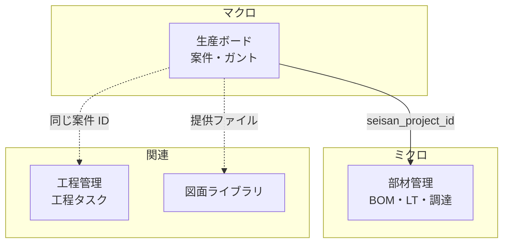
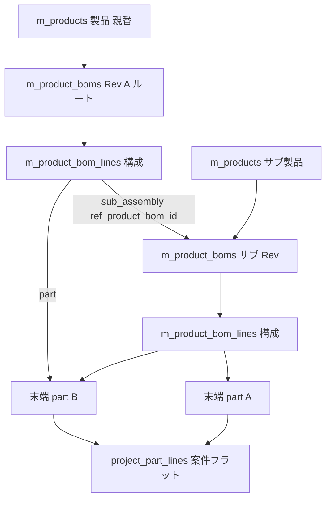
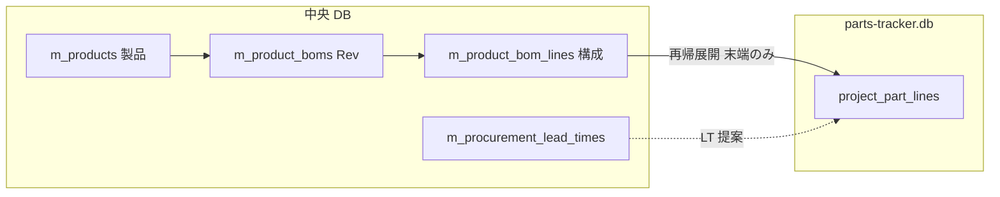
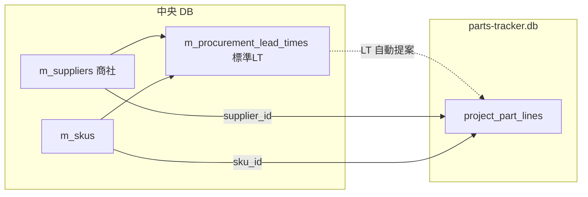
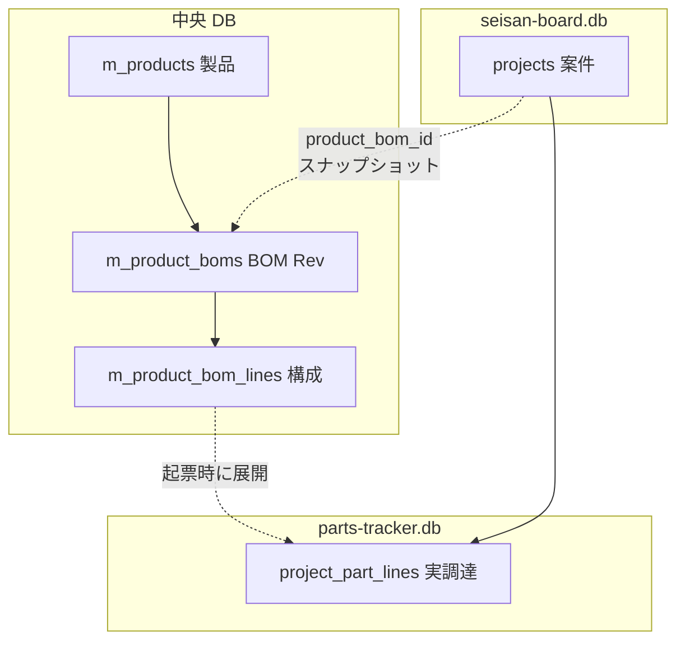

# ポータルアプリ 要件定義書

最終更新: 2026-05-23

---

## 0. 本書の位置づけ

社内で個別に開発してきた 6 つの Electron デスクトップアプリを「1 つのポータル」に統合するための要件をまとめる。
本書は **方針合意のための文書** であり、確定したらこの内容に沿って開発に着手する。

> 凡例:
> - **【決定】** 既に合意済みの事項
> - **【推奨】** 本書での提案。修正があれば指示してください
> - **【未確定】** 次フェーズで詰める事項

---

## 1. 背景・目的

### 1.1 背景
- 既存アプリは個別 exe として開発・運用されており、以下の課題がある。
  - ログインや認証が **アプリごとにバラバラ**（master-database は `app_operators`、Process management desktop は独自 `users` テーブル、seisan-board は「最初に開いた人を承認者にする」など）。
  - 客先・機種・品番などの **マスタの持ち方も統一されていない**（drawing-libraly は文字列をそのまま保存、seisan-board はマスタ DB を読み取り専用で参照、Process management は無関係）。
  - 各アプリを個別に起動・更新する必要があり、**「全社のデジタル基盤」としての一貫性がない**。

### 1.2 目的
- 全アプリの **入り口を 1 つに統合** したポータルを提供する。
- ユーザー認証・マスタを **ポータル内に集約** し、各アプリは中央 DB を参照する。
- **ランディングページ風のホーム画面** で、会社の方針・各アプリの紹介・起動導線を提供する。
- **将来のアプリ追加に耐えられる拡張性**（モジュラ構成、契約の明文化）を確保する。

### 1.3 非ゴール（やらないこと）
- 各アプリの **業務ロジックの作り直し**（既存の動作はできる限り維持）。
- 各アプリ固有 DB（図面 DB、OCR DB など）を **1 つに統合** すること。

---

## 2. 用語定義

| 用語 | 説明 |
|------|------|
| ポータル | 本書で開発する Electron アプリ。ログインと「顔」（ホーム）を持つ |
| 中央 DB | `master-database` が生成する SQLite ファイル。全アプリ共通のユーザー・マスタを保持 |
| サテライト DB | 各アプリが固有データのために持つ SQLite ファイル（図面、OCR、案件詳細など） |
| 子アプリ | ポータルから起動される子プロセスとしての既存 exe |
| 内蔵アプリ | ポータル内に画面として吸収された既存アプリ |

---

## 3. 既存 6 アプリの整理

### 3.1 アプリ一覧

| # | アプリ | 主な機能 | 技術スタック | DB | ポータル統合方針 |
|---|--------|----------|--------------|-----|----------------|
| 1 | **master-database** | 客先 / 機種 / 品番 / 部品名称 / グループ名 / ユーザー名のマスタ管理、操作者（ログインアカウント）管理 | Electron + React 18 + electron-vite + better-sqlite3 + CSS Modules | 中央 DB を生成 | **内蔵** |
| 2 | **seisan-board** | 生産工程の計画・実行、ガントチャート、ダッシュボード | Electron + React 18 + Tailwind + better-sqlite3 + Recharts | サテライト DB ＋ 中央 DB 参照 | **内蔵** |
| 3 | **Process management desktop** | 案件 / 工程ボード（Web 版から移植中） | Electron + React 18 + electron-vite + better-sqlite3 | 独自 DB（独自 `users` あり） | **内蔵** |
| 4 | **drawing-libraly** | 図面（PDF / eDrawings）管理、図面比較。※ DXF 取り扱いは 2026-05-17 に廃止 | （現状）Electron + React 19 + **Express サーバ** + better-sqlite3 + Tailwind + Python(compare exe) → **ポータル取り込み時に Express を撤去** し、Electron + React + Node（IPC 直結）構成へ再設計 | 独自 DB | **内蔵（再設計）** |
| 5 | **PixoConverter** | PDF ↔ 画像変換、PDF 連結、ページ編集 | Electron + React 19 + pdf-lib + sharp | DB なし | **子プロセス起動** |
| 6 | **部材管理（parts-tracker）** | 生産案件に紐づく部品（BOM）の調達区分・リードタイム・必要着日・ステータス管理 | （計画）Electron + React + better-sqlite3 | サテライト DB（`parts-tracker.db`）＋ 生産案件参照 | **内蔵（新規）【計画】** |

> **部材管理**は既存 6 アプリの移植ではなく、ポータル内の **新規内蔵アプリ**。詳細要件は **§8.5** を参照。ホーム LP では **生産ボードの直下**（事務サポートセクション内）に配置する。

### 3.2 統合方針（ハイブリッド）【決定】

- **内蔵（4 アプリ）**: master-database、seisan-board、Process management desktop、drawing-libraly。
  - いずれも DB に依存し、マスタ・ユーザー情報をポータルと共有したい業務系。
  - ポータル内のページとして React コンポーネントを移植する（段階的に行う）。
  - **drawing-libraly は Express サーバを撤去**し、Electron の IPC 経由でメインプロセスの repository／ハンドラを呼び出す構成に **作り直す**。
    - 既存 Express エンドポイント（`/api/drawings/...` 等）は IPC チャネル（`drawing:list`, `drawing:create` 等）に置き換える。
    - 図面比較の `compare_drawings.exe`（Python ビルド成果物）は **extraResources として同梱** を維持し、メインプロセスから `child_process.spawn` で呼び出す。
    - PDF 表示（PDF.js / react-pdf）は **レンダラで Blob URL / File URL として扱う**（Express 経由のファイル配信は廃止）。
- **子プロセス起動（1 アプリ）**: **PixoConverter** のみ。
  - **PDF_scope_vault**（OCR・全文検索）は **ポータル統合対象外**（単体デスクトップアプリとして別管理。2026-05-09 リポジトリから削除）。
  - ポータルから「起動ボタン」で既存 exe を `child_process.spawn` で立ち上げる。
  - 将来吸収しやすいよう、IPC 規約（`module:action` 形式、`{success, data|error}`）を共通化しておく。

### 3.3 アプリ起動時の画面挙動【決定】

内蔵アプリ・子プロセス起動アプリとも、**ポータル本体のウィンドウとは別のウィンドウ（別タブ相当）** で開く。

| 種別 | 起動方法 | 挙動 |
|------|---------|------|
| 内蔵アプリ | 新規 `BrowserWindow` を生成し、そのアプリ専用の URL（例: `#/apps/seisan-board`）を `loadURL` | ポータルのホームは常にバックで残る。各アプリは **独立ウィンドウ** で並行利用可能 |
| 子プロセス起動 | `child_process.spawn(exePath)` | そもそも別プロセスなので自然に別ウィンドウ |

実装方針（内蔵アプリ）:
- メインプロセスに `launcher` モジュール（`launcher:openApp` など）を設ける。
- 起動済みウィンドウを `Map<appId, BrowserWindow>` で管理し、**同じアプリを複数起動しない**（既に開いていれば `focus()` する）。
- 各ウィンドウは同一の preload を共有し、**ポータルのセッション（ログイン状態）を引き継ぐ**（メインプロセス側で保持しているため自然に引き継がれる）。
- ウィンドウを閉じた時点でそのアプリだけを終了する。ポータル本体を閉じると全ウィンドウを閉じる。
- ウィンドウ間のデータ共有は **メインプロセス（DB / セッション）経由のみ**。レンダラ同士の直接通信は禁止。

### 3.4 ワークスペース上の旧アプリフォルダの扱い【記録】

統合（ポータルへの移植・子プロセス起動への一本化）が **完了した時点** で、リポジトリ直下に並んでいる旧スタンドアロンアプリのディレクトリは **削除予定** とする。

対象（削除予定）:

| ディレクトリ名 |
|----------------|
| `drawing-libraly` |
| `master-database` |
| `PixoConverter` |
| `Process management desktop` |
| `seisan-board` |

**Python スクリプト・ランタイム依存の扱い**:

- 他 PC に Python 環境を用意できないため、**ソースの `.py` は最終的に残さなくてよい**前提でよい。
- 代わりに、ビルド済み **exe（および同梱に必要なリソース）だけ** をリポジトリ直下（例: `resources/` または `electron-builder` の `extraResources`）へ置き、**インストーラー配布物に含める**。
- 具体的な exe 名・配置パスは、アプリ取り込み時に `launcher-design.md` / `ipc-channels.md` を更新して固定する（図面比較、OCR、その他スクリプト由来のツールなど）。

> 注: 上記削除は **統合完了後** の整理作業。現時点では参照・比較のためフォルダを残す。

---

## 4. 技術構成

### 4.1 採用技術【決定】

| 領域 | 採用 | 理由 |
|------|------|------|
| 基盤 | **Electron 33** | 既存 4 アプリと同等。Chromium + Node 同梱で配布が容易 |
| ビルド | **electron-vite** | master-database / seisan-board / Process management desktop と同じ |
| 言語 | **TypeScript（ESM）** | ユーザー規約遵守。`require` 不可 |
| UI | **React 18** | 既存内蔵対象アプリ（1〜3）と揃える。19 系の PixoConverter / drawing-libraly は子で隔離 |
| ルーティング | **react-router-dom 6（HashRouter）** | Electron でファイルパス問題を避ける |
| スタイル | **Tailwind CSS + CSS Modules（共存）**【推奨】 | LP 演出・shadcn 系コンポーネントは Tailwind 中心。既存 master-database 由来の画面は CSS Modules を維持しつつ段階移行 |
| アニメーション | **framer-motion**【推奨】 | ヒーローのメリーゴーラウンド演出・スクロール連動・各セクションのフェードイン |
| アイコン | **lucide-react** | 既存複数アプリで使用中 |
| DB | **better-sqlite3** | 既存全アプリで使用 |
| パッケージング | **electron-builder（Windows NSIS）** | 既存と同じ |

### 4.2 セキュリティ規約【決定】（ユーザー規約より）

- `contextIsolation: true`
- `nodeIntegration: false`
- `sandbox: true`
- preload は **`contextBridge.exposeInMainWorld("api", { invoke })`** のみ。業務ロジック禁止
- IPC は **`ipcMain.handle` のみ**、レスポンスは `{ success, data | error }` で統一
- ネイティブモジュール（better-sqlite3 ほか）は **メイン側でのみ使用**

### 4.3 ディレクトリ構成（提案）

```
.                                 ← リポジトリルート
├── docs/
│   └── requirements.md           ← 本書
├── src/
│   ├── main/
│   │   ├── index.ts              ← エントリ。loader.ts のみ import
│   │   ├── window.ts             ← BrowserWindow 生成
│   │   ├── db/
│   │   │   ├── connection.ts     ← 中央 DB 接続管理
│   │   │   ├── schema.ts         ← テーブル DDL（バージョニング対応）
│   │   │   └── migrate.ts        ← マイグレーション（schema_meta による版管理）
│   │   ├── session.ts            ← ログインセッション
│   │   ├── auth-guard.ts         ← 権限チェック
│   │   ├── password.ts           ← scrypt ハッシュ
│   │   └── modules/
│   │       ├── loader.ts         ← 各 *.handler.ts を register
│   │       ├── auth/             ← ログイン・セッション・bootstrap
│   │       ├── operator/         ← 操作者管理
│   │       ├── master/           ← マスタ全般（customer/model/...）
│   │       ├── settings/         ← ポータル設定（DB パス・会社情報）
│   │       ├── launcher/         ← アプリ起動（内蔵= 新規 BrowserWindow／外部= child_process.spawn）
│   │       └── （アプリ別）/      ← 内蔵アプリのハンドラ
│   ├── preload/
│   │   └── index.ts              ← contextBridge のみ
│   ├── renderer/
│   │   ├── main.tsx
│   │   ├── App.tsx               ← ルーティング
│   │   ├── routes/
│   │   │   ├── Login.tsx
│   │   │   ├── Bootstrap.tsx     ← 初期セットアップウィザード
│   │   │   ├── Home.tsx          ← LP 風ホーム
│   │   │   └── apps/             ← 内蔵アプリ画面（段階追加）
│   │   ├── components/
│   │   │   ├── Navbar.tsx
│   │   │   ├── HeroCarousel.tsx  ← メリーゴーラウンド
│   │   │   ├── AppSection.tsx    ← #anchor で遷移する各アプリ説明
│   │   │   └── ui/               ← Button, Card 等の共通 UI
│   │   ├── hooks/
│   │   │   └── useAuth.ts
│   │   └── styles/
│   └── shared/
│       ├── types.ts
│       ├── auth.ts               ← AppRole 等
│       ├── ipcResponse.ts
│       └── constants.ts
├── public/
│   └── portal-icon.ico
├── electron.vite.config.ts
├── tailwind.config.ts
├── postcss.config.js
├── tsconfig.json
└── package.json
```

> `Modular Architecture Rules` に準拠。`*.repo.ts` / `*.handler.ts` を分離し、`loader.ts` で `register(ipcMain)` を呼ぶ。

---

## 5. データベース設計方針

### 5.1 全体像【決定（B：中央 + サテライト）】

- **中央 DB（portal-master.db）**: ポータルおよび内蔵アプリで **共有** するデータ。
  - 操作者（ログインアカウント）、マスタ（客先・機種・品番・部品名称・グループ名・ユーザー名 ほか）、ポータル設定。
- **サテライト DB（各アプリ）**: アプリ固有のトランザクションデータ。
  - 例: 案件、工程、図面、OCR 結果、ガントスケジュール。
  - サテライト側は **中央 DB の整数 ID を参照（FK ではなく ID コピー）** + **必要に応じて表示用テキストをスナップショット保存**（マスタ名変更時の追跡可能性のため）。

> サテライトでは FK は **同一 DB ファイル内のテーブルにのみ** 張る（SQLite はファイル間 FK 不可のため）。中央 DB の ID は単なる整数として保持。

### 5.2 中央 DB のテーブル構成方針【決定：master-database を作り直す／flat + 共有 SKU】

#### 5.2.1 方針転換

**【ユーザー判断 2026-05-05】**: 既存 master-database はまだ完成しきっていないため、**後方互換は気にせず作り直す**。
したがって、本章はもはや「互換を保ちつつ段階移行」ではなく、**「ポータル用の中央 DB を新規設計する」** ものとして扱う。既存 `seisan-board` の repository 層（`customers/models/part_numbers/component_names` を階層 FK で読む）は、ポータル取り込み時に合わせて書き換える前提。

#### 5.2.2 既存 master-database の階層を見直す理由

現行 master-database は `customers → models → part_numbers → component_names` を **FK で階層化** しており、以下のメリット・デメリットがある。

| 観点 | 現行（階層 FK） | 採用案（flat + 共有 SKU） |
|------|----------------|--------------------------|
| 同名利用 | 同名は親が違えば OK（例: 客先 A の機種「X」と客先 B の機種「X」は別） | 全社で同名は 1 つ（重複は意図的なら別途対応） |
| カスケード UI | 「客先 → 機種」で絞り込みが自然 | 別途 `m_skus` テーブルで関係管理 |
| アプリ間の差 | seisan-board は 4 階層、drawing-libraly は 3 階層、Process management は 0 階層 → **強制的な階層は誰かにとっては過剰** | 各アプリが必要な分だけ参照できる |
| 同じ部品が複数の機種にぶら下がる | 機種ごとに重複登録 | 共有 SKU で 1 行で表現可能 |
| 名称変更の影響 | 子も含めて 1 箇所更新で済む | flat なので 1 箇所更新で済む（SKU 側は ID 参照） |
| 取り込み側アプリの書き換え | 不要 | 必要（ただし内蔵時にまとめて実施） |

→ **階層 FK は外し、関係は `m_skus` で別テーブル化** することで「アプリごとに必要な切り口」を後から作れる柔軟性を確保する。

#### 5.2.3 提案テーブル

##### A. 操作者・認証（鶏卵対策の中核）

| テーブル | 役割 |
|----------|------|
| `app_operators` | ログインアカウント（loginName, passwordHash, displayName, role, isActive） |
| `app_operator_app_grants` | （任意・将来）アプリ別の利用権限。なければ全アプリ可 |

`role`: `viewer` / `editor` / `admin`（既存と同じ）

##### B. マスタ（flat）

各テーブルとも以下の共通列を持つ:

| 列 | 型 | 説明 |
|----|-----|------|
| `id` | INTEGER PRIMARY KEY AUTOINCREMENT | 主キー |
| `name` | TEXT NOT NULL | 名称 |
| `isActive` | INTEGER NOT NULL DEFAULT 1 | 有効フラグ |
| `createdAt` / `updatedAt` | TEXT | 監査列 |

部分 UNIQUE インデックス: `WHERE isActive = 1` で `name COLLATE NOCASE` 一意。

| テーブル | 説明 | 既存との違い |
|----------|------|-------------|
| `m_customers` | 客先 | （変更なし） |
| `m_models` | 機種 | **`customer_id` カラム廃止**（共有 SKU 側で関係を持つ） |
| `m_part_numbers` | 品番 | **`model_id` カラム廃止** |
| `m_component_names` | 部品名称 | **`part_number_id` カラム廃止** |
| `m_group_names` | グループ名 | （変更なし） |
| `m_user_names` | ユーザー名 | （変更なし） |
| `m_suppliers` | **商社**（購入・外注先） | **部材管理向け【計画】**。§8.5.6 参照 |
| `m_categories` | カテゴリ（scope 付き） | 図面ライブラリ等。§8.4.2 参照 |

**部材管理向けの追加マスタ（標準リードタイム）** は flat 名称マスタではなく **関連テーブル `m_procurement_lead_times`** として中央 DB に持つ（§8.5.6）。

##### C. 共有 SKU（任意のリンク）

複数アプリが「客先 × 機種 × 品番 × 部品名称 × 図面番号」を扱うため、**ポータルレベルで 1 つの「SKU テーブル」を持たせる**。

```sql
CREATE TABLE m_skus (
  id INTEGER PRIMARY KEY AUTOINCREMENT,
  customer_id   INTEGER REFERENCES m_customers(id),
  model_id      INTEGER REFERENCES m_models(id),
  part_number_id INTEGER REFERENCES m_part_numbers(id),
  component_name_id INTEGER REFERENCES m_component_names(id),
  drawing_number TEXT,
  revision      TEXT,
  isActive INTEGER NOT NULL DEFAULT 1,
  createdAt TEXT DEFAULT (datetime('now')),
  updatedAt TEXT DEFAULT (datetime('now'))
);
```

- どの ID も **NULL 可**（アプリごとに必要な深さでだけ埋める）。
- seisan-board は (客先・機種・品番・部品名称) を埋めて使う。
- drawing-libraly は (客先・機種・品番) + 図面番号 + リビジョンを埋めて使う。
- Process management desktop は (客先) + 図面番号 + リビジョンで使う、など。

##### D. 互換レイヤは不要

既存 master-database はスタンドアロンアプリとして廃止方針のため、**旧テーブル名（`customers` 等）を残す必要はない**。
既存 `seisan-board` の repository 層（`masterData.repo.ts` の `listCustomers` / `listModels(customerId)` など）は、内蔵移植時に **新スキーマ（`m_customers` + `m_skus` JOIN）前提に書き換える**。

##### E. 設定

| テーブル | 役割 |
|----------|------|
| `app_settings` | key/value で設定保持（会社名、モットー、配色、ロゴパス、アプリ起動コマンド等） |
| `schema_meta` | DB スキーマバージョン管理（マイグレーション制御） |

### 5.3 マスタの「使い方」のルール

| 局面 | ルール |
|------|--------|
| アプリが新規レコードを登録するとき | マスタに **存在する ID を必ず使う**（フォームはマスタ選択 UI 必須） |
| マスタ名が変更されたとき | サテライト側の表示は **マスタ JOIN を都度実行**。スナップショット保存している場合は監査列のみ更新せず、別途「履歴」を持つ |
| マスタが無効化されたとき | 既存レコードは残るが、**新規入力選択肢からは外す**（`isActive = 1` のみ表示） |

---

## 6. 認証・初期化（鶏と卵対策）

### 6.1 起動時フロー【決定（B 案：admin/admin 自動シード + 強制パスワード変更）】

```
[ポータル起動]
   │
   ▼
DB パス読み込み（app config に保存）
   │
   ├─ 未設定 ──────────────┐
   │                       ▼
   │              [初期セットアップ画面]
   │              ・新規 DB 作成 / 既存 DB 選択
   │              ・既定: %APPDATA%/portal/portal-master.db
   │                       │
   ▼                       │
DB 接続 + テーブル自動作成 ◄─┘
   │
   ▼
app_operators 件数チェック
   │
   ├─ 0 件 → admin/admin を seed → ログイン画面（admin/admin 案内）
   │                                      │
   └─ 1 件以上 → ログイン画面             │
                                          ▼
                              ログイン成功（admin/admin の場合）
                                          │
                                          ▼
                                [強制パスワード変更モーダル]
                                          │
                                          ▼
                                   ポータルホームへ
```

### 6.2 鶏卵にしないためのキーポイント

1. **DB ファイルが無くてもログイン画面まで到達できる** → 「DB を作成 / 選択する画面」を必ず先に出す。
2. **DB はあるが `app_operators` が空** という壊れ状態でも、**admin/admin が必ず立ち上がる**（自動 seed）。
3. **admin/admin のままでは業務画面に進めない**。最初のログイン直後に強制パスワード変更（DB に `mustChangePassword = 1` 列を持つか、初期パスワード判定で分岐）。
4. **管理者を最低 1 人保証**。管理者の最後の 1 人を無効化／降格はできない（既存 master-database のロジックを踏襲）。
5. **DB 切り替え時** はセッションを破棄し、初期化フローを最初からやり直す（既存 Process management desktop の `resetAppStateAfterDatabaseChange` 相当）。
6. **bootstrap 完了フラグ** を `app_settings` に保持（`portal.bootstrapped = '1'`）。`admin/admin` シードは `bootstrapped` が無い & 操作者 0 件のときだけ動かす（誤って 2 回目以降に admin が再生成されないように）。

### 6.3 セッション

- メイン側のメモリにセッション保持（既存 master-database の `session.ts` 方式）。
- アプリ終了で消える前提（業務 PC 想定なら問題なし）。
- 必要なら将来「N 分で自動ログアウト」を `app_settings` の値で実装。
- **子プロセスで起動するアプリ（PixoConverter）にセッションを引き継ぐ仕組み** は当面不要（各アプリは独立起動）。将来は「ワンタイムトークンを引数で渡す」拡張で対応可能。【未確定】

### 6.4 権限モデル

| ロール | できること |
|--------|-----------|
| `viewer` | 閲覧のみ。マスタ・案件 etc. の更新不可 |
| `editor` | 業務データの登録・更新可 |
| `admin` | 操作者管理、DB 設定、マスタ削除、`app_settings` 変更 |

---

## 7. UI 設計（LP 風ホーム）

### 7.1 ホーム画面の構成【決定】

```
┌────────────────────────────────────────────────────────┐
│ Navbar  [会社名]                  [#master][#seisan]…  │  ← アンカー遷移
├────────────────────────────────────────────────────────┤
│                                                        │
│   Hero (メリーゴーラウンド型カルーセル)                  │
│   ・「安全第一」「品質第二」「生産第三」を                │
│     回転式（フェード or サークル状）で順送り表示          │
│   ・会社名・ポータル名を中央に                           │
│                                                        │
├────────────────────────────────────────────────────────┤
│  #master-database                                      │
│   ┌──────────────┐  マスター DB 説明                     │
│   │  preview     │  ・客先・機種・品番…                   │
│   └──────────────┘  ・[開く]                            │
├────────────────────────────────────────────────────────┤
│  #seisan-board       … (同様、各アプリのセクション)      │
│  #process-management …                                 │
│  #drawing-library    …                                 │
│  #pixo-converter     …  [起動]（子プロセス・未対応時はエラー）  │
│  #pixo-converter     …  [起動]（子プロセス）             │
├────────────────────────────────────────────────────────┤
│  Footer  バージョン / 更新日 / 自分の表示名 / ログアウト │
└────────────────────────────────────────────────────────┘
```

### 7.2 デザイン要件

- **navbar**:
  - 左に会社名、右にアプリ名のアンカーリンク（`#master-database` など）。
  - クリックで **そのセクションまでスムーズスクロール**。
  - 右端に表示名と「ログアウト」。
- **ヒーロー**:
  - 会社モットーを **3 件** カルーセル表示（メリーゴーラウンド風）。
  - framer-motion で 3D 回転 or サークルパス上を移動。
  - モットー文言は `app_settings.company_motto_1/2/3` に保存し、設定画面から差し替え可能（**当面はプレースホルダ「安全第一 / 品質第二 / 生産第三」**）。
  - 会社名・ポータル名も `app_settings` から取得。
- **アプリセクション**:
  - 1 アプリ 1 セクション。スクロールで順に出現（`whileInView` フェード）。
  - **内蔵**: 「開く」ボタン → メインに `launcher:openApp` を送信 → **新規 `BrowserWindow`（別タブ相当）** でそのアプリの画面を `loadURL`。既に開いていれば前面化（focus）。
  - **子プロセス**: 「起動」ボタン → メインから `child_process.spawn(exePath)`。失敗時はトーストで通知。
- **配色テーマ**:
  - 既存 master-database のダーク系をベースに、Tailwind の `slate / sky / emerald` を組み合わせる方向【推奨】（具体案は実装フェーズで詰める）。

### 7.3 ログイン画面

- `app_operators` テーブルからログイン名 + パスワードで認証。
- フォーム下に **「初回は admin / admin でログインできます」** の案内（`bootstrapped` フラグが立つまで）。
- 「DB を選択 / 作成」リンクを下部に小さく置き、**DB 未設定状態から脱出可能** にする（鶏卵対策の補助動線）。

---

## 8. 開発スコープ（フェーズ計画）

### 8.1 今回のスコープ（フェーズ 1）【決定】

1. プロジェクト雛形（electron-vite + React + TS + Tailwind + framer-motion）
2. preload / contextBridge / IPC 雛形
3. 中央 DB 接続・テーブル自動作成・スキーマ版管理
4. **初期セットアップ画面**（DB 新規作成 / 既存選択）
5. **ログイン画面**（admin/admin 自動 seed + 強制パスワード変更）
6. **ポータルホーム**（LP 風、ヒーローのメリーゴーラウンド、navbar アンカー、各アプリセクションは仮プレースホルダ）
7. ログアウト / セッション管理

### 8.2 フェーズ 2（次回以降）【未確定】

- 中央 DB のスキーマ確定（flat + 共有 SKU の最終仕様、マイグレーション方式）
- マスタ管理画面の内蔵（旧 master-database の画面を移植・刷新）
- 操作者管理画面の内蔵
- 設定画面（会社名・モットー・DB パス変更）
- `launcher` モジュールの実装（別ウィンドウ起動・二重起動防止）

### 8.3 フェーズ 3 以降

- seisan-board / Process management desktop の段階吸収
- **drawing-libraly の再設計取り込み**（Express 撤去 → IPC 化、図面比較 exe の child_process 呼び出し、PDF/eDrawings の IPC 経由配信。**DXF は 2026-05-17 に取り扱いを廃止**）
- **PixoConverter** の起動ボタン連携と、起動後のステータス監視
- アプリ別利用権限（`app_operator_app_grants`）の実装 → **フェーズ 4-A** で `m_user_app_grants`（user 基準）として実装済み
- ログ・監査機能 → **フェーズ 4-D** で計画化（`app_audit_log`）

### 8.4 フェーズ 4 系（権限・カテゴリ・Pixo・運用強化）【計画のみ】

詳細・チェックリストは `task-progress.md` を参照。本書ではスコープと位置づけのみ記録する。

#### 8.4.1 フェーズ 4-A: マスタ起点のユーザー権限・アプリ別権限【実装済み】

- ログインアカウント（`app_operators`）と業務ユーザー（`m_user_names`）を **1:1**（ログイン名 = マスタ名）。
- **ポータル `admin`**: ポータル設定・操作者管理・**マスタ編集**のみ。業務アプリの権限は持たない。
- **アプリ別権限**: `m_user_app_grants`（中央 DB）で各内蔵アプリに admin / editor / viewer。工程管理のみ `processView`（SolidWorks / CADMAC / 両方）を併設。
- **グループ役割**: `m_user_group_memberships` で 1 ユーザー = 最大 1 グループ。`member` / `group_admin`。
- **完了通知**: 工程タスク完了時、当該案件のグループの `group_admin` のみへ通知（portal admin 全員には送らない）。
- 関連ドキュメント: [user-permissions.md](./user-permissions.md)。

#### 8.4.2 フェーズ 4-B: 共通カテゴリマスタ【計画】

- 中央 DB に **`m_categories`** を新設（`scope` 列でアプリ別に分離。`'common'` / `'drawing-library'` / 将来）。
- 図面ライブラリの **自社発行** タブで先行採用（既存 `LibDrawingRow.category` 文字列列を活用、クロス DB FK は張らない）。
- **マスタ編集はポータル admin のみ**。新規登録時はマスタからの選択を推奨し、自由入力フォールバックを許容。
- 工程管理・生産ボードへの導入は将来検討（先送り可）。

#### 8.4.3 フェーズ 4-C: PixoConverter 高負荷耐性【計画】

- 200 枚規模のカメラ写真 → PDF 変換 + 連結でクラッシュする現状を解消する。
- 方針: **画像は JPEG のまま `embedJpg`**、長辺リサイズ可、**チャンク連結**、**`utilityProcess.fork`** で別プロセス化、**進捗イベント + キャンセル**、renderer は path 文字列のみ保持。
- 既存 IPC (`pixo-converter:mergePdfs` 等) は当面維持し、**新 API**（`pixo-converter:imagesToPdf:start` / `:cancel` + `progress` event）を追加。

#### 8.4.4 フェーズ 4-D: 権限ガード強化と運用機能【計画】

- 4-A の権限モデルを **全 IPC・UI** に行き渡らせる。
  - `launcher:openApp` で `assertCanViewApp` を実施。grant 未付与ユーザーはホームで権限なし表示。
  - 生産ボードの主要 write IPC に `assertCanWriteApp("seisan-board")` を付与（現状は `assertLoggedIn` のみ）。
  - PixoConverter は `assertCanViewApp("pixo-converter")` に切替（grant 廃止して全ログインユーザー利用可とする運用も検討余地）。
- **監査ログ** `app_audit_log` を追加し、重要操作（マスタ更新・操作者更新・完了取消・grant 変更）を記録。管理メニューに閲覧画面（ポータル admin のみ）。
- 工程タスク `tasks.assignee` の **userNameId 化**（4-A 残課題）を完了させ、用語「担当 / 入力者」→「ユーザー」横断統一。

### 8.5 フェーズ 5: 部材管理（parts-tracker）

**位置づけ**: 生産ボード（**マクロ**＝製番・案件・工程ガント）の **直下** に置く **ミクロ** 管理。1 案件で使う **全部品** の調達・リードタイムを追い、「納期に間に合うか」を可視化する。**5-A-0 / 5-A MVP は実装済み**。**5-A-1 以降** は要件定義のみまたは未着手。

#### 8.5.1 背景・課題

- 生産ボードは **案件単位**（客先・機種・品番・案件納期・工程タスク）の管理に特化しており、**案件内の個別部品**（数十〜数百行）の調達状況は扱わない。
- 現場の要望: **社内製作 / 商社購入 / 支給品** など調達区分ごとに、**リードタイム**を踏まえ **必要着日までに間に合うか** を一覧で把握したい。
- 工程管理は **工程タスク（作業）** の進捗であり、部品表（BOM）の在庫・発注・入荷管理ではない。

#### 8.5.2 目的

| 目的 | 説明 |
|------|------|
| **部品の網羅** | 1 生産案件に必要な部品を **行リスト（BOM）** として登録・参照する |
| **調達区分** | 社内製作・購入（商社等）・支給品など **調達経路** を明示する |
| **リードタイム管理** | 部品ごとの LT（日）と **必要着日** から、発注・着手の遅れを検知する |
| **納期整合** | 案件納期（生産ボード `projects.deadline`）との関係で **リスク部品** を強調表示する |
| **商社マスタ** | 購入・外注先の名称を **中央マスタ** で一元登録し、部品行から参照する |
| **標準 LT マスタ** | 「何日前までに発注／着手しないと間に合わないか」を **DB 上の標準値** として保持し、部品登録時に自動反映する |
| **リピート品の入力効率** | 製品 BOM 展開に加え、**前回案件から BOM コピー**（§8.5.17.1）で手配・状態のみ初期化して流用 |
| **多階層 BOM** | サブ組立（子の親番）配下の部品も **再帰的に展開** し、案件に **末端部品まで** 載せる |
| **BOM CSV 取込（優先）** | **SolidWorks 等の BOM エクスポート** から一括取込し、手入力より **最短** で部品表を立ち上げる |
| **部品リビジョン** | 部品行ごとに **Rev** を保持・表示し、図面・3D モデルとの版整合を取れる |
| **非表示（除外）部品** | 商社提供 3D 等で **サブ組立に含まれるが手配対象外** の部品を一覧から **非表示** にできる |
| **手配済の可視化** | 案件ごとの部品行で **手配済チェック** を付け、**いつ・誰が** 手配したかを一覧表示する |
| **製品中心の BOM 管理（5-E）** | 「製品（親番）」を主役にして、**案件は製品 Rev の発注インスタンス** として扱う。案件は無限に増えても、製品 BOM は **有限の単位** で長期管理できる |
| **設計変更の見える化（5-F）** | 同じ親番の **Rev A → Rev B の差分**（追加・削除・数量変更・Rev 上がり）を一覧／視覚表示し、調達担当が「何が変わったか」をすぐ把握できる |

#### 8.5.3 非ゴール（やらないこと・初期スコープ外）

- **3D CAD プレビュー**（IGES / STEP / eDrawings のブラウザ内表示）。図面ライブラリの eDrawings ダウンロード運用は維持。
- **在庫数量の厳密管理**（倉庫 WMS・ロット・棚番）。初期は **案件あたりの必要数と調達ステータス** のみ。
- **発注書・見積書の PDF 生成**、会計・購買システムとの **双方向連携**。
- **生産ボードの工程タスクを部品行に置き換える** こと（データモデルは分離）。
- **中央 DB への BOM 全量統合**（部品行はサテライト DB に保持。マスタ ID の参照のみ）。

#### 8.5.4 アプリ概要

| 項目 | 内容 |
|------|------|
| **表示名** | 部材管理 |
| **アプリ ID** | `parts-tracker`（`m_user_app_grants.appId` / ランチャー / ルートで共通） |
| **統合形態** | 内蔵アプリ（別 `BrowserWindow`、`#/apps/parts-tracker`） |
| **LP 配置** | セクション **`office-support`（事務サポート）**、`seisan-board` の **直後** |
| **DB** | 中央 DB と **隣接** の `parts-tracker.db`（工程管理・図面ライブラリと同パターン） |
| **生産ボード連携** | 部品行は **`seisan_project_id`**（`seisan-board.db` の `projects.id`）で紐付け。生産 DB への FK 制約は張らない（参照整合はアプリ層） |



#### 8.5.5 ユーザーと権限【推奨】

フェーズ 4-A の **アプリ別 grant**（`m_user_app_grants`）に **`parts-tracker`** を追加する。

| grant | できること | できないこと |
|-------|------------|--------------|
| **未設定** | — | アプリ起動・IPC（`assertCanViewApp` で拒否） |
| **viewer** | 閲覧・検索・ソート・区分タブ・**非表示行も表示**・CSV 出力 / コピー（印刷用） / 印刷 | データ変更全般（詳細は §8.5.20） |
| **editor** | viewer + **一括編集モード**・手配済・モーダル編集（BOM 同一性以外） | BOM 取込・コピー・行削除・非表示・品番等の手修正（§8.5.20） |
| **admin** | editor + **BOM CSV 取込**・**前回案件コピー**・行追加・非表示・品番 / 名称 / Rev / 数量の手修正 | ポータル設定・中央マスタ CRUD（別権限） |

- **商社マスタ**（`m_suppliers`）と **標準リードタイム**（`m_procurement_lead_times`）の CRUD は、既存マスタと同様 **ポータル admin のみ**（`master:*` IPC）。部材管理アプリからは **参照・選択** が主用途。

- IPC は **`assertCanViewApp("parts-tracker")` / `assertCanWriteApp("parts-tracker")`** を原則とする（4-D 方針に準拠）。
- 生産ボード **viewer** でも部材管理 **editor** が付いていれば、案件を選んで部品を更新できる（アプリ権限は独立）。

#### 8.5.6 データモデル（案）

##### 8.5.6.1 中央 DB: 商社マスタ【決定案】

部材管理の **購入・外注** で選ぶ商社名を、客先・グループと同様 **中央マスタ** で管理する。

**テーブル: `m_suppliers`**

| 列 | 型 | 説明 |
|----|-----|------|
| `id` | INTEGER PK | |
| `code` | TEXT NOT NULL UNIQUE COLLATE NOCASE | 略称・コード（任意運用可） |
| `name` | TEXT NOT NULL | **商社名**（表示・選択の主キー） |
| `note` | TEXT | 連絡先メモ・取扱品目など |
| `isActive` | INTEGER DEFAULT 1 | 無効化で選択肢から除外 |
| `createdAt` / `updatedAt` | TEXT | |

- マスターデータベース UI に **「商社」タブ** を追加（`MasterCrud` + `master:list` / `master:upsert` 等の既存 IPC を拡張）。
- 社内製作・支給品は **商社マスタを使わない**（`source_type` が `inhouse` / `supplied` のとき `supplier_id` は NULL 可）。

##### 8.5.6.2 中央 DB: 標準リードタイム【決定案】

「**大体どのくらい前に注文（または着手）しないと間に合わないか**」を、マスタとして DB 管理する。

**テーブル: `m_procurement_lead_times`**

| 列 | 型 | 説明 |
|----|-----|------|
| `id` | INTEGER PK | |
| `source_type` | TEXT NOT NULL | 調達区分（`inhouse` / `purchase` / `supplied`） |
| `supplier_id` | INTEGER | `m_suppliers.id`。`purchase` 時は **推奨必須** |
| `sku_id` | INTEGER | 中央 `m_skus.id`（任意。部品特定用） |
| `part_number` | TEXT | 品番・図番（`sku_id` 未設定時の代替キー。任意） |
| `lead_time_days` | INTEGER NOT NULL | **標準リードタイム（日）** — 必要着日の何日前までに発注／着手すべきか |
| `note` | TEXT | 例: 「通常 2 週間、年末は +7 日」 |
| `isActive` | INTEGER DEFAULT 1 | |
| `createdAt` / `updatedAt` | TEXT | |

**一意性【推奨】**: 有効行について `(source_type, supplier_id, sku_id, part_number)` の組み合わせで重複不可（NULL は DISTINCT として扱う実装は SQLite 制約に合わせて設計）。

**解決優先順位（部品行作成・更新時に LT を自動提案）【推奨】**:

1. **品番/SKU × 商社 × 区分** が一致する行（最も具体）
2. **商社 × 区分** のみ（商社デフォルト LT）
3. **区分のみ**（社内製作デフォルト LT 等、`supplier_id` NULL）
4. 上記なし → 部品行で **手入力**

**日数の意味【決定案】**:

- `lead_time_days` は **カレンダー日**（土日含む）とする。営業日換算が必要になったら `note` または将来列で拡張。【未確定: 営業日カレンダー】

**マスタ UI【推奨】**:

- マスターデータベースに **「標準リードタイム」** タブ（または商社タブ内サブ画面）を追加。
- 列例: 区分 / 商社 / 品番(SKU) / 標準 LT（日）/ 備考。
- 購入区分では商社を **ドロップダウン**（`m_suppliers`）で選択。

##### 8.5.6.3 サテライト DB: 案件部品行

**DB ファイル: `parts-tracker.db`**

**テーブル: `project_part_lines`（案件部品行）**

| 列 | 型 | 説明 |
|----|-----|------|
| `id` | INTEGER PK | 行 ID |
| `seisan_project_id` | TEXT NOT NULL | 生産案件 ID |
| `part_number` | TEXT NOT NULL | 部品品番・図番 |
| `part_name` | TEXT NOT NULL | 部品名称 |
| `quantity` | REAL NOT NULL DEFAULT 1 | 必要数量 |
| `source_type` | TEXT NOT NULL | 調達区分（下表） |
| `supplier_id` | INTEGER | 中央 `m_suppliers.id`（`purchase` 時など） |
| `lead_time_days` | INTEGER NOT NULL DEFAULT 0 | **この案件での LT（日）**。作成時に標準 LT マスタからコピーし、案件ごとに上書き可 |
| `required_date` | TEXT NOT NULL | 必要着日（`yyyy-mm-dd`） |
| `order_by_date` | TEXT | **発注期限日**（任意・自動計算可）= `required_date` − `lead_time_days` |
| `ordered_at` | TEXT | 実際の発注日（購入・外注時） |
| `status` | TEXT NOT NULL | 行ステータス（下表） |
| `sku_id` | INTEGER | 中央 `m_skus.id` への任意リンク |
| `procurement_lead_time_id` | INTEGER | 参照した標準 LT マスタ行（任意・監査用） |
| `note` | TEXT | 備考 |
| `sort_order` | INTEGER DEFAULT 0 | 表示順 |
| `created_at` / `updated_at` | TEXT | 監査用 |

**5-B 追加列（案件部品行・【計画・未実装】）**

| 列 | 型 | 説明 |
|----|-----|------|
| `revision` | TEXT | **部品リビジョン**（例: `A`, `01`）。SolidWorks BOM CSV から取込可。空欄可 |
| `is_hidden` | INTEGER NOT NULL DEFAULT 0 | **一覧非表示**（1=非表示）。DB からは削除せず、既定 UI から除外 |
| `hidden_at` / `hidden_by_username` | TEXT | 非表示にした日時・操作者（任意・監査用） |
| `hidden_reason` | TEXT | 非表示理由（例: 「商社3D付属・購入品に含む」） |
| `import_batch_id` | INTEGER | `project_part_import_batches.id`（CSV 取込由来の行） |

> **入力経路の優先度【決定案】**: 新規案件の部品表立ち上げは **(1) BOM CSV 取込（SolidWorks）** → (2) 親番テンプレート展開（リピート品）→ (3) 手入力。商社提供 3D を参照する場合、CSV／取込後一覧で **不要行を非表示** する運用を想定する。

> 旧案の `supplier_name`（自由文字列）は **廃止**し、`supplier_id` + マスタ参照に統一する。マスタ未登録の商社は **先にマスタ登録** してから部品行に紐付ける運用【推奨】。

**調達区分 `source_type`【決定案】**

| 値 | 表示名 | 説明 |
|----|--------|------|
| `inhouse` | 社内製作 | 自社加工・内製 |
| `purchase` | 購入 | 商社・メーカー購入 |
| `supplied` | 支給品 | 客先支給・既存支給在庫 |

> **SolidWorks BOM CSV 取込時（2026-05-25 確定）**: CSV から調達区分は **取り込まない**。取込直後は **未設定**（`purchase` 等への自動既定はしない）。購入品は全体の約 3 割のため、**取込後に一覧で手入力** する。未設定行はリスク集計から除外するか「区分未設定」として表示する【実装時に UI 確定】。

**行ステータス `status`【決定案】**

| 値 | 表示名 |
|----|--------|
| `planned` | 未着手 |
| `ordered` | 発注済 |
| `in_progress` | 製作中 |
| `received` | 入荷済 |
| `delayed` | 遅延 |

**その他テーブル（サテライト・MVP 外）**

- `project_part_import_batches` … BOM CSV インポート履歴
- `project_part_line_arrangement_log` … 手配済チェックの ON/OFF 履歴（**5-A-1【計画】**）。解除時も「誰がいつ外したか」を残す場合に使用

**5-A-1 追加列（案件部品行・【計画・未実装】）**

手配済チェックと操作者表示のため、`project_part_lines` に以下を追加する。

| 列 | 型 | 説明 |
|----|-----|------|
| `is_arranged` | INTEGER NOT NULL DEFAULT 0 | **手配済**（1=チェック ON）。一覧のチェックボックスと同期 |
| `arranged_at` | TEXT | 手配済にした日時（`datetime('now')` 相当） |
| `arranged_by_user_name_id` | INTEGER | 中央 `m_user_names.id`（ログインセッションの `userNameId`） |
| `arranged_by_username` | TEXT | 表示用スナップショット（ユーザー名。マスタ改名後も当時の表示を維持） |

**手配済の意味【決定案】**

- **購入（`purchase`）**: 商社への発注・手配が完了した
- **社内製作（`inhouse`）**: 製作依頼・着手手配が完了した
- **支給品（`supplied`）**: 支給の確認・手配が完了した

チェック ON 時は `is_arranged = 1` とし、`arranged_at` / `arranged_by_*` を **その操作のセッション** でセットする。あわせて **行ステータス `status` とサマリ「未着手」件数と連動** する（詳細は下記 §8.5.6.3.1）。

チェック OFF（解除）時:

- `is_arranged = 0`、`arranged_at` / `arranged_by_*` を NULL に戻す（一覧は「未手配」表示）
- 解除操作は **`project_part_line_arrangement_log`** に 1 行追記し、監査・問い合わせ用に **過去の手配記録** を残す
- **手配済 ON によって自動進めた `status` のみ** `planned`（未着手）へ戻す（後述 §8.5.6.3.1）

> 既存列 `ordered_at` は **実際の発注日**（任意入力）として維持。`arranged_at` は **現場が「手配済」チェックを付けた日時** とし、意味を分離する。

##### 8.5.6.3.1 手配済チェックと行ステータス・サマリの連動【2026-05-25 決定・未実装】

**背景**: 現状の実装では `is_arranged`（手配済チェック）と `status`（状態列・サマリの「未着手: N 件」）は **独立**。手配済にしても `status` が `planned` のままだと **未着手件数が減らない**。**一覧の手配済チェックとサマリ・状態列を一致** させる。

**連動の原則**

| 操作 | `is_arranged` | `status`（自動） | サマリへの影響 |
|------|---------------|------------------|----------------|
| 手配済 **ON** | `1` + `arranged_*` セット | `planned` から区分に応じて進める（下表） | **未着手**（`plannedCount`）**減**、**手配済**（`arrangedCount`）**増** |
| 手配済 **OFF** | `0` + `arranged_*` クリア | 当該行が **手配済 ON による自動進行のみ** のとき `planned` に戻す | **未着手** **増**、**手配済** **減** |

**手配済 ON 時の `status` 進行（調達区分 `source_type`）**

| `source_type` | 進める先 `status` | 状態列の表示 |
|---------------|-------------------|--------------|
| `purchase`（購入） | `ordered` | 発注済 |
| `inhouse`（社内製作） | `in_progress` | 製作中 |
| `supplied`（支給品） | `ordered` | 発注済（支給確認完了の意味） |
| `unset`（未設定） | **変更しない**（`planned` のまま） | 未着手 — 区分未設定のため進行しない。UI で **区分を先に設定** するよう促す【確定】 |

**手配済 OFF 時の戻し**

- 直前の状態が上表の **自動進行で付いた `ordered` / `in_progress` のみ** → `planned` に戻す。
- ユーザーが編集ダイアログで手動設定した `received` / `delayed` 等は **手配済 OFF だけでは変更しない**（誤操作防止）。
- 自動進行か手動かを判別するため、行に **`status_advanced_by_arrangement`**（INTEGER 0/1）を追加するか、**arrangement_log の直近イベント** と組み合わせて判定する【実装時にいずれかを採用】。

**サマリバーとの対応（表示行＝非表示除く）**

| チップ | 集計条件（連動後） |
|--------|-------------------|
| **手配済** | `is_arranged = 1` |
| **未着手** | `status = 'planned'`（手配済 ON で進んだ行は含めない） |
| **遅延** / **要発注** | 既存どおり `risk`（日付と `status` から算出）。`status` が `planned` 以外になれば **要発注** の対象外になる |

**一覧・フィルタとの関係**

- **手配** フィルタ（未手配 / 手配済）は引き続き **`is_arranged`** を参照。
- **状態** 列は **`status`** のラベル表示（連動後は手配済と整合）。
- 手配済 ON/OFF 後も **行が消えない**（楽観的更新。§8.5.13.2.8）。

**IPC / リポジトリ**

- `parts-tracker:line:setArranged` 内で **トランザクション** として `is_arranged` と `status`（および戻し時の `planned`）を同一更新する。現状の **チェックのみ更新** は本仕様で置き換える。

**受け入れ（未実装）**

- [ ] 購入行で手配済 ON → 状態が「発注済」、サマリ未着手が 1 減る
- [ ] 同じ行で手配済 OFF → 状態が「未着手」、サマリ未着手が 1 増える
- [ ] `unset` 行で手配済 ON → `is_arranged` のみ ON、状態は未着手のまま（トースト等で区分設定を促す）
- [ ] 手動で「入荷済」にした行を手配済 OFF しても **入荷済のまま**

##### 8.5.6.4 中央 DB: 製品 BOM（親番テンプレートを兼ねる）【計画・5-A-1 / 5-E 統合・未実装】

**方針確定（2026-05-25）**:
**5-A-1 で別立て予定だった `m_bom_templates` / `m_bom_template_lines` は実装しない**。代わりに **5-E の `m_products` / `m_product_boms` / `m_product_bom_lines`** をそのまま **「親番 BOM テンプレート」と兼用** する。**製品 Rev = テンプレート Rev** と見なし、テーブル重複を避ける。
（テーブル DDL の詳細は §8.5.14.3 を参照。本節は **多階層展開ロジック** と **案件部品行への階層メタ** を扱う）

**位置づけ**: 同じ **親番（製品・組立品の品番）** で繰り返し発生する案件について、構成部品リストを **製品マスタ（`m_products` + `m_product_boms`）** に保持し、案件起票（5-E）または既存案件への一括展開で **末端部品まで再帰展開** する。

**多階層（サブ組立）【決定案】**

製造 BOM は **1 段のフラットリストだけでは不足** する。親番の直下に **サブ組立品番（子の親番）** があり、その配下にさらに部品がぶら下がる構成を扱う。

| 用語 | 意味 |
|------|------|
| **親番（ルート）** | 生産案件の製品品番に相当する **製品 Rev**（`m_product_boms` の特定 Rev） |
| **サブ組立** | 親番の構成行のうち、**別の `m_product_boms` を参照する** 中間品番 |
| **末端部品（リーフ）** | 調達・手配の対象となる **これ以上展開しない** 品番行 |
| **展開** | ルートから再帰的にサブ組立を辿り、**すべての末端部品** を `project_part_lines` に生成すること |

**展開の基本方針【決定案】**

- 案件への展開結果は **調達・手配単位のフラットな行リスト** とする（現場がチェックを付ける単位）。
- ただし **どのサブ組立経由か** は失わないよう、案件部品行に **階層メタデータ**（後述）を保持する。
- 数量は **親数量 × 子数量 × …** を各階層で乗算し、末端行の `quantity` に反映する【推奨】。
- サブ組立 BOM が **未定義** の行は、展開プレビューで **警告** し、当該行はスキップまたは **サブ組立品番1行のみ** 追加するかをユーザー選択【未確定】。
- **循環参照**（A→B→A）は展開前に検出し、エラーとする。

**親番キーの決め方【決定案】**

製品マスタ `m_products` で **親番 = `part_number`**（UNIQUE）を一意に持つため、テンプレート側で `parent_sku_id` / `parent_part_number` を別に持つ必要は **なし**。任意で `m_products.sku_id` に SKU を紐付ける。

案件への展開時は、生産案件 `projects.product_id` から **製品 Rev**（`projects.product_bom_id`）を直接参照する。案件起票時に Rev をスナップショットしているため、テンプレート照合は不要（5-E 後の運用）。**既存 5-A MVP 案件への後付け展開** をしたい場合のみ、`part_number` から `m_products` を検索する補助 UI を提供【推奨・5-A-1 互換】。

**構成行の構造（`m_product_bom_lines`・§8.5.14.3 と同一）**

| 主要列 | 説明 |
|--------|------|
| `product_bom_id` | この行が属する **製品 Rev**（`m_product_boms.id`） |
| `line_kind` | **`part`**（末端部品）または **`sub_assembly`**（サブ組立参照） |
| `part_number` / `part_name` / `quantity` / `source_type` / `supplier_id` / `sku_id` / `sort_order` / `note` | 部品メタ（5-A-1 案と同等） |
| `ref_product_bom_id` | **`sub_assembly` 時**: 参照先 `m_product_boms.id`（推奨） |
| `ref_part_number` | **`sub_assembly` 時**: `ref_product_bom_id` 未設定なら **親番=`part_number`** の最新 `released` Rev を検索 |

- **`line_kind = part`**: 展開時に **そのまま1行**（末端）として案件に追加。
- **`line_kind = sub_assembly`**: 展開時に **`ref_product_bom_id` または `ref_part_number` で子製品 Rev を解決** し、**再帰的に** 子の構成行を展開。サブ組立品番自体は案件行に **載せない**（末端のみ載せる）【決定案】。サブ組立単位でも手配したい場合は **5-A-2 以降** で `sub_assembly` 行も案件に残すモードを検討【未確定】。

**製品 BOM 行には必要着日を持たない**（案件納期・部品ごとに展開後に設定）。

**展開アルゴリズム（案）**

1. ルート `product_bom_id` の行を `sort_order` 順に走査。
2. `part` → 数量係数 `qtyMul` を掛けたうえで展開候補リストへ。
3. `sub_assembly` → 子製品 Rev を解決。見つからなければ警告。見つかれば `qtyMul × line.quantity` で **再帰**。
4. 訪問済み `product_bom_id` セットで **循環検出**。
5. 末端行ごとに **`m_procurement_lead_times` から LT 自動提案** → `project_part_lines` へ INSERT。`required_date` は **案件納期を初期値** とし、ユーザーが行ごとに調整【推奨】。

**案件部品行への階層メタ（展開由来・5-A-1 / 5-E 追加列）**

サブ展開後も「どの組立の下か」を一覧で分かるように、`project_part_lines` に以下を追加する【計画】。

| 列 | 型 | 説明 |
|----|-----|------|
| `bom_level` | INTEGER NOT NULL DEFAULT 0 | ルートからの深さ（0=ルート直下の末端、1=1段サブ経由…） |
| `assembly_path` | TEXT | 経路表示用（例: `TOP-ASSY/SUB-01/BOLT-M6`） |
| `parent_assembly_part_number` | TEXT | **直上** のサブ組立品番（ルート直下なら NULL 可） |
| `root_product_bom_id` | INTEGER | 展開元ルート `m_product_boms.id`（= 案件の `projects.product_bom_id` と一致） |
| `source_product_bom_line_id` | INTEGER | 展開元 `m_product_bom_lines.id`（末端行がどのマスタ行由来か） |

> 手入力で追加した行は上記を NULL / 0 とし、展開由来のみ埋める。
> 旧案 `root_template_id` / `source_template_line_id` は **採用しない**（テンプレート別立てを廃止したため）。

**マスタ UI【推奨】**

- マスターデータベースに **「製品 BOM」** タブ（ポータル admin、§8.5.14.5 と同一 UI）。
- 親番（`m_products`）を選び、Rev（`m_product_boms`）を選んで構成行を CRUD。
- **ツリー表示【推奨】**: `sub_assembly` 行に **「子 BOM を開く」** リンク。子 Rev 未登録のサブ組立品番は **警告バッジ**。
- 行追加時: **末端部品** / **サブ組立（別 Rev 参照）** を選択。
- 既存案件の部品表から **「製品 BOM として保存」** する逆方向は **5-E 以降の補助機能** で検討【未確定】。

**部材管理 UI: 一括展開【推奨】**

- 案件選択後、案件の親番に一致する `m_products` があれば **「製品 BOM から展開（全階層）」** ボタンを表示。
- 展開前 **プレビュー**: 追加される **末端行数**、通過する **サブ組立数**、**最大階層**、未登録サブ組立の **警告一覧**、既存行との **重複**。
- 一覧表示: **インデント表示**（`bom_level` 連動）。`assembly_path` は補助列。**ツリー折りたたみ** は 5-B 以降で検討可（§8.5.13.2.5）。
- 重複方針【未確定】: 同一 `part_number` + 同一 `assembly_path` / 同一 `source_product_bom_line_id` で判定し、**スキップ** / **数量加算** / **上書き** をユーザー選択。





**中央 DB との関係**

- `m_skus` は **部品の辞書** として任意参照（`sku_id`）。未登録品番も **自由入力で BOM 行を作成可**（生産ボード CSV インポートと同様の運用耐性）。
- **`m_suppliers` / `m_procurement_lead_times`** は部品行の商社選択・LT 初期値の **正** とする。
- 生産案件のメタ（製番・客先・案件納期）は **読み取り専用で `seisan-project:*` から取得**。部材 DB に案件ヘッダのコピーは持たない（MVP）。



#### 8.5.7 リードタイム・リスク判定（案）

**必要着日**の決め方（MVP）:

- **手入力** を基本とする。
- 画面に生産案件 **納期** を表示し、ユーザーが部品ごとに必要着日を設定する。
- 部品行追加時: **区分・商社・品番/SKU** から `m_procurement_lead_times` を引き、**`lead_time_days` を自動セット**（ユーザーが上書き可）。

**発注期限日 `order_by_date`【推奨】**:

- 自動計算: **`order_by_date = required_date − lead_time_days`**（日付演算）。
- 一覧に **発注期限** 列を表示し、「今日が発注期限を過ぎているのに未発注」を **要発注** として強調する。

**リスク判定（自動）【推奨】**:

| 条件 | 表示 |
|------|------|
| `status` が `received` | 問題なし（完了扱い） |
| `required_date` < 今日 かつ 未入荷 | **遅延**（赤） |
| 今日 > `order_by_date` かつ `status` が `planned` | **要発注**（黄）— 発注期限超過 |
| 今日 + `lead_time_days` > `required_date` かつ `status` が `planned` | **要発注**（黄）— LT 不足（`order_by_date` 未設定時のフォールバック） |
| 上記以外 | 正常 |

**逆算（将来）【未確定】**:

- 組立基準日または案件納期から **自動で必要着日を提案**（工程ガントの組立タスク終了日との連動はフェーズ 5-B 以降）。

#### 8.5.8 画面・UX（案）

**ルート**: `#/apps/parts-tracker`

| 画面 | MVP | 説明 |
|------|-----|------|
| **案件選択** | ○ | 生産案件をドロップダウンまたは検索で選択（製番・客先・納期表示） |
| **部品一覧** | ○ | テーブル: 品番・名称・数量・区分・商社・LT・必要着日・**発注期限**・ステータス・備考 |
| **サマリバー** | ○ | 遅延件数・要発注件数・未着手件数 |
| **行追加・編集** | ○ | 詳細は **モーダル**（品番・数量・着日・備考等）。**調達区分・状態・商社** は §8.5.16 の **一覧インライン編集**【実装済み】 |
| **一覧インライン編集** | ○ | §8.5.16: 編集モード＋一括保存（`parts-tracker:line:batchUpdate`） |
| **区分タブ（一覧）** | ○ | §8.5.16: 調達区分タブ＋表示行件数バッジ |
| **手配済チェック** | △ | 一覧にチェック列・`arranged_at` / 操作者表示・解除ログは **実装済み**。**`status`・サマリ未着手との連動** は §8.5.6.3.1【未実装】 |
| **親番 BOM 一括展開** | — | **5-A-1【計画】**: テンプレート一致時に **サブ組立含む全階層** を再帰展開し末端部品を一括 INSERT |
| **部品一覧（BOM ツリー）** | x | **5-B.2【確定】**: **親品番・レベル** を軸にしたツリー表（§8.5.13.2.8）。**ページネーションなし**・1 画面スクロール【実装済み】 |
| **マスタ: 商社** | ○ | マスターデータベースに `m_suppliers` タブ（ポータル admin） |
| **マスタ: 標準 LT** | ○ | マスターデータベースに `m_procurement_lead_times` タブ（ポータル admin） |
| **マスタ: 製品 BOM（親番テンプレート兼用）** | — | **5-A-1 / 5-E【計画・統合】**: `m_products` / `m_product_boms` / `m_product_bom_lines` タブ（ポータル admin）。5-A-1 で別立て予定だった `m_bom_templates` は廃止 |
| **生産ボードへの導線** | △ | MVP 後: 生産案件詳細から「部材管理を開く」 |
| **BOM CSV インポート** | x | **5-B**: SolidWorks 標準8列から一括取込・再取込 3 ポリシー【実装済み】 |
| **部品 Rev 列** | x | 一覧・編集・CSV 取込【実装済み】 |
| **非表示部品** | x | 非表示トグル・「非表示行も表示」・サマリから除外【実装済み】 |
| **ダッシュボード（全案件横断）** | — | フェーズ 5-C |
| **製品（親番）起点トップ** | — | **5-E【計画】**: 入口を製品一覧に変更。Rev 数・関連案件数・最新 Rev を表示 |
| **製品 Rev 一覧・BOM 編集** | — | **5-E【計画】**: 製品 Rev ごとの BOM をマスタとして編集（CSV 取込／サブ展開共用） |
| **製品マスタ（マスタ DB）** | — | **5-E【計画】**: `m_products` / `m_product_boms` タブ（ポータル admin） |
| **案件起票（製品中心）** | — | **5-E【計画】**: 製品 + Rev + 数量 + 客先 + 納期 で案件を作成。`product_bom_id` をスナップショット |
| **BOM Rev 差分ビュー** | △ | **5-F**: 製品 Rev / 案件間 / 最新 Rev 比較 IPC。**案件間専用ページ** は §8.5.17.2【実装済み】 |
| **リピート案件 BOM 引き継ぎ** | x | §8.5.17.1: 前回案件の BOM を流用（手配・状態は初期化）【実装済み】 |
| **カスケード式案件選択** | x | §8.5.17.3: 客先 → 親番／製番 → 案件【実装済み】 |
| **製品 BOM マスタ** | — | §8.5.18: **運用廃止**（UI 非表示）【実装済み】 |
| **BOM エクスポート** | x | §8.5.18.3: CSV / コピー（印刷用）/ 印刷【実装済み】 |
| **変更履歴** | x | §8.5.18.4: `/history`【実装済み】 |

- UI テーマ: 図面ライブラリ・工程管理と同様 **`.portal-app-calm-shell`（事務向けライト）**。
- ~~一覧ページネーション: 20 / 50 / 100~~ → **【決定（2026-05-25）】部材管理の部品一覧はページネーションなし**。CSV 由来の BOM（数百行）を **1 画面でスクロール** して俯瞰する（§8.5.13.2.8）。他アプリのページネーション方針とは切り離す。

#### 8.5.9 IPC 設計（案・未実装）

モジュール名 **`parts-tracker`**。レスポンスは共通 `{ success, data | error }`。

| チャネル | 権限 | 概要 |
|---------|------|------|
| `parts-tracker:line:listByProject` | viewer | `{ seisanProjectId }` → 部品行一覧 |
| `parts-tracker:line:create` | editor | 行追加 |
| `parts-tracker:line:update` | editor | 行更新 |
| `parts-tracker:line:delete` | admin | 行削除 |
| `parts-tracker:line:setArranged` | editor | **5-A-1【計画】** `{ id, arranged: boolean }` → 手配済 ON/OFF、`arranged_at` / `arranged_by_*` 更新、必要なら arrangement_log 追記 |
| `parts-tracker:project:summary` | viewer | 遅延・要発注件数など |
| `parts-tracker:productBom:match` | viewer | **5-A-1 / 5-E【計画・統合】** `{ seisanProjectId }` → 親番一致 `m_products` + 利用可能 Rev 一覧（既存 5-A MVP 案件の後付け展開用） |
| `parts-tracker:productBom:expand` | editor | **5-A-1 / 5-E【計画・統合】** `{ seisanProjectId, productBomId, duplicatePolicy?, expandSubAssemblies?: true }` → **再帰展開**で末端部品行を一括作成 |
| `parts-tracker:productBom:previewExpand` | viewer | **5-A-1 / 5-E【計画・統合】** 展開前プレビュー（末端行数・サブ組立数・最大階層・未登録サブ警告） |
| `parts-tracker:productBom:reapplyNewRev` | editor | **5-E / 5-F【計画】** `{ seisanProjectId, newProductBomId }` → 既存案件を **新 Rev に当て直し**。差分プレビューを介して行ごとに承認反映 |
| `parts-tracker:db:status` | viewer | DB パス・接続状態（工程管理 `process-mgmt` の status に準拠） |
| `parts-tracker:import:preview` | editor | **5-B【計画】** CSV 内容のプレビュー・列マッピング確認 |
| `parts-tracker:import:commit` | editor | **5-B【計画】** 取込実行 → `project_part_lines` 一括 INSERT/更新 |
| `parts-tracker:import:downloadTemplate` | viewer | **5-B【計画】** 取込用 CSV テンプレ DL（UTF-8 BOM） |
| `parts-tracker:line:setHidden` | editor | **5-B【計画】** `{ id, hidden: boolean, reason? }` 非表示 ON/OFF |

**マスタ IPC（既存 `master:*` の拡張・未実装）**

| 対象 | 概要 |
|------|------|
| `m_suppliers` | `MASTER_TABLES` 追加 → `master:list` / `master:upsert` 等で CRUD |
| `m_procurement_lead_times` | 専用 IPC **`master:procurementLeadTime:*`** または `master:*` の table パラメータ拡張【未確定】 |
| `m_products` / `m_product_boms` / `m_product_bom_lines` | **5-A-1 / 5-E【計画・統合】** 専用 IPC **`master:productBom:*`**（製品ヘッダ + Rev ヘッダ + 構成行の CRUD、Released 化、Rev コピー）。展開は `parts-tracker` 側。5-A-1 で予定していた `master:bomTemplate:*` は廃止し本 IPC に集約 |

- 生産案件一覧は **新規 IPC を増やさず** 既存 `seisan-project:list` を renderer から invoke（モジュール間 import 禁止のため、部材 handler から seisan repo を直接呼ぶのは **案件メタ取得の read のみ** 可とするかは実装時に判断。【未確定】

**実装配置（予定）**

```
src/main/modules/parts-tracker/
  parts-tracker.handler.ts
  parts-tracker.repo.ts
src/main/db/
  partsTrackerSchema.ts
  partsTrackerConnection.ts
src/shared/
  partsTracker.ts
src/renderer/src/routes/
  PartsTrackerApp.tsx
```

#### 8.5.10 フェーズ分割（実装順）

| 段階 | 内容 | 受け入れの目安 |
|------|------|----------------|
| **5-A-0 マスタ** | 中央 DB に `m_suppliers` + `m_procurement_lead_times`、マスタ UI タブ | 商社名と標準 LT を登録・編集できる |
| **5-A MVP** | `parts-tracker.db` + 部材管理 UI（案件選択・部品表・CRUD・リスク色・LT 自動提案） | 1 案件の部品を登録し、マスタ LT から発注期限が分かる |
| **5-A-1 効率・現場** | **5-E と統合**: 製品 BOM（`m_product_boms`）を親番テンプレート兼用とし、**サブ組立の再帰展開** で末端まで案件に一括展開。**手配済チェック** + `arranged_by` / `arranged_at` 表示は独立に先行可 | リピート品で **末端まで** 一括展開でき、手配した人・日時が一覧で分かる |
| **5-B 入力効率** | **SolidWorks BOM CSV 一括取込**（Rev 対応）、**非表示部品**、SKU 紐付け、生産ボードからの導線 | 設計 BOM を **最短** で案件部品表に載せ、不要なサブ構成は非表示にできる |
| **5-C 横断** | 全案件の「要対応部品」ダッシュボード | 調達担当が日次で一覧確認できる |
| **5-D 連携** | 工程管理・通知（部品遅延をグループ管理者へ等） | 【未確定】 |
| **5-E 製品中心 BOM** | 入口を **案件選択 → 製品（親番）選択** に切替。製品 Rev ごとに BOM を保持し、案件は **製品 Rev のインスタンス** として作る | 製品単位で長期的に BOM を持ち、案件は **製品 + Rev + 数量 + 客先** だけで起票できる |
| **5-F BOM 差分** | 同一親番の **Rev A → Rev B の差分表示**（追加・削除・数量変更・Rev 上がり）。案件間の比較も可 | 設計変更時に「何の部品が変わったか」が一目で分かる |

#### 8.5.11 受け入れ基準

**5-A-0（マスタ）**

- [x] マスターデータベースで **商社**（`m_suppliers`）を CRUD できる（ポータル admin）。
- [x] マスターデータベースで **標準リードタイム**（`m_procurement_lead_times`）を CRUD できる。区分・商社・品番/SKU・LT（日）を登録できる。
- [ ] 同一キーの重複登録が防止される（または警告される）。【未実装: DB UNIQUE 制約なし】

**5-A MVP（部材管理アプリ）**

- [x] ホームの **事務サポート** セクションで、生産ボードの **直下** に「部材管理」が表示され、grant 付与ユーザーが別ウィンドウで開ける。
- [x] 生産案件を選択すると、その案件の部品行一覧が表示される。
- [x] 調達区分（社内 / 購入 / 支給）・**商社（マスタ選択）**・LT・必要着日・**発注期限**・ステータスを **editor 以上** が登録・更新できる。
- [x] 部品行作成時、標準 LT マスタから **`lead_time_days` が自動提案** される（上書き可）。
- [x] **遅延**および**要発注**の行が一覧上で判別できる。
- [x] `parts-tracker.db` が中央 DB と同じディレクトリに自動作成される。
- [x] `npm run typecheck` が通る。IPC・モジュール構成が Architecture Rules に準拠する。

**5-A-1（親番テンプレート・手配済）【計画・未実装】**

- [x] 中央 DB に **`m_products` / `m_product_boms` / `m_product_bom_lines`**（5-E と統合確定）があり、マスタ DB から親番ごとの構成部品を **製品 Rev 単位で** CRUD できる（ポータル admin）。
- [x] 部材管理で案件を選択し、親番に一致する **製品 BOM**（`m_product_boms` の Rev）がある場合 **「製品 BOM から展開（全階層）」** で `project_part_lines` に **末端部品まで** 一括追加できる（editor 以上）。
- [x] **サブ組立**（`line_kind = sub_assembly`）を参照する多階層テンプレートで、数量が **親×子の積** として末端行に反映される。
- [x] 展開結果の部品行に **`assembly_path` / `bom_level` 等** が入り、どのサブ組立下かが一覧で分かる。
- [x] **循環参照** するテンプレート構成は展開前にエラーとなる。
- [x] 子 BOM 未登録のサブ組立品番はプレビューで **警告** される。
- [x] 展開時に標準 LT マスタから **`lead_time_days` が自動提案** され、必要着日は案件納期等を初期値とできる。
- [x] 部品一覧に **手配済チェック** があり、ON/OFF を editor 以上が操作できる。
- [x] 手配済 ON の行に **`arranged_at` と操作者（ユーザー名）** が表示される。
- [x] 手配済 OFF（解除）時、**解除前の記録** が `project_part_line_arrangement_log`（または同等）に残る【推奨】。
- [x] `npm run typecheck` が通る。

**5-E（製品中心 BOM 管理 / 5-A-1 統合）【計画・未実装】**

- [ ] 中央 DB に **`m_products`** / **`m_product_boms`** / **`m_product_bom_lines`** があり、製品（親番）単位で BOM を Rev ごとに保持できる（ポータル admin）。**5-A-1 の `m_bom_templates` は実装しない**（兼用確定）。
- [ ] `seisan-board.db / projects` に **`product_id`** / **`product_bom_id`** / **`quantity_units`** が追加され、案件が **どの製品 Rev の発注インスタンスか** を保持する。
- [ ] 部材管理アプリのトップが **製品一覧** から始まり、Rev 数・関連案件数・最新 Rev・最終更新を確認できる。
- [ ] 製品 Rev を選ぶと **BOM 編集画面**（CSV 取込・サブ展開共用）が開き、構成行を CRUD できる。
- [ ] 案件起票時に **製品 + Rev + 数量 + 客先 + 納期** だけで案件が作成でき、`product_bom_id` を **スナップショット** として `projects` に持つ。
- [ ] 案件部品行は **製品 BOM × `quantity_units`** から自動生成され、以後の手配・遅延管理は既存 5-A MVP と同じ画面で行える。
- [ ] **製品 BOM が後から更新されても、既存案件には自動追従しない**（§8.5.14.4.1）。新 Rev への当て直しは手動操作で、5-F の差分プレビューを必ず介する。
- [ ] 既存の **案件起点 UI も残り**、過去案件（`product_id` NULL）をそのまま開ける。
- [ ] サブ組立の **再帰展開**（旧 5-A-1 のロジック）が `m_product_boms` 上で動く。
- [ ] `npm run typecheck` が通る。

**5-F（BOM Rev 差分表示）【計画・未実装】**

- [x] 製品マスタ画面から **同じ親番の Rev A と Rev B を比較** でき、追加・削除・数量変更・Rev 上がりが色分けで一覧表示される。
- [x] 差分テーブルとは別に、**要約テキスト**（「追加 3 / 削除 1 / 数量変更 2 / Rev 上がり 5」等）が表示される。
- [x] 同じ製品の **過去案件 vs 新案件** の差分も同じ画面ロジックで表示できる（§8.5.17.2 案件間比較ページ）。
- [ ] 案件部品一覧で **「前 Rev からの変更」バッジ** が行ごとに表示できる（変更ありのみ抽出トグルあり）。
- [ ] 差分は **読み取り専用** で、書き込みは BOM 編集経由とする。
- [x] `npm run typecheck` が通る。

**5-B（BOM CSV 取込・Rev・非表示）【実装済み】**

- [x] 部材管理 UI から BOM CSV を **プレビュー付き** で取込できる（editor 以上）【簡易列のみ】。
- [x] **標準8列形式**（§8.5.13.2.1）の取込。調達区分・商社は **CSV 外・手入力**。
- [x] 取込時 **空欄 → `-`**（§8.5.13.5.2）。一覧 **ツリー維持ソート**（§8.5.13.5.3）。
- [x] 取込行に **`revision`** が保存され、一覧に表示される（空欄可）【CSV に Rev 列が無い場合は空】。
- [x] 登録用 **BOM テンプレート DL**（§8.5.13.5 理想列・8列）【実装済み】。
- [x] 取込バッチの一覧表示（§8.5.18.4 変更履歴ページ）。【行単位の変更元バッジは未実装】
- [x] 取込後も手入力・編集で Rev を変更できる。
- [x] 部品行を **非表示** にでき、既定一覧から除外される（行は DB に残る）。
- [x] **「非表示を含む」** トグルで非表示行を再表示できる。非表示理由を任意入力できる。
- [ ] **サブ組立ヘッダ行**（例: `175t補助バー`）も取込し **既定で表示**（どの組立に属するか分かるように）。非表示はユーザー操作のみ。
- [x] 部品一覧が **BOM ツリー表**（親品番・レベル・折りたたみ・ページネーションなし）§8.5.13.2.8。
- [x] **手配済** トグルが一覧から行を消さない（楽観的更新）。
- [x] CSV 取込時、調達区分は **未設定**（自動で `purchase` にしない）。
- [x] 再取込: **品番+Rev で更新** / **新規のみ** / **全置換** を選択可能（§8.5.13.4）。
- [ ] 案件 **`quantity_units`** による表示倍率（BOM は常に 1 台分）【サブ機能】。
- [x] 非表示行は **遅延・要発注サマリから除外** する【推奨】。
- [x] 取込履歴が `project_part_import_batches` に残る。
- [x] 生産ボード `CsvImportDialog` と同様、**フォーマット説明・テンプレ DL** がある【理想列テンプレは未】。
- [x] `npm run typecheck` が通る。

#### 8.5.13 BOM CSV 取込・部品 Rev・非表示部品【計画・5-B】

##### 8.5.13.1 位置づけ（入力経路の優先）

現場・設計の **最初の部品表投入** として、**SolidWorks からエクスポートした BOM CSV の一括取込** を **最優先** とする。

| 順位 | 入力経路 | 向いている場面 |
|------|----------|----------------|
| **1** | **BOM CSV 取込（SolidWorks）** | 新規案件・設計 BOM が確定しているとき（**最速**） |
| ~~2~~ | ~~製品 BOM 展開~~ | **§8.5.18 で廃止**。リピートは **前回案件コピー** を使用 |
| 3 | 手入力（1 行ずつ） | 追加分・例外のみ |

手入力のみでは数百行の BOM 立ち上げに時間がかかるため、**5-B は 5-A-1 と同等かそれ以上に実務優先度が高い**【決定案】。

##### 8.5.13.2 SolidWorks BOM CSV【2026-05-25 ヒアリング確定・実装は 5-B 拡張で対応】

**参照データ**: リポジトリ直下 `ダミー生データ.csv`（SolidWorks → Excel → **UTF-8** CSV、インデント付き）。

**参照実装（プロトタイプ）**: `parts-tracker:import:*` / `shared/partsTrackerCsvFormat.ts` — 簡易ヘッダ（`品番`/`名称`/`数量`）のみ。**本節の SW 形式は未対応**。

| 項目 | 内容【確定】 |
|------|-------------|
| **文字コード** | **UTF-8**（Excel 保存時も UTF-8）。`ｽﾄｯｸ` 等の半角カナは **変換せずそのまま** 名称・備考に残してよい |
| **UI** | 案件選択後「BOM CSV 取込」→ ファイル選択 → **列マッピング／プレビュー** → 確定 |
| **重複（再取込）** | ユーザー選択: **品番+Rev で更新** / **全置換**（§8.5.13.4）。リピート品は同一 **品番+Rev** を **流用** |
| **階層** | **優先**: CSV の **`レベル`** → `bom_level`、**`親品番`** → `parent_assembly_part_number`。**補助**: 品番先頭スペース・符号・行順（§8.5.13.2.4）。不一致時はプレビュー警告 |
| **符号列** | ルート付近のみ連番（`0`,`1`,…）。子行は空欄可（取込後 **`-`** 表示可・§8.5.13.5.2） |
| **調達区分・商社** | CSV に **含めない**。**取込後に UI で手入力**（確定・2026-05-25） |
| **空白セル** | 取込時に表示用テキスト列の空欄を **`-`** に正規化（§8.5.13.5.2） |
| **一覧ソート** | **ツリー構造を崩さない** 昇順／降順（§8.5.13.5.3）。取込時の行全体の品番ソートは **しない** |
| **不要列** | `ｽﾄｯｸ ｻｲｽﾞ`・`単重` は **取込しない**（設計 BOM にはあるが部材管理では不要） |
| **LT・商社・区分** | CSV からは **取込しない**。取込後: 標準 LT は **品番単位** の `m_procurement_lead_times` から自動提案（材質×加工ルールは **不要**）。商社・調達区分は **手入力**（品番プレフィックスルールも **不要**） |
| **必要着日** | 取込時は **全行とも案件納期** を `required_date` の初期値とする。工程（切断→曲げ→組立）での段階ずらしは **不要** |

###### 8.5.13.2.1 実 CSV 列マッピング

**形式名**: **標準8列 BOM CSV**（SolidWorks からエクスポート。約 300 行規模・UTF-8。**特定のリポジトリ内ファイル名には依存しない**）。

**旧形式（互換）**: インデント＋`材料` のみ（`ダミー生データ.csv` 相当）。親品番・レベル・Rev なし。

| CSV 列（標準8列） | 部品行・メタ | 備考 |
|---------------------------|--------------|------|
| `符号` | `sort_order` 補助 | ルート行は `0`,`1`,…。子行は空→取込後 `-` 可 |
| `品　　番` | `part_number` | **trim して保存**（先頭スペースは本サンプルでは未使用） |
| `名　称` | `part_name` | 改行を含む quoted フィールドあり（パーサで対応） |
| `Rev` | `revision` | 空欄・`未検出`（SW 未取得）・図面 Rev（`1` 等）。空は `-` 化可 |
| `個数` | `quantity` | 数値。**空欄は `-` にしない**（未指定時 1 またはエラー【実装時】） |
| `材質` | `note` または将来 `material` | 空欄多い。既に CSV 内で `-` の行あり |
| `親品番` | `parent_assembly_part_number` | **階層の主キー**。仮想親（例: `側で準備する部品`）あり |
| `レベル` | `bom_level` | 整数 `0`〜`4`（本サンプル）。`assembly_path` 生成の主入力 |

| CSV 列（`ダミー生データ.csv` のみ） | 備考 |
|-------------------------------------|------|
| `ｽﾄｯｸ ｻｲｽﾞ` / `単重` | **取込しない** |

**ヘッダー正規化**: `品番` / `品　　番`、`名称` / `名　称`、`Rev` / `リビジョン`、`個数` / `数量` 等を同一視。

**階層算出の優先順位【2026-05-25 確定・標準8列形式 ベース】**

1. **`レベル` 列** → `bom_level`
2. **`親品番` 列** → `parent_assembly_part_number`（親の `part_number` と一致すること）
3. 親品番から **`assembly_path`** を構築（ルートは `レベル=0` の品番）
4. 上記が欠ける行のみ、**行順＋品番先頭スペース** で推定（旧 `ダミー生データ` 互換）
5. `レベル` と `親品番` の整合性チェック（例: 子の level = 親の level + 1）— 不一致は **警告**、取込は続行可

###### 8.5.13.2.2 行の取込方針（サブ組立ヘッダ）

| 方針 | 内容【確定】 |
|------|-------------|
| **親行（サブ組立ヘッダ）** | **取込し、そのまま表示**（例: `175t補助バー`）。どの組立に使うか分かるようにする |
| **既定の非表示** | **しない**（取込時に親行を自動非表示にしない） |
| **手配対象** | 親行も子行も、調達区分・手配済は **ユーザーが後から設定**。原価・員数積算は **不要** |

###### 8.5.13.2.3 数量と製造台数

| 概念 | 内容【確定】 |
|------|-------------|
| **BOM の単位** | 設計 BOM は **常に 1 台分** で作成・エクスポートする |
| **CSV の `個数`** | 1 台分 BOM 上の数量を **そのまま** `quantity` に保存（親子積算しない） |
| **案件の製造台数** | `seisan-board.db / projects.quantity_units`（将来フィールド）。**サブ機能**として UI 上で「表示数量 = `quantity` × `quantity_units`」または展開時倍率を選べるようにする【実装詳細は 5-E 連携時】 |
| **製品 BOM 再帰展開** | マスタ展開時の親×子積は **製品 BOM 用**。SW CSV 取込パスとは **別ルール** とする |

###### 8.5.13.2.4 階層の算出

**標準8列形式（主）**

- `bom_level` ← CSV **`レベル`**（例: ルート `G262-C100-1000` は `0`、その子 Assy は `1`、末端は `4` まで）
- `parent_assembly_part_number` ← CSV **`親品番`**（空のルート行は親なし／自身がルート）
- `assembly_path` ← ルート品番から親品番を辿ったパス（例: `G262-C100-1000/G262-C101-1000/G262-C102-1000/...`）
- CSV **行順** は `sort_order` に保存（符号順など **出力設定に依存**）。階層メタは **親品番＋レベル** から決め、行順に依存しない

**`ダミー生データ.csv` 形式（フォールバック）**

```
品番先頭スペース数 → bom_level（2スペース単位）
直上親: 自分より浅い直近の行の品番
```

- **深さ**: 標準8列形式 では **level 4 まで** 確認。上限は設けず UI でインデント調整可。
- **Excel 経由の注意**: 先頭スペース形式を使う場合のみ記載。本番は **親品番＋レベル** 推奨。

###### 8.5.13.2.5 一覧表示（インデント）【§8.5.13.2.8 に統合】

旧「インデントのみ」案は **BOM ツリー表**（親品番・レベル列を前面に出す）に置き換える。詳細は §8.5.13.2.8。

###### 8.5.13.2.8 部品一覧 BOM ツリー UX【2026-05-25 確定】

標準8列 CSV の **`親品番`・`レベル`** を活かし、部品一覧を **BOM ツリーとして読める UI** に作り直す。

| 項目 | 内容【確定】 |
|------|-------------|
| **主役の列** | **`レベル`（Lv）** と **`親品番`** を品番の左（または直前）に常時表示。どのサブ組立にぶら下がっているかが **一目** で分かること |
| **ツリー表現** | 左ガターに **階層線／インデント**、`bom_level` に応じた **段差**。子行は親の下に **取込順またはツリーソート順** で並ぶ |
| **折りたたみ** | 子を持つ行（親品番として参照されている品番）で **サブツリーを折りたたみ** 可能【実装済み】 |
| **一括折りたたみ** | BOM 表直上に **「すべて展開」「すべて折りたたむ」** を配置。対象は **現在フィルタ後に表示中の行** のうち **ルート（`bom_level` ≤ 0 の行の `assembly_path`）を除く** 親ノードのみ（ルート直下は常に表示）【2026-05-25 確定・実装】 |
| **ページネーション** | **なし**。フィルタ後の全行を **1 つのスクロール領域** に表示（sticky ヘッダ）。数百行の BOM をページ跨ぎしない |
| **ソート** | §8.5.13.5.3 の **ツリー維持ソート**（兄弟のみ並べ替え）をツールバーに配置 |
| **一覧ツールバー配置** | **左寄せ**: 品番検索・**リスク**フィルタ・**手配**フィルタ。**右寄せ**: 「非表示行も表示」チェック・ソート（並び／方向）【2026-05-25 確定・実装】 |
| **手配済** | チェック ON/OFF 後も **行が消えない**（一覧を loading で差し替えない）。**楽観的更新** または **サイレント再取得** で即時反映 |
| **調達列** | 区分・商社・LT・着日等はツリーの **右側** に配置。末端部品とサブ組立ヘッダを **同じ表** で扱う（親行も手配対象になり得る） |

**列レイアウト（推奨・左→右）**

`[折りたたみ] Lv | 親品番 | 手配済 | リスク | 品番 | Rev | 名称 | 個数 | 材質 | 区分 | 商社 | LT | 必要着日 | 発注期限 | 状態 | 操作`

**受け入れ**

- [x] レベル 4 付近まで階層が読める（スクロールで追える）
- [x] 親品番が空の行は **ルート** と分かる表示（「—」または自身がルート）
- [x] 手配済チェック後、**リロードなし** でチェック状態・行が一覧に残る
- [x] 「すべて展開」「すべて折りたたむ」でサブツリーを一括操作できる
- [x] 検索・リスク・手配フィルタは **左端**、「非表示行も表示」は **右端**
- [ ] 手配済 ON/OFF と **状態列・サマリ未着手** が連動する（§8.5.6.3.1）
- [x] ページ送り UI がなく、件数表示は「全 N 件（フィルタ後）」のみ
- [x] §8.5.16 の一覧インライン編集・区分タブ

###### 8.5.13.2.6 部品リビジョンと変更追跡

- 各行に **`revision`（TEXT、空欄可）** を保持。
- **Rev は必須運用に近い**（品番のみの差分運用は避けたい）。SW エクスポートに Rev 列を載せる（§8.5.13.5）。
- 同一案件内の更新・再取込のキー: **`part_number` + `revision` + `assembly_path`**（Rev 空は NULL 同士でマッチ）。
- **どこから変わったか**: 行に `import_batch_id` / `source_product_bom_line_id` / `root_product_bom_id` を保持し、UI で **「CSV 取込 yyyy-mm-dd」** / **「製品 BOM Rev B から展開」** 等を表示。5-F の Rev 差分と併用。

##### 8.5.13.3 商社提供 3D と「非表示」部品【決定案】

**背景**: 商社から提供・ダウンロードした **3D モデル（サブアセンブリ付き）** を参照すると、BOM 上は存在するが **当社で個別手配しない部品**（既に購入品に含まれる締結部品、標準部品、表示用ジオメトリ等）が **サブ構成として大量に展開** されることがある。これらを部材管理の **手配・リスク一覧から除外** したい。

| 項目 | 内容 |
|------|------|
| **非表示の意味** | 行は **削除しない**。`is_hidden = 1` とし、**既定の部品一覧・サマリから除外** |
| **操作** | editor 以上が行単位で「非表示にする／表示に戻す」。理由 `hidden_reason` を任意入力 |
| **UI** | 一覧に **目アイコン／非表示** 操作。ツールバーに **「非表示を含む」** チェックで再表示 |
| **サマリ** | 非表示行は **遅延・要発注件数に含めない**【推奨】（手配対象外のため） |
| **CSV 取込** | 取込直後の一覧でまとめて非表示にする、または CSV に **除外フラグ列** を将来追加【未確定】 |
| **テンプレート** | `m_product_bom_lines`（5-A-1 / 5-E 統合）にも `default_hidden` を持てる余地【未確定】 |

**非表示 vs 削除**

- **削除**: 誤取込の行を完全に除去
- **非表示**: 参照用・3D 整合用に残すが、調達業務の一覧から外す

##### 8.5.13.4 再取込ポリシー【2026-05-25 確定】

| ポリシー | 用途 |
|----------|------|
| **品番+Rev で更新** | リピート品・設計微修正。同一キーの行は数量・名称等を上書き。**キーに無い行は残す**（追加のみ） |
| **全置換** | 設計変更後の SW 再出力を **案件部品表ごと差し替え**。手配済・区分・商社は **事前確認** またはバックアップ推奨 |
| ~~追加のみ~~ | 運用上は上記 2 種で足りるため **UI からは外してもよい**（プロトタイプに残す場合は非推奨表示） |

**リピート品の流用**: 同一案件で **品番+Rev が変わらない** 行は、再取込「更新」で **手配済・商社・LT・区分** を維持する【推奨・実装時にマージ規則を明文化】。

**設計変更**: 同一品番で Rev が上がった部品は、(1) 一覧で **Rev を手動変更**、(2) **全置換 CSV**、(3) 製品 BOM 更新 + **5-F 差分** のいずれか。

##### 8.5.13.5 登録用 BOM CSV テンプレート【2026-05-25 確定・標準8列】

SolidWorks から **社内テンプレ列** でエクスポート可能になった（**標準8列**・行数は製品により可変）。

**標準列（この順・左から右）**

| 順 | 列（ヘッダ・SW 出力例） | 必須 | 用途 |
|----|-------------------------|------|------|
| 1 | `符号` | 任意 | ルートの並び。子行は空欄可 |
| 2 | `品番`（出力は `品　　番` 可） | ○ | `part_number` |
| 3 | `名称`（出力は `名　称` 可） | ○ | `part_name` |
| 4 | `Rev` | 推奨 | `revision`（`未検出` はそのまま保存可） |
| 5 | `個数` | ○ | `quantity`（1 台分） |
| 6 | `材質` | 任意 | 材質・`note` |
| 7 | `親品番` | **○（本形式）** | `parent_assembly_part_number`。ツリー復元・ソートの主キー |
| 8 | `レベル` | **○（本形式）** | `bom_level` |

**ヘッダー行の例（実機）**

```text
符号,品　　番,名　称,Rev,個数,材質,親品番,レベル
```

**CSV に含めない列（手入力）【確定】**

| 列 | 扱い |
|----|------|
| `調達区分` | **テンプレに載せない**。部材管理 UI で行ごとに設定 |
| `商社コード` | **同上**。`m_suppliers` から選択 |

**SolidWorks 側の確認事項**

1. [x] **Rev** 列を BOM に追加してエクスポートできる（未取得時は `未検出` 等）
2. [x] **親品番・レベル** を BOM 列として出せる
3. [x] UTF-8 で **標準8列** の CSV が得られる
4. 符号順／品番順など **並びが変わっても**、親品番＋レベルが正しければ取込可能（§8.5.13.5.3）

**テンプレ DL IPC**: `parts-tracker:import:downloadTemplate` — 上記 **8 列** + サンプル 1 行（UTF-8 BOM）。実装時は社内テンプレと同一ヘッダ順。

**任意拡張（現テンプレ外）**

| 列 | 用途 |
|----|------|
| `行種別` | `part` / `sub_assembly` |
| `除外` | 取込直後 `is_hidden`（既定では使わない） |

###### 8.5.13.5.1 取込時の行順と CSV 出力順の違い【注意】

**背景**: SW の BOM 出力は **符号順**・**品番順** などで **CSV 内の行順だけ** が変わることがある（標準8列では符号＋階層順のことが多い）。

**標準8列形式 形式での扱い【確定】**

| 処理 | 方針 |
|------|------|
| **階層の決定** | **`親品番` + `レベル`** から決める。CSV 行順に **依存しない** |
| **取込時のソート** | ファイル全体を品番昇順などに **並べ替えてから取込しない**（親子が壊れる） |
| **`sort_order`** | 取込時の **CSV 行番号順** を保存（再現・差分用）。表示の既定順は §8.5.13.5.3 |

**旧形式（親品番なし）のみの注意**: インデント＋行順頼みの CSV を品番ソートして取り込むと、§8.5.13.5.1 旧版と同様に **親子が壊れる**。その場合は親品番・レベル列の追加を推奨。

###### 8.5.13.5.2 空欄の正規化（`-` 埋め）【2026-05-25 確定・未実装】

**要望**: 取込時、空白セルは一覧上で **`-`** と表示できるようにする（空欄と未設定の区別をしやすくする）。

| 対象列 | 取込時の扱い |
|--------|--------------|
| `符号` | 空・空白のみ → **`-`**（子行の空符号） |
| `Rev` | 空・空白のみ → **`-`**。値 `未検出` は **そのまま**（SW 由来の明示状態） |
| `材質` | 空 → **`-`**。既に CSV が `-` の場合はそのまま |
| `名称` | 空 → **品番をコピー** または **`-`**【実装時にどちらか固定。プレビューで明示】 |
| `親品番` | **ルート（`レベル=0`）** のみ空→親なし（DB は NULL）。空だが level>0 は **警告** |
| `個数` | 空は **`-` にしない**。未指定は `1` またはバリデーションエラー |
| `レベル` | 数値必須。空はエラー |
| `品番` | 空行は **スキップまたはエラー**（`-` 不可） |

- DB 保存値も `-` とするか、NULL のまま UI のみ `-` 表示とするかは **実装時選択**（推奨: TEXT 列は `NULL`→表示 `-`、検索時は空と同一扱い）。
- **調達区分・商社** は CSV に無いため対象外（未設定表示は別 UI）。

###### 8.5.13.5.3 ツリーを崩さない一覧ソート【2026-05-25 確定・未実装】

**要望**: 取込後・部品一覧 UI で、**品番・符号・Rev・個数・材質** などで **昇順／降順** に並べ替えたいが、**サブアセンブリの親子構造は維持** したい。

**前提**: 各行に `parent_assembly_part_number` と `bom_level`（CSV **`親品番`・`レベル`** 由来）があること。

**ソート方式（要件）**

1. CSV／DB から **親子グラフ** を構築（親品番 → 子品番のリスト。ルートは `レベル=0` または親品番なし）。
2. ユーザーが選んだ列（例: **品番**）と方向（**昇順 / 降順**）で、**同一親の直下の子どうしだけ** をソートする（兄弟ノードソート）。
3. 表示順は **深さ優先（pre-order）**: 親 → ソート済みの子 → 孫… の順でフラット化し、**インデント表示** は `bom_level` のまま。
4. **親子の所属は変えない**（子が別の親の下に移動しない）。

| ソートキー候補 | 備考 |
|----------------|------|
| 品番 | 最も利用想定が多い |
| 符号 | ルート付近のみ値あり。子は `-` 同士で元 `sort_order` 副次キー |
| Rev | `未検出` / `-` の並び順は実装時定義（末尾推奨） |
| 個数 | 数値ソート |
| 材質 | 文字列ソート |
| （既定） | **CSV 取込順**（`sort_order`）＝兄弟間はファイル順 |

**やってはいけないこと**

- 全行を **品番だけでフラットソート** してからツリー表示する（親が子より下に来る）。
- 取込パイプライン内で **グローバル品番ソート** してから `親品番` を解釈する。

**UI**

- 部品一覧に **「ツリー順（既定）」** と **「品番↑／品番↓」** 等のソート切替。
- ツリーソート中は **インデント＋親子線（任意）** を維持。
- ソート変更は **表示のみ**（DB の `parent_assembly_part_number` は不変）。永続化する場合は `display_sort_mode` を案件またはユーザー設定に保存【任意】。

> **結論**: 標準8列形式 のように **親品番＋レベル** があるため、**兄弟単位ソート＋深さ優先表示** で「昇順／降順」と「ツリー維持」を両立できる。取込時のグローバルソートは引き続き **禁止**。

##### 8.5.13.6 取込履歴テーブル（サテライト）

**テーブル: `project_part_import_batches`**

| 列 | 型 | 説明 |
|----|-----|------|
| `id` | INTEGER PK | |
| `seisan_project_id` | TEXT NOT NULL | 対象案件 |
| `source` | TEXT NOT NULL | 例: `solidworks_bom_csv` |
| `file_name` | TEXT | 元ファイル名 |
| `row_count` | INTEGER | 取込行数 |
| `imported_by_username` | TEXT | 操作者 |
| `created_at` | TEXT | 取込日時 |

行の `import_batch_id` から **いつ・どのファイルで入ったか** を一覧に表示する。

##### 8.5.13.7 プロトタイプ実装との差分（実装タスク用）

| 項目 | 現状（プロトタイプ） | 本要件（標準8列） |
|------|---------------------|---------------------------|
| ヘッダ | `品番`/`名称`/`数量` のみ | **8列**: 符号・品番・名称・Rev・個数・材質・親品番・レベル |
| 調達区分・商社 | 未指定時 `purchase` 既定 | CSV **非搭載**・**手入力** |
| 階層 | 未解析 | **親品番＋レベル** 優先 |
| 空欄 | そのまま NULL | **符号/Rev/材質** 等は **`-`** 正規化（§8.5.13.5.2） |
| 一覧ソート | なし | **ツリー維持**の昇順／降順（§8.5.13.5.3） |
| 一覧表示 | フラット | **インデント表示** |
| Rev | あれば取込 | `未検出` 含む |

#### 8.5.14 製品中心の BOM 管理【計画・5-E・未実装】

##### 8.5.14.1 課題と方向性

現状（5-A MVP）の部材管理は、**生産案件（製番）を入口** にして部品表を読み込む。
これでも動くが、長期運用で次の不都合が出る。

- **案件は無限に増えていく**: 会社が続く限り製番は積み上がり、過去案件の一覧は長くなる。
- **同じ製品なのに毎回 BOM 取込・調整が必要**: 設計が同じでも、案件単位で別データになる。
- **設計変更の追跡が案件ごと**: ある製品の Rev 履歴を **製品横断** で見にくい。
- **「製品ごとの定番部品」が散らばる**: リピート品テンプレート（5-A-1）はマスタとして用意できても、**製品の "正" の BOM** がどこにあるかが曖昧。

そこで **「製品（親番）を主役」** とするデータの持ち方を追加する。

| 概念 | 役割 | 数 |
|------|------|-----|
| **製品（Product / 親番）** | 「何を作るか」を表す **長期マスタ**。会社が続く限り増える品種は **有限** | 数十〜数百 |
| **製品 Rev（BOM Version）** | その製品の **設計バージョン**。Rev A / B / C … と推移 | 製品ごとに数〜数十 |
| **生産案件（インスタンス）** | 「製品 Rev X を 5 台、A 社に納める」**1 回ぶんの発注** | 無限に増える |
| **案件部品行** | 案件にぶら下がる **実調達ログ**。手配済・発注日などを記録 | 案件ごとに数十〜数百 |

**マクロ → ミクロ の対応**:

```
製品マスタ（有限）
   └─ Rev A の BOM
       └─ 案件 #001（A 社・3 台・2026-06-30 納期） ← 部品行（実調達）
       └─ 案件 #015（B 社・1 台・2026-08-10 納期） ← 部品行（実調達）
   └─ Rev B の BOM
       └─ 案件 #032（C 社・2 台・2026-09-15 納期） ← 部品行（実調達）
```

> 製品 BOM が **設計の "正"**、案件部品行は **その製品 Rev を作るときの実調達記録**、という分離。

##### 8.5.14.2 入口の切替（UI/UX）

部材管理アプリのトップ画面を、**案件起点** ではなく **製品起点** に組み替える。

| 起点 | 画面 | 主な操作 |
|------|------|---------|
| **製品一覧** | 親番（製品）の一覧。Rev 数・関連案件数・最新 Rev・最終更新を表示 | 製品を選ぶ → Rev 一覧へ |
| **Rev 一覧** | その製品の Rev（A / B / C …）。BOM 行数・差分件数・関連案件 | Rev を選ぶ → BOM 編集／案件適用 |
| **BOM 編集（製品 Rev）** | 製品 Rev の部品表を編集（マスタとしての正本） | CSV 取込・手入力・サブ展開 |
| **案件一覧（製品配下）** | この製品 Rev で立てた案件 | 案件を開く → 案件部品行（実調達） |
| **案件部品行** | 既存の 5-A MVP 画面。製品 BOM のスナップショット＋実調達 | 手配済チェック・LT・必要着日 |

> 既存の **案件選択 UI も残す**（過去案件を直接開く導線として）。**主入口を製品起点に切替** するだけで、案件起点は補助。

##### 8.5.14.3 データモデル（案）

**中央 DB の追加マスタ**

**テーブル: `m_products`（製品マスタ）**

| 列 | 型 | 説明 |
|----|-----|------|
| `id` | INTEGER PK | |
| `part_number` | TEXT NOT NULL UNIQUE | 親番（製品品番） |
| `name` | TEXT NOT NULL | 製品名称 |
| `sku_id` | INTEGER | 中央 `m_skus.id`（任意） |
| `default_supplier_id` | INTEGER | 既定商社（任意） |
| `note` | TEXT | 備考（製品ファミリ等） |
| `isActive` | INTEGER DEFAULT 1 | |
| `createdAt` / `updatedAt` | TEXT | |

**テーブル: `m_product_boms`（製品 BOM ヘッダ・Rev 単位）**

| 列 | 型 | 説明 |
|----|-----|------|
| `id` | INTEGER PK | |
| `product_id` | INTEGER NOT NULL | `m_products.id` |
| `revision` | TEXT NOT NULL | Rev（`A`, `B`, `01` 等） |
| `released_at` | TEXT | リリース日時 |
| `released_by_username` | TEXT | リリース者 |
| `status` | TEXT | `draft` / `released` / `obsolete` |
| `note` | TEXT | 変更内容メモ（設計変更履歴の自由記述） |
| `createdAt` / `updatedAt` | TEXT | |
| **UNIQUE** | `(product_id, revision)` | 同製品で同 Rev は 1 つ |

**テーブル: `m_product_bom_lines`（製品 BOM 構成行）**

| 列 | 型 | 説明 |
|----|-----|------|
| `id` | INTEGER PK | |
| `product_bom_id` | INTEGER NOT NULL | `m_product_boms.id`（この行が属する製品 Rev） |
| `line_kind` | TEXT NOT NULL | **`part`**（末端部品）または **`sub_assembly`**（サブ組立参照） |
| `part_number` | TEXT NOT NULL | 品番（`part` 時は末端品番、`sub_assembly` 時は **サブ組立品番**） |
| `part_name` | TEXT NOT NULL | 名称 |
| `quantity` | REAL NOT NULL DEFAULT 1 | 親 1 個あたりの員数 |
| `source_type` | TEXT NOT NULL | 調達区分（`part` 行のみ必須。`sub_assembly` は展開後の子に適用） |
| `supplier_id` | INTEGER | `m_suppliers.id`（`part`・購入時） |
| `sku_id` | INTEGER | `m_skus.id`（任意） |
| `ref_product_bom_id` | INTEGER | **`sub_assembly` 時**: 参照先 `m_product_boms.id`（推奨） |
| `ref_part_number` | TEXT | **`sub_assembly` 時**: `ref_product_bom_id` 未設定時に **親番=`part_number`** の最新 `released` Rev を検索 |
| `sort_order` | INTEGER DEFAULT 0 | 同一 Rev 内の表示順 |
| `note` | TEXT | 行備考 |

> **5-A-1 統合確定（2026-05-25）**: 5-A-1 で別立て予定だった `m_bom_templates` / `m_bom_template_lines` は **実装しない**。**製品 Rev = 親番テンプレート** と見なし、`m_product_boms` / `m_product_bom_lines` で兼用する。展開アルゴリズム・階層メタの詳細は §8.5.6.4 を参照。

**案件側の追加列（配置先確定: `seisan-board.db` の `projects`）**

**確定事項（2026-05-25）**: **`seisan-board` の `projects` テーブル** に持たせる。理由は「**案件 ＝ 製品 Rev の発注インスタンス**」という意味づけが最も自然で、`parts-tracker` 以外（生産ボード・工程管理・図面ライブラリ）からも製品紐付けが見えると運用上便利なため。

| 追加列（`seisan-board.db / projects`） | 型 | 説明 |
|---------------------------------------|-----|------|
| `product_id` | INTEGER | 中央 `m_products.id`（任意・既存案件は NULL 可） |
| `product_bom_id` | INTEGER | 起票時にスナップショットした `m_product_boms.id` |
| `quantity_units` | REAL DEFAULT 1 | 製造台数（製品 1 台あたりの BOM × `quantity_units` で部品数量を算出） |

- 中央 DB の `m_products` / `m_product_boms` を **`seisan-board.db` から参照**（中央 DB 統合済みなので同一 DB 内 JOIN 可）。
- `parts-tracker.db / project_part_lines` 側にはスナップショット出自を **`root_product_bom_id`**（§8.5.6.4）として持つ。`projects.product_bom_id` と冗長だが、案件詳細を引かずに行レベルで参照できるようにする【推奨】。
- 既存 5-A MVP 案件（`product_id` / `product_bom_id` が NULL）も従来どおり **手入力・CSV 取込・後付け展開** で動作する（5-E 移行は段階的）。



##### 8.5.14.4 案件起票フロー（製品中心）

1. **製品を選ぶ**: `m_products` から親番を選択
2. **Rev を選ぶ**: 既定は **最新 released**。古い案件のリピートなら旧 Rev も選べる
3. **数量・客先・納期を入力**: 既存の生産ボード `projects` の作成フロー（`product_id` / `product_bom_id` / `quantity_units` も併せて INSERT）
4. **BOM をスナップショット**: `m_product_boms` の構成行を **`project_part_lines` に展開**（既存の再帰展開ロジック流用）
5. **以降は既存 5-A MVP と同じ**: 手配済・遅延・要発注

##### 8.5.14.4.1 製品 BOM 更新時の追従ポリシー【決定（2026-05-25）】

**既存案件には自動追従しない**（既定）。

理由:

- 案件は **発注済み・部品到着済み・手配中** が混在し、上流の BOM 変更を自動反映すると **現場の手配記録が壊れる**。
- 製品 Rev は **`released` 後に内容を編集しない** ことを運用前提とする（編集が必要なら **新 Rev を切る**）。

具体動作:

| 操作 | 既存案件 | 新規案件 |
|------|---------|---------|
| **`m_product_boms.note`** などメタ列の更新 | 影響なし（参照のみ） | 影響なし |
| **`m_product_bom_lines`** の追加・削除・編集（同じ Rev に対して） | **自動追従しない**。案件部品行は起票時点のスナップショットのまま | 起票時点の最新内容で展開 |
| **新 Rev（`m_product_boms` 追加）** | 既存案件は **旧 Rev のまま**。`projects.product_bom_id` は更新されない | 既定で新 Rev が選ばれる |
| **既存案件を新 Rev に "あえて" 当て直す** | 手動操作で許可。**差分（§8.5.15）をプレビュー** → 追加・削除・数量変更を **行ごとに承認** して反映【推奨・5-F と統合】 | — |

UI:

- 案件部品一覧に **「製品 BOM がより新しい Rev に更新されています」** バッジ（軽い通知）を表示【推奨】。
- バッジから **「新 Rev と比較」（§8.5.15）** を 1 クリックで開ける。

##### 8.5.14.5 製品マスタ画面（マスタ DB 側）

- マスターデータベースに **「製品（親番）」タブ** を追加（ポータル admin）。
- 列例: 親番 / 名称 / 既定商社 / Rev 数 / 最新 Rev / 関連案件数 / 最終更新。
- 行クリック → **BOM Rev 一覧**（Rev 追加・コピー・Released 化）。
- Rev 詳細で **構成行 CRUD**（部材管理の BOM 編集画面を共用）。

##### 8.5.14.6 移行シナリオ（5-A MVP からの段階移行）

- **5-A MVP** のデータ（案件単位の部品行）は維持。
- 5-E 導入後、過去案件の部品行から **製品 BOM を逆生成** する補助機能を提供【未確定】。
- 当面は **製品起点 / 案件起点 を併用** し、新規案件から徐々に製品起点に寄せる。
- マイグレーション順:
  1. 中央 DB に `m_products` / `m_product_boms` / `m_product_bom_lines` を **追加**（schema 次バージョン）。
  2. `seisan-board.db / projects` に `product_id` / `product_bom_id` / `quantity_units` を **NULL 許容で追加**。既存案件は NULL のまま。
  3. `parts-tracker.db / project_part_lines` に `root_product_bom_id` / `source_product_bom_line_id` / `bom_level` / `assembly_path` / `parent_assembly_part_number` を **追加**。
  4. マスタ UI「製品 BOM」タブを公開。
  5. 案件起票 UI を **製品中心モード** にも対応（既存の案件起点モードはトグルで残す）。
  6. 既存案件への **製品 BOM 後付け展開**（手動）を 5-A-1 互換 UI として提供。
- **5-A-1 の `m_bom_templates`** は実装スキップのため、マイグレーションは **不要**（テーブル自体が存在しない）。

#### 8.5.16 一覧インライン編集・区分タブ【2026-05-25 決定・実装済み】

**背景**: CSV 取込後、数百行について **調達区分・状態・商社** を行ごとにモーダルで開いて修正するのは工数が大きい。現場ではこの 3 項目をまとめて直すことが多く、**品番・数量・着日・材質・備考** は取込値のまま触らない運用が想定される。

**設計方針（レビュー・確定）**

| 案 | 概要 | 採用 |
|----|------|------|
| **A. セル変更の即時保存** | プルダウン変更のたびに IPC → DB | 不採用 |
| **B. 行ごとチェックアウト／チェックイン** | 行単位で編集開始・保存 | 不採用 |
| **C. 編集モード（案件単位）** | ツールバー **1 ボタン** で **表示中の全行** をプルダウン化し、**一括保存のみ** で DB 反映 | **採用【確定】** |

**編集モードの流れ**

1. **閲覧モード（既定）**: 区分・状態・商社は **テキスト表示**。手配済チェック・折りたたみ・検索・区分タブは利用可。
2. **編集モード ON**: ツールバー（部品一覧直上）の **「編集モード」** トグルで切替。
   - **現在の表示行**（検索・リスク・手配・区分タブ・非表示除外後の `filteredLines`）のうち、次の列が **プルダウン** になる:
     - **区分** … 全表示行で常に編集可（`inhouse` / `purchase` / `supplied` / `unset`）
     - **商社** … **`purchase` の行のみ** プルダウン有効。それ以外は **—** 表示（無効）
     - **状態** … **`is_arranged = 1`（手配済 ON）の行のみ** プルダウン有効。未手配行は **テキスト表示のまま**（変更不可）【2026-05-25 確定】
   - 編集モード中は一覧上部を **編集中バー** 表示（例: 背景色・「未保存の変更があります」）。
   - 手配済チェックは **編集モード中も操作可**（即時反映の既存仕様）。手配済を ON にした行は、**同一セッション内で状態プルダウンが有効化** される【確定】。
3. **ドラフト**: プルダウン変更は **クライアント側ドラフト** のみ。DB には書かない。
   - 区分を `purchase` 以外に変えたドラフトでは **商社を NULL 扱い** で保存予定。
   - **`purchase` に変更しても商社未選択を許容**（保存時バリデーション **なし**）【2026-05-25 確定】。既存モーダル編集の「購入は商社必須」とは **一覧インラインのみ緩和**。
   - 区分・商社のドラフト確定時（一括保存時）に LT をマスタから再提案し、`lead_time_days` / `order_by_date` / `risk` を再計算【確定】。
4. **一括保存（チェックイン）【唯一の保存手段】**:
   - ツールバーの **「一括保存」** のみ。行ごとの保存ボタンは **置かない**【確定】。
   - 変更のあった行だけ `parts-tracker:line:update` を送る（行数 N 回）。件数が多い場合は **`parts-tracker:line:batchUpdate`**（トランザクション）を **推奨実装**。
   - 成功後: 編集モード OFF（または閲覧に戻る）、ドラフト破棄、**楽観的更新**（一覧を loading 全面差し替えしない §8.5.13.2.8）、サマリ・リスクを再集計。
5. **キャンセル**: **「キャンセル」** で編集モード OFF + 全ドラフト破棄（DB 不変）。未保存確認ダイアログ【推奨】（変更があるときのみ）。
6. **編集モード中のタブ切替**: 区分タブを変えたとき、**新タブの表示行もプルダウン表示**（編集モードは案件単位で維持）。**他タブで編集したドラフトはメモリに保持**し、タブを戻せば復元【確定】。
7. **モーダル編集**: 品番・名称・Rev・数量・必要着日・備考・`ordered_at` 等は **従来モーダル** のまま。インライン対象外。

**権限**

- `parts-tracker` の **editor 以上** のみ編集モード ON 可。viewer はトグル非表示。

**手配済・状態連動との関係（§8.5.6.3.1）**

- インラインで **状態** を変えられるのは **手配済 ON 行のみ**（上記）。§8.5.6.3.1 実装後は手配済 ON で `status` 自動進行と整合させる。
- インラインの状態変更は **手動変更** 扱い。
- 一括保存後、サマリ（未着手・要発注等）と **リスク列** をサイレント再集計。

**区分タブ（一覧の切替表示）【確定】**

| タブ | 表示対象 |
|------|----------|
| **すべて** | 現行フィルタ後の全表示行（既定） |
| **未設定** | `source_type = unset` |
| **購入** | `purchase` |
| **社内製作** | `inhouse` |
| **支給品** | `supplied` |

- 配置: 部品一覧 **直上**（検索バーより上）。各タブに **件数バッジ** — **表示行のみ** をカウント（非表示行・フィルタ除外行は含めない）【2026-05-25 確定】。
- **ツリー表示**: タブは **該当区分の行だけを表示** する通常フィルタ。**親が別区分の子だけが残る** ケースは **運用上想定しない**（BOM 上、親子は同一調達フローでまとめて直す）ため、**祖先の薄色表示などの特別扱いは不要** — 通常のツリー行表示でよい【確定】。
- タブと **リスク／手配** フィルタは **AND** 結合。

**IPC（案）**

- MVP: 既存 `parts-tracker:line:update` を変更行ぶん呼ぶ。
- **推奨**: `parts-tracker:line:batchUpdate` — `{ updates: ProjectPartLineUpsertInput[] }` を 1 トランザクションで処理（一括保存の失敗を中途半端にしない）。

**受け入れ**

- [x] 「編集モード」ON で表示中の全行の区分（＋条件付き商社・状態）がプルダウンになる
- [x] 保存は **一括保存のみ**。一括保存まで DB は更新されない
- [x] 手配済 OFF の行は状態プルダウンが無効。ON 後は同一編集セッションで有効
- [x] 購入以外で商社プルダウンが無効。`purchase` で商社空でも保存可
- [x] 区分タブの件数バッジが **表示行のみ** と一致
- [x] editor 未満は編集モード不可

**確認事項（2026-05-25 クローズ）**

| # | 質問 | 決定 |
|---|------|------|
| 1 | チェックアウト単位 | **編集モード 1 ボタンで全行プルダウン化** |
| 2 | チェックイン単位 | **一括保存のみ**（行ごと保存なし） |
| 3 | 区分タブで親が別区分 | **想定しない。通常表示** |
| 4 | `unset`→`purchase` で商社必須 | **バリデーションなし** |
| 5 | 状態のインライン | **手配済 ON 行のみ** |
| 6 | タブ件数 | **表示行のみ** |

#### 8.5.17 リピート運用・案件間差分ページ・カスケード案件選択【2026-05-25 決定・実装済み】

現場ヒアリング（2026-05-25）に基づく追加要件。§8.5.16（一覧インライン編集）とは独立した **入力効率・案件切替・設計変更の見える化** を扱う。

##### 8.5.17.1 リピート案件：前回 BOM の引き継ぎ【決定】

**背景**: 同じ親番・同じ製品で **リピート生産** する場合、BOM 構成（品番・数量・階層・Rev・区分・商社・LT・必要着日など）は **前回案件とほぼ同一** でよい。一方、**手配済・状態** は **新案件としてゼロから** 進めたい。

**位置づけ**

| 経路 | 用途 |
|------|------|
| **製品 BOM 展開（5-E）** | マスタの **最新設計 Rev** から案件を立ち上げる（設計変更あり） |
| **前回案件からコピー（本機能）** | **実績に近い前回案件** の部品表をそのまま複製（リピート・微修正なし） |
| **BOM CSV 取込（5-B）** | 新規設計・大きな構成変更 |

**操作フロー（案）**

1. 部材管理で **対象案件（新案件）** をカスケード選択（§8.5.17.3）で選ぶ。
2. **「前回案件から BOM をコピー」** を実行（editor 以上）。
3. **コピー元** を選択:
   - **推奨**: 同一 `part_number`（親番）かつ **納期が直近の過去案件** を候補リストで提示（`seisan-board.db / projects`）。
   - 手動で別案件を検索して指定可。
4. **プレビュー**: コピー行数・上書き対象（既に部品行がある場合）を表示。
5. **確定** で `project_part_lines` を INSERT（トランザクション）。

**コピー時の列の扱い【確定】**

| 項目 | コピー元 → 先 |
|------|----------------|
| 品番・名称・Rev・数量・階層メタ（`bom_level` / `assembly_path` / `parent_assembly_part_number` 等） | **そのまま複製** |
| 調達区分・商社・LT・必要着日・発注期限・備考・`sort_order` | **そのまま複製**（前回の調達設定を引き継ぐ） |
| **`is_arranged` / `arranged_at` / `arranged_by_*`** | **初期化**（0 / NULL） |
| **`status`** | **`planned`（未着手）** に初期化 |
| **`is_hidden`** | 既定は **非表示も含めて複製**（`is_hidden` の値を維持）。オプションで「非表示行はコピーしない」【実装時にトグル】 |
| `import_batch_id` / `source_product_bom_line_id` | NULL または **コピー元行 ID を参照メタ** に記録（監査用 `copied_from_line_id` 列の追加を検討【任意】） |
| `ordered_at` | NULL に初期化【推奨】— 前回の実発注日は引き継がない |

**重複・上書きポリシー【確定案】**

| 先案件の状態 | 動作 |
|--------------|------|
| **部品行が 0 件** | 全行 INSERT |
| **既に部品行あり** | 確認ダイアログ。**「全置換（既存行を削除してからコピー）」** と **「中止」** のみ【推奨】。部分マージは将来 |

**IPC（案）**

| チャネル | 権限 | 概要 |
|---------|------|------|
| `parts-tracker:project:suggestRepeatSources` | viewer | `{ seisanProjectId }` → 同一親番の過去案件候補（納期降順・部品行件数付き） |
| `parts-tracker:project:cloneBomFrom` | editor | `{ targetProjectId, sourceProjectId, includeHidden? }` → コピー件数。トランザクション |

**受け入れ**

- [x] リピート案件で前回 BOM を **1 操作** で複製できる
- [x] コピー後、手配済はすべて OFF、状態は未着手
- [x] 区分・商社・LT は前回値が残る（現場が §8.5.16 で一括修正可能）

##### 8.5.17.2 案件間 BOM 差分：専用ページ【決定】

**背景**: 設計変更があり **今回案件** の BOM が前回と違うとき、「何が変わったか」を **部品一覧とは別画面** で俯瞰したい。モーダルだけでは行数が多く説明・共有に不向き。

**既存との関係**

- **5-F / `parts-tracker:bomDiff:project`**: 案件 A vs 案件 B の差分ロジックは **実装済み**（`shared/bomDiff.ts` + `bom-diff.repo.ts`）。
- **本要件**: UI を **専用ルート／専用ページ** に分離（部品一覧のサブ画面ではなく **独立ナビ**）。

**ルート（案）**

- `#/apps/parts-tracker/diff` または `#/apps/parts-tracker/compare`
- 部材管理ヘッダーに **「案件間比較」** リンク（一覧に戻る導線あり）

**画面構成【確定】**

1. **比較元・比較先の選択**（カスケード案件選択 §8.5.17.3 を流用）
   - **比較元（前回）**: リピートの **前回案件** を既定候補
   - **比較先（今回）**: 現在作業中の案件、または別途選択
   - **「前回候補を自動セット」**: 比較先と同一親番の **直近過去案件** を比較元に提案
2. **要約バー**: §8.5.15 と同様（追加 N / 削除 N / 数量変更 N / Rev 上がり N）+ `summaryText`
3. **差分テーブル**（読み取り専用）: 色分け（緑／赤／黄／青）、**変更ありのみ表示** トグル
4. **マッチング**: 既定 `part_number` + `assembly_path`（§8.5.15.3）
5. **エクスポート**【将来】: 差分のみ CSV

**権限**: viewer 以上（読み取り専用）。

**受け入れ**

- [x] 部品一覧と別ページで、前回案件 vs 今回案件の差分が見られる
- [x] 設計変更の説明に要約テキストが使える
- [x] 比較元・先はカスケード UI で選べる

##### 8.5.17.3 カスケード式案件選択【決定】

**背景**: 案件が増えると、単一の検索ボックス + 長いドロップダウンでは **目的の案件にたどり着きにくい**。

**UI【確定】— 3 段カスケード**

| 段 | ラベル | 内容 |
|----|--------|------|
| **1** | **客先** | `projects` の `company_name`（`company_id` 表示名）を **重複排除リスト**。未選択時は 2 段目以降無効 |
| **2** | **親番（製品品番）** | 1 段目で絞った案件の **`part_number`（親番）** をリスト（空は「（親番なし）」）。同一親番のリピート群を選びやすくする |
| **3** | **案件** | 1・2 段で絞った **`projects` 一覧**（製番・案件名・納期・部品行件数）。選択で `seisanProjectId` 確定 |

- 既存の **フリーワード検索**（製番・案件名・客先）は **任意の補助** として残してよい（3 段の上または横）。
- 選択変更時: 部品一覧を読み込み。**編集モード ON かつ未保存** のときは確認ダイアログ【推奨】。
- **比較ページ・コピー元選択** でも **同一コンポーネント** を再利用【推奨】。

**データ**

| チャネル | 概要 |
|---------|------|
| `parts-tracker:projectList`（既存） | 一覧取得のままクライアント側でカスケード集計でも可 |
| `parts-tracker:projectListCascade`（任意） | `{ companyName?, partNumber? }` で段階絞り込み（件数多い場合） |

MVP は **既存 `projectList`（最大 500 件）をクライアント集計** で足りる想定【確定】。

**受け入れ**

- [x] 客先 → 親番 → 案件の順で絞り込める
- [x] リピート品（同一親番）の前後案件が選びやすい
- [x] 部品一覧・差分ページ・BOM コピーで同じ選択 UI

**確認事項（2026-05-25 クローズ）**

| # | 内容 | 決定 |
|---|------|------|
| 1 | リピート時に区分・商社も引き継ぐか | **引き継ぐ**（手配・状態のみ初期化） |
| 2 | 差分 UI | **専用ページ**（IPC は既存 `bomDiff:project` 流用可） |
| 3 | 案件検索 | **客先 → 親番 → 案件** のカスケード |

#### 8.5.18 運用方針の確定：案件 BOM 中心・製品 BOM 廃止・トレーサビリティ【2026-05-25 決定・実装】

現場方針に基づき、部材管理の **データの正** を **案件ごとの BOM（CSV 取込 or 前回案件コピー）** に一本化する。中央マスタの **製品 BOM（`m_product_boms`）は運用・UI から廃止** する（DB テーブルは後方互換のため残置可。新規登録・展開導線は出さない）。

##### 8.5.18.1 入力経路の再整理【確定】

| 経路 | 採用 |
|------|------|
| **案件へ BOM CSV 取込** | **主経路**（設計 Rev 変更時は当該案件で再取込 or 新案件で新 CSV） |
| **前回案件から BOM コピー** | リピート・調達設定も引き継ぐとき |
| **製品 BOM マスタ展開** | **廃止**（UI・ドキュメント上の推奨経路から除外） |
| **マスタ DB「製品 BOM」タブ** | **非表示**（admin 向け CRUD 導線を閉じる） |

**設計変更の見える化**: 製品 Rev マスタ比較に頼らず、**案件間比較**（§8.5.17.2）で「前回案件 vs 今回案件」を見る。

##### 8.5.18.2 リードタイム表示の区分【確定】

**背景**: アプリは事務所内のみ。社内製作・区分未設定の **着手／製作進捗は本アプリでは更新しない** ため、購入品向けの **発注期限・要発注** ロジックを社内行に載せない。

| `source_type` | LT・発注期限の一覧表示 | 標準 LT マスタの自動提案 |
|---------------|------------------------|-------------------------|
| `purchase`（購入） | **表示する** | **する** |
| `supplied`（支給） | **表示する** | **する** |
| `inhouse`（社内製作） | **表示しない**（`—`） | **しない**（LT=0 扱い） |
| `unset`（未設定） | **表示しない** | **しない** |

- **遅延**（必要着日超過）は全区分で従来どおり判定可。
- **要発注**は **`purchase` / `supplied` かつ `planned`** のときのみ（LT ベース）。

##### 8.5.18.3 BOM エクスポート・クリップボード【確定】

部品一覧（表示中のフィルタ結果）から:

| 操作 | 内容 |
|------|------|
| **CSV ダウンロード** | 標準8列（符号・品番・名称・Rev・個数・材質・親品番・レベル）＋ **調達用拡張列**（区分・商社・LT・必要着日・発注期限・状態・手配済）を UTF-8 BOM で出力 |
| **コピー（印刷用）** | 上記と同内容を TSV（タブ区切り）でクリップボードにコピー（Excel 貼り付け・印刷用） |
| **印刷** | 表示行を A4 横の HTML 表で別ウィンドウ表示し、ブラウザ印刷 |

- エクスポートは **表示行**（非表示・折りたたみ・タブフィルタ後）を対象とする【確定】。
- 変更履歴ページの案件詳細でも **CSV 出力 / コピー（印刷用） / 印刷** を提供【実装】。
- ファイル名例: `{製番}_{案件名}_bom_{日付}.csv`

##### 8.5.18.4 変更履歴ページ【確定】

**ルート**: `#/apps/parts-tracker/history`  
**ヘッダー**: 「部品一覧」「案件間比較」と並ぶ **「変更履歴」** リンク。

**目的**: 過去に登録・取込した **案件別 BOM の変更** を一覧し、いつ・誰が・どのファイルで載せたかを追える。

**一覧（インデックス）**

| 列 | 内容 |
|----|------|
| 客先 / 親番 / 製番・案件名 / 納期 | 生産案件メタ（カスケード絞り込み可） |
| 部品行数 | 表示行 / 全行 / 非表示 |
| 最終更新 | `project_part_lines` の `updated_at` 最大 |
| 最終 CSV 取込 | `project_part_import_batches` の直近（日時・ファイル名・件数） |
| 操作 | **詳細**・**部品一覧で開く** |

**詳細（ドロワー or 下位パネル）**

- 当該案件の **取込バッチ履歴**（日時・ファイル名・行数・実行者）
- **読み取り専用** の部品表（ツリー表示は簡略版でも可）
- **CSV エクスポート**（§8.5.18.3 と同形式）

**IPC（案）**

| チャネル | 概要 |
|---------|------|
| `parts-tracker:history:index` | 部品行が 1 件以上ある案件のメタ＋集計一覧 |
| `parts-tracker:line:export` | `{ seisanProjectId, includeHidden?, format? }` → CSV 文字列（一覧ページからも利用可） |

**受け入れ**

- [x] マスタ DB に「製品 BOM」タブが **表示されない**
- [x] 部材管理に製品 BOM 展開 UI が **ない**
- [x] 社内製作・未設定行で LT／発注期限が **表示されない**
- [x] 部品一覧から CSV ダウンロード・コピー（印刷用）・印刷ができる
- [x] 変更履歴ページで過去案件の BOM と取込履歴を追える

#### 8.5.19 親品番行の視覚ハイライト【2026-05-25 決定・実装】

**背景**: BOM ツリー表では折りたたみアイコンで親子が分かるが、数百行の一覧では **サブ組立（親品番として他行から参照される行）** が葉部品と同じ見た目のままだと、構造の把握に時間がかかる。

**目的**: **子を 1 件以上持つ行**（＝当該行の `part_number` が、他の表示行の `parent_assembly_part_number` として参照されている行）を、一覧上で **ひと目で識別** できるようにする。

##### 8.5.19.1 対象行の定義【確定】

| 条件 | ハイライト |
|------|------------|
| 他行の `parent_assembly_part_number` と **一致する** `part_number` を持つ | **する**（親品番行） |
| 子を持たない末端部品（葉） | しない |
| ルート行（`bom_level = 0` 等）で子を持つ | **する** |

- 判定は **クライアント側** で行い、表示中の行集合（非表示除外・フィルタ後）を元に **親品番セット** を構築する（既存 `PartsBomTreeTable` の `branchParents` ロジックと同等）。
- IPC・DB 変更は **不要**。

##### 8.5.19.2 表示仕様【確定・B案】

| 項目 | 内容 |
|------|------|
| **適用画面** | **部品一覧**（`PartsBomTreeTable`）、**案件間比較**（`BomDiffResultPanel`）、**変更履歴**スナップショット（`PartsBomTreeTable` 読み取り専用） |
| **表現** | **「構造」列**を追加し、親品番行（子を 1 件以上持つ行）のみ **`組立` バッジ** を表示。葉部品行は空欄。**品番列は通常表示のまま**（太字・背景色による強調はしない） |
| **理由** | 遅延・手配済・非表示は **行背景色** で既に判定しているため、親行も背景色にすると視認が競合する |
| **折りたたみ** | 親行のバッジは **折りたたみ状態に依存しない**（子が非表示でも親は `組立` 表示） |
| **印刷・コピー** | `組立` バッジは **画面表示のみ**。CSV／クリップボード／印刷 HTML には **載せない** |

##### 8.5.19.3 受け入れ

- [x] 子を持つ親品番行の「構造」列に `組立` バッジが付く
- [x] 遅延・手配済・非表示の既存行スタイルと競合しない
- [x] 区分タブ・リスクフィルタ・折りたたみ後も判定が破綻しない
- [x] 部品一覧・案件間比較・変更履歴の各一覧に同じルールで適用する

#### 8.5.20 アプリ内ロール別操作権限【2026-05-25 決定・実装】

`m_user_app_grants` の **parts-tracker** ロール（admin / editor / viewer）で UI と IPC を分岐する。実装は `shared/partsTrackerAuth.ts` と handler 側の検証で二重化する。

##### 8.5.20.1 編集モーダルから除外する項目【確定】

**調達区分**・**状態** は §8.5.16 の **一括編集モード** でのみ変更する。行編集モーダルからは **削除** する。

##### 8.5.20.2 ロール別一覧

| 操作 | admin | editor | viewer |
|------|:-----:|:------:|:------:|
| 案件選択・検索・ソート・区分タブ | ○ | ○ | ○ |
| 非表示行も表示（トグル） | ○ | ○ | ○ |
| CSV 出力 / コピー（印刷用） / 印刷 | ○ | ○ | ○ |
| **BOM CSV 取込** | ○ | — | — |
| **前回案件から BOM コピー** | ○ | — | — |
| **部品行を追加**（手動） | ○ | — | — |
| **一括編集モード**（区分・商社・状態） | ○ | ○ | — |
| **手配済** ON/OFF | ○ | ○ | — |
| **行削除** | ○ | — | — |
| **非表示** / 再表示 | ○ | — | — |
| モーダル: **品番・部品名称・Rev・数量** | ○※ | — | — |
| モーダル: 商社・LT・必要着日・備考 | ○ | ○ | — |

※ admin が品番・名称・Rev・数量を手修正する場合、UI に **「原則は生産技術へ最新 BOM CSV 取込を依頼」** の警告を表示する（やむを得ない手修正用）。

##### 8.5.20.3 IPC 権限（案）

| チャネル | 最低ロール |
|---------|------------|
| `parts-tracker:import:preview` / `import:commit` | **admin** |
| `parts-tracker:project:cloneBomFrom` | **admin** |
| `parts-tracker:line:create` | **admin** |
| `parts-tracker:line:setHidden` | **admin** |
| `parts-tracker:line:update`（品番・名称・Rev・数量を含む） | **admin** |
| `parts-tracker:line:update`（商社・LT・必要着日・備考のみ） | **editor** |
| `parts-tracker:line:batchUpdate` / `line:setArranged` | **editor** |
| `parts-tracker:line:delete` | **admin** |
| 閲覧系・`import:downloadTemplate`・エクスポート相当 | **viewer** |

##### 8.5.20.4 受け入れ

- [x] 編集モーダルに調達区分・状態がない
- [x] ロールごとに上表どおりボタン・操作列が表示される
- [x] editor が品番等を API で更新できない
- [x] 一括編集の区分・商社・状態プルダウン幅が十分に広い

#### 8.5.15 BOM Rev 差分表示（設計変更の見える化）【5-F・IPC 実装済み／案件間比較は §8.5.17.2】

##### 8.5.15.1 課題

設計変更で **Rev A → Rev B** に上がったとき、現場・調達は次のことを知りたい。

- **追加された部品**（新規発注・新規手配が必要）
- **削除された部品**（不要在庫リスク・キャンセル要否）
- **数量が変わった部品**（不足／過剰）
- **部品 Rev だけが上がった部品**（同じ品番だが図面が更新された）

現状の部材管理は **Rev を行に持つ予定**（5-B）だが、**Rev 同士の比較ビュー** はまだ要件にない。
これを **「変更ハイライト」** として加える。

##### 8.5.15.2 表示モード

**(1) 製品 Rev の比較（マスタ側）**

- 入口: 製品マスタ → BOM Rev 一覧 → **「Rev A と Rev B を比較」**。
- 表示: 並列テーブル または 統合テーブル（差分行に色付け）。

| 種別 | 色 | 内容 |
|------|-----|------|
| **追加** | 緑 | Rev B にだけ存在する品番 |
| **削除** | 赤（取消線） | Rev A にだけ存在する品番 |
| **数量変更** | 黄 | 同品番だが `quantity` が違う（前値 → 新値を併記） |
| **Rev 上がり** | 青 | 同品番だが部品 `revision` が違う（例: `BOLT-M6 A → B`） |
| **変更なし** | 灰／非表示 | 既定は **「変更ありのみ表示」** トグル可 |

**(2) 案件と案件の比較**

- 同じ製品の **過去案件 vs 新案件** を比較（リピート品の差分把握）。
- 過去案件の `project_part_lines` をスナップショットとして扱い、(1) と同じロジックで diff。
- **UI は §8.5.17.2 の専用ページ** に集約（部品一覧上のモーダルだけにしない）。

**(3) 単一案件内の "前 Rev からの変更" バッジ**

- 案件起票時、製品 BOM が **前 Rev からどう変わったか** を案件部品一覧の **行バッジ**として常時表示。
- 例: 「この案件で **新規** に発生する部品」「**前案件 Rev からの変更** がある部品」を色分け。

##### 8.5.15.3 比較アルゴリズム（案）

**マッチング キー**:

- **第1段**: `part_number`（必須）
- **第2段**: 同一品番が複数経路で出る場合は `assembly_path`（5-A-1 列）も照合
- **第3段**: `revision`（部品 Rev）を **属性比較**（マッチ確定後の差分判定）

**差分種別の判定**:

```
A 行 = Rev A 側の構成行 / B 行 = Rev B 側
- A になく B にある → 追加
- A にあり B にない → 削除
- 両方にある:
    - quantity が違う → 数量変更
    - 部品 revision が違う → Rev 上がり
    - 上記どちらも違いなし → 変更なし
```

##### 8.5.15.4 説明・要約（"何が変わったか" を読みやすく）

差分テーブルだけでなく、**要約テキスト** も出す。

> 例:
> 「**Rev A → Rev B**: 追加 3 件 / 削除 1 件 / 数量変更 2 件 / 部品 Rev 上がり 5 件」
> 「数量変更の例: `BOLT-M6×20` が 8 → 12 個に増加」
> 「削除: `BRACKET-OLD` が構成から外れました」

調達担当が現場や上長に説明するときに、**箇条書きの要約** をそのまま使える形にする【推奨】。

##### 8.5.15.5 IPC・データ取り回し（案）

| チャネル | 権限 | 概要 |
|---------|------|------|
| `parts-tracker:bomDiff:productRev` | viewer | `{ productId, revA, revB }` → 差分行リスト + 要約 |
| `parts-tracker:bomDiff:project` | viewer | `{ projectIdA, projectIdB }` → 案件間差分 |
| `parts-tracker:bomDiff:currentVsPrev` | viewer | `{ seisanProjectId }` → 直前案件・直前 Rev との差分 |

- 差分は **読み取り専用ビュー**。書き込みはなし（編集は通常の BOM 編集経由）。

##### 8.5.15.6 受け入れの目安

- 設計変更で Rev を上げた直後、**1 クリックで** 何が変わったかが分かる。
- **追加部品** だけを抽出して **発注リスト** として出せる（CSV エクスポート【将来】）。
- 案件で **「前 Rev からの変更」** が一覧で色分けされ、ベテラン以外でも変更点を見落としにくい。

#### 8.5.12 未確定事項

1. ~~BOM **CSV 列定義**~~ → **【決定（2026-05-25）】** **標準8列**（符号・品番・名称・Rev・個数・材質・親品番・レベル）。§8.5.13.2.1 / §8.5.13.5。
2. **支給品**の LT 扱い（0 日固定 vs 客先支給予定日を別列で持つか）。
3. 部品行と **工程管理タスク** の紐付け要否。
4. 監査ログ（`app_audit_log`）に部材 CRUD・マスタ LT 変更を記録するか（4-D 拡張）。
5. `m_procurement_lead_times` の CRUD を **`master:*` 汎用 CRUD** に載せるか **専用 IPC** にするか。
6. **営業日**換算（土日祝除外）が必要か。現状は **カレンダー日** で統一。
7. 社内製作（`inhouse`）の「着手期限」も `order_by_date` と同じ式でよいか（用語を **着手期限** / **発注期限** で出し分けるか）。
8. **親番 BOM テンプレート** の親番キーは `parent_sku_id` 優先か `parent_part_number` のみか（両方併用時の一意性）。
9. テンプレート展開時の **重複部品行** の扱い（スキップ / 数量加算 / 上書き）。
10. 手配済チェック OFF 時に **`status` を `planned` に戻す** か、発注済のまま残すか。
11. 手配済履歴を **行内のみ** で足りるか、**監査ログ（`app_audit_log`）** にも載せるか。
12. 既存案件の部品表から **テンプレートを逆生成** する機能の要否。
13. ~~**サブ組立品番** を案件行に残すか~~ → **【決定（2026-05-25）】** SW CSV 取込では **親行も取込・表示**（§8.5.13.2.2）。製品 BOM **再帰展開** の末端のみモードは別途（5-A-1）。
14. 同一末端品番が **複数サブ経路** から出る場合の行の **統合**（1行に数量合算）vs **経路別に分割** のデフォルト。
15. ~~一覧の **ツリー UI**~~ → **【決定（2026-05-25）】** **インデント表示は 5-B で必須**（§8.5.13.2.5）。折りたたみは任意・将来。
16. ~~BOM CSV **再取込** ポリシー~~ → **【決定（2026-05-25）】** **品番+Rev 更新** / **全置換**（§8.5.13.4）。
17. 非表示行を **CSV 再エクスポート** に含めるか。
18. SolidWorks 以外（Excel 手作り BOM 等）の **汎用 CSV** 対応の要否（理想列テンプレがあれば **同一パーサ** で可）。
19. ~~`revision` の一意性~~ → **【決定（2026-05-25）】** 同一案件で **品番+Rev+assembly_path** をキー。別 Rev は **別行**。
20. ~~**製品中心モデル（5-E）** で、`product_id` / `product_bom_id` を **`seisan-board` 側に持たせる** か **`parts-tracker` 側のみ** か。~~ → **【決定（2026-05-25）】 `seisan-board.db / projects`** に `product_id` / `product_bom_id` / `quantity_units` を追加する（§8.5.14.3）。
21. ~~5-E 導入後、**5-A-1 の `m_bom_templates` を `m_product_boms` に統合** するか、両者を別概念として残すか。~~ → **【決定（2026-05-25）】統合**。`m_bom_templates` / `m_bom_template_lines` は実装せず、`m_product_boms` / `m_product_bom_lines` で兼用（§8.5.6.4 / §8.5.14.3）。
22. 製品 Rev の **`status` 遷移**（`draft` → `released` → `obsolete`）の運用ルール。`released` 以外で案件起票を許すか。
23. ~~製品 BOM を案件に **スナップショット** したあと、製品 BOM 側が更新された場合の **追従ポリシー**。~~ → **【決定（2026-05-25）】 既存案件には自動追従しない**（§8.5.14.4.1）。新 Rev は手動で当て直し、その際は 5-F の差分プレビューを介する。
24. BOM 差分（5-F）の **マッチング キー** が `part_number` だけで足りるか、**`sku_id`** や **`assembly_path`** も常に必要か。
25. 5-F の差分結果を **CSV / クリップボード** に書き出す要件の有無（変更通知メール／発注リスト雛形）。
26. **過去案件の部品行から製品 BOM を逆生成** する自動化を 5-E に含めるか、5-A-1 のテンプレ逆生成と統合するか（5-A-1 / 5-E 統合済み）。
27. 製品マスタの **画像／代表図面** を持たせるか（図面ライブラリ連携）。
28. 5-E 移行で **既存 5-A MVP 案件**（`product_id` NULL）の表示を、製品起点トップで **「製品未割当」グループ** にまとめるか、製品起点トップから完全に外すか。

---

## 9. 拡張性ガイドライン

新しいアプリを将来追加するときに崩壊しないよう、以下を守る。

### 9.1 必ず守ること

- **中央 DB のテーブル名・PK・`isActive` の意味は、ポータル稼働後は変えない**（運用後は後方互換を厳守）。
- 新マスタを足すときは **既存と同じ列セット**（`id / name / isActive / createdAt / updatedAt` + 部分 UNIQUE）で作る。
- IPC は `module:action`、レスポンスは `{success, data | error}` で統一。
- 内蔵アプリは `src/main/modules/<app>/` 配下で完結させ、**他アプリのモジュールを直接 import しない**。共通処理は `src/shared/`。
- 内蔵アプリの画面は **別 `BrowserWindow` で開く**（`launcher` モジュール経由）。ポータル本体の window と同居させない。

### 9.2 推奨すること

- サテライト DB の業務テーブルは **マスタ ID（`m_customers.id` など）を整数で保持** し、JOIN は実行時にする（snapshot は監査要件があるときのみ）。
- 子プロセスで起動するアプリには **将来引数でセッショントークンを渡せる導線** を残す（プロトコル URL or 環境変数）。
- `app_settings` を文字列 key/value にして、機能フラグ・テーマ・モットー差し替えに使う。

### 9.3 絶対に避けること

- 中央 DB に **「type / key / value」式の超汎用テーブル** を増やすこと（型・参照整合性が崩れる）。
- preload に業務関数を増やすこと（必ず汎用 `invoke` のみ）。
- レンダラから直接 SQLite を触ること。

---

## 10. 未確定事項（次のフェーズで決める）

1. 子プロセスアプリへの **セッション引き継ぎ** の有無。
2. `app_operator_app_grants`（アプリ別利用権限）の必要性とテーブル定義。
3. ログ・監査要件（誰がいつ何を変更したか）。
4. 配色・ロゴ・モットーの **実テキスト / 画像**。
5. 既存 `seisan-board` / `drawing-libraly` を新スキーマに合わせて書き換える **着手順・移行計画**。
6. `drawing-libraly` のサテライト DB（図面・eDrawings）の **新設計**（Express 撤去に伴い、ファイル保存ルールと IPC チャネルを再定義。**DXF は 2026-05-17 に取り扱いを廃止**）。
7. 内蔵アプリを別ウィンドウで開く際の **タブ風 UI（BrowserView ベース）** と **マルチウィンドウ** のどちらを採用するか（現時点では「マルチウィンドウ（別 BrowserWindow）」で進める）。

---

## 11. 受け入れ基準（フェーズ 1）

以下を満たしたらフェーズ 1 完了とする。

- [ ] `npm run dev` でポータルが起動し、初回はセットアップ画面が出る。
- [ ] 「新規 DB 作成」で `%APPDATA%/portal/portal-master.db` が作られ、`app_operators` に `admin/admin` が seed される。
- [ ] ログイン画面で `admin/admin` でログインでき、強制パスワード変更モーダルが出る。
- [ ] 変更後、ホーム（LP 風）に遷移できる。
- [ ] ヒーローのメリーゴーラウンドで 3 件のモットーが順送り表示される。
- [ ] navbar のアプリ名リンクで該当セクションにスムーズスクロールする。
- [ ] 「ログアウト」でログイン画面に戻る。
- [ ] DB ファイルを削除して再起動 → セットアップ画面に戻り、再 seed できる（鶏卵にならない）。
- [ ] レンダラで `window.api` 以外の Node API が露出していない（`contextIsolation` 等の規約準拠）。

---

## 12. 確認事項（このまま開発に進めますか？）

特に以下に **NG / 修正希望** があればコメントください。問題なければこの内容で実装に着手します。

- 統合方針が **ハイブリッド（4 内蔵 + 2 子プロセス起動）** でよい
- 各アプリは **別ウィンドウ（別タブ相当）で開く**。同じアプリは二重起動させず、既に開いていれば前面化する
- master-database は **後方互換を気にせず作り直し**、**flat + 共有 SKU** 構成で新規設計してよい
- drawing-libraly は **Express を撤去**し、Electron + React + Node（IPC 直結）で再構成してよい
- ログインは **admin/admin 自動 seed + 強制パスワード変更**
- UI スタックは **Tailwind CSS + framer-motion**
- フェーズ 1 のスコープは **「初期セットアップ画面 + ログイン + LP 風ホーム」までで打ち止め**
- 会社名・モットーは **プレースホルダ**（「安全第一 / 品質第二 / 生産第三」、会社名 = `__COMPANY__`）で進め、`app_settings` で後から差し替え可能にする
