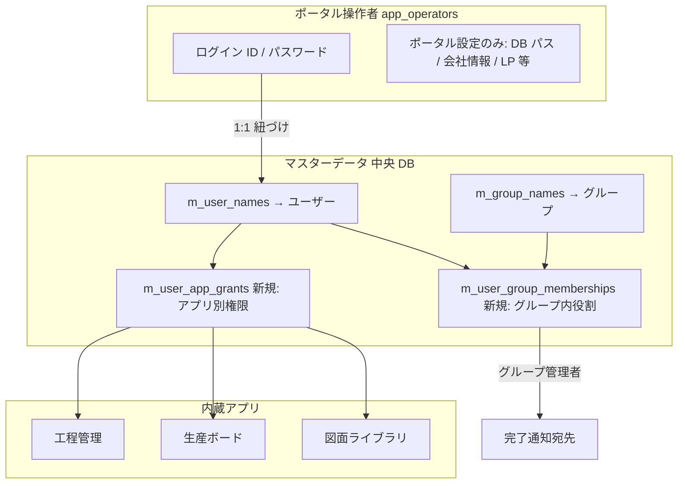

# タスク進捗管理

本書は **ポータル開発の唯一のタスクリスト**。
完了したら `- [ ]` → `- [x]` に更新する。新しい要件が出たら末尾に追加。

凡例: `- [ ]` = 未着手／進行中、`- [x]` = 完了、`- [~]` = 保留・延期

---

## フェーズ 0: 要件・設計ドキュメント

### 要件定義
- [x] `requirements.md` 初版作成
- [x] 統合方針（ハイブリッド）決定
- [x] DB 方針（中央 + サテライト、flat + 共有 SKU）決定
- [x] 認証方針（admin/admin seed + 強制パスワード変更）決定
- [x] UI 方針（LP 風、navbar アンカー、メリーゴーラウンド）決定
- [x] drawing-libraly の Express 撤去方針を追記
- [x] アプリ起動時は別ウィンドウ（別タブ相当）方針を追記
- [x] master-database を後方互換なしで作り直す方針を追記

### 支援ドキュメント
- [x] `docs/index.md`（ドキュメント索引）
- [x] `docs/task-progress.md`（本書）
- [x] `docs/architecture.md`
- [x] `docs/db-schema.md`
- [x] `docs/ipc-channels.md`
- [x] `docs/ui-design.md`
- [x] `docs/launcher-design.md`
- [x] `docs/bootstrap-and-auth.md`
- [x] `docs/coding-conventions.md`
- [x] `docs/app-router-best-practices.md`

---

## フェーズ 1: ポータル本体（ログイン + LP 風ホーム）

### 1-A. プロジェクト雛形
- [x] リポジトリルート配下に electron-vite 雛形を作成
- [x] `package.json` に依存追加（electron 32 / electron-vite 2 / react 18 / react-router-dom 6 / better-sqlite3 11 / lucide-react / tailwindcss 3 / framer-motion 11 / 型定義 / typescript / vite）
- [x] `package.json` に `"type": "module"` を設定
- [x] `package.json` に `"main": "./out/main/index.js"` を設定
- [x] `package.json` の `scripts` に `"postinstall": "electron-builder install-app-deps"` を追加
- [x] `package.json` の `scripts` に `"dev" / "build" / "preview" / "typecheck" / "dist"` を追加
- [x] `tsconfig.json` / `tsconfig.node.json`（main+preload）/ `tsconfig.web.json`（renderer）に path alias を定義
- [x] `electron.vite.config.ts`（出力先 `out/main`, `out/preload`(cjs), `out/renderer` / alias / `externalizeDepsPlugin`）
- [x] `tailwind.config.ts` + `postcss.config.js` + 共通 CSS 変数
- [x] `.gitignore`、`README.md`
- [x] `npm install` で **`better-sqlite3` が Electron ABI で再ビルド** されることを確認（postinstall 成功ログ）
- [x] `npm run dev` で Electron アプリが起動することを確認

### 1-B. メインプロセス基盤
- [x] `src/main/index.ts`（`BrowserWindow` + `loadModules` + single-instance lock）
- [x] `src/main/window.ts`（`createPortalWindow` / `webPreferences` 規約準拠）
- [x] `src/main/session.ts`（ログインセッション保持）
- [x] `src/main/auth-guard.ts`（`assertLoggedIn` / `assertCanWrite` / `assertAdmin`）
- [x] `src/main/password.ts`（scrypt ハッシュ＋`timingSafeEqual`）
- [x] `src/main/db/connection.ts`（`better-sqlite3` 接続管理、WAL、パス切替）
- [x] `src/main/db/schema.ts`（全テーブル DDL）
- [x] `src/main/db/migrate.ts`（`schema_meta` 版管理）
- [x] `src/main/db/seed.ts`（初期セッティング + admin/admin シード）

### 1-C. Preload
- [x] `src/preload/index.ts`（`contextBridge.exposeInMainWorld("api", { invoke })` のみ、CJS 出力）
- [x] 型定義 `src/preload/index.d.ts` で `window.api.invoke<T>` を宣言
- [x] `src/shared/types.ts` / `src/shared/ipcResponse.ts` / `src/shared/auth.ts` / `src/shared/constants.ts`

### 1-D. モジュール（IPC ハンドラ）
- [x] `src/main/modules/loader.ts`（**`import.meta.glob` で自動ロード**）
- [x] `settings` モジュール
  - [x] `settings:get` / `settings:pickExistingDatabase` / `settings:createNewDatabase` / `settings:closeDatabase` / `settings:updateCompanyInfo`
  - [x] `userData/portal-config.json` に DB パスを永続化し、次回起動時に自動復帰
- [x] `auth` モジュール
  - [x] `auth:session` / `auth:login` / `auth:logout` / `auth:changePassword`
- [x] `operator` モジュール
  - [x] `operator:list` / `operator:create` / `operator:setActive` / `operator:updateRole`（全て admin 限定、最後の admin 保護あり）
- [x] `launcher` モジュール（スケルトン）
  - [x] `launcher:list`（APP_CATALOG 返却）
  - [x] `launcher:openApp`（`ready=false` なら "準備中" エラー）

### 1-E. DB 初期化
- [x] `app_operators` / `app_settings` / `schema_meta` テーブル作成
- [x] 操作者 0 件かつ `bootstrapped` 未設定のとき `admin/admin` を seed（`mustChangePassword=1`）
- [x] seed 後は `app_settings.bootstrapped = '1'` をセット
- [x] マスタ（`m_customers` 〜 `m_user_names`）と `m_skus` + 複合ユニーク index を DDL のみ作成
- [x] `app_operator_app_grants` テーブルも DDL のみ作成（将来のアプリ別権限用）

### 1-F. レンダラ（ルーティング + 画面）
- [x] `src/renderer/src/main.tsx`（ReactDOM, HashRouter）
- [x] `src/renderer/src/App.tsx`（ステート駆動でルート出し分け + 強制パスワード変更モーダル）
- [x] `src/renderer/src/hooks/useAuth.ts`（session / login / logout / changePassword）
- [x] `src/renderer/src/hooks/useSettings.ts`（DB/bootstrap/会社情報）
- [x] `src/renderer/src/lib/api.ts`（`IpcResponse` を unwrap した型付き invoke ラッパ）
- [x] `src/renderer/src/lib/cn.ts`
- [x] `src/renderer/src/routes/Bootstrap.tsx`（DB 新規作成 / 既存選択 / 前回パス表示）
- [x] `src/renderer/src/routes/Login.tsx`（ログイン + DB 切替リンク）
- [x] `src/renderer/src/routes/Home.tsx`（LP 風 Hero + **4 セクションのアプリ一覧** + フッタ）
- [x] `src/renderer/src/routes/NotFound.tsx`
- [x] `src/renderer/src/components/Navbar.tsx`（会社名 + アンカー scrollIntoView + ログアウト）
- [x] `src/renderer/src/components/HeroCarousel.tsx`（3 モットーを framer-motion で rotateY 切替）
- [x] `src/renderer/src/components/AppSection.tsx`（whileInView で fade-up）
- [x] `src/renderer/src/components/ForcePasswordChangeModal.tsx`
- [x] `src/renderer/src/components/ui/Button.tsx` / `TextField.tsx` / `Card.tsx`

### 1-G. Tailwind / 共通 CSS
- [x] `index.css` で CSS 変数 12 種 + スクロールバー + `scroll-behavior: smooth`
- [x] `tailwind.config.ts` で `bg/fg/accent/state/border` セマンティックカラーを 変数 ↔ クラス に紐付け
- [x] framer-motion のアニメは `HeroCarousel` / `AppSection` / `Home` の Hero に直接適用（共通 hook は必要時に追加）

### 1-H. 受け入れ確認（フェーズ 1 完了条件）

#### 機能要件
- [x] `npm run dev` でポータルが起動し、初回はセットアップ画面が出る
- [x] 「新規 DB 作成」で `portal-master.db` が作られる
- [x] `admin/admin` で初回ログインでき、強制パスワード変更モーダルが表示
- [x] パスワード変更後、LP 風ホームに遷移
- [x] Hero のメリーゴーラウンドが 3 モットーを順送り
- [x] navbar のアプリ名リンクでスムーズスクロール
- [x] 「ログアウト」でログイン画面に戻る
- [x] DB ファイル削除 → 再起動でセットアップに戻る（鶏卵耐性）

#### 規約準拠（`.cursor/rules/*.mdc`）セルフチェック
- [x] **Electron-Rules**: `contextIsolation=true` / `nodeIntegration=false` / `sandbox=true`
- [x] **Electron-Rules**: `"main": "./out/main/index.js"` / 出力先 `out/{main,preload,renderer}`
- [x] **Electron-Rules**: `package.json` に `postinstall: electron-builder install-app-deps`
- [x] **Electron-Rules**: `better-sqlite3` などネイティブモジュールを renderer で使っていない
- [x] **Electron-Rules**: preload は `{ invoke }` のみ公開（業務関数を公開していない）
- [x] **Electron-Rules**: `ipcMain.handle` のみ使用（`ipcMain.on` なし）
- [x] **Modular-Architecture-Rules**: `src/main/index.ts` がモジュールを個別 import していない
- [x] **Modular-Architecture-Rules**: `loader.ts` が `import.meta.glob` で自動収集している
- [x] **Modular-Architecture-Rules**: 全モジュールが `register(ipcMain)` を export
- [x] **Modular-Architecture-Rules**: handler に生 SQL がなく、repo に IPC 記述がない
- [x] **Modular-Architecture-Rules**: renderer に `createProject()` のような具体関数がなく、`window.api.invoke("module:action", data)` に統一
- [x] **Modular-Architecture-Rules**: モジュール同士が直接 import していない
- [x] **Coding-Rules**: 全ファイル TypeScript / ESM（`require` なし）
- [x] **Coding-Rules**: 全 IPC handler が `try/catch` し `{success, data|error}` を返す
- [x] **Coding-Rules**: `.then()` を使っていない（async/await のみ）
- [x] **Coding-Rules**: React は関数コンポーネントのみ、class なし
- [x] **Coding-Rules**: import 順が 3 段（external / shared / local）
- [x] **Coding-Rules**: 跨ぎ import は `@shared/*` / `@main/*` / `@renderer/*` エイリアス使用
- [x] **Coding-Rules**: 本番ビルドに `console.log` が残っていない

---

## フェーズ 2: マスタ管理・設定・ランチャー本実装

### 2-A. マスタ管理画面（内蔵）
- [x] マスタ一覧コンポーネント（汎用、6 マスタ共通）— `MasterCrud.tsx`
- [x] `m_customers` CRUD
- [x] `m_models` CRUD
- [x] `m_part_numbers` CRUD
- [x] `m_component_names` CRUD
- [x] `m_group_names` CRUD
- [x] `m_user_names` CRUD

### 2-B. SKU（関係）管理
- [x] `m_skus` CRUD 画面（客先 × 機種 × **図面番号(品番)** × 部品名称 × **図面番号（台帳）** × Rev）
- [x] 図面番号(品番)選択時に **図面番号（台帳）** が空ならマスタ名称（なければコード）を自動入力。台帳が「直前マスタの既定と同じ」場合のみ品番変更に追従し、手修正した値は上書きしない（`SkuCrud.tsx`）
- [ ] CSV / Excel インポート・エクスポート

### 2-C. 操作者管理
- [x] 操作者一覧画面（admin のみ）
- [x] 操作者追加・権限変更・有効化/無効化
- [x] 最後の admin 保護

### 2-D. 設定画面
- [x] DB パス変更（設定画面から既存選択 / 新規作成）
- [x] 会社名・モットー複数件の編集（`app_settings`）
- [x] **ヒーロー背景画像**（ローカルファイルを選択しパスを DB 保存・ホームで `file:` URL 反映）。**カルーセル用背景は実装しない**（後から削除済み）
- [ ] ロゴ画像（任意）

### 2-E. ランチャー本実装
- [x] `launcher` モジュールで別 `BrowserWindow` を生成
- [x] `Map<appId, BrowserWindow>` で二重起動防止（既に開いていれば focus）
- [x] ウィンドウを閉じると Map から削除
- [x] ポータル本体を閉じると全子ウィンドウも閉じる

---

## フェーズ 3: 各アプリの取り込み

### 3-A. seisan-board（内蔵）
- [x] 画面の移植（案件・ガント・ダッシュボード）
- [x] 中央 DB（`m_*` + `m_skus`）に合わせて repository 書き換え
- [x] サテライト DB（案件・タスク等）のスキーマ確定
- [x] マイグレーション（旧 `customers/models/…` 参照からの置換）

#### 3-A 関連の実装メモ（2026-05 時点）
- 用語: マスタの「品番」を **図面番号(品番)** に統一（`shared/master.ts` の表示ラベル、中央マスタ画面説明、SKU 一覧・モーダル、生産ボードの表・フォーム・検索プレースホルダー・CSV エクスポートヘッダー等）。
- CSV インポート: ヘッダー 3 列目は **図面番号(品番)** を推奨しつつ、従来の **品番** ヘッダーも解決可能（`CsvImportDialog.tsx`）。
- `projects.repo.ts` の重複エラーメッセージも上記用語に合わせて更新。
- CSV インポート（`CsvImportDialog`）: **フォーマット説明・列定義表**、**UTF-8 BOM 付き CSV テンプレ**のダウンロード（`seisan-import:downloadCsvTemplate`、`shared/seisan/csvImportFormat.ts` でヘッダー・説明・テンプレ生成を共用）。
- CSV 列に **リビジョン**（号機の次・納期の前）を追加。**ヘッダー省略またはセル空欄は可**（旧 9 列 CSV 互換）。`projects.create` に `revision` を渡す。案件一覧 **CSV エクスポート**にもリビジョン列。
- **設定 → DB 設定（一般）**: 案件 CSV 用 Excel テンプレを `downloadFormat` で保存可能。**`resources/format.xlsx`** をリポジトリに同梱。既定ファイル名 `案件CSVインポート形式.xlsx`。記入上の注意はリビジョン・マスタ完全一致（客先・機種・図面番号・名称・グループ・入力者）に追随。

#### 3-A-2. 部材管理（parts-tracker）

**位置づけ**: 生産ボード（マクロ）の **直下**。1 案件で使う **全部品** の調達区分・リードタイム・必要着日を管理し、案件納期に間に合うかを可視化する **ミクロ** 管理。詳細は [requirements.md §8.5](./requirements.md#85-フェーズ-5-部材管理parts-tracker) を参照。

**到達状況**: **5-A-0 / 5-A MVP / 5-A-1 / 5-B / 5-E / 5-F を一括実装完了**（2026-05-25）。schema v6 + 中央 DB 製品 BOM マスタ + `seisan-board.db / projects` の `product_id` / `product_bom_id` / `quantity_units` 列 + `parts-tracker.db` 拡張（手配済・Rev・非表示・取込バッチ・階層メタ）+ 製品 BOM 再帰展開 + CSV 取込（プレビュー・コミット）+ Rev 差分（製品 Rev 同士 / 案件同士 / 案件 vs 最新 Rev）まで実装。**BOM 自動追従は採用しない**ポリシーで実装。

**目的（要約）**

- 社内製作 / 商社購入 / 支給品 など **調達区分** ごとに部品行を管理
- **リードタイム（日）** と **必要着日**・**発注期限** から、遅延・要発注を一覧表示
- **商社名**は中央マスタ **`m_suppliers`** で登録し、部品行から選択
- **標準リードタイム**は中央マスタ **`m_procurement_lead_times`** で管理（何日前までに発注／着手すべきか）
- 生産案件は **`seisan_project_id`** で紐付け（`parts-tracker.db` は中央 DB 隣接）
- **【5-A-1 計画】** **親番 BOM テンプレート** から案件へ **一括展開**（リピート品対策）。**サブ組立を再帰展開** し **末端部品まで** 載せる
- **【5-B 計画・最優先入力】** **SolidWorks BOM CSV 取込**（Rev 対応）、**非表示部品**（商社 3D 等の手配対象外サブ構成）
- **【5-A-1 計画】** **手配済チェック** + **`arranged_at` / 操作者** の一覧表示
- **【5-E 計画】** **製品（親番）を主役** にした BOM 管理。案件は **製品 Rev のインスタンス** として作成（無限に増える案件と、有限の製品 BOM を分離）
- **【5-F 計画】** **製品 Rev A → Rev B の差分表示**（追加・削除・数量変更・部品 Rev 上がり）と要約テキスト。案件同士の比較や「前 Rev からの変更バッジ」も対象

**マスタ（5-A-0・中央 DB）**

| テーブル | 用途 | UI |
|----------|------|-----|
| `m_suppliers` | 商社名（購入・外注先） | マスタ DB「商社」タブ |
| `m_procurement_lead_times` | 区分×商社×品番/SKU ごとの **標準 LT（日）** | マスタ DB「標準リードタイム」タブ |
| `m_products` / `m_product_boms` / `m_product_bom_lines` | **親番ごとの標準 BOM**（**`sub_assembly` 多階層**・**Rev 単位**）【5-A-1 / 5-E 統合・計画】。**5-A-1 で予定していた `m_bom_templates` は実装しない**（兼用確定） | マスタ DB「製品 BOM」タブ |

**実装チェックリスト（5-A-0 マスタ）**

- [x] 要件定義（商社・標準 LT）— **2026-05-23 追記済み**
- [x] 中央 DB スキーマ + migrate: `m_suppliers` / `m_procurement_lead_times`（schema v5）
- [x] `shared/master.ts` / `master.repo` 拡張（商社は flat マスタ、標準 LT は `procurement-lead-time.repo` + `master:procurementLeadTime:*`）
- [x] マスターデータベース UI: 「商社」「標準リードタイム」タブ
- [x] `docs/db-schema.md` §10 追随
- [x] `docs/ipc-channels.md` §6e 追随 — **2026-05-25**

**実装チェックリスト（5-A MVP・部材管理アプリ）**

- [x] 要件定義（`requirements.md` §8.5）— **2026-05-23 追記済み**
- [x] `parts-tracker.db` スキーマ + connection（中央 DB 隣接）
- [x] `src/main/modules/parts-tracker/`（handler + repo）
- [x] `shared/partsTracker.ts` 型定義
- [x] IPC 実装: `parts-tracker:*` / `master:procurementLeadTime:*`
- [x] `docs/ipc-channels.md` 追記 — **2026-05-25**（§6e / §6g）
- [x] `APP_CATALOG` + `GRANTABLE_APP_IDS` + ユーザー権限 UI
- [x] `App.tsx` ルート + `PartsTrackerApp.tsx`（案件選択・部品表・CRUD・リスク表示・商社選択・LT 自動提案・検索/フィルタ・ページネーション・**ヘルプ**）
- [x] 権限: `assertCanViewApp` / `assertCanWriteApp("parts-tracker")`
- [x] `npm run typecheck` 通過

**実装チェックリスト（5-A-1・手配済チェック）【実装完了 2026-05-25】**

> **2026-05-25 確定**: 親番 BOM テンプレートのテーブル別立て（`m_bom_templates`）は **廃止し、5-E の `m_product_boms` に統合**。本チェックリストは **手配済関連** に絞り、テンプレ・多階層展開系は 5-E チェックリストに集約。

- [x] 要件定義 — **2026-05-23 追記**（`requirements.md` §8.5.6.3〜8.5.6.4、§8.5.11 5-A-1）
- [x] **多階層 BOM（サブ組立再帰展開）** 要件 — **2026-05-23 追記**（§8.5.6.4、2026-05-25 改訂で `m_product_boms` ベース）
- [x] **5-E への統合方針確定** — **2026-05-25 追記**（§8.5.6.4 / §8.5.14）
- [x] サテライト DB: `project_part_lines` に **`is_arranged`** / `arranged_at` / `arranged_by_user_name_id` / `arranged_by_username` 列追加（+ migrate）
- [x] サテライト DB: `project_part_lines` に **階層メタ** `bom_level` / `assembly_path` / `parent_assembly_part_number` / `root_product_bom_id` / `source_product_bom_line_id` 列追加（5-E と同時に実施）
- [x] `project_part_line_arrangement_log`（手配 ON/OFF 履歴）
- [x] `parts-tracker:line:setArranged` IPC（セッションから操作者記録）
- [x] `PartsTrackerApp`: 一覧の手配済チェック・操作者/日時表示、サマリの「手配済」件数
- [x] `shared/partsTracker.ts` 型拡張、`docs/db-schema.md` / `ipc-channels.md` 追随

> テンプレ・多階層展開系（`master:productBom:*` IPC、`parts-tracker:productBom:*` IPC、全階層展開ボタン、`assembly_path` 列表示）は **5-E チェックリスト** に集約。

**アプリ概要**

| 項目 | 内容 |
|------|------|
| 表示名 | 部材管理 |
| アプリ ID | `parts-tracker` |
| LP 配置 | `office-support` セクション、**`seisan-board` の直後** |
| 実装 | 内蔵・別ウィンドウ `#/apps/parts-tracker` |

**将来（5-B 拡張・要件確定・未実装）**

- [x] **標準8列 BOM CSV**（8列・親品番・レベル）— §8.5.13.2.1 / §8.5.13.5
- [x] 取込時空欄 **`-` 埋め**（§8.5.13.5.2）
- [x] 一覧 **BOM ツリー表**（親品番・Lv・折りたたみ・ページネーションなし）§8.5.13.2.8
- [x] **手配済** 楽観的更新（一覧が消えない）
- [x] 一覧 **ツリー維持ソート** 昇順／降順（§8.5.13.5.3）
- [x] 部品一覧 **インデント表示**（`bom_level` 連動）
- [x] CSV 取込時 **調達区分未設定**（`purchase` 自動既定の廃止）
- [x] SW 実機エクスポートで **標準8列**（調達区分・商社なし）— 要件 §8.5.13.5 に反映
- [x] 登録用 BOM テンプレ DL を **8列** に更新（§8.5.13.5）
- [ ] 案件 **`quantity_units`** 表示倍率（BOM 1 台分 × 台数）
- [ ] SW 実機で **Rev 列** がエクスポートできるか確認
- [x] **§8.5.16** 一覧インライン編集（編集モード＋一括保存）+ **区分タブ**
- [ ] **§8.5.6.3.1** 手配済 ↔ `status` / サマリ未着手の連動
- [x] **§8.5.17.1** リピート案件：前回 BOM コピー（手配・状態初期化）
- [x] **§8.5.17.2** 案件間 BOM 差分 **専用ページ**（`bomDiff:project` UI）
- [x] **§8.5.17.3** カスケード式案件選択（客先 → 親番 → 案件）

**実装チェックリスト（5-H・リピート／差分ページ／カスケード案件）【実装済み】**

- [x] 要件定義 — **2026-05-25**（`requirements.md` §8.5.17）
- [x] `ProjectCascadeSelect`（客先 → 親番 → 案件）— `PartsTrackerApp`・比較ページで共用
- [x] `parts-tracker:project:suggestRepeatSources` / `project:cloneBomFrom`
- [x] ルート `#/apps/parts-tracker/compare` + `PartsTrackerComparePage`（`bomDiff:project`）
- [x] ヘッダー導線・ヘルプ更新（`PartsTrackerLayout` ナビ・比較ページ。一覧の「最新 Rev と比較」は廃止）

**実装チェックリスト（5-G・一覧インライン編集）【実装完了 2026-05-25】**

- [x] 要件定義 — **2026-05-25**（`requirements.md` §8.5.16）
- [x] `PartsBomTreeTable` + ツールバー: **編集モード**（表示行プルダウン）、**一括保存のみ**／キャンセル
- [x] 状態プルダウンは **手配済 ON 行のみ**；商社は **purchase のみ**；購入+商社空は保存可
- [x] 区分タブ＋件数バッジ（**表示行のみ**）、通常ツリーフィルタ
- [x] `parts-tracker:line:batchUpdate`（トランザクション）
- [x] `docs/ipc-channels.md` 追随（`line:batchUpdate` 記載済み）

**完了済み（5-B プロトタイプ・2026-05-25）**

- [x] 簡易 BOM CSV 取込（`品番`/`名称`/`数量`）・Rev・非表示・再取込 3 ポリシー
- [ ] 生産ボード案件詳細から「部材管理を開く」導線
- [ ] 全案件横断ダッシュボード
- [ ] 工程管理・通知との連携
- [ ] 案件部品表から BOM テンプレートを **逆生成**（5-A-1 未確定事項）

**実装チェックリスト（5-B・BOM CSV / Rev / 非表示）【実装完了 2026-05-25】**

- [x] 要件定義 — **2026-05-23 追記**（`requirements.md` §8.5.13）
- [x] `project_part_lines` に `revision` / `is_hidden` / `hidden_at` / `hidden_by_username` / `hidden_reason` / `import_batch_id` 列追加
- [x] `project_part_import_batches` テーブル + migrate
- [x] `shared/partsTracker.ts` / `shared/partsTrackerCsvFormat.ts`（列定義・テンプレ生成・CSV パーサ・プレビュー）
- [x] IPC: `parts-tracker:import:preview` / `import:commit` / `import:downloadTemplate` / `import:batches` / `line:setHidden`
- [x] `PartsTrackerApp`: BOM CSV 取込ダイアログ（列ヘッダ自動認識・エラー / 警告表示・商社マッチ・重複ポリシー）
- [x] 一覧: Rev 列、非表示操作（理由入力）、「非表示行も表示」トグル、サマリから非表示行除外（`visibleLines` / `hiddenLines`）
- [ ] SolidWorks **実機エクスポート** で **Rev 列** の有無を確認（理想列は §8.5.13.5）
- [x] `docs/ipc-channels.md` / `docs/db-schema.md` 追随

**実装チェックリスト（5-B.1・SolidWorks 形式）【実装完了 2026-05-25】**

- [x] 要件定義 — **2026-05-25** ヒアリング反映（`requirements.md` §8.5.13.2〜2.7 / §8.5.13.4〜5 / `db-schema.md` §10.2）
- [x] `partsTrackerCsvFormat.ts`: 標準8列形式 8列・親品番・レベル・quoted 複数行名称
- [x] `bom-csv-import.repo.ts`: 区分/商社なし・`-` 正規化・親品番+レベルで path 生成・取込時グローバルソート禁止
- [x] `PartsBomTreeTable`: インデント一覧・**ツリー維持ソート**
- [x] テンプレ DL を 標準8列形式 と同型 8 列に差し替え
- [ ] 変更元（製品 Rev / 取込バッチ）の一覧表示 — §8.5.13.2.6【未実装】

**実装チェックリスト（5-E・製品中心 BOM 管理）【実装完了 2026-05-25】**

- [x] 要件定義 — **2026-05-25 追記**（`requirements.md` §8.5.14）
- [x] **配置先・統合・追従方針の確定** — **2026-05-25**（§8.5.14.3 / §8.5.14.4.1）
- [x] 中央 DB: `m_products` / `m_product_boms` / `m_product_bom_lines` + migrate（schema v6）。**5-A-1 の `m_bom_templates` は実装しない**（統合確定）
- [x] **`seisan-board.db / projects`** に `product_id` / `product_bom_id` / `quantity_units` 列追加 + migrate（`seisanSchema.ts`）
- [x] `parts-tracker.db / project_part_lines` に `root_product_bom_id` / `source_product_bom_line_id` / 階層メタ（`bom_level` / `assembly_path` / `parent_assembly_part_number`）を追加（5-A-1 と同時実施）
- [x] マスタ UI: 「製品 BOM」タブ（CRUD・Released 化・Rev コピー・サブ組立参照・子 BOM リンク・Rev 差分）
- [x] IPC: `master:productBom:*`（旧 `master:bomTemplate:*` 案を本 IPC に集約）
- [x] IPC: `parts-tracker:productBom:match` / `previewExpand` / `expand`（再帰展開・循環検出・未登録サブ組立検出）
- [~] 部材管理 UI: 案件起点に **「製品 BOM テンプレート」カード**で Rev 一覧と展開ボタンを表示。製品起点トップは「マスタ DB > 製品 BOM」タブで実装（完全な「製品起点専用トップ」は将来 UX 改善）
- [~] 案件起票フロー（生産ボード側 UI に製品 / Rev / 数量を組込）：**DB 列は揃った**が、生産ボード起票画面の UI 改修は別タスク。当面は `parts-tracker` 側の「製品 BOM を展開」ボタンで同等の結果が得られる
- [x] 製品 BOM 編集画面と CSV 取込（5-B）／サブ展開ロジック（`product-bom-expand.repo.ts`）を共用
- [x] **追従ポリシー**: 既存案件には自動追従しない（既定）。新 Rev は手動展開＋ 5-F 差分プレビュー
- [~] 案件部品一覧に「より新しい Rev からの変更」バッジ：ヘッダー **案件間比較** ページで代替。自動バッジ表示は将来 UX 改善
- [x] `shared/partsTracker.ts` / `shared/productBom.ts` 型拡張、`docs/db-schema.md` / `ipc-channels.md` 追随

**実装チェックリスト（5-F・BOM Rev 差分表示）【実装完了 2026-05-25】**

- [x] 要件定義 — **2026-05-25 追記**（`requirements.md` §8.5.15）
- [x] IPC: `parts-tracker:bomDiff:productRev` / `bomDiff:project` / `bomDiff:currentVsLatest`
- [x] 共通ロジック: `part_number`（+任意 `assembly_path`）をキーに **追加・削除・数量変更・部品 Rev 上がり** を判定（`shared/bomDiff.ts` の `computeBomDiff`）
- [x] 差分ビュー UI: 色分け（追加=緑 / 削除=赤 / 数量変更=黄 / Rev 上がり=青）。部材管理アプリ + マスタ DB の両方に搭載
- [x] 差分要約テキスト（「追加 N / 削除 N / 数量変更 N / 部品 Rev 上がり N」）の生成
- [~] 案件部品一覧の **「前 Rev からの変更」バッジ**：**案件間比較** ページで確認可能（自動バッジ表示は将来 UX 改善）
- [ ] 差分の CSV エクスポート（発注リスト雛形）の要否確定（§8.5.12 未確定 25）
- [x] `docs/ipc-channels.md` 追随

### 3-B. drawing-libraly（内蔵・再設計）**（一旦完成: 2026-05-06）**
- 以降の改善は別途。現状の到達点を「内蔵・再設計フェーズ完了」とみなす。
- [x] **顧客図面**: 生産ボードの「提供ファイル」と**同一扱い**。`drawing-library:listSeisanCustomerDrawings` のみを UI で表示（別タブ「顧客図面（DB）」は廃止）。開く＝`seisan-file:open`。
- [x] Express 撤去相当: 旧 `localhost:3001` API を **IPC** に置換（`drawing:*` / `drawing-dxf:*` / `drawing-edrawings:*` / `drawing-comment:*` / `drawing-library:*`）。専用 SQLite は中央 DB と**隣接**して `drawing-library.db` として自動オープン（`drawingLibraryConnection.ts`）。
- [x] **自社発行のみ** `drawing-library.db` へ登録: `drawing:list` … `drawing:readFile` ほか eDrawings / コメント（`drawingType` は UI 上 `work` のみ）
- [x] ~~`drawing-dxf:list` / `drawing-dxf:upload` / `drawing-dxf:delete`~~ **廃止（2026-05-17）**: 図面ライブラリでの DXF 取り扱いをやめたため、IPC・repo・ストレージ補助・スキーマ作成・型を削除（既存 DB の `drawing_dxf_files` テーブル・`dxf/` ディレクトリは互換のため残置）
- [x] `drawing-edrawings:list` / `drawing-edrawings:upload` / `drawing-edrawings:delete`
- [x] `drawing-comment:list` / `drawing-comment:create` / `drawing-comment:update` / `drawing-comment:delete`
- [x] PDF 等: レンダラは **`drawing:readFile` → Blob URL** でプレビュー（Express の `/api/files` 廃止）
- [x] 図面比較（おまけ）: 外部 PDF 2 件を IPC で比較。**`compare_drawings.exe` 優先**（`resources/tools/` 開発配置、`electron-builder` の `extraResources` で `resources/tools` に同梱、`DRAWING_COMPARE_EXE` で上書き）。無い場合は Python スクリプト（`DRAWING_COMPARE_SCRIPT` 等）
- [x] 自社発行タブ: 詳細モーダルで **eDrawings** の一覧・追加・削除
- [x] **一覧の絞り込み・並び替え（旧アプリ相当）**
  - [x] **自社発行**（`DrawingDbTab.tsx`）: 客先→機種→図面番号(品番) の **カスケード**（`drawing:workCascadeOptions`）。**並び替え**は `drawing:list` の `sortBy` / `sortOrder`（`drawings.repo.ts` で列ホワイトリスト + 動的 `ORDER BY`）
  - [x] **顧客図面＝提供ファイル**（`SeisanProvidedFilesTab.tsx`）: `company_id`→`model_type`→`part_number` の **カスケード**と **並び替え**（取得済み行に対するクライアント側。追加 IPC なし）
- [x] `docs/ipc-channels.md`: `drawing:workCascadeOptions`・`DrawingListParams` のソート項目を追記
- [x] **UI（顧客図面・自社発行）**
  - 一覧は **カード**（顧客: PDF サムネ、`readAsDataUrl`）。詳細は **`Modal` の `width="full"`** で周囲に余白を取りワークエリアを広げる。
  - **顧客図面詳細**: 案件に紐づく全ファイルを **行リスト**（開く・保存・行ごとの旧図面チェック）。**詳細ヘッダの旧図面チェック**と **行オーバーレイ** の二重表示にならないよう、モーダル全体の `ObsoleteOverlay` は付けない（`SeisanProvidedFilesTab.tsx`）。
  - **自社発行詳細**: 左 **PDF 複数ページ表示**（`pdfjs-dist` / `PdfJsViewer`）、右 **eDrawings** の追加・一覧・保存・削除、下 **コメント**。**自社タブの DXF UI は削除**。
  - **旧図面**: `project_files.is_obsolete`（顧客）／`drawings.is_obsolete`（自社）。`seisan-file:setObsolete`・`drawing:setObsolete`。生産ボードの提供ファイル一覧は **`is_obsolete` を表示・分岐に使っていない**（DB 同一カラムだが図面ライブラリ主導の意味。`projectFile.ts` に注記）。
  - **カード 1 行目ラベル**: 客先・機種・図面番号(品番)・名称・リビジョンを **`_` 連結**（値が無い項目は省略）。顧客は空ならファイル名、自社は空なら名称へフォールバック。副行に **ファイル名**（顧客）／**登録 PDF ファイル名**（自社パスからベース名）。
- [x] メイン `out/main` が古いと `seisan-file:setObsolete` 等が **No handler registered** になる → **`npm run build` 後の起動** または **dev 再起動**で解消（ソースは `seisan-file.handler.ts` に登録済み）。
- [~] サテライトの `customers/models/products` を中央 `m_*` ID に**完全移行** — 現状は図面ライブラリ DB 内ローカルマスタを維持。`drawing-library:masterList|Create|Delete` で管理。将来ポータル中央マスタへの統合は別タスク。

### 3-C. Process management desktop（内蔵）
- [x] **サテライト DB**: 中央 DB と**隣接**で `process-management.db` を自動オープン（`processMgmtConnection.ts` / `connection.ts`）。スキーマは `projects` + `tasks`（**独自 `users` は作成しない**。旧スタンドアロン DB に残る `users` テーブルは未使用で可）
- [x] **認証**: IPC はポータル `assertLoggedIn` / 更新系は `assertCanWrite`。ボード・開始は **セッションの `username`**（`app_operators`）を担当者に使用
- [x] **工程表示（process_view）**: Flask 原型 `Process management` と同様、中央 `app_operators.processView`（`solidworks` / `cadmac` / `both`）でボード・案件タスク一覧をサーバ側でフィルタ。管理画面「操作者」で編集。`general` 種別は SW/CAD どちらの専用表示でも可。`auth:syncSession` で自分の変更を即時セッション反映
- [x] **初回 UI**: `#/apps/process-management`・ヘッダ固定 + ビューポート内スクロール（図面ライブラリに準拠）。**ボード**（全体俯瞰・開始/完了・履歴・マイタスク）／**案件**（一覧 + 選択案件のタスク）
- [x] **ボード一覧 UX**（`ProcessManagementApp.tsx`）: メイン余白（`mx-3` / `sm:mx-5`）。`process-mgmt:task:listBoard` は **`query` / `client` を空**で全件取得し、**レンダラ側**でカスケード（客先→案件→工程→担当）、テキスト検索、**列ヘッダクリックでソート**、**ページネーション**（表示件数 20 / 50 / 100）。テーブルに **更新**列（`updatedAt`）
- [x] **完了時の進捗％**: `status === '完了'` は **常に 100% 扱い**（`pm-tasks.repo.ts` の `mapDbToPmTask`）。DB 更新は `completeTask` に加え **`updateTask` / `updateTaskStatus` が `完了` になったときも** `progress_percent = 100`・`completed_at` 等を整合。マイタスクの「完了」直後は UI 上 `setPercent(100)` してから再取得
- [x] **タスク完了のインナー通知（メールなし）**: 完了時に `pm_task_completion_notifications` へ行を追加し、**他のアクティブ管理者**（完了操作者本人を除く）がヘッダのベル一覧で確認。**確認（ack）するまで一覧から消えない**。完了取り消しで当該タスクの通知行を削除。IPC: `process-mgmt:notify:listPending` / `process-mgmt:notify:acknowledge`

#### 3-C 関連の実装メモ（2026-05-06 時点）
- ボードの絞り込み・並び・ページングは **IPC 追加なし**（一覧は従来どおり `listBoard` の 1 回取得を前提）。
- カスケードの担当「（未割当）」は内部値 `__unassigned__`（未入力 `assignee` を一致判定）。
- `filterBoardTasks`（メイン）は空クエリで実質バイパス; 以降はクライアント処理が正。

### ~~3-D. PDF_scope_vault（子プロセス起動）~~ **撤去済み（2026-05-09）**
- PDF Scope Vault（OCR アプリ）は**ポータル統合から外し**、単体デスクトップアプリとして別管理。`launcher:openApp` / 同梱 `resources/tools/pdf-scope-vault` / 設定 IPC は削除。
- **PixoConverter** は当面コード上は子プロセス起動だが、**内蔵化が最終方針**（詳細は 3-E）。

### 3-E. PixoConverter

**方針変更（計画のみ・本書追記時点ではコード未変更）**: 当初は独自 exe の **`child_process` 起動**。安定性・保守のため **ポータル内蔵（別 `BrowserWindow` + 既存と同じ IPC 規約）へ移行する**。

#### 現状（外部 exe 起動・実装済み）

- [x] `launcher:openApp`（`appId: pixo-converter`）で `child_process.spawn`（`externalProcess.ts`）
- [x] パス解決: **`PIXO_CONVERTER_EXE`** / **`launcher.pixoConverter.exePath`** / **`resources/tools/pixo-converter/pixoconverter.exe`**（ローカル同梱） / 開発時 **`PixoConverter/dist/win-unpacked/pixoconverter.exe`**
- [x] IPC: `settings:pickPixoConverterExe` / `settings:clearPixoConverterExe`。`SettingsSnapshot.pixoConverterExePath`
- [x] `APP_CATALOG` で `kind: "external"`・`ready: true`
- 補足: electron-builder 出力の exe 名は **`pixoconverter.exe`**（小文字）。

#### PixoConverter 単体（リポジトリ `PixoConverter/`）UI 更新（2026-05-09）
- PDF **連結**・**ページ編集（差し替え／挿入／削除）**を Acrobat 風（左サムネ一覧・メインプレビュー・ツールバー）に刷新（`AcrobatPdfMerge.jsx`、`PdfReplacePage.jsx`、`pdfjs-dist`、`acrobat.css` 等）。
- **ページ編集**画面の不具合修正（ソース PDF 解除ボタン、プレビュー canvas クリア、`setSelectedPageIndices` など）。PNG/JPG・TIFF→PDF は従来画面のまま。

#### 将来（内蔵化・未実装）

- [ ] `APP_CATALOG` を **`kind: "internal"`** に変更し、`launcher:openApp` は **`openInternalAppWindow`** のみで起動（`externalProcess.ts`・exe パス解決の撤去または縮退）
- [ ] 管理画面から **Pixo 専用の exe 登録 IPC / UI**（`settings:pickPixoConverterExe` 等）を**不要なら削除**し、`SettingsSnapshot` から **`pixoConverterExePath` を除去**（後方互換・マイグレーション方針は別途決定）
- [ ] レンダラー: `PixoConverter` の UI（React）を **`portal` 配下に移植**（ルート例: `#/apps/pixo-converter`）。`AppShell` の `REGISTRY` に登録。ルーティング・スタイルは図面ライブラリ等の内蔵アプリに準拠
- [ ] メインプロセス: 現行 Pixo の **`ipcMain.handle`（PDF/TIFF/画像変換・pdf-lib・sharp・Poppler 呼び出し等）**を **`src/main/modules/`** に **repo + handler** へ分割移植し、チャネルを **`module:action`** に統一（preload は汎用 `invoke` のみ）
- [ ] ネイティブ/バイナリ依存（**sharp**、**Poppler**、既存 `resources/bin` 相当）を **ポータルの `extraResources` またはビルド手順**に合わせて一本化
- [ ] 開発時: 単体 `PixoConverter` リポジトリフォルダへの依存を**なくすか**、モノレポ内参照に**整理**（フェーズ 5 の「旧フォルダ削除」と整合）
- [ ] ドキュメント追随: `ipc-channels.md` / `launcher-design.md` / `requirements.md` / `resources/tools/README.md` の **外部起動・同梱 exe** 記述を内蔵前提に更新

---

## フェーズ 4-A: マスタ起点のユーザー権限・アプリ別権限（**実装済み 2026-05-19**・一部ドキュメント未追随）

**目的**: ポータル「操作者」はログインとポータル内設定だけ。業務ユーザー・グループ・工程表示・各アプリの権限は **マスターデータ（中央 DB）** で定義する。工程完了通知は **ポータル全体 admin** ではなく **グループ単位の管理者**（マスタ定義）へ。

### 現状（2026-05 時点）とギャップ

| 項目 | 現状 | 望ましい姿 |
|------|------|------------|
| ログイン | `app_operators`（username / password / **role** / **processView**） | 操作者＝ログイン口のみ。業務属性はマスタへ |
| 業務ユーザー | `m_user_names`（マスタ画面ラベルは「担当者」） | **ユーザー** として定義し、権限・通知の主体にする |
| グループ | `m_group_names`（生産案件のグループ名のみ） | **グループ × ユーザー × 役割**（例: 一般 / グループ管理者） |
| アプリ権限 | `app_operator_app_grants` は **DDL のみ**（未使用）。実効は `app_operators.role` が全アプリ共通 | **アプリごと**に admin / editor / viewer（＋工程管理だけ工程表示） |
| 工程表示 | `app_operators.processView`・操作者画面で編集 | **マスタ側**（工程管理アプリ権限に紐づけ） |
| 工程タスク担当 | `tasks.assignee` は **文字列**（ログイン名と一致させて運用） | **マスタユーザー**（ID または正規名）で紐づけ |
| 完了通知宛先 | `listActiveAdminUsernames()`＝**有効な portal admin 全員**（完了者除く） | **当該案件グループの「グループ管理者」** などマスタ定義 |

### 責務の切り分け（修正イメージ）

- **ポータル操作者（`app_operators`）**: 認証・`mustChangePassword`・有効/無効。**ポータル管理画面**では DB 設定・会社情報・（必要なら）操作者アカウントの追加/無効化のみ。**工程表示・アプリ別 role は編集しない**。
- **マスターデータ**: ユーザー・グループ・**グループ所属と役割**・**アプリ別権限**（＋工程管理向け **工程表示**）を編集。**編集権限はポータル admin のみ**（マスターデータ画面もポータル admin が操作）。生産ボード CSV の「ユーザー」列等と整合する **正のユーザー名** をここで管理。
- **セッション**: ログイン後、`app_operators` → 紐づく `m_user_names` を解決し、**アプリ起動時・IPC 時**に `m_user_app_grants`（＋グループ役割）を参照して権限判定。

### 合意済み方針（2026-05-17）

| # | 論点 | 決定 |
|---|------|------|
| 1 | ログインとユーザー | **1 ログイン = 1 マスタユーザー（固定）**。**ログイン名（`app_operators.username`）とマスタの名前（`m_user_names.name`）は同一**とする |
| 2 | ポータル `admin` | **ポータル設定のみ**（DB・会社情報・操作者アカウント等）。生産・工程・図面・Pixo 等の業務権限は **すべてマスタの `m_user_app_grants`** |
| 3 | 完了通知 | **当該案件のグループの「グループ管理者」** のみ（完了したユーザーは除外）。**複数グループ所属は想定しない**（1 ユーザー = 最大 1 グループ） |
| 4 | グループ未設定案件 | 生産ボードで **グループは必須入力**のため、通常は未設定にならない。通知ロジックは **グループに紐づく group_admin のみ**（特別フォールバックは設けない。データ不整合時は通知なし＋ログ等で検知する程度） |
| 5 | 用語 | `m_user_names` の表示を **「ユーザー」** に統一。生産ボード CSV・画面の **「入力者」「担当者」表記も「ユーザー」に揃える** |
| 6 | マスタ編集権 | **ポータル admin のみ**。各アプリ admin やグループ管理者によるマスタ編集は **しない** |

### データモデル案（スキーマ追加・移行は別タスク）

- [x] **`app_operators.userNameId`** + migrate v3（既存 operator → マスタユーザー + `m_user_app_grants` へ role/processView コピー）
- [ ] **`app_operators.processView` 列の DDL 廃止**（ランタイムは grants 参照。列は後方互換のため残置）
- [x] **`role` はポータル用**（業務権限は `m_user_app_grants`）
- [x] **`m_user_group_memberships`**（新規）例:
  - `userNameId` → `m_user_names`（**1 ユーザーは 0 または 1 グループのみ** — `UNIQUE(userNameId)` で担保）
  - `groupNameId` → `m_group_names`
  - `roleInGroup`: `member` | `group_admin`（表示名: 一般 / グループ管理者）
- [x] **`m_user_app_grants`**（新規）例:
  - `userNameId`, `appId`（`process-management` / `seisan-board` / `drawing-library` / `pixo-converter` 等）
  - `appRole`: `admin` | `editor` | `viewer`
  - `processView`: **工程管理のみ** `solidworks` | `cadmac` | `both`（他アプリは NULL）
  - PRIMARY KEY (userNameId, appId)
- [x] **用語（マスタ）**: `m_user_names` ラベル →「ユーザー」
- [ ] **用語統一（横断）**: 生産ボード CSV・工程管理 UI の「担当」「入力者」表記の残り

### UI / IPC の修正イメージ

- [x] **マスターデータ** — ポータル admin のみ CRUD（`assertPortalAdmin`）
  - [x] **ユーザー権限** タブ（`user-access:*`）— グループ所属・アプリ別権限
- [x] **ポータル管理 › 操作者** — 工程表示列削除、`operator:updateProcessView` 廃止
  - [ ] 新規操作者作成時は **マスタユーザーを選択**（または作成後にマスタで紐づけ）— パスワードと有効/無効のみ
  - [ ] 説明文: 「業務権限はマスターデータで設定」
- [x] **認証・セッション** — `SessionUser` 拡張、`buildSessionFromOperator`、`auth:syncSession` で grants 反映
- [x] **権限ガード** — `assertPortalAdmin` / `assertCanWriteApp` / `assertAppRoleAtLeast` 等
- [x] **工程管理・完了通知** — 案件グループの `group_admin` へ通知。ベルは `group_admin` + 工程管理利用権
- [ ] **工程タスク `assignee` の userNameId 化**（現状はログイン名文字列のまま）
- [ ] **既存 `app_operator_app_grants`**
  - [ ] `operatorId` ベースの DDL は **非推奨化**し、`m_user_app_grants` に移行するか、テーブル定義を差し替え（マイグレーション方針を `db-schema.md` に記載）

### ドキュメント（実装前に更新）

- [ ] `requirements.md` — 認証・権限の二層構造（ポータル / マスタ）
- [ ] `db-schema.md` — 新テーブル・FK・移行手順
- [ ] `ipc-channels.md` — `operator:updateProcessView` 廃止、`master:userGroup:*` / `master:userAppGrant:*` 等の新チャネル
- [ ] `bootstrap-and-auth.md` — 初回 admin とマスタユーザーの関係

### 実装時の残タスク（合意後の細部）

- [ ] 初回 seed: `admin` 操作者と同名の `m_user_names` 行・`m_user_app_grants`・（任意）グループ所属の初期データ
- [ ] 既存 DB 移行: `app_operators.processView` → `m_user_app_grants`、文字列 `assignee` → `userNameId` の名寄せ
- [ ] ポータル `editor`/`viewer` の扱い（ポータル設定に一切触れないなら `portal_user` 1 種のみでも可）— 実装時に最小構成を決める

---

## フェーズ 4: 運用強化

- [ ] アプリ別利用権限 — **フェーズ 4-A に統合して設計**。旧タスク `app_operator_app_grants`（operator 基準）は **user 基準へ作り直し**
- [ ] 操作ログ・監査テーブル
- [ ] 更新通知（バージョンチェック）
- [ ] インストーラ作成（`electron-builder`、NSIS）
- [ ] 配布・運用ドキュメント

---

## フェーズ 4-B: 共通カテゴリマスタ（**計画のみ・未実装**）

**目的**: 図面ライブラリの「自社発行」を発端に、**他アプリでも使える共通の分類軸（カテゴリ）** をマスターデータとして提供する。

### 合意済み方針

| # | 論点 | 決定 |
|---|------|------|
| 1 | 置き場所 | **中央 DB** に `m_categories`（横展開のため drawing-library.db には置かない） |
| 2 | アプリ間共有 | 1 テーブル + **`scope` 列**（`common` / `drawing-library` / `process-management` 等）で管理。`master:list` に `scope` 引数を追加して絞り込む |
| 3 | アプリ DB との結合 | **文字列で保存**（drawing-library.db の既存 `category` 列を活用）。クロス DB FK は張らない（`group_name` と同じパターン） |
| 4 | 編集権限 | **ポータル admin のみ**（既存マスタと同じ） |
| 5 | 既存データ | drawing-library.db の `category` 既存値はそのまま保持。マスタ未登録の値は表示・検索可。新規登録時はマスタからの選択を推奨 |
| 6 | 階層 / 多重所属 | **フラット**（深い階層は当面持たない）。1 図面 = 1 カテゴリ。複数分類が必要になったら既存 `tags` 列で運用 |

### データモデル案

- [ ] **`m_categories`**（中央 DB / 新規）
  - `id INTEGER PK AUTOINCREMENT`
  - `code TEXT NOT NULL`（scope 内ユニーク・大小文字無視）
  - `name TEXT NOT NULL`
  - `scope TEXT NOT NULL`（`'common'` / `'drawing-library'` / 将来追加）
  - `note TEXT`
  - `isActive INTEGER NOT NULL DEFAULT 1`
  - `createdAt` / `updatedAt`
  - `UNIQUE (scope, code COLLATE NOCASE)`
- [ ] `SCHEMA_VERSION` を **4** に
- [ ] `MASTER_TABLES` / `MASTER_TABLE_LABELS` に追加（マスタ画面に自動でタブ追加）

### IPC

- [ ] `master:list` の payload を `{ table, scope?: string }` に拡張（後方互換: scope 省略時は全件）
- [ ] 既存マスタは `scope` 列なしのため、`master.handler` で `m_categories` のみ scope フィルタを適用

### UI

- [ ] **マスターデータ › カテゴリ** タブ — 既存 `MasterCrud` で対応可能。scope 切替セレクタを追加
- [ ] **図面ライブラリ › 自社発行 › 新規登録 / 編集** — カテゴリの **Select**（`m_categories` の `drawing-library` + `common` を統合表示）。**自由入力フォールバック**（マスタ未登録名でも保存可）
- [ ] **図面ライブラリ › 自社発行 一覧** — カテゴリ列とフィルタ（`DrawingListParams.category` は既存）
- [ ] 既存 `category` 列が空の場合の取扱: フィルタで「未分類」選択肢

### 残検討

- [ ] 旧データの正規化（マスタにない値を自動登録するかどうか）
- [ ] 工程管理タスクへの導入時期（先送り可）

---

## フェーズ 4-C: PixoConverter 高負荷耐性（**計画のみ・未実装**）

**目的**: カメラ写真の **大量（〜200 枚以上）の画像→PDF 変換 + 連結** でアプリが落ちないようにする。現状は main プロセスで全件直列・PNG 化・全 PDF を同時にメモリ展開しており、200 枚規模で OOM クラッシュする実例あり。

### 既知の問題（コード読みからの推定）

| # | 箇所 | 問題 |
|---|------|------|
| 1 | `convertImageToPdf` | `sharp(...).png().toBuffer()` で **PNG（無圧縮級）化** → カメラ写真 4000×3000 で 1 枚 50MB+ |
| 2 | `mergePdfs` | 全 PDF を `PDFDocument.load` → **同時にメモリ展開** |
| 3 | 実行プロセス | すべて **main プロセス** → クラッシュでアプリ全体が落ちる |
| 4 | 進捗・キャンセル | なし → Windows が「応答なし」と判定し強制終了する場合あり |
| 5 | renderer 側 | File オブジェクトを 200 件保持 → renderer も肥大化 |

### 合意済み方針（提案）

| # | 論点 | 決定（提案） |
|---|------|--------------|
| 1 | 入力画像の扱い | **JPEG のまま `embedJpg`**（PNG 化を廃止）。カメラ写真は長辺を上限値（例 2000px）にリサイズ可能とする |
| 2 | 連結戦略 | **チャンク連結**（例 50 枚ごとに中間 PDF）→ 最後にまとめる |
| 3 | 実行プロセス | Electron の **`utilityProcess.fork`** で別プロセス。main は IPC で進捗のみ受ける |
| 4 | UX | **進捗イベント**（処理済 / 全体）と **キャンセル**を提供。renderer は path 文字列のみ保持 |
| 5 | 上限ガード | 入力枚数・合計サイズで事前見積もりし、しきい値超過時は警告（ブロックはしない） |
| 6 | 既存 UI | 現行 Acrobat 風 UI を維持しつつ、進捗バー＋キャンセルを追加 |

### データモデル / IPC

- [ ] 新 IPC: `pixo-converter:imagesToPdf:start`（複数 path を一括投入）
- [ ] 新 IPC: `pixo-converter:imagesToPdf:cancel`
- [ ] イベント: `pixo-converter:progress`（`{ jobId, processed, total, phase }`）を `webContents.send` で通知
- [ ] 既存 `mergePdfs` / `convertImageToPdf` は当面維持（小規模ユースで使用）。新 API へ徐々に移行

### サービス層

- [ ] `pixo-worker.ts`（`utilityProcess` 用エントリ）
  - sharp の **JPEG リサイズ + EXIF 自動回転**
  - `pdf-lib` で 1 枚 PDF → 中間 PDF へチャンク連結
  - 進捗 IPC を main へ post
- [ ] main 側 `pixo-converter.handler` で **ジョブ管理**（`Map<jobId, AbortController>`）

### 短期に効く小修正（worker 化前でも実施可）

- [ ] `convertImageToPdf` を **JPEG 化** に切替
- [ ] `mergePdfs` を **N 件ごとのチャンク化**（暫定）
- [ ] `BrowserWindow` 起動時に `--max-old-space-size=4096` 等のフラグ検討
- [ ] エラー時に **失敗ファイルだけ除外して続行**（部分成功）

### 残検討

- [ ] リサイズ既定値（長辺 px）と JPEG 品質のデフォルト
- [ ] 設定画面に Pixo 既定値（リサイズ・品質・チャンクサイズ）を出すか（当面ハードコード可）
- [ ] EXIF 回転の取扱（カメラ依存。`sharp().rotate()` で自動補正）

---

## フェーズ 4-D: 権限ガード強化と運用機能（**計画のみ・未実装**）

**目的**: 4-A で導入した権限モデルを **全 IPC・UI に行き渡らせ**、運用に必要な可視化（ログ・状態表示）を整える。

### 合意済み方針（提案）

| # | 論点 | 決定（提案） |
|---|------|--------------|
| 1 | grant 未付与ユーザー | ホームで **権限なしバッジ表示**。`launcher:openApp` で **`assertCanViewApp` を実施** し、権限なしは拒否 |
| 2 | 生産ボード IPC | 主要な create/update/delete に **`assertCanWriteApp("seisan-board")`** を付与。viewer は閲覧 + 既定の自分操作のみ |
| 3 | 図面ライブラリ | 既に grant 化済み。**editor / admin の差分は当面なし**で運用 |
| 4 | PixoConverter | grant の有無を **`assertCanViewApp("pixo-converter")`** で評価（現状は `assertLoggedIn` のみ） |
| 5 | マスタ grant | `master-database` grant は **当面意味を持たない**ことを明記（マスタ編集は portal admin 固定）。将来不要なら廃止 |
| 6 | 監査ログ | `app_audit_log`（who / when / channel / payload 概要 / result）を追加。重要操作のみ記録（マスタ更新・操作者更新・完了取消・grant 変更） |

### IPC ガード強化

- [ ] **launcher** — `launcher:openApp` で `assertCanViewApp` 実施。レンダラーは `appGrants` を見て一覧バッジ表示
- [ ] **生産ボード** — `seisan-project:create/update`, `seisan-task:*`, `seisan-import:*`, `seisan-master:*` の write 系に `assertCanWriteApp("seisan-board")`
- [ ] **PixoConverter** — `pixo-converter:*` を `assertCanViewApp("pixo-converter")` に
- [ ] **マスタ** — 現状の portal admin チェックを維持

### 監査ログ

- [ ] **`app_audit_log`**（中央 DB / 新規）
  - `id`, `actorOperatorId`, `actorUsername`, `channel`, `summary`, `result`, `createdAt`
- [ ] 共通ヘルパ `recordAudit(channel, summary, result)` を `auth-guard` 周辺に追加し、各 handler の重要分岐で呼ぶ
- [ ] 管理メニューに **監査ログ閲覧画面**（ポータル admin のみ）

### 工程タスク `assignee` の userNameId 化（4-A 残）

- [ ] スキーマ: `tasks.assignee_user_name_id INTEGER REFERENCES m_user_names(id)` を追加（既存 `assignee` 文字列は当面残す）
- [ ] migrate: 文字列 `assignee` をマスタ名で名寄せして ID へコピー
- [ ] handler / 一覧: ID 優先で参照、未解決時は文字列フォールバック
- [ ] UI: 担当選択をマスタユーザーのプルダウンへ
- [ ] 用語残: 生産ボード CSV / 工程管理 UI の「担当」「入力者」表記を **「ユーザー」** に統一

### 残検討

- [ ] 監査ログのローテーション / 保管期限
- [ ] grant 未付与時にホームでアプリを **完全非表示にするか・無効化表示にするか**
- [ ] PixoConverter の grant 廃止案（全ログインユーザー利用可とする運用も可）

---

## フェーズ 5: リポジトリ整理（統合完了後）

- [ ] 旧スタンドアロンアプリのうち **未削除**のフォルダを整理（`PixoConverter` のみ残置。必要に応じて内蔵化後に削除）
  - [x] `drawing-libraly` / `master-database` / `Process management` / `Process management desktop` / `seisan-board`（2026-05-09 削除済み）
- [ ] Python 由来の処理は **exe のみ** `portal` 側（`resources` / `extraResources`）に集約し、ビルド手順を README に記載
- [ ] 参照パス・ドキュメント（`launcher-design.md` 等）から旧ディレクトリ前提の記述を除去

---

## 直近の改善・修正（UI / ホーム / 図面ライブラリ / Pixo）

チェックが付いた項目は実装済み。詳細はコミット・`README.md`・本書の変更履歴を参照。

### ポータルホーム・アプリカタログ
- [x] `APP_CATALOG` に `section` を追加し、ホームを **4 セクション**（ポータル内アプリ共有データベース／事務サポート／進捗確認／お助けアプリ）で表示（`Home.tsx`・`types.ts`・`constants.ts`）
- [x] 各アプリの説明文を長文化（`constants.ts` の `PORTAL_APP_SECTION_*`）
- [x] `README.md` に **保存ファイルのディレクトリ階層** を追記（中央 DB・隣接 DB・図面・精算添付・Pixo temp 等）

### 内蔵アプリのテーマ（事務向けライト）
- [x] 生産ボード・図面ライブラリ・工程管理を `.portal-app-calm-shell` で **ライトテーマ**（ポータルホームのダークは維持）
- [x] 前景トークンを **ほぼ黒** に調整（長時間閲覧・白カード上の可読性）
- [x] 共有 `Button` の primary を **`text-white`** に変更（青ボタン上の文字がライト背景変数と干渉しないよう）

### 図面ライブラリ（視認性・一覧ページネーション）
- [x] 顧客図面タブ：カード／モーダル／詳細で薄い文字を **`text-fg-primary` 等に修正**（`<button>` 内継承・Modal 見出し・`<dd>` 値）
- [x] 共有 `Modal` のパネル・`h2` に **`text-fg-primary`**（図面以外のモーダルもトークンに追随）
- [x] **顧客図面・自社発行**の一覧に **ページネーション**（表示件数 **20 / 50 / 100**、前へ／次へ）。共通定数 `renderer/.../drawingListPageSize.ts`。顧客はフィルタ後配列をクライアント分割、自社は既存 `drawing:list` の `limit`/`offset`

### PixoConverter（作業用 temp）
- [x] **`will-quit`** で `portal-pixo-converter/temp` の `uploadimages`・`outputimages` を空にする（`cleanupTempDirs`・`src/main/index.ts`）
- [x] `README.md` に終了時クリアの注記

### 図面ライブラリ（ヘルプ）
- [x] 顧客図面／自社発行／PDF 比較タブの**説明文を削除**し、**ヘルプボタン＋モーダル**で文言を表示（`drawingLibraryHelpCopy.ts`、`SeisanProvidedFilesTab.tsx`、`DrawingDbTab.tsx`、`PdfCompareBonusTab.tsx`、`DrawingLibraryApp.tsx`）

### 工程管理（ヘルプ・ボード UI）
- [x] ボード／マイタスクの長い説明・DB パスを撤去し、**ヘルプモーダル**に集約（`processManagementHelpCopy.ts`、`ProcessManagementApp.tsx`）。画面上は短いタグラインのみ
- [x] ボード「**案件内容**」を secondary＋`ExternalLink` で強調。**進捗（共有）**は先頭 **約15文字**表示し**クリックでモーダル全文**（一覧はアクティブ／履歴共通）
- [x] 案件内容モーダルは閲覧のみ（優先度は表示のみ・入力欄なし）

### ポータルホーム（LP・ヒーロー背景）
- [x] constants の **`HOME_LP_BACKGROUNDS.hero`** と、**設定で選んだヒーロー画像**を統合（未設定時は constants／グラデのみ）
- [x] メイン **`settings.handler`** で画像パスを保存・**存在時のみ `pathToFileURL`**（`normalize`）。**`settings:pickHomeLpImage`**。**レンダラー CSP** で **`img-src` に `file:`** を許可（`index.html`）。**`portalWebPreferences.ts`** に **`webSecurity: false`**（ローカル背景表示用）
- [x] **カルーセル背景画像**は要件から外し設定・型・保存キーを削除
- [x] **レイアウト**: ナビ下〜アプリ一覧ボタンまで **1 セクションで背景を全面表示**。会社名・モットーは **`w-fit` の半透明パネル**（backdrop-blur）。**HeroCarousel** は `inline-flex`・**縦 `min-h` 削除**・ドット上マージン縮小・パネル `py` 縮小で**縦方向のオーバーレイを文字に寄せる**

---

## 変更履歴

| 日付 | 内容 |
|------|------|
| 2026-05-04 | 要件定義書 初版 |
| 2026-05-05 | drawing-libraly Express 撤去、別ウィンドウ起動、master-database 作り直し方針を追記。本書（task-progress.md）作成 |
| 2026-05-05 | フェーズ 0 支援ドキュメント全 9 本（index / task-progress / architecture / db-schema / ipc-channels / ui-design / launcher-design / bootstrap-and-auth / coding-conventions）作成完了 |
| 2026-05-05 | `app-router-best-practices.md` 追加（React Router v6 + HashRouter 指針、認証ガード、アンカー遷移、マルチウィンドウ連携） |
| 2026-05-05 | `.cursor/rules/*.mdc` 準拠セルフレビュー。loader を `import.meta.glob` 自動ロードに変更、`postinstall` 明示、import 順を 3 段に整理、絶対 import エイリアス（`@shared/*` `@main/*` `@renderer/*`）を規定、bootstrap-and-auth を Pattern B として明示 |
| 2026-05-05 | フェーズ 1 実装完了。portal 雛形 / 7 handler モジュール / React ルーティング / Bootstrap・Login・Home（LP 風）画面 / Tailwind テーマ。`npm run typecheck` 通過、`npm run build` 成功、`npm run dev` で Electron 起動確認。preload は sandbox 向け CJS 出力。 |
| 2026-05-05 | 統合完了後に旧 6 アプリフォルダを削除予定、Python は exe のみポータル側に集約する方針を `requirements.md` §3.4 と `task-progress.md` フェーズ 5 に記録 |
| 2026-05-05 | フェーズ 2 のうちマスタ 6 + SKU CRUD、設定、操作者、ランチャー（子ウィンドウ）を実装済みと記録。中央スキーマは当面 `schema.ts` を正とし `db-schema.md` に注記。CSV/Excel インポート・設定ロゴは未着手 |
| 2026-05-05 | **フェーズ 3-A 完了**（内蔵 seisan-board: 案件・ガント・ダッシュボード表示・中央 DB 連携・サテライト DB・マイグレーション相当まで動作確認済みと整理）。図面番号(品番) 用語統一・CSV 品番ヘッダー互換・SKU 台帳フィールドのマスタ追従（空／同期時のみ）を実装済みとして本書・2-B・3-A メモに反映 |
| 2026-05-05 | フェーズ 3 の項順：**3-B = drawing-libraly**、**3-C = Process management** に入替。LP の `APP_CATALOG` にも同順を反映 |
| 2026-05-06 | **図面ライブラリ本格 IPC 化**: `drawing-library.db`・スキーマ移行・`drawing*` / `drawing-dxf*` / `drawing-edrawings*` / `drawing-comment*` / `drawing-library:compare` 実装。LP 子ウィンドウでタブ UI（提供ファイル同期／顧客 DB／自社 DB）。比較 exe はリソースまたは環境変数 |
| 2026-05-06 | **図面ライブラリ**: 顧客図面を提供ファイルタブに統一（顧客 DB タブ削除）。PDF 比較は外部ファイル2件のみ（`drawing-library:pickPdfForCompare`）。`drawing-library:compare` はログイン可 |
| 2026-05-06 | 図面比較（おまけ）: `drawingCompare.ts` でスクリプト／exe パス解決・Windows Python 起動（`py -3`）・DB 未オープン時の一時出力先を実装。`drawing-library:compare` から `ensureDrawingLibrary` を外し UI 文言・`ipc-channels.md` を追随 |
| 2026-05-06 | 図面ライブラリ **UI 追記**: 詳細モーダル全幅化（`Modal` `width="full"`）、`PdfJsViewer`／`pdfjs-dist`。顧客詳細の旧図面バッジ二重表示を解消。一覧カード主行を **客先_機種_品番_名称_Rev** の `_` 連結に統一。`project_files.is_obsolete` の意味（図面ライブラリ表示・生産ボード UI 未参照）を注記。`out/main` 古い場合の IPC 未登載はビルド／dev 再起動で解消 |
| 2026-05-06 | **3-B 図面ライブラリ一旦完成**（以降は改善・将来タスクに切り出し）。**3-C 工程管理**: `process-management.db` 隣接オープン・`process-mgmt:*` IPC・`#/apps/process-management` 初回 UI（ボード + 案件/タスク一覧）。`APP_CATALOG` で工程管理を利用可に |
| 2026-05-06 | **工程表示**: `app_operators.processView`（Flask 原型 `Process management` の `process_view` 準拠）・スキーマ v2・工程管理の一覧フィルタ・`operator:updateProcessView`・`auth:syncSession`。`shared/processView.ts` / `docs/db-schema.md` / `ipc-channels.md` 更新 |
| 2026-05-06 | **工程管理ボード**: 左右マージン、カスケード絞り込み・全文検索・ソート・ページネーション（20/50/100）、`listBoard` は query/client 空でフル取得＋レンダラ処理、更新列を追加（上記 3-C チェックリスト・実装メモ） |
| 2026-05-06 | **工程タスク完了と進捗％**: 完了状態は表示・DB 更新とも 100% に整合（`mapDbToPmTask` / `updateTask` / `updateTaskStatus` / マイタスク完了 UI） |
| 2026-05-09 | **PixoConverter 子プロセス起動**: `externalProcess.ts`・`PIXO_CONVERTER_EXE`・管理画面 exe 登録・`resources/tools/pixo-converter` 手順。`ipc-channels.md` 追随。 |
| 2026-05-09 | **PDF Scope Vault 統合撤去**（旧 3-D）: 子プロセス連携・同梱・設定 IPC・`PDF_scope_vault` フォルダ削除。 |
| 2026-05-09 | **PixoConverter ポータル連携を再適用**（設定・ランチャー・ドキュメント）。 |
| 2026-05-09 | **PixoConverter 計画変更**: 最終形を**内蔵**に変更（外部起動からの移行タスクを §3-E「将来」に記載。実装は未着手）。 |
| 2026-05-09 | **生産ボード（内蔵）**: CSV インポートにフォーマット説明・**CSV テンプレ DL**・**リビジョン**列（任意・旧 CSV 互換）・エクスポートのリビジョン列。設定の **Excel テンプレ**は `resources/format.xlsx` を同梱して DL、記入注意を更新。**PixoConverter（単体）**: PDF 連結／ページ編集の Acrobat 風 UI と `PdfReplacePage` 不具合修正。 |
| 2026-05-09 | **スタンドアロンアプリ 5 フォルダをリポジトリから削除**: `drawing-libraly` / `master-database` / `seisan-board` / `Process management` / `Process management desktop`（機能は `portal` 内蔵に集約済み）。`drawingCompare`・CSV フォーマット DL のフォールバックパス・ドキュメント索引を追随。 |
| 2026-05-09 | **ホーム LP**: アプリ一覧を 4 セクション化・説明文拡充（`APP_CATALOG`・`AppDescriptor.section`）。**事務向けライトテーマ**（生産ボード・図面ライブラリ・工程管理の `.portal-app-calm-shell`）・文字色調整・共有 `Button` primary。**図面ライブラリ**の薄字修正・**顧客／自社の一覧ページネーション（20/50/100）**。**Pixo** temp 終了時クリア。**README** 保存階層・Pixo 注記。詳細は本書「直近の改善・修正」を参照。 |
| 2026-05-09 | **工程管理**: タスク完了時に DB へ通知行を追加し、**管理者**ヘッダのベルで未確認一覧表示。**確認するまで消えない**（`acknowledge`）。`process-mgmt:notify:listPending` / `notify:acknowledge`。`ipc-channels.md`・`task-progress.md` 追記。 |
| 2026-05-09 | **図面ライブラリ**: 説明文をヘルプモーダル化。**工程管理**: 説明をヘルプ化・ボードの案件内容／進捗メモ UI 改善。**ホーム**: ヒーロー背景を設定＋constants で指定可能（`file:`・CSP・`webSecurity`）、カルーセル背景は撤去、LP セクション全面背景＋`w-fit` パネル・カルーセル縦オーバーレイ縮小。詳細は本書「直近の改善・修正」。 |
| 2026-05-17 | **工程管理**: ボード「状態」列をバッジ色分け（完了=success / 作業中=accent / blocked=warning / その他=ニュートラル）。通知ベルに **更新ボタン** を追加し、ポーリング・タブ復帰時の再取得は静かに実行（チラつき抑制）。 |
| 2026-05-17 | **図面ライブラリ**: **DXF 取り扱いを廃止**。`drawing-dxf:*` IPC、`drawingAttachments.repo` の DXF 関数、`ensureDxfInCustomerFolder`、`LibDxfFileRow`、`drawing_dxf_files` テーブル DDL、`drawingFilesRead.repo` の `.dxf` MIME 分岐、`drawingCompare` の `dxf/` プレフィックス分岐、`drawingLibraryConnection` のコメント、`docs/ipc-channels.md`・`README.md`・本書の DXF 記述を削除／更新（既存 DB の `drawing_dxf_files` テーブル・`dxf/` フォルダは互換のため残置）。 |
| 2026-05-17 | **権限・通知の再設計（計画のみ）**: フェーズ **4-A** を追記。マスタのユーザー／グループ所属（グループ管理者）／アプリ別権限＋工程表示をマスタで管理。ポータル操作者はポータル設定のみ。工程完了通知はグループ管理者へ（現状の portal admin 全員から変更予定）。**実装は未着手**。 |
| 2026-05-17 | **フェーズ 4-A 合意**: 1 ログイン=1 ユーザー・ログイン名=マスタ名同一／ポータル admin=ポータル設定のみ・業務権限はマスタ／通知=グループ管理者のみ・複数グループ所属なし／グループは生産で必須・用語は「ユーザー」に統一／マスタ編集はポータル admin のみ。本書 4-A「合意済み方針」表に反映。 |
| 2026-05-23 | **フェーズ 4-B / 4-C / 4-D 計画追加**: 共通カテゴリマスタ（`m_categories` + `scope`、図面ライブラリ自社発行で先行採用）／PixoConverter 高負荷耐性（JPEG 化・チャンク連結・`utilityProcess` 化・進捗・キャンセル）／権限ガード強化と監査ログ・assignee の userNameId 化。本書フェーズ 4-B / 4-C / 4-D に方針を記載。**実装は未着手**。 |
| 2026-05-23 | **フェーズ 4-B 完了**: `m_categories` テーブル＋`scope`（schema v4 / migrate v4）、`MasterCrud` で scope 切替、マスタタブ「カテゴリ」追加、図面ライブラリ自社発行に **カテゴリ選択／フィルタ／カードバッジ**を実装。 |
| 2026-05-23 | **フェーズ 4-D 完了**: ① 全アプリ IPC を `assertCanViewApp` / `assertCanWriteApp` / `assertAppRoleAtLeast` で再ガード（PixoConverter・生産ボード全モジュール、ランチャー）。② `app_audit_log` テーブル＋ `appendAuditEntry`、認証/オペレーター/SKU/設定の主要書き込みを記録、マスタ「監査ログ」タブ（フィルタ＋詳細ドロワー）。③ `tasks.assignee_user_name_id` 列を追加し、タスク開始時に session.userNameId を併記する後方互換マイグレーション。 |
| 2026-05-23 | **フェーズ 4-C 完了**: PixoConverter 高負荷耐性。画像→PDF を `sharp` で長辺 2000px に縮小＋JPEG q=85 に統一、PDF 結合は **チャンク（50 本単位）→中間 PDF→最終結合** で OOM 回避。`pixo-converter:progress` push イベントを追加し、preload は許可チャネル限定 `on()` を公開、結合・画像変換ページに進捗バー表示。 |
| 2026-05-23 | **部材管理（parts-tracker）要件定義**: 生産ボード直下の新規内蔵アプリとして §8.5 / 本書 3-A-2 に追記。BOM・調達区分・リードタイム・必要着日の管理。**実装は未着手**。 |
| 2026-05-23 | **部材管理マスタ要件追加**: 中央 DB に **商社**（`m_suppliers`）と **標準リードタイム**（`m_procurement_lead_times`）。マスタ UI タブ・部品行の `supplier_id`・発注期限日・LT 自動提案。フェーズ **5-A-0** を task-progress に追加。**実装は未着手**。 |
| 2026-05-23 | **部材管理 5-A-1 要件追加**: **親番 BOM テンプレート**（`m_bom_templates` / `m_bom_template_lines`）→ 案件 **一括展開**、**手配済チェック** + `arranged_at` / `arranged_by_*` 表示。`requirements.md` §8.5.6.3〜8.5.6.4、`db-schema.md` §10、`task-progress.md` 3-A-2 に追記。**実装は未着手**。 |
| 2026-05-23 | **部材管理 多階層 BOM 要件追加**: **`sub_assembly` 行** による **サブ組立の再帰展開**（末端部品まで）、`assembly_path` / `bom_level` 等の案件行メタ、循環参照検出・展開プレビュー IPC 案。§8.5.6.4 / §8.5.11 / `db-schema.md` §10.1 / `task-progress.md` 3-A-2 に追記。**実装は未着手**。 |
| 2026-05-23 | **部材管理 5-A-0 / 5-A MVP 完了**: 商社・標準 LT マスタ、`parts-tracker.db`、部材管理 UI（CRUD・リスク・LT 自動提案）、grant・LP 配線。UI 作り込み（検索/フィルタ・ページネーション・ヘルプ・事務向けシェル）。`task-progress.md` 3-A-2 チェックリスト更新。**残**: `ipc-channels.md` 追記、5-A-1。 |
| 2026-05-23 | **部材管理 5-B 要件追加**: **SolidWorks BOM CSV 取込**（部品表投入の最優先経路）、部品行 **`revision`**、商社 3D 由来の **非表示部品**（`is_hidden`）。§8.5.13 / `task-progress.md` 3-A-2。**実装は未着手**。 |
| 2026-05-25 | **部材管理 5-E 要件追加（製品中心 BOM 管理）**: 入口を **案件 → 製品（親番）** に切替。`m_products` / `m_product_boms` / `m_product_bom_lines` を中央 DB に追加し、案件は **製品 Rev のスナップショット**（`product_bom_id` + 数量）として起票する設計を §8.5.14 にまとめ。5-A-1 の `m_bom_templates` は 5-E に統合する想定。**実装は未着手**。 |
| 2026-05-25 | **部材管理 5-F 要件追加（BOM Rev 差分表示）**: 製品 Rev A → Rev B、案件 vs 案件、案件内 "前 Rev からの変更バッジ" を **追加 / 削除 / 数量変更 / 部品 Rev 上がり** で色分け表示。要約テキスト・差分専用 IPC 案を §8.5.15 にまとめ。**実装は未着手**。 |
| 2026-05-25 | **部材管理 5-E 設計確定（3 決定）**: ①案件側列（`product_id` / `product_bom_id` / `quantity_units`）は **`seisan-board.db / projects`** に持たせる（生産ボード側に持たせる方が "案件＝製品の発注" として自然）。② **5-A-1 の `m_bom_templates` / `m_bom_template_lines` は実装しない**。`m_product_boms` / `m_product_bom_lines` を「親番テンプレート」と兼用（§8.5.6.4 / §8.5.14.3 改訂）。③ **製品 BOM 更新時の既存案件への自動追従はしない**。新 Rev への当て直しは手動 + 5-F 差分プレビュー（§8.5.14.4.1 新設）。これに伴い未確定事項 20/21/23 をクローズ、`project_part_lines` の階層メタ列を `root_template_id` → **`root_product_bom_id`** 等にリネーム。`requirements.md` / `db-schema.md` / `task-progress.md` 整合反映。**実装は未着手**。 |
| 2026-05-25 | **部材管理 BOM 標準8列要件**: 符号・品番・名称・Rev・個数・材質・親品番・レベルを §8.5.13 に反映（ファイル名非依存）。調達区分・商社は手入力。取込時 **`-` 埋め**、**ツリー維持ソート**（§8.5.13.5.2〜5.3）。**実装なし**。 |
| 2026-05-25 | **部材管理 BOM テンプレ列順・並び注意**: 登録用 CSV を **符号・品番・名称・Rev・個数・材質** の6列順に確定（§8.5.13.5）。品番昇順ソートとインデント階層の両立不可について §8.5.13.5.1 を追記。**実装なし**。 |
| 2026-05-25 | **部材管理 5-B.1 要件確定（実装なし）**: `ダミー生データ.csv` に基づく SW インデント BOM の列マッピング・親行表示・員数積算なし・UTF-8・区分/LT/商社は手入力・インデント UI・再取込（品番+Rev 更新/全置換）・理想列テンプレ・Rev 追跡を `requirements.md` §8.5.13 に集約。`db-schema.md` §10.2 / `task-progress.md` 3-A-2 に 5-B.1 チェックリスト追加。 |
| 2026-05-25 | **部材管理 5-A-1 / 5-B / 5-E / 5-F 一括実装完了**: ① 中央 DB schema **v6**: `m_products` / `m_product_boms` / `m_product_bom_lines` 追加 + migrate。② `seisan-board.db / projects` に `product_id` / `product_bom_id` / `quantity_units` 列を追加。③ `parts-tracker.db / project_part_lines` に `is_arranged` / `arranged_at` / `arranged_by_user_name_id` / `arranged_by_username` / `revision` / `is_hidden` / `hidden_at` / `hidden_by_username` / `hidden_reason` / `import_batch_id` / `bom_level` / `assembly_path` / `parent_assembly_part_number` / `root_product_bom_id` / `source_product_bom_line_id` 列を一気に追加。`project_part_import_batches` / `project_part_line_arrangement_log` も新設。④ 共有型: `shared/partsTracker.ts` 拡張、`shared/productBom.ts` / `shared/partsTrackerCsvFormat.ts` / `shared/bomDiff.ts` を新規追加（CSV パーサ・列ヘッダ自動認識・テンプレ生成・BOM 差分の純粋関数を含む）。⑤ IPC: `master:productBom:*`（14 系統）、`parts-tracker:line:setArranged` / `setHidden`、`parts-tracker:productBom:match` / `previewExpand` / `expand`、`parts-tracker:import:preview` / `commit` / `downloadTemplate` / `batches`、`parts-tracker:bomDiff:productRev` / `project` / `currentVsLatest`。⑥ UI: 部材管理アプリに「手配済」列（誰がいつチェックしたか表示）・Rev 列・非表示トグル・「非表示行も表示」フィルタ・「手配済 / 未手配 / 全て」フィルタ・BOM CSV 取込モーダル（プレビュー＋テンプレ DL）・製品 BOM テンプレートカード（親番一致 Rev 一覧 + 展開ボタン）・展開モーダル（多階層プレビュー＋ 3 重複ポリシー）・「最新 Rev と比較」差分モーダル・非表示理由ダイアログ。マスタ DB に「製品 BOM」タブ（製品 CRUD + Rev CRUD + リリース + コピー + BOM 行 CRUD + Rev 差分ダイアログ）を追加。⑦ ヘルプ文言・`ipc-channels.md` §6e / §6f / §6g を追記。`npm run typecheck` 通過。 |
